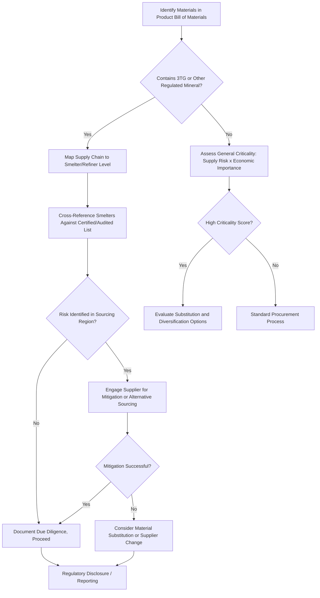

## Critical and Conflict Materials

### Overview and Definitions

Critical materials and conflict materials are two related but distinct classifications that intersect with materials selection, supply chain risk management, and sustainability reporting. **Critical materials** (or critical raw materials) are elements or material groups identified by governments, industry bodies, or standards organizations as having both high economic/technological importance and elevated supply risk, typically due to geographically concentrated production, limited substitutability, or geopolitical exposure. **Conflict materials** (or conflict minerals) are a narrower, legally defined category of specific minerals whose extraction and trade have been linked to financing armed conflict and human rights abuses, most prominently in the Democratic Republic of the Congo (DRC) and adjoining regions, and which are subject to specific mandatory disclosure and due diligence regulations in several jurisdictions.

### Criticality Assessment Framework

**Key Points**

- Criticality is typically assessed along two primary axes: **economic importance** (how essential the material is to key industries and technologies with limited substitution options) and **supply risk** (concentration of production/reserves, political stability of supplying regions, and byproduct-dependency of production).
- Materials produced primarily as **byproducts** of other metal mining operations (e.g., several rare earth elements, tellurium, gallium) carry elevated supply risk because their production volume is driven by the economics of the primary metal being mined, not by demand for the byproduct itself, limiting the ability of the market to rapidly scale supply in response to price signals.
- Criticality assessments are typically published periodically (e.g., by the European Commission, the U.S. Geological Survey/Department of Energy, and other national bodies) and are dynamic — a material's criticality status can shift over time as demand patterns, substitute technology development, and supply diversification evolve.
- [Unverified: specific current criticality lists and their exact material composition change periodically with each assessment cycle and vary by issuing body and jurisdiction; current lists should be obtained directly from the relevant national/regional assessment rather than assumed static from prior editions.]

### Common Categories of Critical Materials in Engineering Applications

| Category | Representative Elements/Materials | Primary Engineering Application Driving Demand |
| --- | --- | --- |
| Rare earth elements (REE) | Neodymium, dysprosium, praseodymium, and others | Permanent magnets (electric motors, wind turbine generators), phosphors |
| Battery materials | Lithium, cobalt, nickel, graphite | Lithium-ion battery cathodes/anodes for electric vehicles and grid storage |
| Platinum group metals (PGM) | Platinum, palladium, rhodium | Catalytic converters, fuel cell catalysts |
| Semiconductor/electronics materials | Gallium, germanium, indium, tantalum | Semiconductors, capacitors, display technology, fiber optics |
| Specialty alloying elements | Cobalt, tungsten, niobium, chromium | Superalloys, cutting tools, structural alloy steels |
| Graphite | Natural and synthetic graphite | Battery anodes, refractories |

### Conflict Minerals: The 3TG Framework

**Key Points**

- The most widely regulated conflict mineral category is often referred to by the shorthand **3TG**: **tin, tantalum, tungsten, and gold**, reflecting their historical association with armed-conflict financing in the DRC and surrounding Great Lakes region of Central Africa.
- These minerals are used extensively across electronics manufacturing (tantalum in capacitors, tin in solder, tungsten in vibration motors and cutting tools, gold in electrical connectors and plating), making the electronics supply chain a primary focus of conflict minerals regulation and due diligence.
- Conflict minerals regulation is distinct from broader critical materials policy in that it is driven by human rights and conflict-financing concerns rather than by supply security or economic criticality per se — a mineral can be a conflict mineral without being classified as critical, and vice versa, though the categories do overlap in specific cases (e.g., tantalum and tungsten appear in both discussions).

### Regulatory Frameworks for Conflict Minerals

**Key Points**

- In the United States, **Section 1502 of the Dodd-Frank Wall Street Reform and Consumer Protection Act** requires publicly traded companies to conduct due diligence on their supply chains and disclose whether their products contain conflict minerals sourced from the DRC or adjoining countries, and to report on the measures taken to exercise due diligence on the source and chain of custody of those minerals.
- The **OECD Due Diligence Guidance for Responsible Supply Chains of Minerals from Conflict-Affected and High-Risk Areas** provides an internationally referenced due diligence framework used by companies globally, including those not directly subject to U.S. regulation, and underpins several other national and regional conflict minerals regulatory frameworks.
- The **EU Conflict Minerals Regulation** establishes supply chain due diligence obligations for EU importers of tin, tantalum, tungsten, and gold above defined volume thresholds, broadly aligned with OECD guidance principles but with its own specific scope and compliance mechanism.
- Compliance mechanisms commonly rely on industry-developed traceability and reporting tools, such as the **Conflict Minerals Reporting Template (CMRT)**, which enables companies to collect and pass smelter/refiner-level sourcing information through multi-tier supply chains. [Unverified: specific regulatory thresholds, reporting template versions, and the precise list of covered "adjoining countries" are subject to periodic regulatory and template revision; current compliance requirements should be verified against the current regulatory text and current CMRT version rather than assumed static.]

### Supply Chain Due Diligence Process

**Key Points**

- **Supply chain mapping** — identifying the smelters and refiners that process the relevant minerals within a company's supply chain, since the smelter/refiner stage is typically the practical point at which traceability to mine-of-origin can be established or verified.
- **Risk assessment** — evaluating whether identified smelters/refiners source from conflict-affected or high-risk areas, commonly cross-referenced against third-party audit programs (e.g., industry-run responsible sourcing assurance programs that audit and certify conformant smelters/refiners).
- **Response to identified risk** — engaging with suppliers to mitigate identified risk, which may include supplier engagement/improvement programs rather than immediate disengagement, consistent with OECD guidance's emphasis on risk mitigation over blanket avoidance (recognizing that responsible sourcing from conflict-affected regions, rather than wholesale withdrawal, can support legitimate local economic development).
- **Reporting and disclosure** — publishing due diligence findings and conflict minerals content disclosure in accordance with applicable regulatory requirements (e.g., annual Form SD/Conflict Minerals Report filings under Dodd-Frank Section 1502 for covered U.S. issuers).

### Materials Selection Implications

**Key Points**

- Critical and conflict material status is an increasingly explicit criterion in materials selection and multi-criteria decision making frameworks, alongside conventional mechanical, cost, and environmental (LCA/embodied carbon) criteria, particularly for companies with public sustainability commitments or regulatory disclosure obligations.
- Materials substitution strategies driven by criticality concerns commonly target reducing or eliminating dependence on a critical material through alternative alloy/material chemistry (e.g., reduced-cobalt or cobalt-free battery cathode chemistries, dysprosium-reduced or dysprosium-free permanent magnet formulations), even when the substitute may carry a modest performance penalty, reflecting a supply-risk-weighted rather than purely performance-optimized selection criterion.
- Design for disassembly and recycling (see circular economy principles) is a complementary strategy to substitution for managing critical material supply risk, since efficient end-of-life recovery of critical materials from products (particularly rare earth magnets and battery materials) reduces reliance on primary/virgin extraction and associated geopolitical supply exposure.
- Supply chain diversification (qualifying multiple, geographically distributed suppliers for a given critical material or component) is a common risk mitigation strategy applied alongside, rather than instead of, materials substitution, since substitution is not always technically feasible without unacceptable performance loss.

### Critical Materials Risk Assessment Matrix

| Risk Dimension | Example Manifestation | Typical Mitigation |
| --- | --- | --- |
| Geographic production concentration | Majority of global supply of a given element from one or few countries | Supplier diversification, strategic stockpiling |
| Byproduct-dependent supply | Production volume tied to economics of a different primary metal | Recycling investment, demand forecasting with primary-metal producers |
| Geopolitical/export policy risk | Export restrictions or tariffs imposed by a dominant producing country | Substitution research, domestic/allied-region supply chain development |
| Conflict-financing association | Mineral extraction linked to armed conflict or human rights abuse in source region | Due diligence per OECD guidance, smelter/refiner certification programs |
| Processing/refining concentration | Even when raw ore is geographically diverse, refining capacity concentrated in few locations | Investment in diversified midstream processing capacity |

### Critical/Conflict Material Due Diligence Flow

### Criticality Assessment Matrix (svg_diagram)

<svg xmlns="http://www.w3.org/2000/svg" viewBox="0 0 800 480" font-family="Arial, sans-serif">
<text x="400" y="28" font-size="18" font-weight="bold" text-anchor="middle">Economic Importance vs. Supply Risk (svg_diagram)</text>
<line x1="90" y1="420" x2="740" y2="420" stroke="#333" stroke-width="2" />
<line x1="90" y1="420" x2="90" y2="60" stroke="#333" stroke-width="2" />
<text x="415" y="455" font-size="13" text-anchor="middle">Supply Risk</text>
<text x="40" y="240" font-size="13" text-anchor="middle" transform="rotate(-90 40 240)">Economic Importance</text>
<line x1="415" y1="60" x2="415" y2="420" stroke="#ccc" stroke-width="1" stroke-dasharray="3,3" />
<line x1="90" y1="240" x2="740" y2="240" stroke="#ccc" stroke-width="1" stroke-dasharray="3,3" />

<text x="580" y="100" font-size="13" fill="`#8a2c2c`" font-weight="bold">Critical Zone</text>

<circle cx="640" cy="120" r="10" fill="#8a2c2c" />
<text x="640" y="105" font-size="11" text-anchor="middle">Rare Earths (magnets)</text>
<circle cx="600" cy="160" r="10" fill="#8a2c2c" />
<text x="600" y="145" font-size="11" text-anchor="middle">Cobalt</text>
<circle cx="560" cy="200" r="10" fill="#c98a2c" />
<text x="560" y="185" font-size="11" text-anchor="middle">Tantalum</text>
<circle cx="200" cy="150" r="10" fill="#2c5f8a" />
<text x="200" y="135" font-size="11" text-anchor="middle">Iron Ore</text>
<circle cx="250" cy="350" r="10" fill="#7a7a7a" />
<text x="250" y="370" font-size="11" text-anchor="middle">Common Aggregates</text>
</svg>

### Case Example: Electric Vehicle Battery Supply Chain

Electric vehicle battery manufacturing illustrates the intersection of critical materials risk and materials selection response: cobalt, historically a key cathode material in lithium-ion battery chemistries (e.g., NMC formulations), carries significant supply risk due to production concentration and documented human rights and labor concerns associated with artisanal mining operations in parts of the DRC, distinct from but related to the conflict minerals due diligence framework applied to 3TG. This risk profile has been a substantial driver behind materials engineering efforts to develop reduced-cobalt (high-nickel NMC formulations) and cobalt-free (lithium iron phosphate, LFP) cathode chemistries, illustrating a direct case of criticality-and-responsible-sourcing-driven materials substitution occurring in parallel with, and partly independent of, the underlying electrochemical performance optimization also driving battery chemistry development. [Unverified: relative market share and adoption trends between NMC, high-nickel, and LFP chemistries continue to evolve with battery technology development and regional policy differences, and current figures should be checked against recent industry sources.]

### Common Pitfalls in Managing Critical and Conflict Material Risk

- **Conflating criticality with conflict mineral status** — treating all critical materials as subject to conflict minerals regulation, or assuming non-3TG critical materials carry no responsible-sourcing risk, both misrepresent the distinct (though sometimes overlapping) nature of these two classification frameworks.
- **Treating due diligence as a one-time compliance exercise** — supply chains and risk profiles change; regulatory frameworks (Dodd-Frank Section 1502, EU Conflict Minerals Regulation) generally require ongoing, periodic due diligence and reporting rather than a single initial assessment.
- **Assuming substitution eliminates all supply risk** — a substitute material may itself become critical or carry its own emerging supply risk profile (e.g., increased demand for alternative battery/magnet materials can shift, rather than eliminate, criticality exposure to a different material).
- **Overlooking smelter/refiner-level traceability gaps** — supply chain due diligence that stops at direct suppliers without tracing to the smelter/refiner level, the point at which mineral origin can typically be meaningfully verified, provides limited actual assurance despite apparent compliance effort.
- **Ignoring the byproduct-supply dynamic** — assuming supply of a byproduct-sourced critical material (e.g., several rare earth elements co-produced with other ores) will scale readily with demand, when in practice such supply is constrained by the economics of the unrelated primary metal being mined.

### Standards and Reference Frameworks

Critical and conflict materials management draws on the OECD Due Diligence Guidance for Responsible Supply Chains, Dodd-Frank Act Section 1502 and associated SEC disclosure rules, the EU Conflict Minerals Regulation, periodic national/regional critical raw materials assessments (e.g., from the European Commission and U.S. Geological Survey/Department of Energy), and industry-developed tools such as the Conflict Minerals Reporting Template (CMRT) and related Responsible Minerals Initiative resources.

**Related Topics**

- Materials Substitution Strategies
- Multi Criteria Decision Making in Materials Selection
- Circular Economy Principles in Materials Engineering
- Recycling Technologies for Metals
- Supply Chain Risk Assessment for Engineering Materials
- Battery Materials and Electrochemical Energy Storage Metallurgy
- Rare Earth Element Metallurgy and Permanent Magnet Materials