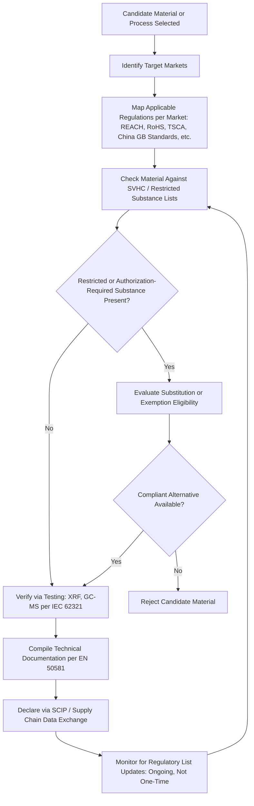

## Environmental Regulations in Materials Industries

### Overview

Environmental regulation of materials industries spans chemical substance control, hazardous substance restriction in products, air and water emissions control from processing facilities, and end-of-life product/packaging recovery obligations. These frameworks directly constrain materials selection (certain substances or alloying elements become effectively unusable in regulated markets regardless of technical performance), influence process selection (emissions control requirements affect the economics and permissibility of specific manufacturing routes), and increasingly extend materials engineering responsibility beyond the factory gate into the full product life cycle addressed elsewhere in this chapter.

### Major Regulatory Frameworks — Chemical and Substance Control

**Key Points**

- **REACH (Registration, Evaluation, Authorisation and Restriction of Chemicals)** is an EU regulation, in force across the EU since June 1, 2007, and is managed by the European Chemicals Agency (ECHA). It puts the burden on the chemical industry to ensure substances are safe by requiring a thorough registration process, and is a horizontal regulation that applies to all companies handling chemical substances, in contrast to substance-restriction directives that apply only to specific product categories. [RoHS & REACH: A 2025 Update +2](https://galvanizeit.org/knowledgebase/article/rohs-reach)
- Chemicals identified as posing serious risk are added to the "Substances of Very High Concern" (SVHC) list, which includes carcinogens, reproductive toxins, mutagens, and chemicals that build up in the environment over time. This list is not static: the SVHC Candidate List grew from 247 to 251 substances in 2025 alone, and by early 2025 it required listing over 235 Substances of Very High Concern, with ongoing additions anticipated. [Inference: given the demonstrated pace of addition, the exact current SVHC count should always be checked against ECHA's live list rather than any fixed figure quoted here.] [RoHS & REACH: A 2025 Update +2](https://galvanizeit.org/knowledgebase/article/rohs-reach)
- **RoHS (Restriction of Hazardous Substances)** is, by contrast, a directive that applies to Electronic Products only, and is transposed into individual EU countries' regulations rather than applying directly. The current version, RoHS 3 (Directive 2015/863), targets specific heavy metals, phthalates and phenyls, with RoHS 3, effective since 2019, limiting ten harmful substances in covered products. [Material Compliance Requirements: REACH, RoHS, SCIP - Accuris +2](https://accuristech.com/blog/material-compliance-requirements-reach-rohs-scip/)
- Materials selection implication: REACH's SVHC list can restrict or require authorization for specific alloying elements, surface treatment chemicals, or processing aids (e.g., certain chromium compounds), while RoHS directly restricts specific elements (lead, mercury, cadmium, hexavalent chromium, and specified brominated flame retardants and phthalates) in electrical/electronic product materials — a direct example being that galvanizers applying hexavalent chromium passivation for RoHS-covered products must keep bath concentrations low enough that the passivation coating does not exceed the RoHS threshold, with trivalent chromium widely used as a RoHS-compliant alternative. [Galvanizeit](https://galvanizeit.org/knowledgebase/article/rohs-reach)

### Emerging Substance Classes: PFAS

**Key Points**

- Per- and polyfluoroalkyl substances (PFAS) represent a rapidly expanding regulatory focus area. The EPA manages the TSCA Chemical Substance Inventory and, on October 11, 2023, published a new rule under TSCA regarding the reporting and tracking of PFAS in the United States. [GlobalSpec](https://electronics360.globalspec.com/article/21141/where-rohs-reach-and-pfas-intersect)
- Phase-out timelines are already active in specific applications: the full prohibition for PFAS in firefighting foams above a 1 mg/L threshold begins in 2030, but October 23, 2026 marks the first major compliance trigger in that phase-out. [Sourceintelligence](https://blog.sourceintelligence.com/eu-reach-compliance)
- As of 2026, PFAS controls, packaging rules (PPWR), persistent organic pollutants (POPs), TSCA-PBT requirements, and plastics reporting are widening the information manufacturers must obtain and maintain beyond the traditional RoHS/REACH core, and product compliance is no longer a final checkpoint before product launch but a continuous business process connecting product design, purchasing, supplier management, laboratory testing, technical documentation, packaging, and market-access decisions. [Getenviropass](https://getenviropass.com/product_compliance/)[Getenviropass](https://getenviropass.com/product_compliance/)
- Materials selection implication: fluoropolymer coatings and treatments historically selected for chemical/thermal resistance (e.g., in seals, coatings, and certain high-performance applications) face increasing substitution pressure as PFAS restrictions broaden, directly connecting to materials substitution strategies driven by regulatory rather than purely technical or cost criteria.

### Global Regulatory Analogues and Divergence

**Key Points**

- The EU's RoHS and REACH directives have analogues in the US, China, and other developed countries, but these frameworks are not harmonized, creating compliance complexity for materials used in globally distributed products. [GlobalSpec](https://electronics360.globalspec.com/article/21141/where-rohs-reach-and-pfas-intersect)
- China's regulatory approach has evolved substantially: China RoHS initially required product labelling detailing the presence of hazardous substances, but China is now intensifying its stance with the forthcoming mandatory national standard GB 26572-2025 and the new Ecological and Environmental Code entering into force in August 2026, requiring products to be designed with their full lifecycle impact in mind, prioritising non-toxic materials and restricting hazardous substances at the source. [Componentsense](https://www.componentsense.com/blog/navigating-rohs-compliance-in-2026-a-guide-for-electronic-manufacturers)
- India regulates electronic waste under the E-Waste (Management) Rules, enforcing stringent Extended Producer Responsibility (EPR) targets alongside RoHS compliance. [Componentsense](https://www.componentsense.com/blog/navigating-rohs-compliance-in-2026-a-guide-for-electronic-manufacturers)
- In the United States, California Proposition 65 remains a core compliance requirement alongside RoHS and REACH-equivalent frameworks for electronics manufacturers. [Getenviropass](https://getenviropass.com/product_compliance/)
- Materials selection implication: a material or surface treatment compliant in one jurisdiction may not be compliant in another, meaning global product programs frequently must select the most restrictive applicable standard across all target markets as the effective design constraint, rather than optimizing separately per market.

### Compliance Verification and Testing Standards

**Key Points**

- Standardized laboratory testing for RoHS-restricted substances commonly uses X-ray fluorescence (XRF) screening, wet chemistry, and gas chromatography-mass spectrometry (GC-MS) analysis — the same XRF technology used for alloy sorting in metal recycling technologies, applied here for compliance verification rather than scrap sourcing. [Certivo](https://www.certivo.com/blog-details/rohs-and-reach-compliance-lessons-from-2025-and-action-steps-for-2026)
- Sample preparation must meet IEC 62321 standards, and documentation must follow EN 50581 requirements for RoHS technical documentation. [Certivo](https://www.certivo.com/blog-details/rohs-and-reach-compliance-lessons-from-2025-and-action-steps-for-2026)
- Materials declaration data exchange between supply chain tiers is increasingly managed through standardized reporting mechanisms; the EU's SCIP database (Substances of Concern In Products) and similar tools support REACH/RoHS declaration flow-down through multi-tier supply chains, extending the traceability challenge already discussed for conflict minerals reporting to the broader universe of regulated substances.

### End-of-Life and Producer Responsibility Regulation

**Key Points**

- Regulatory frameworks increasingly extend materials industry responsibility beyond point-of-sale into end-of-life recovery, directly reinforcing the extended producer responsibility (EPR) mechanisms discussed in circular economy principles.
- The scale of the underlying problem motivating this regulatory expansion is substantial: the UN's Global E-waste Monitor 2024 reported the world generated 62 million tonnes of e-waste in 2022, projected to surge by 32% to reach 82 million tonnes by 2030, while only 22.3% of e-waste is formally documented as recycled, with an estimated $62 billion worth of recoverable natural resources such as gold, copper, and rare earths squandered annually. [Componentsense](https://www.componentsense.com/blog/navigating-rohs-compliance-in-2026-a-guide-for-electronic-manufacturers)[Componentsense](https://www.componentsense.com/blog/navigating-rohs-compliance-in-2026-a-guide-for-electronic-manufacturers)
- Packaging-specific regulation is expanding materials compliance scope further: PPWR (Packaging and Packaging Waste Regulation) is among the widening set of requirements electronics and other manufacturers must now track alongside traditional RoHS/REACH obligations. [Getenviropass](https://getenviropass.com/product_compliance/)

### Regulatory Compliance Workflow for Materials Selection

### Regulatory Scope Comparison (svg_diagram)

<svg xmlns="http://www.w3.org/2000/svg" viewBox="0 0 820 420" font-family="Arial, sans-serif">
<text x="410" y="28" font-size="18" font-weight="bold" text-anchor="middle">Regulatory Scope: Breadth vs. Product Specificity (svg_diagram)</text>
<line x1="80" y1="380" x2="740" y2="380" stroke="#333" stroke-width="2" />
<line x1="80" y1="380" x2="80" y2="60" stroke="#333" stroke-width="2" />
<text x="410" y="410" font-size="13" text-anchor="middle">Substance Scope Breadth</text>
<text x="30" y="220" font-size="13" text-anchor="middle" transform="rotate(-90 30 220)">Product-Category Specificity</text>
<rect x="120" y="300" width="160" height="50" rx="6" fill="#dbe9f7" stroke="#2c5f8a" stroke-width="2" />
<text x="200" y="330" font-size="12" text-anchor="middle">REACH (all chemicals,</text>
<text x="200" y="345" font-size="11" text-anchor="middle">all industries)</text>
<rect x="500" y="130" width="180" height="50" rx="6" fill="#f7e7c1" stroke="#8a6d2c" stroke-width="2" />
<text x="590" y="160" font-size="12" text-anchor="middle">RoHS (10 substances,</text>
<text x="590" y="175" font-size="11" text-anchor="middle">electronics only)</text>
<rect x="300" y="200" width="180" height="50" rx="6" fill="#d7f0d3" stroke="#2c7a3d" stroke-width="2" />
<text x="390" y="230" font-size="12" text-anchor="middle">PFAS Regulations</text>
<text x="390" y="245" font-size="11" text-anchor="middle">(expanding scope)</text>
<rect x="400" y="90" width="200" height="50" rx="6" fill="#f0d3d3" stroke="#8a2c2c" stroke-width="2" />
<text x="500" y="120" font-size="12" text-anchor="middle">EPR / WEEE (product</text>
<text x="500" y="135" font-size="11" text-anchor="middle">category-specific)</text>
</svg>

### Materials Selection Implications Summary

| Regulatory Driver | Materials Selection Impact | Representative Example |
| --- | --- | --- |
| REACH SVHC listing | Restriction/authorization requirement can eliminate a substance from viable use | Certain plasticizers, chromates, and processing chemicals |
| RoHS substance limits | Direct ban on specific elements above threshold in electronics | Lead-free solder substitution (see materials substitution strategies) |
| PFAS phase-outs | Substitution pressure on fluoropolymer coatings/treatments | Alternative low-friction, chemical-resistant coating development |
| China GB 26572-2025 / Eco Code | Full lifecycle design requirement, not just point-of-sale compliance | Design-stage material and process selection tied to end-of-life impact |
| EPR / WEEE / PPWR | Producer accountability for end-of-life recovery | Design for disassembly and recyclability (see circular economy principles) |

### Case Example: Cross-Jurisdictional Compliance for a Globally Sold Electronic Assembly

A component manufacturer selling into the EU, US, China, and India markets must simultaneously satisfy REACH substance registration and SVHC screening, RoHS 3 elemental restrictions, evolving PFAS reporting obligations, China's GB 26572-2025 lifecycle-design requirements taking effect alongside the new Ecological and Environmental Code in August 2026, and India's E-Waste Management Rules EPR targets — meaning the practical design constraint is the union of all applicable restricted-substance lists and design requirements across target markets, not any single jurisdiction's rules considered in isolation. This reinforces why, as compliance teams increasingly describe it, the challenge is not simply answering whether a product is "RoHS compliant" but demonstrating that the product, its components, its materials, and increasingly its packaging meet the requirements of every target market. [Getenviropass](https://getenviropass.com/product_compliance/)

### Common Pitfalls in Materials Environmental Compliance

- **Treating compliance as a one-time design gate** — product compliance is increasingly a continuous business process rather than a pre-launch checkpoint, given how frequently substance lists and standards are revised. [Getenviropass](https://getenviropass.com/product_compliance/)
- **Assuming RoHS compliance implies REACH compliance or vice versa** — REACH applies horizontally across all companies and chemicals while RoHS is scoped specifically to electrical and electronic products; satisfying one does not satisfy the other. [Accuris](https://accuristech.com/blog/material-compliance-requirements-reach-rohs-scip/)
- **Underestimating supply chain traceability burden** — verifying substance content requires flow-down declarations through multi-tier supply chains, and, as with conflict minerals due diligence, incomplete traceability below direct suppliers leaves compliance gaps.
- **Ignoring emerging substance classes until regulation is finalized** — PFAS regulation is a clear example of a substance class moving from limited to broad regulatory scope within a short period; materials selection that waits for final rules risks late, costly redesign.
- **Assuming testing method equivalence** — using non-standardized test methods rather than accredited laboratory methods following IEC 62321 sample preparation and EN 50581 documentation requirements can produce compliance determinations that do not hold up to regulatory audit. [Certivo](https://www.certivo.com/blog-details/rohs-and-reach-compliance-lessons-from-2025-and-action-steps-for-2026)

### Standards and Reference Bodies

Materials industry environmental compliance is governed by REACH (EU Regulation 1907/2006, administered by ECHA), RoHS Directive 2015/863 (RoHS 3) and national equivalents (China GB 26572, India E-Waste Management Rules), U.S. TSCA (administered by EPA) and California Proposition 65, testing/documentation standards IEC 62321 and EN 50581, and an expanding set of packaging and persistent-substance frameworks including PPWR and POPs regulations. [Unverified: given the pace of revision documented above — SVHC list growth, new national standards entering force in 2026, evolving PFAS rules — specific thresholds, substance lists, and effective dates should always be verified against the current text of the applicable regulation rather than treated as fixed.]

**Related Topics**

- Critical and Conflict Materials
- Circular Economy Principles in Materials Engineering
- Life Cycle Assessment of Materials
- Materials Substitution Strategies
- Recycling of Polymers and Composites
- Supply Chain Traceability and Material Declaration Systems
- PFAS Chemistry and Regulatory Phase-Out Strategies