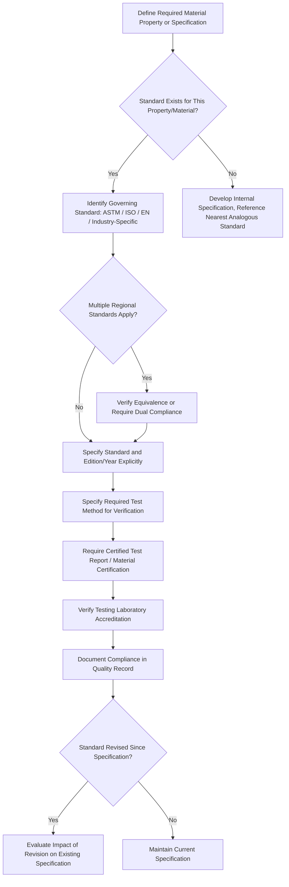

## ASTM, ISO, and Other Materials Standards

### Overview

Materials standards are formally documented specifications, test methods, classifications, and practices developed by consensus standards organizations to ensure consistency, safety, quality, and interoperability in materials specification, testing, and use across the engineering and manufacturing industries. Standards provide the common technical language that allows a material specified by an engineer in one organization to be sourced, tested, and verified by a supplier or laboratory in another, and they underpin nearly every other topic in this chapter — materials selection indices, failure analysis, substitution decisions, and regulatory compliance all ultimately rely on standardized test methods and material designations to produce comparable, trustworthy data.

### Major Standards-Developing Organizations

| Organization | Scope | Standard Designation Format |
| --- | --- | --- |
| ASTM International | Broad materials, testing, and product standards, historically strong US/North American adoption, now globally referenced | ASTM followed by letter/number (e.g., ASTM A36, ASTM D638) |
| ISO (International Organization for Standardization) | International consensus standards across nearly all technical domains, including materials | ISO followed by number (e.g., ISO 6892 for tensile testing) |
| SAE International | Aerospace and automotive materials, particularly AMS (Aerospace Material Specifications) | SAE AMS followed by number |
| ASME (American Society of Mechanical Engineers) | Pressure equipment, boiler and pressure vessel materials, piping | ASME Boiler and Pressure Vessel Code (BPVC) Section II (materials) |
| EN (European Norm) | European regional standards, often harmonized with or referencing ISO | EN followed by number |
| JIS (Japanese Industrial Standards) | Japanese national materials and testing standards | JIS followed by letter/number |
| DIN (Deutsches Institut für Normung) | German national standards, historically influential in European industrial practice | DIN followed by number |
| NACE (now AMPP - Association for Materials Protection and Performance) | Corrosion control, sour service, materials degradation | NACE/AMPP MR-series and related standards |

### Structure and Types of Materials Standards

**Key Points**

- **Specifications** — define required properties, composition, and quality requirements for a material or product (e.g., a specification for a specific steel grade defining chemical composition ranges and minimum mechanical properties).
- **Test methods** — define standardized procedures for measuring a specific property, ensuring that a reported value (tensile strength, hardness, fracture toughness) is comparable regardless of which laboratory performed the test.
- **Practices** — define standardized procedures for performing an operation (e.g., specimen preparation, surface treatment application) that does not itself produce a numerical test result.
- **Classifications** — establish systems for grouping materials by composition, property, or application (e.g., alloy designation systems).
- **Guides** — provide organized information or options without establishing a specific required procedure, offering reference material rather than a mandatory compliance requirement.
- **Terminology standards** — establish standardized definitions for technical terms used across other standards, reducing ambiguity in specification and reporting.

### Representative ASTM Materials Standards

**Key Points**

- **ASTM A36** — standard specification for carbon structural steel, one of the most widely referenced structural steel specifications in construction and general fabrication.
- **ASTM E8/E8M** — standard test method for tension testing of metallic materials, the foundational test method underlying most reported yield strength, tensile strength, and elongation values for metals in North American practice.
- **ASTM D638** — standard test method for tensile properties of plastics, the polymer-industry analogue to E8 for metals.
- **ASTM E23** — standard test methods for notched bar impact testing of metallic materials (Charpy and Izod), providing standardized impact toughness data relevant to failure-driven materials selection.
- **ASTM E399** — standard test method for linear-elastic plane-strain fracture toughness $K_{IC}$ of metallic materials, directly underlying the fracture mechanics indices discussed in failure driven materials selection.
- **ASTM B117** — standard practice for operating salt spray (fog) apparatus, a widely used (though limited-correlation) accelerated corrosion test method.
- **ASTM G48** — standard test methods for pitting and crevice corrosion resistance of stainless steels using ferric chloride solution, relevant to corrosion-driven material screening.

### Representative ISO Materials Standards

**Key Points**

- **ISO 6892-1** — metallic materials tensile testing at room temperature, the international analogue to ASTM E8, with methodological differences (e.g., in strain rate control and specimen geometry tolerances) that can produce measurably different reported values for the same material, making the standard used a necessary part of any reported property citation.
- **ISO 148-1** — metallic materials Charpy pendulum impact test, the international counterpart to ASTM E23.
- **ISO 12737** — metallic materials determination of plane-strain fracture toughness, the ISO counterpart to ASTM E399.
- **ISO 9001** — quality management systems requirements, not a materials property standard itself but foundational to the quality assurance processes (see QMS & ISO Standards) that govern how materials testing and certification are conducted and documented within a compliant organization.
- **ISO 14001** — environmental management systems, relevant to the environmental regulatory compliance processes discussed in environmental regulations in materials industries.

### ASTM vs. ISO — Practical Differences and Equivalence Considerations

**Key Points**

- ASTM and ISO standards addressing the same fundamental property (e.g., tensile testing) are generally similar in principle but frequently differ in specific procedural details — specimen geometry, strain rate, temperature tolerance bands, and rounding/reporting conventions — meaning reported values from ASTM-based and ISO-based testing are not always directly interchangeable without verification of testing basis.
- Global supply chains increasingly require dual-standard compliance or documented equivalence, particularly where a component is specified under one standards system but manufactured or tested under practices native to another region's standards infrastructure.
- Some industries have converged on a dominant standard globally regardless of region (e.g., API standards for oil and gas equipment, ASME BPVC for pressure vessels in many jurisdictions), while others maintain persistent regional standard divergence requiring engineers to explicitly track which standard governs a given specification.
- [Inference: the practical significance of ASTM-versus-ISO procedural differences for a given material and property is application-specific; for many common structural metals under normal test conditions, differences are typically within reported measurement uncertainty, but for fracture toughness, high-strain-rate, or elevated-temperature testing, procedural differences can be more consequential, and this should be confirmed against the specific standards being reconciled rather than assumed negligible.]

### Alloy and Material Designation Systems

| System | Scope | Example Format |
| --- | --- | --- |
| UNS (Unified Numbering System) | Cross-referencing designation system spanning most US-originated metal specifications, jointly maintained by ASTM and SAE | UNS G10180 (corresponds to AISI/SAE 1018 steel) |
| AISI/SAE steel designations | Carbon and alloy steel composition-based numbering | AISI 4140, AISI 304 (stainless) |
| Aluminum Association (AA) designations | Aluminum alloy series numbering by primary alloying element | 6061, 7075, 2024 |
| ASME/ASTM dual-numbered specifications | Pressure equipment materials referenced identically in both systems | SA-516 (ASME) corresponding to A516 (ASTM) |
| ISO material designation (EN-based for steels) | Composition and property-based European steel designation | S355 (structural steel, 355 MPa minimum yield) |

**Key Points**

- The UNS system was developed jointly by ASTM and SAE specifically to provide a single cross-reference point across the many historically independent numbering systems used by different industries and standards bodies, reducing ambiguity when a material is referenced across multiple specification documents.
- Designation systems generally encode different types of information depending on their origin: some (like AA aluminum designations) encode primary alloying element family, while others (like EN structural steel designations) directly encode a key mechanical property (minimum yield strength) in the designation itself.

### Standards in Pressure Equipment and Regulated Industries

**Key Points**

- The **ASME Boiler and Pressure Vessel Code (BPVC)**, particularly Section II (Materials), Section VIII (Pressure Vessels), and Section IX (Welding Qualifications), governs materials selection, fabrication, and inspection requirements for pressure-retaining equipment in much of the world, either directly or through harmonized national adoption.
- **API (American Petroleum Institute) standards** govern materials and equipment specifications specific to oil and gas production, transport, and refining, including sour-service material requirements referenced in NACE/AMPP MR0175/ISO 15156 (discussed in the sour-service pipeline case study in case studies in materials selection).
- Aerospace materials are governed extensively by **SAE AMS specifications**, which define composition, processing, and property requirements at a level of rigor and traceability substantially exceeding typical commercial materials specifications, reflecting the safety-criticality and certification requirements of the sector.
- Regulated-industry standards frequently mandate not just material property compliance but full traceability (material test reports, heat/lot traceability, certified test laboratory accreditation), connecting materials standards directly to the quality management system practices covered elsewhere in this chapter.

### Standards Development and Revision Process

**Key Points**

- Consensus standards organizations (ASTM, ISO) develop and revise standards through committee-based processes involving balanced representation of producers, users, and general-interest stakeholders, with formal balloting and public comment periods required before a standard is approved or revised.
- Standards are periodically reviewed and reaffirmed, revised, or withdrawn (typically on a multi-year cycle, commonly five years for ASTM standards, though this varies by standard and organization), meaning a specification cited in an older engineering drawing or contract may reference a superseded version, requiring engineers to verify whether the current or a specific historical version applies.
- Engineers and organizations specifying materials should reference the specific edition/year of a standard where precision matters (e.g., "ASTM A36-14" rather than simply "ASTM A36"), since property requirements, test methods, and even scope can change between revisions.

### Standards Application Workflow in Materials Engineering

### Standards Ecosystem Relationship Map (svg_diagram)

<svg xmlns="http://www.w3.org/2000/svg" viewBox="0 0 850 460" font-family="Arial, sans-serif">
<text x="425" y="28" font-size="18" font-weight="bold" text-anchor="middle">Materials Standards Ecosystem (svg_diagram)</text>
<circle cx="425" cy="230" r="70" fill="#dbe9f7" stroke="#2c5f8a" stroke-width="2" />
<text x="425" y="225" font-size="13" text-anchor="middle">Material</text>
<text x="425" y="242" font-size="13" text-anchor="middle">Specification</text>
<circle cx="200" cy="120" r="60" fill="#f7e7c1" stroke="#8a6d2c" stroke-width="2" />
<text x="200" y="115" font-size="12" text-anchor="middle">ASTM</text>
<text x="200" y="132" font-size="11" text-anchor="middle">(Property Spec)</text>
<line x1="255" y1="155" x2="380" y2="195" stroke="#333" stroke-width="1.5" />
<circle cx="650" cy="120" r="60" fill="#d7f0d3" stroke="#2c7a3d" stroke-width="2" />
<text x="650" y="115" font-size="12" text-anchor="middle">ISO</text>
<text x="650" y="132" font-size="11" text-anchor="middle">(Int'l Test Method)</text>
<line x1="595" y1="155" x2="470" y2="195" stroke="#333" stroke-width="1.5" />
<circle cx="150" cy="350" r="60" fill="#f0d3d3" stroke="#8a2c2c" stroke-width="2" />
<text x="150" y="345" font-size="12" text-anchor="middle">SAE AMS</text>
<text x="150" y="362" font-size="11" text-anchor="middle">(Aerospace)</text>
<line x1="205" y1="315" x2="370" y2="265" stroke="#333" stroke-width="1.5" />
<circle cx="700" cy="350" r="60" fill="#d3d9f0" stroke="#2c3a8a" stroke-width="2" />
<text x="700" y="345" font-size="12" text-anchor="middle">ASME BPVC</text>
<text x="700" y="362" font-size="11" text-anchor="middle">(Pressure Equip.)</text>
<line x1="645" y1="315" x2="480" y2="265" stroke="#333" stroke-width="1.5" />
<circle cx="425" cy="420" r="55" fill="#e8d3f0" stroke="#6a2c8a" stroke-width="2" />
<text x="425" y="415" font-size="12" text-anchor="middle">NACE/AMPP</text>
<text x="425" y="432" font-size="11" text-anchor="middle">(Corrosion)</text>
<line x1="425" y1="365" x2="425" y2="300" stroke="#333" stroke-width="1.5" />
</svg>

### Case Example: Structural Steel Specification Across a Multinational Project

A multinational construction project sourcing structural steel from fabricators in North America, Europe, and Asia illustrates the practical challenge of standards interoperability: steel specified as ASTM A36 in the North American-fabricated portion, S355 (EN 10025) in the European-fabricated portion, and an equivalent JIS-designated grade in the Asian-fabricated portion must be verified as delivering equivalent (though not necessarily numerically identical) mechanical performance, requiring an engineer to reconcile minimum yield strength, chemical composition limits, and impact toughness requirements across three distinct designation systems and, frequently, three distinct test method standards (ASTM E8/E23 vs. ISO 6892/148 vs. JIS-native test methods) — a task that depends entirely on the standards literacy and cross-referencing discipline this reference topic addresses, and that connects directly to the materials substitution and multi-criteria evaluation frameworks used when true equivalence, rather than assumed equivalence, must be established.

### Common Pitfalls in Applying Materials Standards

- **Citing a standard without specifying the edition/year** — property requirements and test methods can change between revisions; an unspecified edition creates ambiguity in contractual and engineering documentation.
- **Assuming ASTM and ISO test methods for the "same" property are directly interchangeable** — procedural differences in specimen geometry, strain rate, or environmental control can produce measurably different results, particularly for fracture toughness and other geometry-sensitive tests.
- **Confusing a guide or practice with a mandatory specification** — guides provide reference information without establishing binding requirements, and treating one as equivalent to a specification can create a false sense of verified compliance.
- **Neglecting designation cross-referencing in multinational supply chains** — assuming a locally familiar designation (e.g., AISI grade) is universally understood without providing UNS or equivalent cross-reference can lead to incorrect material substitution by an international supplier.
- **Overlooking traceability requirements in regulated industries** — material property compliance to a standard is necessary but not sufficient in regulated sectors; certified test reports, heat/lot traceability, and accredited laboratory testing are frequently independently mandated requirements.

### Related Quality and Compliance Infrastructure

Materials standards function within a broader quality infrastructure that includes laboratory accreditation bodies (verifying that testing laboratories are competent to perform standardized test methods correctly), quality management system standards (ISO 9001 and sector-specific variants such as AS9100 for aerospace), and the standards-referencing regulatory frameworks discussed in environmental regulations in materials industries, together forming the interconnected system that gives a materials specification practical, verifiable meaning in commercial and engineering practice.

**Related Topics**

- Quality Management Systems (QMS) & ISO Standards
- Failure Driven Materials Selection
- Environmental Regulations in Materials Industries
- Materials Substitution Strategies
- Mechanical Testing Methods: Tensile, Impact, and Fracture Toughness
- Alloy Designation Systems (UNS, AISI/SAE, Aluminum Association)
- Material Certification and Traceability (Mill Test Reports, Heat Lot Tracking)