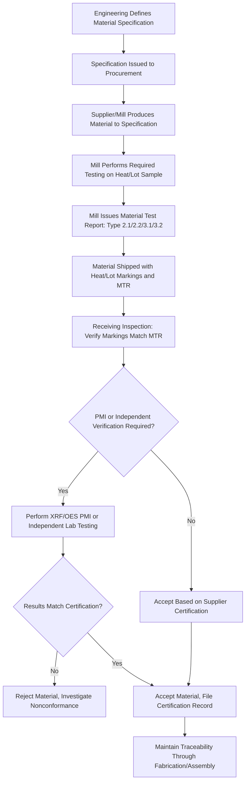

## Materials Specifications and Certification

### Overview

Materials specification and certification is the practice of formally defining required material properties, composition, and processing requirements (specification), and then documenting and verifying that a specific batch, heat, or lot of material actually meets those requirements (certification). While materials standards (see ASTM, ISO, and Other Materials Standards) provide the reference framework of test methods and property requirements, specification and certification is the applied engineering and quality discipline that connects a specific piece of material delivered to a project or production line to documented, traceable evidence that it conforms to the required standard.

### Specification vs. Certification — Core Distinction

**Key Points**

- **Specification** defines what is required: composition ranges, mechanical property minimums/maximums, processing requirements, surface condition, dimensional tolerances, and applicable test methods for verification — established at the design/engineering stage, before material is procured.
- **Certification** provides documented evidence that a specific, identifiable quantity of material (a heat, lot, or batch) has been tested and conforms to the specification — established at the point of material delivery, tied to the actual physical material supplied.
- A specification is generic (applies to all material meeting its requirements); a certification is specific (applies to one traceable quantity of material and its accompanying test data).

### Elements of a Materials Specification

| Element | Description | Example |
| --- | --- | --- |
| Chemical composition | Required elemental ranges (min/max) | Carbon content 0.15–0.20% for a specific steel grade |
| Mechanical properties | Required strength, ductility, hardness, toughness values | Minimum yield strength 350 MPa, minimum elongation 20% |
| Processing requirements | Required or prohibited processing routes | Hot-rolled only; no cold work permitted |
| Heat treatment condition | Required microstructural/property state | Solution annealed and aged (T6 temper) |
| Surface condition | Required surface finish, coating, or cleanliness | Pickled and oiled; galvanized to specified coating weight |
| Dimensional tolerances | Permitted variation from nominal dimensions | Thickness tolerance per applicable ASTM dimensional standard |
| Applicable test methods | Standards governing how conformance is verified | Tensile testing per ASTM E8/ISO 6892 |
| Non-destructive examination requirements | Required inspection for internal/surface defects | Ultrasonic testing per specified acceptance criteria |

### The Material Test Report (MTR) / Mill Test Certificate

**Key Points**

- The Material Test Report (MTR), also called a Mill Test Certificate (MTC) or Certified Material Test Report (CMTR), is the primary document connecting a specific material shipment to its actual tested properties, issued by the producing mill or a subsequent processor.
- A typical MTR includes: heat/lot number (the traceability identifier), actual chemical composition (not just nominal specification compliance, but the measured values), actual mechanical test results (yield strength, tensile strength, elongation, hardness, and impact values where applicable), the specific standard and edition the material is certified against, and the testing laboratory or facility that performed the reported tests.
- **Certification types** are commonly classified by the level of independence of the testing/certifying party, following a framework historically defined in EN 10204 (and referenced, directly or by analogy, in many other regional practices):
  - **Type 2.1** — a declaration of conformity issued by the manufacturer, without specific test results.
  - **Type 2.2** — a test report issued by the manufacturer, based on non-specific testing (testing performed on material from the same production but not necessarily the specific lot supplied).
  - **Type 3.1** — a test report issued by the manufacturer's own quality department, independent of the production department, based on specific testing of the actual material supplied.
  - **Type 3.2** — a test report validated by both the manufacturer's authorized representative and an independent third-party inspector (or the purchaser's authorized representative), providing the highest level of independent verification.
- [Unverified: EN 10204 is a European standard; while its 2.1/2.2/3.1/3.2 classification framework is widely referenced internationally as informal shorthand for certification rigor levels, exact terminology and equivalent classification schemes in other regional/industry-specific certification frameworks should be verified against the specific standard governing a given project or industry.]

### Traceability Systems

**Key Points**

- **Heat traceability** — for metals, the "heat" refers to a single melting/refining batch, and heat numbers allow all material from that batch to be traced back to its specific chemical composition and processing history, since composition can vary meaningfully between heats even within the same nominal grade specification.
- **Lot traceability** — for materials processed or supplied in discrete batches beyond the heat level (e.g., a specific rolling or heat-treatment batch derived from a larger heat), lot numbers provide finer-grained traceability reflecting processing-stage variation.
- **Chain of custody documentation** — as material passes through multiple processing or distribution stages (mill → service center → fabricator → assembler), traceability requires that heat/lot identification is carried through each transfer, typically via markings on the material itself (stamped, stenciled, or tagged) cross-referenced to accompanying paperwork.
- Traceability is particularly critical in regulated and high-consequence industries (aerospace, pressure equipment, nuclear, medical devices), where a material property nonconformance discovered after installation must be traceable back to identify all other components potentially affected by the same heat/lot — directly connecting to failure analysis and recall/corrective action processes.

### Certification Verification and Quality Assurance

**Key Points**

- Receiving inspection at the point of material delivery typically involves verifying that the accompanying MTR corresponds to the actual material received (matching heat/lot markings on the physical material against the MTR), and, depending on criticality, may include independent verification testing (re-testing a sample of the received material) rather than relying solely on the supplier's certification.
- **Positive Material Identification (PMI)**, commonly performed using portable X-ray fluorescence (XRF) or optical emission spectroscopy (OES) analyzers, provides rapid on-site verification that a material's actual composition matches its certified/specified grade, serving as a practical safeguard against material mix-ups, mislabeling, or fraudulent certification, particularly for alloy grades where visual inspection cannot distinguish materials of similar appearance but different composition (e.g., distinguishing carbon steel from certain low-alloy grades, or verifying stainless steel grade).
- Third-party inspection and certification bodies provide independent verification services, particularly for Type 3.2-equivalent certification requirements, where the purchaser or a regulatory body requires certification independent of both the manufacturer's production and quality departments.
- Quality management system requirements (see Quality Management Systems (QMS) & ISO Standards) govern the processes by which a manufacturer generates, controls, and issues certification documentation, including requirements for calibrated test equipment, qualified/accredited testing personnel, and document control ensuring certification records remain accurately linked to the physical material throughout its life.

### Specification and Certification Workflow

### Certification Hierarchy (svg_diagram)

<svg xmlns="http://www.w3.org/2000/svg" viewBox="0 0 820 420" font-family="Arial, sans-serif">
<text x="410" y="28" font-size="18" font-weight="bold" text-anchor="middle">Certification Independence Hierarchy (svg_diagram)</text>
<rect x="80" y="80" width="640" height="50" rx="6" fill="#f0d3d3" stroke="#8a2c2c" stroke-width="2" />
<text x="400" y="110" font-size="13" text-anchor="middle">Type 2.1 — Declaration of Conformity (No Specific Test Data)</text>
<rect x="80" y="150" width="640" height="50" rx="6" fill="#f7e7c1" stroke="#8a6d2c" stroke-width="2" />
<text x="400" y="180" font-size="13" text-anchor="middle">Type 2.2 — Manufacturer Test Report (Non-Specific Testing)</text>
<rect x="80" y="220" width="640" height="50" rx="6" fill="#dbe9f7" stroke="#2c5f8a" stroke-width="2" />
<text x="400" y="250" font-size="13" text-anchor="middle">Type 3.1 — Manufacturer QA Dept. Test Report (Specific Testing)</text>
<rect x="80" y="290" width="640" height="50" rx="6" fill="#d7f0d3" stroke="#2c7a3d" stroke-width="2" />
<text x="400" y="320" font-size="13" text-anchor="middle">Type 3.2 — Independent Third-Party Validated Report</text>

<text x="400" y="365" font-size="12" fill="#666" text-anchor="middle">Increasing independence and rigor →</text>

<line x1="200" y1="385" x2="600" y2="385" stroke="#333" stroke-width="2" marker-end="url(#arrow7)" />

</svg>

### Case Example: Pressure Vessel Component Material Certification

A pressure vessel fabricated under ASME BPVC requirements illustrates layered certification practice: plate material must be supplied with an MTR traceable to a specific heat, demonstrating chemical composition and mechanical properties conforming to the specified ASME/ASTM material specification (e.g., SA-516 Grade 70); the fabricator performs receiving inspection verifying heat markings against the MTR and, for critical applications, may perform independent PMI using portable XRF to confirm alloy composition before cutting the plate into components (since heat markings are lost once a plate is cut into multiple pieces, requiring a marking transfer procedure to maintain traceability to the sub-piece level); and the completed vessel's material certification package, compiled and retained per the applicable code, must allow any individual pressure-boundary component to be traced back to its original heat and test data for the life of the vessel, supporting future fitness-for-service assessment (see the sour-service pipeline discussion in case studies in materials selection) if a material-related concern arises.

### Common Pitfalls in Specification and Certification Practice

- **Specifying a grade without defining the required certification type** — omitting the required EN 10204 (or equivalent) certification type from a purchase specification can result in receiving a lower-rigor declaration of conformity when specific, independently verified test data was actually needed for the application.
- **Losing traceability during processing (marking transfer failure)** — cutting, machining, or otherwise subdividing certified material without a documented marking transfer procedure breaks the chain of custody between the physical material and its certification.
- **Treating supplier certification as infallible without verification** — accepting an MTR without any independent verification (visual marking check, PMI, or re-testing) for critical applications creates exposure to certification fraud, clerical error, or genuine material mix-up at the source.
- **Confusing nominal specification compliance with actual reported values** — a valid MTR reports actual measured composition and properties, not merely a statement that the material "meets the specification"; engineers should review actual reported values against specification limits rather than assuming a pass/fail statement alone is sufficient for critical applications.
- **Inconsistent specification of standard edition** — as discussed in ASTM, ISO, and Other Materials Standards, failing to specify the governing standard's edition/year in a purchase specification creates ambiguity about which version's requirements the certification is actually verifying against.

### Regulatory and Industry-Specific Certification Requirements

Materials certification requirements are frequently mandated or referenced directly within regulatory and code frameworks: ASME BPVC requires specific material certification and traceability practices for pressure-retaining components, aerospace industry practice under AS9100 quality management requirements mandates rigorous material certification and traceability for flight-critical components, and nuclear industry material certification follows even more stringent requirements (often requiring Type 3.2-equivalent independent certification as standard practice) given the consequence severity of the application. [Unverified: specific mandatory certification type requirements vary by code, industry, and jurisdiction, and current applicable requirements should be verified against the governing code or regulatory text for any specific project.]

**Related Topics**

- ASTM, ISO, and Other Materials Standards
- Quality Management Systems (QMS) & ISO Standards
- Failure Driven Materials Selection
- Positive Material Identification and Alloy Verification Techniques
- Fitness-for-Service Assessment and Root Cause Failure Analysis
- Supply Chain Traceability and Material Declaration Systems