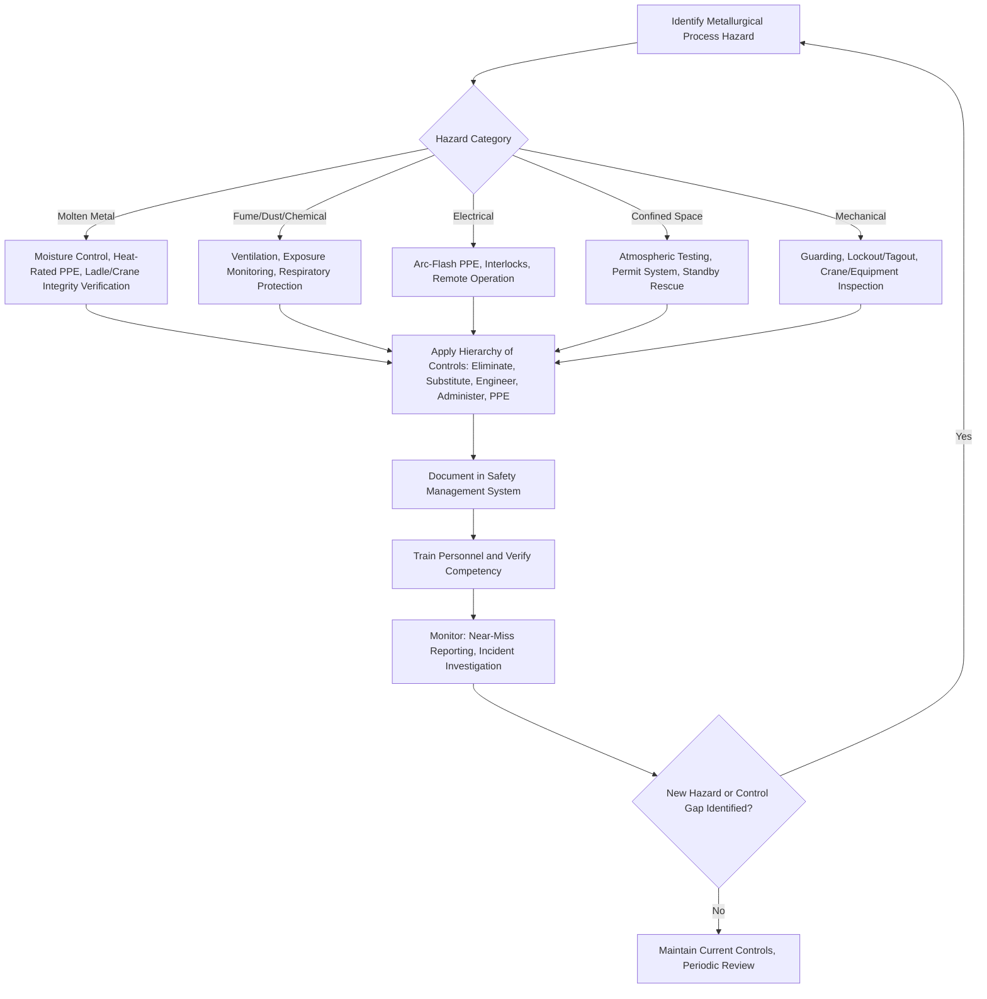

## Industrial Safety in Metallurgical Operations

### Overview

Industrial safety in metallurgical operations addresses the specific occupational hazards present across ore processing, primary metal production, melting and casting, thermal and mechanical processing, and metal finishing operations. Metallurgical environments combine several hazard categories simultaneously — extreme heat, molten material, heavy machinery, hazardous chemicals and dust, confined spaces, and high-energy processes — making structured safety management a core operational discipline rather than a peripheral compliance function. This topic connects directly to environmental regulations in materials industries (many safety and environmental exposure limits share regulatory origin) and to materials specifications and certification (safety-critical process controls are frequently embedded within the quality systems governing material production).

### Major Hazard Categories in Metallurgical Operations

| Hazard Category | Representative Sources | Primary Risk |
| --- | --- | --- |
| Thermal/molten metal | Furnaces, ladles, casting operations | Severe burns, molten metal explosions (water contact) |
| Mechanical | Rolling mills, presses, cranes, material handling | Crushing, entanglement, struck-by injuries |
| Chemical/fume exposure | Smelting off-gas, welding fume, acid pickling, plating baths | Respiratory disease, chemical burns, systemic toxicity |
| Dust/particulate | Ore crushing, grinding, abrasive blasting | Pneumoconiosis, explosion risk (combustible dust) |
| Confined space | Furnace interiors, tanks, ducting, silos | Asphyxiation, entrapment, toxic gas accumulation |
| Electrical | Electric arc furnaces, electrolytic cells, induction heating | Electrocution, arc flash |
| Radiation | Non-destructive testing (radiography), induction/RF heating equipment | Ionizing/non-ionizing radiation exposure |
| Ergonomic | Manual material handling, repetitive tasks | Musculoskeletal injury |

### Molten Metal Hazards

**Key Points**

- **Water-metal explosions** represent one of the most severe acute hazard scenarios in melting and casting operations: molten metal contacting even small quantities of water or moisture can produce a rapid phase-change explosion (steam explosion) with significant projectile and blast risk, making moisture control in melting/casting areas (dry refractories, dry scrap charging, moisture-free molds and tooling) a fundamental safety control rather than merely a quality consideration.
- **Personal protective equipment (PPE) for molten metal exposure** typically includes heat-resistant/reflective clothing, face shields rated for molten metal splash, and specialized footwear designed to shed molten metal rather than allow it to pool against the foot, reflecting the specific failure modes of standard PPE against molten metal contact.
- **Thermal radiant heat exposure** from furnace and casting operations requires engineering controls (shielding, ventilation, distance) in addition to PPE, since prolonged radiant heat exposure presents heat stress and dehydration risk independent of direct contact hazards.
- **Ladle and crane operations** transporting molten metal require rigorous mechanical integrity verification (crane load testing, ladle refractory inspection) because a dropped or ruptured ladle of molten metal represents a mass-casualty-potential event, driving stringent inspection and maintenance protocols specifically for molten-metal-handling equipment beyond standard material handling equipment requirements.

### Fume, Gas, and Dust Exposure Controls

**Key Points**

- **Metal fume exposure** (fine particulate generated during welding, cutting, and high-temperature melting/casting operations) carries specific occupational health risks depending on the metal involved; certain metal fumes (e.g., from galvanized/zinc-coated material, manganese-containing alloys, and various alloying elements) are associated with distinct acute and chronic occupational health effects, driving substance-specific exposure limits and, where cutting/welding on coated or alloyed material is unavoidable, local exhaust ventilation and respiratory protection requirements.
- **Combustible/explosible dust** generated during metal grinding, polishing, and certain powder-handling operations (notably in powder metallurgy and additive manufacturing feedstock handling) presents a distinct explosion hazard requiring dust collection system design, housekeeping practices preventing dust accumulation, and ignition source control, governed in many jurisdictions by dedicated combustible dust safety standards.
- **Acid and chemical process hazards** in pickling, plating, and surface treatment operations (e.g., hydrofluoric acid, chromic acid, cyanide-based plating baths) require chemical-specific handling protocols, ventilation, and emergency response planning given the severity and, in some cases (hydrofluoric acid, cyanide), systemic rather than purely local toxicity of these substances.
- **Confined space entry procedures** apply extensively in metallurgical operations (furnace interiors during maintenance, storage silos, ducting) and require atmospheric testing (oxygen level, toxic gas concentration, flammability), permit-based entry authorization, and standby/rescue provisions before entry is permitted.

### Electrical and Process Energy Hazards

**Key Points**

- **Electric arc furnace (EAF) operations** involve extremely high electrical currents and present both electrical hazard (arc flash, electrocution) and the general molten metal hazards described above simultaneously, requiring specialized electrical safety protocols, arc-flash-rated PPE for personnel working near energized equipment, and engineering controls (interlocks, remote operation capability) minimizing personnel proximity to energized, molten-metal-containing equipment.
- **Electrolytic reduction processes** (e.g., aluminum production via the Hall-Héroult process) involve sustained high-current electrical systems presenting both electrical hazard and, given the high current levels involved, significant arc-flash energy potential in the event of an unintended fault.
- **Induction and radio-frequency (RF) heating equipment**, widely used in metallurgical heat treatment and melting operations, presents non-ionizing electromagnetic field exposure considerations in addition to conventional electrical and thermal hazards, particularly relevant for personnel with implanted medical devices.

### Personal Protective Equipment Framework

**Key Points**

- PPE selection in metallurgical operations follows a hierarchy-of-controls principle in which PPE is the last line of defense, applied after elimination, substitution, engineering controls, and administrative controls have been applied to the extent practicable — a general occupational safety principle with particular importance in metallurgical settings given the severity of unmitigated hazard exposure.
- Task-specific PPE requirements vary substantially across metallurgical operations: molten metal handling requires heat/splash-rated protective clothing and face/eye protection; grinding and abrasive operations require impact-rated eye protection and, where dust exposure is significant, respiratory protection; and chemical processing (pickling, plating) requires chemical-resistant protective clothing and, for volatile/toxic chemical handling, appropriate respiratory protection matched to the specific chemical hazard.
- Respiratory protection programs, where required, involve hazard-specific assessment (particulate vs. gas/vapor hazard, exposure concentration relative to occupational exposure limits) to select appropriate respirator type, along with fit-testing and medical clearance requirements for personnel required to use respiratory protection.

### Safety Management Systems in Metallurgical Operations

**Key Points**

- Formal safety management systems in metallurgical facilities typically integrate hazard identification and risk assessment (systematically evaluating process hazards before they result in incidents), permit-to-work systems (formal authorization processes for high-hazard activities such as confined space entry, hot work, and lockout/tagout for equipment maintenance), and incident investigation processes that feed corrective action back into procedures and training.
- **Lockout/tagout (LOTO)** procedures, isolating equipment from all hazardous energy sources (electrical, mechanical, thermal, hydraulic, pneumatic) before maintenance work, are particularly critical in metallurgical settings given the multiple simultaneous energy sources typically present around furnaces, rolling mills, and material handling equipment.
- Emergency response planning specific to metallurgical hazards (molten metal spill response, toxic gas release, confined space rescue) requires specialized training and equipment beyond generic industrial emergency response, given the distinct failure modes described above.
- Behavioral and cultural safety programs (safety observation programs, near-miss reporting systems encouraging non-punitive disclosure of close calls) complement procedural and engineering controls by surfacing hazard conditions and at-risk practices before they result in actual incidents.

### Regulatory and Standards Framework

**Key Points**

- Occupational safety in metallurgical operations is governed by general industrial safety regulation (e.g., OSHA regulations in the United States, and equivalent national/regional occupational safety authorities elsewhere) alongside industry-specific standards addressing particular hazards (combustible dust standards, confined space entry standards, respiratory protection standards).
- Metallurgical-specific safety guidance is frequently published by industry associations and standards bodies with direct metallurgical process expertise, complementing generic occupational safety regulation with process-specific hazard guidance (e.g., molten metal handling practices, furnace safety guidance).
- [Unverified: specific regulatory citations, exposure limits, and standard numbers vary significantly by jurisdiction and are subject to periodic revision; current applicable requirements should be verified against the specific occupational safety authority and industry standards governing the jurisdiction and operation in question, rather than assumed from general familiarity.]

### Metallurgical Safety Hazard Management Flow

### Hierarchy of Controls in Metallurgical Safety (svg_diagram)

<svg xmlns="http://www.w3.org/2000/svg" viewBox="0 0 700 460" font-family="Arial, sans-serif">
<text x="350" y="28" font-size="18" font-weight="bold" text-anchor="middle">Hierarchy of Controls (svg_diagram)</text>
<path d="M350,60 L500,150 L450,150 L580,240 L520,240 L650,330 L50,330 L180,240 L120,240 L250,150 L200,150 Z" fill="none" stroke="#333" stroke-width="2" />

<text x="350" y="90" font-size="13" text-anchor="middle" font-weight="bold">Elimination</text>

<text x="350" y="175" font-size="13" text-anchor="middle" font-weight="bold">Substitution</text>

<text x="350" y="260" font-size="13" text-anchor="middle" font-weight="bold">Engineering Controls</text>

<text x="350" y="300" font-size="11" text-anchor="middle">(ventilation, guarding, interlocks)</text>

<text x="350" y="345" font-size="13" text-anchor="middle" font-weight="bold">Administrative Controls</text>

<text x="350" y="365" font-size="11" text-anchor="middle">(permits, LOTO, training)</text>

<rect x="200" y="380" width="300" height="50" fill="#f0d3d3" stroke="#8a2c2c" stroke-width="2" />
<text x="350" y="410" font-size="13" text-anchor="middle" font-weight="bold">PPE (Last Line of Defense)</text>

<text x="580" y="90" font-size="11" fill="`#2c7a3d`">Most effective</text>

<text x="580" y="410" font-size="11" fill="`#8a2c2c`">Least effective alone</text>

</svg>

### Case Example: Steel Mill Melt Shop Safety Program

A steel mill electric arc furnace melt shop illustrates the layered safety approach characteristic of metallurgical operations: scrap charging procedures require visual and, where practical, moisture-detection inspection of scrap to reduce water-contamination explosion risk before charging into the furnace; EAF operation itself is conducted with personnel positioned away from the furnace during the melt cycle via remote/automated control systems, minimizing exposure to arc-flash and molten metal splash hazard during the highest-risk operational phase; ladle and crane systems transporting molten steel to casting operations undergo scheduled non-destructive inspection of lifting equipment and refractory condition, reflecting the mass-casualty potential of a dropped or ruptured ladle; and a permit-to-work system governs any hot work, confined space entry (e.g., furnace refractory maintenance), or equipment lockout for maintenance activities, integrating the process-specific molten metal and electrical hazards with standard industrial mechanical and confined-space controls into a single coordinated safety management framework specific to the melt shop's combined hazard profile.

### Common Pitfalls in Metallurgical Safety Management

- **Underestimating water-metal explosion risk in scrap and tooling** — inadequate moisture control in charge material, molds, or tooling remains a persistent and severe hazard in melting and casting operations despite being well understood and preventable.
- **Treating PPE as a substitute for engineering and administrative controls** — over-reliance on PPE without addressing the underlying hazard through higher-priority controls in the hierarchy leaves residual risk that PPE alone cannot adequately manage, particularly for catastrophic-potential hazards like molten metal handling.
- **Inconsistent atmospheric testing before confined space entry** — treating confined space hazards as static rather than re-verifying atmospheric conditions throughout an entry, particularly as work activity itself can change atmospheric composition during the entry.
- **Neglecting substance-specific fume/dust hazard assessment** — treating all metal fume or dust exposure as generically low-risk without evaluating the specific metals and coatings involved, when certain alloying elements and coatings carry substantially different occupational health risk profiles.
- **Incomplete lockout/tagout for multi-energy-source equipment** — isolating only the most obvious energy source (e.g., electrical) on equipment with multiple hazardous energy types (hydraulic, pneumatic, stored mechanical energy, residual heat) present in metallurgical processing equipment.

### Relationship to Quality and Regulatory Systems

Industrial safety management in metallurgical operations frequently operates within the same organizational quality management system infrastructure that governs materials specifications and certification and environmental regulations in materials industries, since process controls maintaining product quality (e.g., controlled melting practice, controlled atmosphere processing) frequently share direct overlap with the engineering controls that manage worker safety hazards in the same processes.

**Related Topics**

- Quality Management Systems (QMS) & ISO Standards
- Environmental Regulations in Materials Industries
- Materials Specifications and Certification
- ASTM, ISO, and Other Materials Standards
- Metal Melting and Casting Process Fundamentals
- Occupational Exposure Limits and Industrial Hygiene Monitoring