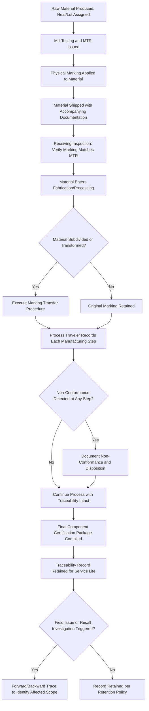

## Materials Traceability and Documentation

### Overview

Materials traceability and documentation is the systematic practice of maintaining an unbroken, verifiable record linking a specific material item — from raw material heat or lot, through every processing, fabrication, and assembly step, to its final installed or in-service location — to its full history of composition, processing, testing, and handling. While materials specifications and certification establishes the point-of-delivery link between material and its test data, traceability and documentation extends that link forward through the entire manufacturing and service life of the material, and is the practical mechanism that makes root-cause failure analysis, recall/corrective action, and fitness-for-service assessment possible when a material-related concern arises after installation.

### Core Traceability Concepts

**Key Points**

- **Traceability** is the ability to identify and follow the history, application, or location of an item and its documentation, forward from raw material through to end use, or backward from an installed item to its origin.
- **Forward traceability** — starting from a raw material heat/lot, identifying all products and locations that material was used in; essential for recall scope determination when a material-level nonconformance is discovered.
- **Backward traceability** — starting from an installed component or product, identifying its specific material origin, processing history, and test data; essential for failure investigation when an in-service problem is discovered.
- **Unbroken chain of custody** — the traceability record must have no gaps; each transfer of material between organizations, processing steps, or physical locations must be documented in a way that preserves the link to the original heat/lot identity.

### Traceability Levels and Granularity

| Level | Description | Typical Application |
| --- | --- | --- |
| Heat/lot level | Traceable to the specific melt or production batch | Standard structural and commercial material |
| Piece/serial level | Traceable to an individual, uniquely identified component | Aerospace, medical device, pressure-critical components |
| Location-within-piece level | Traceable to a specific region of a larger item (e.g., which position on a plate a test coupon was taken from) | Critical fracture-sensitive or highly regulated applications |
| Process-step level | Traceable to the specific equipment, operator, and process parameters used at each processing stage | Highly regulated industries (aerospace, nuclear) requiring full process history reconstruction |

**Key Points**

- Required traceability granularity is application- and risk-driven: a structural steel beam in a standard commercial building typically requires heat-level traceability, while a single forged component in a jet engine or a medical implant frequently requires full piece-level, and sometimes process-step-level, traceability given the consequence severity of a material or process deviation.
- Increasing traceability granularity increases documentation and administrative cost, meaning the appropriate traceability level is itself a risk-based engineering and quality decision, not simply a default maximum applied uniformly.

### Physical Marking and Identification Methods

**Key Points**

- **Stamping/die-stamping** — physically impressing an identification number directly into the material surface, providing a highly durable but potentially stress-concentration-inducing marking method (relevant consideration for fatigue-critical components, where marking location and method must avoid creating an unintended crack initiation site).
- **Stenciling/paint marking** — surface-applied identification, less durable than stamping but avoiding surface stress concentration; common for structural steel and general commercial material.
- **Tagging** — physical tags (metal, plastic, or paper) attached to material bundles or individual pieces, commonly used for bar stock, tube, and similar product forms.
- **Barcode and 2D matrix (Data Matrix/QR) marking** — machine-readable identification enabling automated tracking through manufacturing execution systems, increasingly applied via direct part marking (laser etching or dot-peening) for durable, machine-readable identification that survives subsequent processing.
- **RFID (Radio Frequency Identification)** — embedded or attached electronic identification enabling automated, non-line-of-sight tracking through complex supply chains and warehousing operations, particularly valuable for high-value or high-volume component tracking.
- **Marking transfer procedures** — formal, documented procedures for transferring identification from an original piece of material to sub-pieces created by cutting, machining, or other subdivision, ensuring traceability is preserved when the original marking location is removed or destroyed during processing (directly referenced in the pressure vessel case example in materials specifications and certification).

### Documentation Systems Supporting Traceability

**Key Points**

- **Material Test Reports (MTRs)** — as discussed in materials specifications and certification, the foundational document linking material composition and properties to a specific heat/lot.
- **Traveler documents (process travelers)** — documents that physically or electronically accompany a component through each manufacturing step, recording process parameters, inspection results, and operator/equipment identification at each stage, building a complete process history as the component moves through production.
- **Certificate of Conformance (CoC)** — a supplier declaration that delivered material or product conforms to specified requirements, which may or may not be accompanied by specific test data depending on the certification type required (see the EN 10204 framework discussed in materials specifications and certification).
- **Non-conformance and corrective action records** — documentation of any deviation from specification discovered during processing or inspection, including the disposition decision (use-as-is with engineering justification, rework, or reject) and its rationale, forming part of the permanent traceable record for the affected material.
- **Digital traceability systems / Manufacturing Execution Systems (MES)** — increasingly, traceability documentation is managed through integrated digital systems that automatically link material identification, process parameters, and inspection results across the full manufacturing chain, reducing the risk of manual transcription error and enabling rapid forward/backward traceability queries compared to paper-based systems.

### Traceability in Regulated and High-Consequence Industries

**Key Points**

- **Aerospace** — traceability requirements under quality standards such as AS9100 mandate rigorous material and process traceability for flight-critical components, commonly at piece/serial level, supporting both airworthiness certification and, where needed, fleet-wide corrective action if a material or process issue is discovered.
- **Pressure equipment** — ASME BPVC and related codes require material traceability sufficient to support fitness-for-service assessment of pressure-boundary components throughout the vessel's operating life, as discussed in the pressure vessel case example in materials specifications and certification.
- **Nuclear** — nuclear industry material traceability requirements are among the most stringent in industrial practice, typically requiring full process-step-level traceability and independent (Type 3.2-equivalent) certification as standard practice, reflecting the extreme consequence severity of material-related failures in this sector.
- **Medical devices** — traceability requirements support both regulatory compliance and, critically, the ability to identify and recall specific affected devices/lots if a material or manufacturing issue is discovered post-market, directly connecting to patient safety outcomes.
- Across these sectors, the common thread is that traceability requirements scale with the consequence of a hypothetical material or process failure, not merely with material cost or nominal criticality classification alone.

### Digital Product Passports and Emerging Traceability Trends

**Key Points**

- **Material/digital product passports** — increasingly, particularly in the context of circular economy regulation (see circular economy principles in materials engineering), traceability documentation is being extended beyond manufacturing and service-life quality assurance into end-of-life material recovery, with digital passports recording material composition and processing history specifically to support higher-value recycling and disassembly decisions at end of life.
- **Blockchain and distributed ledger approaches** have been explored in some supply chain traceability applications as a mechanism for creating tamper-resistant, multi-party-verifiable traceability records, particularly relevant where traceability data must be trusted across organizational boundaries without a single controlling authority. [Unverified: the maturity and actual industrial adoption of blockchain-based materials traceability systems, as distinct from conventional digital traceability/MES systems, varies significantly by industry and continues to evolve; specific current adoption status should be verified against recent industry sources rather than assumed.]
- Increasing regulatory pressure for supply chain traceability (as seen in conflict minerals reporting requirements discussed in critical and conflict materials, and in the substance declaration requirements discussed in environmental regulations in materials industries) is progressively extending traceability documentation requirements beyond pure material-property/quality concerns into ethical sourcing and regulatory substance-declaration domains, meaning modern traceability systems increasingly must capture and link multiple distinct categories of information (property/quality data, sourcing/origin data, substance/compliance data) to the same underlying material identity.

### Materials Traceability Documentation Flow

### Forward vs. Backward Traceability (svg_diagram)

<svg xmlns="http://www.w3.org/2000/svg" viewBox="0 0 850 400" font-family="Arial, sans-serif">
<text x="425" y="28" font-size="18" font-weight="bold" text-anchor="middle">Forward vs. Backward Traceability (svg_diagram)</text>
<rect x="360" y="180" width="130" height="50" rx="6" fill="#f7e7c1" stroke="#8a6d2c" stroke-width="2" />
<text x="425" y="210" font-size="12" text-anchor="middle">Raw Material Heat</text>
<rect x="130" y="80" width="120" height="45" rx="6" fill="#dbe9f7" stroke="#2c5f8a" stroke-width="2" />
<text x="190" y="107" font-size="11" text-anchor="middle">Component A</text>
<rect x="130" y="180" width="120" height="45" rx="6" fill="#dbe9f7" stroke="#2c5f8a" stroke-width="2" />
<text x="190" y="207" font-size="11" text-anchor="middle">Component B</text>
<rect x="130" y="280" width="120" height="45" rx="6" fill="#dbe9f7" stroke="#2c5f8a" stroke-width="2" />
<text x="190" y="307" font-size="11" text-anchor="middle">Component C</text>
<line x1="360" y1="205" x2="250" y2="102" stroke="#2c5f8a" stroke-width="2" marker-end="url(#arrowF)" />
<line x1="360" y1="205" x2="250" y2="202" stroke="#2c5f8a" stroke-width="2" marker-end="url(#arrowF)" />
<line x1="360" y1="205" x2="250" y2="302" stroke="#2c5f8a" stroke-width="2" marker-end="url(#arrowF)" />
<text x="300" y="140" font-size="11" fill="#2c5f8a">Forward: Heat →</text>
<text x="300" y="155" font-size="11" fill="#2c5f8a">all products using it</text>
<rect x="600" y="180" width="150" height="50" rx="6" fill="#d7f0d3" stroke="#2c7a3d" stroke-width="2" />
<text x="675" y="210" font-size="12" text-anchor="middle">Installed Component</text>
<line x1="600" y1="205" x2="490" y2="205" stroke="#2c7a3d" stroke-width="2" marker-end="url(#arrowB)" />
<text x="545" y="190" font-size="11" fill="#2c7a3d" text-anchor="middle">Backward: Component</text>
<text x="545" y="240" font-size="11" fill="#2c7a3d" text-anchor="middle">→ origin heat</text>
</svg>

### Case Example: Aerospace Forging Traceability Through Multi-Tier Supply Chain

An aerospace structural forging illustrates full-chain traceability practice: raw titanium alloy is produced and assigned a heat number with accompanying MTR; the forging supplier receives the material, verifies heat markings against the MTR at receiving inspection, and processes it through forging, heat treatment, and machining, with a process traveler recording the specific equipment, temperature profiles, and operator/inspector identification at each step; because the original heat marking is typically removed during machining to final part geometry, a documented marking transfer procedure assigns a unique serial number to the finished forging, cross-referenced in the quality record to the original heat number and full process traveler; the finished part's certification package (material certification, process traveler, final inspection records) accompanies it to the aircraft manufacturer and is retained for the aircraft's service life, such that if a fleet-wide issue is later identified with a specific heat or a specific forging supplier's process during a defined time window, the aircraft manufacturer can query records to identify precisely which serialized components and which aircraft are affected — the practical payoff of the piece-level, process-step-level traceability investment made throughout production.

### Common Pitfalls in Materials Traceability

- **Marking location causing unintended stress concentration** — stamping identification marks in high-stress regions of fatigue-critical components without engineering review can inadvertently create a crack initiation site, directly undermining the component's intended service performance.
- **Incomplete marking transfer during subdivision** — failing to execute or document a marking transfer procedure when material is cut, machined, or otherwise subdivided breaks the traceability chain at that point, even if all preceding and subsequent documentation is otherwise complete.
- **Traceability granularity mismatched to actual risk** — applying minimal heat-level traceability to a component whose failure consequence would warrant piece-level traceability (or, conversely, over-investing in process-step-level traceability for genuinely low-consequence material) reflects a traceability system not calibrated to actual application risk.
- **Fragmented documentation across paper and digital systems** — maintaining traceability records in disconnected paper and digital systems increases the risk of transcription error and significantly slows forward/backward trace queries during a time-sensitive investigation or recall.
- **Inadequate record retention duration** — retaining traceability documentation for a shorter period than the component's actual service life (or applicable regulatory retention requirement) can leave a component untraceable later in its service life when a traceability query becomes necessary.

### Standards and Regulatory Context

Materials traceability practice is governed by quality management system standards (ISO 9001 and sector-specific extensions such as AS9100 for aerospace), code-specific traceability requirements (ASME BPVC for pressure equipment), and, increasingly, regulatory frameworks extending traceability into ethical sourcing (conflict minerals due diligence) and substance compliance (REACH/RoHS declaration flow-down) domains discussed elsewhere in this chapter, reflecting the expanding scope of what a modern materials traceability system is expected to capture and link.

**Related Topics**

- Materials Specifications and Certification
- ASTM, ISO, and Other Materials Standards
- Quality Management Systems (QMS) & ISO Standards
- Critical and Conflict Materials
- Environmental Regulations in Materials Industries
- Fitness-for-Service Assessment and Root Cause Failure Analysis
- Digital Product Passports and Circular Economy Documentation