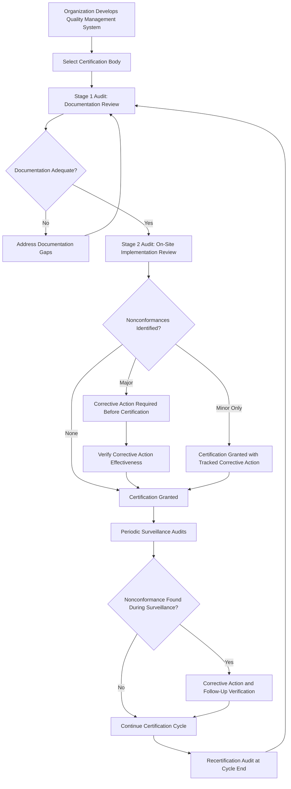

## Quality Certification Systems

### Overview

Quality certification systems are the formal frameworks through which an organization's quality management practices, and the products or materials it produces, are independently assessed and attested to conform to defined standards. Where materials specifications and certification addresses certifying that a specific material shipment meets its property requirements, and materials traceability and documentation addresses tracking that material through its lifecycle, quality certification systems address the higher organizational level: certifying that the producing organization itself operates a management system capable of consistently and reliably delivering conforming material, product, and documentation in the first place. This organizational-level certification is what gives downstream confidence in the entire chain of specification, testing, and traceability practices discussed elsewhere in this chapter.

### Distinguishing Organizational Certification from Product Certification

**Key Points**

- **Organizational (management system) certification** — an independent audit body certifies that an organization's quality management system conforms to a defined standard (e.g., ISO 9001), covering process control, documentation practices, corrective action systems, and continuous improvement mechanisms, rather than certifying any specific product.
- **Product certification** — attests that a specific product or product line meets defined technical requirements (e.g., a pressure vessel certified to ASME code, a component certified to a specific material specification as discussed in materials specifications and certification).
- **Personnel certification** — attests that an individual has demonstrated competency in a specific skill or role (e.g., certified welding inspector, certified NDT technician), often a prerequisite for personnel performing certain quality-critical functions within a certified organization.
- These three certification types are complementary and frequently interdependent: a product certification typically requires that it was produced within a certified organizational quality system, using personnel holding relevant certifications for the specific processes involved.

### Major Quality Management System Standards

| Standard | Scope | Sector |
| --- | --- | --- |
| ISO 9001 | General quality management system requirements | Cross-industry baseline standard |
| AS9100 | Quality management system requirements, built on ISO 9001 with aerospace-specific additions | Aerospace, defense, and space industry |
| IATF 16949 | Quality management system requirements, built on ISO 9001 with automotive-specific additions | Automotive industry |
| ISO 13485 | Quality management system requirements for medical devices | Medical device manufacturing |
| ISO/IEC 17025 | General requirements for the competence of testing and calibration laboratories | Testing and calibration laboratories specifically |
| NADCAP (National Aerospace and Defense Contractors Accreditation Program) | Accreditation for special processes (heat treatment, welding, NDT, coatings) | Aerospace and defense supply chain special processes |
| ISO 14001 | Environmental management systems | Cross-industry, environmental focus |
| ISO 45001 | Occupational health and safety management systems | Cross-industry, safety focus |

### ISO 9001 — The Foundational Framework

**Key Points**

- ISO 9001 establishes requirements for a quality management system based on principles including customer focus, leadership engagement, process-based management, evidence-based decision making, and continual improvement, structured around a Plan-Do-Check-Act (PDCA) cycle applied to organizational processes.
- Core requirements include documented quality objectives, defined roles and responsibilities, process control procedures, management of nonconforming product/output, internal audit programs, management review, and corrective/preventive action processes.
- ISO 9001 is deliberately generic and sector-agnostic, which is both its strength (broad applicability, widely recognized baseline) and the reason sector-specific extensions (AS9100, IATF 16949, ISO 13485) exist — these extensions retain the full ISO 9001 structure while adding sector-specific requirements addressing the particular risk and regulatory profile of that industry.

### Sector-Specific Quality System Extensions

**Key Points**

- **AS9100** builds directly on the ISO 9001 structure, adding aerospace-specific requirements including rigorous configuration management, enhanced risk management requirements, counterfeit parts prevention, and the stringent traceability requirements discussed in materials traceability and documentation, reflecting the safety-criticality and regulatory certification requirements of aerospace and defense products.
- **IATF 16949** adds automotive-specific requirements including production part approval processes (PPAP), advanced product quality planning (APQP), statistical process control expectations, and warranty management, reflecting the automotive industry's high-volume production and field-reliability performance requirements.
- **ISO 13485** adds medical-device-specific requirements including risk management integration throughout the product lifecycle, design control requirements, and regulatory submission support documentation, reflecting the direct patient-safety consequence of medical device nonconformance.
- **NADCAP** operates differently from the broad management-system standards above: rather than certifying an entire organization's quality management system, NADCAP accredits specific "special processes" (heat treatment, welding, non-destructive testing, chemical processing, coatings) that are particularly difficult to verify through end-product inspection alone, requiring instead verification that the process itself was performed correctly — directly relevant to metallurgical processes such as heat treatment where the resulting microstructure and properties cannot always be fully verified by inspecting the finished part alone.

### Laboratory Accreditation — ISO/IEC 17025

**Key Points**

- ISO/IEC 17025 accreditation specifically addresses the competence of testing and calibration laboratories, distinct from the product/organizational management system standards above, and is the accreditation framework most directly relevant to verifying that the test methods and results underlying materials specifications and certification and ASTM, ISO, and Other Materials Standards were actually generated by a competent, properly controlled laboratory.
- Accreditation requirements cover both general management system elements (similar in structure to ISO 9001) and technical competence elements specific to laboratory operations: equipment calibration traceability, method validation, measurement uncertainty evaluation, proficiency testing participation, and personnel competency for specific test methods.
- Specifying that materials testing be performed by an ISO/IEC 17025-accredited laboratory, for the specific test method in question, provides a defensible basis for trusting reported test results beyond simply trusting the testing organization's own internal claims of competence.

### Certification Process and Audit Cycle

**Key Points**

- **Initial certification audit** — typically conducted in two stages: a documentation review confirming the management system is documented and structured appropriately, followed by an on-site implementation audit verifying the system is actually being followed in practice.
- **Surveillance audits** — periodic audits (commonly annual) conducted throughout the certification cycle to verify continued conformance and follow up on any previously identified nonconformances.
- **Recertification audits** — comprehensive audits conducted at the end of a certification cycle (commonly three years for ISO 9001-family certifications) to renew certification, effectively repeating much of the rigor of the initial certification audit.
- **Nonconformance classification** — audit findings are typically classified by severity (e.g., major vs. minor nonconformance), with major nonconformances generally requiring documented corrective action and verification before certification can be granted or maintained, while minor nonconformances may be tracked for correction within a defined timeframe without immediately jeopardizing certification status.
- Certification is issued by accredited third-party certification bodies, themselves subject to oversight by national or international accreditation bodies, creating a layered assurance structure (accreditation body oversees certification body, certification body audits and certifies the organization).

### Quality Certification Audit and Maintenance Flow

### Certification System Layered Assurance Structure (svg_diagram)

<svg xmlns="http://www.w3.org/2000/svg" viewBox="0 0 800 420" font-family="Arial, sans-serif">
<text x="400" y="28" font-size="18" font-weight="bold" text-anchor="middle">Layered Certification Assurance Structure (svg_diagram)</text>
<rect x="250" y="60" width="300" height="60" rx="8" fill="#dbe9f7" stroke="#2c5f8a" stroke-width="2" />
<text x="400" y="85" font-size="13" text-anchor="middle">National/International Accreditation Body</text>
<text x="400" y="103" font-size="11" text-anchor="middle">(oversees certification bodies)</text>
<line x1="400" y1="120" x2="400" y2="150" stroke="#333" stroke-width="2" marker-end="url(#arrow8)" />
<rect x="250" y="150" width="300" height="60" rx="8" fill="#f7e7c1" stroke="#8a6d2c" stroke-width="2" />
<text x="400" y="175" font-size="13" text-anchor="middle">Certification Body</text>
<text x="400" y="193" font-size="11" text-anchor="middle">(audits and certifies organizations)</text>
<line x1="400" y1="210" x2="400" y2="240" stroke="#333" stroke-width="2" marker-end="url(#arrow8)" />
<rect x="250" y="240" width="300" height="60" rx="8" fill="#d7f0d3" stroke="#2c7a3d" stroke-width="2" />
<text x="400" y="265" font-size="13" text-anchor="middle">Certified Organization</text>
<text x="400" y="283" font-size="11" text-anchor="middle">(ISO 9001 / AS9100 / IATF 16949 etc.)</text>
<line x1="400" y1="300" x2="400" y2="330" stroke="#333" stroke-width="2" marker-end="url(#arrow8)" />
<rect x="250" y="330" width="300" height="60" rx="8" fill="#f0d3d3" stroke="#8a2c2c" stroke-width="2" />
<text x="400" y="355" font-size="13" text-anchor="middle">Certified Products/Materials</text>
<text x="400" y="373" font-size="11" text-anchor="middle">(per materials specifications and certification)</text>
</svg>

### Case Example: Aerospace Forging Supplier Certification Stack

An aerospace forging supplier illustrates the layered nature of quality certification in practice: the organization maintains AS9100 certification for its overall quality management system, providing the aerospace-specific process control, risk management, and traceability rigor required by aerospace customers; its heat treatment process, a special process where final part inspection alone cannot fully verify correct execution, holds separate NADCAP accreditation specific to heat treatment; its internal testing laboratory (where preliminary mechanical testing is performed before parts are sent to final certification testing) maintains ISO/IEC 17025 accreditation for the specific test methods it performs; and welding personnel performing any weld repair operations hold individual welder certifications per the applicable welding qualification standard. This layered certification stack — organizational (AS9100), special process (NADCAP), laboratory (ISO/IEC 17025), and personnel (welder certification) — collectively provides the quality assurance foundation underlying the material certification and traceability documentation (see materials specifications and certification and materials traceability and documentation) that accompanies each finished forging to the customer.

### Common Pitfalls in Quality Certification Reliance

- **Assuming ISO 9001 certification guarantees specific technical competence** — ISO 9001 certifies that a management system exists and is followed, not that the organization possesses specific technical capability for a given specialized process; sector-specific or special-process accreditation (AS9100, NADCAP) addresses technical capability more directly.
- **Treating certification as a permanent, static status** — certification is maintained through ongoing surveillance audits and can be suspended or withdrawn for significant nonconformances discovered between recertification cycles; verifying current certification status, not just historical certification, is necessary for ongoing supplier qualification.
- **Confusing accreditation and certification terminology** — accreditation bodies oversee certification bodies, which in turn certify organizations; conflating these terms can create confusion about which entity's credibility actually underlies a given certificate.
- **Overlooking laboratory accreditation scope limitations** — ISO/IEC 17025 accreditation is typically scoped to specific test methods, not laboratory-wide; a laboratory accredited for one test method is not automatically accredited for all tests it may offer, and the specific accredited scope should be verified against the specific test method required.
- **Neglecting special process accreditation for critical processes** — relying solely on organizational ISO 9001/AS9100 certification without verifying special-process-specific accreditation (NADCAP or equivalent) for processes like heat treatment, welding, or NDT, where process execution quality cannot be fully verified through finished-part inspection alone.

### Relationship to Broader Materials and Regulatory Framework

Quality certification systems provide the organizational and process-level assurance foundation underlying essentially every other topic in this chapter: the material test reports and traceability documentation discussed in materials specifications and certification and materials traceability and documentation are only as trustworthy as the quality management system and personnel/process certifications of the organization generating them, and the industrial safety practices discussed in industrial safety in metallurgical operations are frequently governed by the same integrated management system infrastructure (particularly where ISO 45001 occupational health and safety certification is maintained alongside quality and environmental management certification) that governs product quality.

**Related Topics**

- Materials Specifications and Certification
- Materials Traceability and Documentation
- ASTM, ISO, and Other Materials Standards
- Industrial Safety in Metallurgical Operations
- Environmental Regulations in Materials Industries
- Special Process Accreditation (NADCAP) and Personnel Certification
- Laboratory Accreditation and Measurement Uncertainty (ISO/IEC 17025)