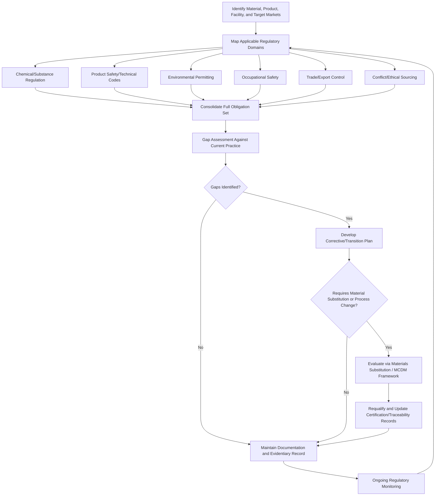

## Regulatory Compliance in Materials Industries

### Overview

Regulatory compliance in materials industries is the organizational discipline of identifying, interpreting, and systematically satisfying the full set of legal and regulatory obligations that govern how materials are sourced, processed, tested, certified, and placed into commerce. This topic sits at the intersection of nearly every other subject in this chapter: it draws on materials standards as the technical reference framework, relies on materials specifications and certification and materials traceability and documentation to demonstrate conformance, is enforced partly through quality certification systems, and directly incorporates the substance-specific and sector-specific regulations discussed in environmental regulations in materials industries and critical and conflict materials. Where those earlier topics addressed specific regulatory domains individually, this topic addresses the integrated compliance management discipline that coordinates across all of them.

### The Regulatory Compliance Landscape — Structural Overview

**Key Points**

- Materials industry regulatory obligations arise from several largely independent regulatory domains that a compliance program must track and satisfy simultaneously: chemical/substance regulation (REACH, RoHS, TSCA), product safety and technical standards (often referenced or incorporated by reference into law, such as pressure equipment codes), environmental permitting and emissions regulation (air/water discharge permits for processing facilities), occupational safety regulation, trade and export control regulation, and conflict/ethical sourcing regulation.
- These domains frequently have different regulatory authorities, different geographic scope, different enforcement mechanisms, and different revision cycles, meaning a single material or product can be simultaneously subject to obligations from multiple domains that must each be tracked and satisfied independently rather than through a single unified compliance check.
- Materials industries face a particular compliance complexity relative to many other sectors because compliance obligations attach at multiple points simultaneously: to the material itself (substance content), to the facility producing/processing it (environmental permits, occupational safety), to the product containing it (product safety/technical standards), and to the transaction moving it across borders (trade/export control, conflict minerals).

### Compliance Domain Reference Overview

| Domain | Representative Frameworks | Primary Compliance Burden |
| --- | --- | --- |
| Chemical/substance regulation | REACH, RoHS, TSCA, China GB standards | Substance registration, restriction compliance, declaration |
| Product safety/technical codes | ASME BPVC, API standards, building/construction codes | Design, material, and fabrication conformance to code |
| Environmental permitting | Air emissions permits, water discharge permits, waste handling regulations | Facility-level operating permits and emissions/discharge limits |
| Occupational safety | OSHA and equivalent national regulations | Workplace hazard control per industrial safety practice |
| Trade and export control | Export administration regulations, dual-use goods controls | Export licensing for controlled materials/technologies |
| Conflict/ethical sourcing | Dodd-Frank Section 1502, EU Conflict Minerals Regulation | Supply chain due diligence and disclosure |
| Quality/certification (regulatory-referenced) | ISO 9001-family standards referenced in regulation or contract | Maintaining certified management system status |

### Regulatory Obligation Identification and Mapping

**Key Points**

- A foundational compliance activity is systematically mapping which regulatory obligations apply to a given material, product, facility, or transaction — since, unlike a single comprehensive "materials law," compliance obligations must be assembled from the applicable subset of each independent regulatory domain based on the specific material composition, product application, facility location, and target market.
- This mapping process typically starts from the bill of materials (identifying substances present, connecting to chemical/substance regulation), the product's intended application and target markets (connecting to product safety codes and market-specific regulatory variants), the facility's location and process type (connecting to environmental and occupational safety permitting), and the material's country/region of origin (connecting to trade control and conflict minerals due diligence).
- Regulatory mapping is not a one-time exercise: as discussed in environmental regulations in materials industries, substance lists and standards are revised on an ongoing basis, meaning a compliance program must include a mechanism for monitoring regulatory change and reassessing previously mapped obligations against current requirements.

### Compliance Management System Structure

**Key Points**

- **Regulatory intelligence/monitoring function** — systematically tracking proposed and finalized regulatory changes across all applicable domains and jurisdictions, providing the input that keeps the regulatory mapping current.
- **Gap assessment** — evaluating current products, materials, and processes against newly identified or updated regulatory requirements to identify where existing practice falls short of new obligations.
- **Corrective/transition planning** — where a gap is identified, developing a plan to achieve compliance within the regulatory timeline, which may involve material substitution (see materials substitution strategies), process changes, additional testing/certification, or supply chain requalification.
- **Documentation and evidentiary record-keeping** — maintaining the specification, certification, and traceability records (see materials specifications and certification and materials traceability and documentation) that serve as the evidentiary basis for demonstrating compliance during audits, inspections, or regulatory inquiries.
- **Cross-functional coordination** — because compliance obligations touch engineering (material/design choices), procurement (supplier qualification and due diligence), quality (certification and testing), environmental/safety (permitting and workplace controls), and legal (interpretation and disclosure obligations), effective compliance management requires structured coordination across these functions rather than treating compliance as a single department's isolated responsibility.

### Interaction Between Compliance Domains

**Key Points**

- Compliance domains frequently interact rather than operating in isolation: a materials substitution driven by REACH/RoHS substance restriction (chemical domain) can trigger requalification testing against product safety codes (technical standards domain) and may require updated supplier due diligence if the substitute material introduces new critical material supply risk (conflict/critical materials domain), illustrating how a single regulatory driver can cascade obligations across multiple compliance domains simultaneously.
- Environmental permitting and occupational safety regulation frequently overlap at the facility level, since many process controls (ventilation, containment, material handling procedures) simultaneously address environmental emissions limits and worker exposure limits, meaning facility-level compliance programs commonly integrate environmental and safety management rather than treating them as fully separate functions — directly reflected in the shared management system infrastructure discussed in industrial safety in metallurgical operations.
- Trade/export control regulation can interact with materials substitution and supply chain diversification decisions (see critical and conflict materials), since a substitute material or an alternative supplier introduced to address one compliance concern (e.g., conflict minerals risk) may itself carry export control classification or origin-country restrictions requiring separate compliance evaluation.

### Regulatory Compliance Management Flow

### Multi-Domain Compliance Intersection (svg_diagram)

<svg xmlns="http://www.w3.org/2000/svg" viewBox="0 0 820 460" font-family="Arial, sans-serif">
<text x="410" y="28" font-size="18" font-weight="bold" text-anchor="middle">Intersecting Regulatory Compliance Domains (svg_diagram)</text>
<circle cx="280" cy="180" r="110" fill="#dbe9f7" fill-opacity="0.6" stroke="#2c5f8a" stroke-width="2" />
<text x="200" y="130" font-size="13" text-anchor="middle">Chemical/</text>
<text x="200" y="146" font-size="13" text-anchor="middle">Substance</text>
<circle cx="450" cy="180" r="110" fill="#f7e7c1" fill-opacity="0.6" stroke="#8a6d2c" stroke-width="2" />
<text x="530" y="130" font-size="13" text-anchor="middle">Product Safety/</text>
<text x="530" y="146" font-size="13" text-anchor="middle">Technical Codes</text>
<circle cx="365" cy="320" r="110" fill="#d7f0d3" fill-opacity="0.6" stroke="#2c7a3d" stroke-width="2" />
<text x="365" y="400" font-size="13" text-anchor="middle">Environmental/</text>
<text x="365" y="416" font-size="13" text-anchor="middle">Occupational Safety</text>

<text x="365" y="230" font-size="12" font-weight="bold" text-anchor="middle">Shared Compliance</text>

<text x="365" y="245" font-size="12" font-weight="bold" text-anchor="middle">Evidentiary Record</text>

</svg>

### Case Example: Multinational Battery Component Manufacturer Compliance Program

A manufacturer of battery components for electric vehicles illustrates integrated multi-domain compliance: cobalt and other critical materials in the bill of materials trigger conflict/critical materials due diligence obligations (supply chain mapping to smelter/refiner level, per critical and conflict materials); the same substances, along with any restricted processing chemicals, trigger REACH SVHC screening and, depending on product classification, RoHS-equivalent substance restriction review (per environmental regulations in materials industries); the battery product itself must meet applicable product safety and transport testing standards before it can be placed into commerce or shipped; the manufacturing facility's chemical processing operations require environmental discharge permits and occupational safety controls for chemical handling (per industrial safety in metallurgical operations); and because the manufacturer sells into the EU, US, and Asian markets simultaneously, each of these obligations must be separately satisfied against the specific regulatory requirements of each target jurisdiction, with the compliance program maintaining a consolidated obligation map rather than addressing each market's requirements as an independent, disconnected exercise. A change in any single input — a new SVHC listing, a shift in a supplier's country of origin, a new market entry — requires the compliance program to reassess the full obligation set rather than only the domain in which the change originated, given the interaction effects described above.

### Common Pitfalls in Materials Industry Regulatory Compliance

- **Managing compliance domains in isolation** — assigning chemical compliance, environmental permitting, and conflict minerals due diligence to entirely separate teams with no coordination mechanism misses the interaction effects where a change in one domain creates obligations in another.
- **Treating compliance mapping as a one-time exercise** — given the demonstrated pace of regulatory revision across nearly every domain discussed in this chapter (SVHC list growth, new national standards, evolving PFAS rules, periodic critical materials list updates), a compliance program without an active regulatory monitoring function will progressively fall out of alignment with current requirements.
- **Assuming certification equals compliance** — quality certification systems (ISO 9001, AS9100, and similar) certify that a management system exists and is followed; they do not, by themselves, guarantee compliance with the full set of substance, environmental, safety, and trade regulations applicable to a specific material or product.
- **Underestimating jurisdictional divergence** — assuming a compliance approach satisfying one major market's requirements (e.g., EU REACH/RoHS) automatically satisfies other markets' analogous-but-distinct requirements, rather than explicitly verifying each target jurisdiction's specific obligations.
- **Insufficient evidentiary record linkage** — maintaining compliance conclusions without the underlying specification, certification, and traceability documentation (see materials specifications and certification and materials traceability and documentation) needed to substantiate those conclusions during an audit or regulatory inquiry.

### Organizational Roles in Compliance Management

Effective regulatory compliance in materials industries typically requires defined coordination among engineering (translating regulatory substance/design restrictions into material and design decisions), procurement and supply chain (supplier qualification, due diligence execution, and requalification when substitution is required), quality assurance (certification, testing, and documentation supporting compliance claims), environmental health and safety (facility permitting and occupational compliance), and legal/regulatory affairs (interpretation of ambiguous requirements, disclosure obligation management, and regulatory change monitoring), reflecting the genuinely cross-functional nature of materials industry compliance as an organizational discipline rather than a task assignable to any single function in isolation.

**Related Topics**

- Environmental Regulations in Materials Industries
- Critical and Conflict Materials
- Materials Specifications and Certification
- Materials Traceability and Documentation
- Quality Certification Systems
- ASTM, ISO, and Other Materials Standards
- Materials Substitution Strategies