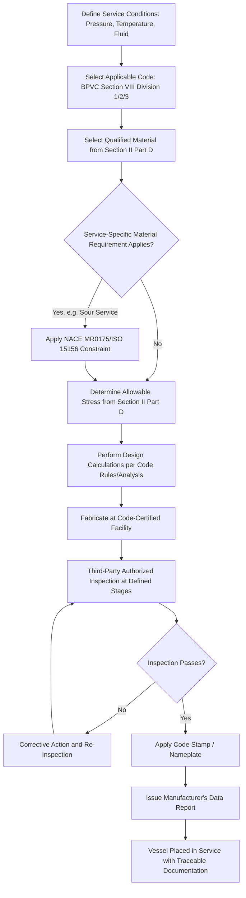

## Codes for Pressure Vessels and Structural Materials

### Overview

Codes for pressure vessels and structural materials are the legally enforceable or industry-mandated engineering codes governing the design, material selection, fabrication, inspection, and in-service assessment of pressure-retaining and load-bearing structural equipment. Unlike voluntary consensus standards (see ASTM, ISO, and Other Materials Standards), these codes are frequently incorporated by reference into law or regulation, making compliance a legal requirement rather than a purely technical or contractual choice. This topic synthesizes how the materials standards, specification/certification practices, and traceability requirements discussed elsewhere in this chapter are integrated into complete, legally binding engineering codes governing two of the most consequence-critical categories of engineered equipment.

### Codes vs. Standards — A Key Distinction

**Key Points**

- A **standard** (ASTM, ISO) is typically a voluntary consensus document that becomes mandatory only when referenced by a code, contract, or regulation.
- A **code** (ASME BPVC, building codes) is a comprehensive document governing design, materials, fabrication, and inspection for a specific equipment category, frequently adopted into law by a jurisdiction (e.g., a state or national government mandating compliance with a specific edition of a pressure vessel code as a condition of legal operation).
- Codes typically incorporate numerous standards by reference (e.g., ASME BPVC Section II references specific ASTM material specifications), meaning code compliance inherently requires standards compliance, but a code additionally imposes design methodology, safety factor, and inspection requirements beyond what the referenced material standards alone specify.
- Jurisdictional adoption of codes varies: some jurisdictions mandate a specific code and edition by law (common for pressure vessels, given the potential for catastrophic failure), while others treat code compliance as an industry best-practice expectation without direct legal mandate.

### ASME Boiler and Pressure Vessel Code (BPVC) — Structure and Scope

**Key Points**

- The ASME BPVC is organized into multiple sections addressing different aspects of pressure equipment: **Section I** (power boilers), **Section II** (materials, itself divided into Parts A–D covering ferrous materials, non-ferrous materials, welding/brazing materials, and properties respectively), **Section VIII** (pressure vessels, divided into Divisions 1, 2, and 3 reflecting increasing design rigor and permitted design stress), and **Section IX** (welding and brazing qualifications).
- **Section II, Part D** specifically provides allowable stress values for qualified materials at various temperatures, directly connecting the material properties discussed in failure driven materials selection and materials specifications and certification to the permitted design stress a code-compliant vessel may use for that material.
- **Section VIII, Division 1** uses a design-by-rule approach with conservative allowable stresses and simplified formulas, suitable for a broad range of standard vessel designs; **Division 2** permits higher allowable stresses through a design-by-analysis approach requiring more rigorous stress analysis and quality control, suitable for vessels where the additional analysis effort is justified by material/fabrication savings; **Division 3** addresses very high-pressure vessel design with additional specialized requirements.
- Code compliance requires using only materials specifically qualified and listed within the code (typically by reference to specific ASTM/ASME dual-numbered specifications, as discussed in ASTM, ISO, and Other Materials Standards), meaning a material's technical suitability alone is insufficient for code compliance — the specific material specification must be explicitly incorporated into the applicable code edition.

### Structural Steel and Building Codes

**Key Points**

- Structural material codes for buildings and civil infrastructure are typically organized differently from pressure vessel codes: a general building code (adopted by a jurisdiction, e.g., the International Building Code in many US jurisdictions, or Eurocode in the EU) establishes overall structural design requirements and references material-specific design standards for the actual structural engineering methodology.
- **AISC (American Institute of Steel Construction) specifications** provide the structural steel design methodology (allowable stress design and load and resistance factor design approaches) referenced by US building codes, governing how structural steel material properties (see ASTM A36 and similar specifications discussed in ASTM, ISO, and Other Materials Standards) are translated into permitted structural design capacity.
- **Eurocode 3** provides the parallel structural steel design methodology referenced by building codes across EU member states, illustrating the same code-references-material-standard-and-design-methodology pattern seen in the AISC/ASTM relationship, but reflecting the EN-based material designation system discussed previously.
- Reinforced concrete structural codes (e.g., ACI 318 in the US, Eurocode 2 in the EU) similarly reference material standards for concrete and reinforcing steel while establishing the structural design methodology, seismic design provisions, and load combination requirements specific to that construction material.
- Unlike pressure vessel codes, where a single unified document (ASME BPVC) governs materials, design, and fabrication together, structural codes are typically more fragmented across separate building code, material design standard, and construction/fabrication standard documents that must be used in coordination.

### Piping Codes

**Key Points**

- **ASME B31 series** codes govern piping systems distinct from the pressure vessels covered by BPVC Section VIII, with different sub-codes addressing different service categories: **B31.1** (power piping), **B31.3** (process piping, widely used in chemical and petrochemical industries), **B31.4** (pipeline transportation of liquids), **B31.8** (gas transmission and distribution piping), among others.
- Piping code selection depends on the specific service and industry context, and the same physical pipe material and fabrication practice may be governed by substantially different allowable stress, inspection, and design requirements depending on which B31 sub-code applies to the specific system's service category.
- The sour-service pipeline case study discussed in case studies in materials selection illustrates how a piping code (governing general design and allowable stress) interacts with a service-specific materials requirement (NACE MR0175/ISO 15156, governing sour-service material hardness/hydrogen-cracking resistance) — code compliance and service-specific material suitability are both independently required and are not interchangeable requirements.

### Code Compliance and Certification Stamps

**Key Points**

- Code-compliant pressure equipment is typically fabricated by organizations holding specific code-issued certification (e.g., an ASME "U" stamp for Section VIII, Division 1 pressure vessels), granted following an audit of the organization's quality management system specific to code compliance requirements, distinct from but analogous to the quality certification systems discussed elsewhere in this chapter.
- A physical stamp or nameplate is typically applied to code-compliant equipment, along with a manufacturer's data report documenting the specific materials, design parameters, and inspection results for that specific vessel, providing a code-specific parallel to the material test report and traceability documentation discussed in materials specifications and certification and materials traceability and documentation.
- Third-party inspection (often by an Authorized Inspector holding specific code-recognized qualification) is typically required at defined stages of fabrication for code-compliant pressure equipment, providing independent verification beyond the manufacturer's own quality system, directly analogous to the Type 3.2 independent certification concept discussed in materials specifications and certification.

### Code Compliance Workflow for Pressure Equipment

### Pressure Vessel Code Document Hierarchy (svg_diagram)

<svg xmlns="http://www.w3.org/2000/svg" viewBox="0 0 850 440" font-family="Arial, sans-serif">
<text x="425" y="28" font-size="18" font-weight="bold" text-anchor="middle">Pressure Equipment Code Document Hierarchy (svg_diagram)</text>
<rect x="325" y="60" width="200" height="55" rx="8" fill="#dbe9f7" stroke="#2c5f8a" stroke-width="2" />
<text x="425" y="90" font-size="13" text-anchor="middle">Jurisdictional Law/</text>
<text x="425" y="106" font-size="12" text-anchor="middle">Regulation (adopts code)</text>
<line x1="425" y1="115" x2="425" y2="145" stroke="#333" stroke-width="2" marker-end="url(#arrow9)" />
<rect x="325" y="145" width="200" height="55" rx="8" fill="#f7e7c1" stroke="#8a6d2c" stroke-width="2" />
<text x="425" y="175" font-size="13" text-anchor="middle">ASME BPVC</text>
<text x="425" y="191" font-size="12" text-anchor="middle">(design, fabrication, inspection)</text>
<line x1="425" y1="200" x2="425" y2="230" stroke="#333" stroke-width="2" marker-end="url(#arrow9)" />
<rect x="325" y="230" width="200" height="55" rx="8" fill="#d7f0d3" stroke="#2c7a3d" stroke-width="2" />
<text x="425" y="255" font-size="13" text-anchor="middle">Section II Part D</text>
<text x="425" y="271" font-size="12" text-anchor="middle">(allowable stress by material)</text>
<line x1="425" y1="285" x2="425" y2="315" stroke="#333" stroke-width="2" marker-end="url(#arrow9)" />
<rect x="325" y="315" width="200" height="55" rx="8" fill="#f0d3d3" stroke="#8a2c2c" stroke-width="2" />
<text x="425" y="340" font-size="13" text-anchor="middle">ASTM/ASME Dual</text>
<text x="425" y="356" font-size="12" text-anchor="middle">Material Specification</text>
<line x1="425" y1="370" x2="425" y2="400" stroke="#333" stroke-width="2" marker-end="url(#arrow9)" />
<rect x="325" y="400" width="200" height="35" rx="8" fill="#e8d3f0" stroke="#6a2c8a" stroke-width="2" />
<text x="425" y="422" font-size="12" text-anchor="middle">Specific Heat/Lot MTR</text>
</svg>

### Case Example: Chemical Process Plant Multi-Code Integration

A chemical process plant illustrates how multiple codes apply simultaneously and must be coordinated: the plant's reactor pressure vessels are designed and fabricated to ASME BPVC Section VIII, Division 2 (justifying the higher allowable stress through rigorous design-by-analysis given the high-value, thick-section equipment involved); the interconnecting process piping is governed by ASME B31.3 (process piping) rather than the vessel code, with its own allowable stress and inspection requirements; the structural steel supporting platform and pipe racks are governed by the applicable building code and AISC structural steel design methodology, entirely separate from the pressure equipment codes governing the vessels and piping they support; and if the process involves sour service conditions, both the vessel and piping materials must additionally satisfy NACE MR0175/ISO 15156 hardness and material cleanliness constraints layered on top of the base code's material qualification. Each of these code domains has its own qualified-material list, allowable stress basis, and inspection requirement structure, requiring the engineering team to correctly apply the intersection of all applicable codes to each specific component category within the same facility, rather than assuming a single code governs the entire installation.

### Common Pitfalls in Pressure Vessel and Structural Code Compliance

- **Assuming material technical suitability equals code compliance** — a material can be technically excellent for a given service condition while remaining non-compliant simply because it is not listed as a qualified material within the specific code edition being applied; code qualification is a distinct requirement from technical performance.
- **Mixing code editions inconsistently within a single project** — since codes are revised periodically (similar to the standards revision cycle discussed in ASTM, ISO, and Other Materials Standards), a project must clearly establish which code edition governs the entire scope, since allowable stresses, qualified materials, and design rules can change between editions.
- **Applying a piping code's requirements to a vessel or vice versa** — the boundary between what constitutes a "pressure vessel" under BPVC Section VIII versus "piping" under the B31 series is a code-defined distinction with real design and inspection consequence, and misclassifying equipment can result in applying the wrong set of code requirements entirely.
- **Overlooking service-specific material constraints layered on top of base code qualification** — as the sour-service example illustrates, base code material qualification (e.g., under Section II) does not automatically satisfy service-specific requirements (e.g., NACE MR0175) that impose additional, sometimes contradictory, constraints (such as maximum rather than minimum strength/hardness).
- **Neglecting jurisdictional adoption verification** — assuming a code applies without confirming which specific code and edition the operating jurisdiction has legally adopted, since jurisdictional adoption timing can lag the code organization's own publication schedule.

### Standards and Code Bodies

Pressure vessel and structural material codes are developed and maintained by ASME (BPVC, B31 piping series), AISC (structural steel design), ACI (reinforced concrete design), and their international counterparts (Eurocode series in the EU, and other national code bodies), with jurisdictional adoption managed through national and sub-national regulatory authorities. [Unverified: specific code editions currently in force, jurisdictional adoption status, and specific allowable stress values are subject to periodic revision and vary significantly by jurisdiction; current applicable code editions and adoption status should be verified against the specific jurisdiction and code body governing a given project.]

**Related Topics**

- ASTM, ISO, and Other Materials Standards
- Materials Specifications and Certification
- Materials Traceability and Documentation
- Quality Certification Systems
- Regulatory Compliance in Materials Industries
- Failure Driven Materials Selection
- Fitness-for-Service Assessment (API 579 / ASME FFS-1)