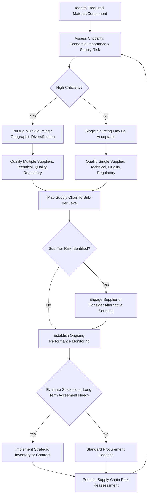

## Supply Chain Considerations in Materials Sourcing

### Overview

Supply chain considerations in materials sourcing address the strategic, operational, and risk management dimensions of procuring engineering materials — extending beyond the technical specification and certification requirements covered in materials specifications and certification into the broader questions of supplier qualification, geographic and geopolitical risk, logistics, inventory strategy, and supply continuity. Materials sourcing decisions increasingly sit at the intersection of technical requirements, cost, and the critical/conflict material and regulatory compliance considerations discussed elsewhere in this chapter, requiring a multi-disciplinary approach that treats supply chain risk as a first-class materials engineering concern rather than a purely procurement-function responsibility.

### Core Supply Chain Risk Dimensions

**Key Points**

- **Geographic concentration risk** — reliance on materials or components sourced predominantly from a limited number of geographic regions, creating exposure to regional disruption (natural disaster, political instability, trade policy change) affecting a disproportionate share of total supply, directly connecting to the critical materials supply concentration concerns discussed in critical and conflict materials.
- **Supplier concentration risk** — reliance on a limited number of qualified suppliers for a given material or component, where qualification requirements (technical, quality certification, or regulatory) may themselves limit the feasible supplier pool even when the underlying material is not geographically scarce.
- **Single-source dependency** — a specific, more acute form of supplier concentration risk where only one qualified supplier exists for a given material, component, or process, eliminating redundancy entirely and creating maximum vulnerability to that supplier's operational disruption.
- **Logistics and transportation risk** — disruption to the physical movement of material between production and point of use, including port congestion, shipping capacity constraints, and transportation mode-specific vulnerabilities.
- **Price volatility risk** — exposure to raw material commodity price fluctuation, which can affect project cost predictability independent of physical supply availability.
- **Quality/counterfeit risk** — risk of receiving material that does not conform to specification despite apparent certification, ranging from unintentional quality escapes to deliberate counterfeiting, particularly relevant in high-value alloy and electronic component supply chains.

### Supplier Qualification Process

**Key Points**

- **Technical qualification** — verifying the supplier's demonstrated capability to consistently produce material meeting the required specification, typically through initial sample testing, process capability review, and, for critical applications, on-site process audit.
- **Quality system qualification** — verifying the supplier holds relevant quality certification (see quality certification systems) appropriate to the criticality of the material/component being sourced, and, where applicable, special process accreditation (NADCAP or equivalent) for processes like heat treatment or welding.
- **Regulatory/compliance qualification** — verifying the supplier can support required regulatory compliance documentation, including substance declarations (REACH/RoHS, see environmental regulations in materials industries) and, where applicable, conflict minerals due diligence support (see critical and conflict materials).
- **Financial and operational stability assessment** — evaluating supplier financial health and operational capacity to ensure supply continuity risk is not introduced through supplier business instability, particularly relevant for long-term or high-volume supply relationships.
- **Ongoing performance monitoring** — ongoing supplier qualification is not a one-time gate but a continuing process, typically involving periodic requalification audits, delivered-quality tracking (nonconformance rate, on-time delivery performance), and reassessment when significant supplier changes occur (ownership change, facility relocation, process changes).

### Sourcing Strategy Frameworks

| Strategy | Description | Trade-off |
| --- | --- | --- |
| Single sourcing | One qualified supplier for a given material/component | Simplifies qualification and can improve unit pricing/relationship depth, but maximizes disruption risk |
| Dual/multi-sourcing | Two or more qualified suppliers, often with defined volume allocation | Reduces disruption risk and can support price competition, at the cost of qualification effort duplicated across suppliers |
| Geographic diversification | Deliberately qualifying suppliers across distinct geographic regions | Reduces regional disruption risk, but can increase logistics complexity and may not be feasible for geographically concentrated raw materials |
| Strategic stockpiling | Maintaining inventory buffers beyond immediate production need for critical materials | Provides disruption buffer at the cost of inventory carrying cost and, for some materials, shelf-life/degradation risk |
| Vertical integration | Bringing upstream material production in-house | Maximizes supply control, at high capital cost and loss of supplier specialization benefit |
| Long-term supply agreements | Contractual commitments securing volume and, often, price stability over an extended period | Provides planning certainty, at the cost of reduced flexibility to respond to market price movements |

**Key Points**

- Sourcing strategy selection is generally risk-weighted by material criticality: high-criticality materials (see critical and conflict materials) more commonly justify the additional cost/complexity of multi-sourcing, geographic diversification, or strategic stockpiling, while lower-criticality, readily available materials may reasonably remain single-sourced for simplicity and relationship-depth benefits.
- These strategies are not mutually exclusive and are commonly combined — e.g., dual-sourcing across geographically diversified suppliers, combined with a modest strategic stockpile for the highest-criticality inputs.

### Supply Chain Mapping and Visibility

**Key Points**

- **Tier 1 visibility** — direct suppliers, typically well understood by the purchasing organization through direct contractual relationship and qualification process.
- **Sub-tier (Tier 2+) visibility** — suppliers to the purchasing organization's direct suppliers, frequently far less visible despite often being the actual source of raw material or critical sub-components, and the tier at which many of the most significant supply risks (including the smelter/refiner-level conflict minerals traceability discussed in critical and conflict materials) actually originate.
- Achieving sub-tier visibility typically requires either direct multi-tier supply chain mapping (requiring cooperation from Tier 1 suppliers to disclose their own supply sources) or reliance on industry-shared traceability tools and databases, mirroring the smelter/refiner identification challenge discussed in the conflict minerals due diligence process.
- Digital supply chain mapping and traceability tools, increasingly integrated with the digital traceability systems discussed in materials traceability and documentation, are progressively improving sub-tier visibility, though achieving complete multi-tier transparency remains a persistent challenge across most industries, particularly for complex, globally distributed supply chains.

### Supply Chain Risk Assessment Framework

**Key Points**

- A structured supply chain risk assessment typically evaluates each critical material or component against: probability of supply disruption (informed by geographic concentration, supplier count, and historical disruption frequency), consequence of disruption (informed by the material's criticality to production continuity and the feasibility/lead-time of qualifying an alternative), and current mitigation coverage (existing dual-sourcing, stockpile, or long-term agreement coverage).
- This risk assessment structure parallels the criticality assessment framework discussed in critical and conflict materials (economic importance × supply risk), but is applied at the operational supply chain level specific to an individual organization's actual supplier relationships, rather than at the broader national/industry criticality level.
- High-risk, high-consequence materials identified through this assessment are the natural priority targets for the sourcing strategy interventions (multi-sourcing, diversification, stockpiling) discussed above, providing a structured basis for allocating typically limited supply chain risk mitigation resources.

### Supply Chain Sourcing Decision Flow

### Supply Chain Tier Visibility Diagram (svg_diagram)

<svg xmlns="http://www.w3.org/2000/svg" viewBox="0 0 820 440" font-family="Arial, sans-serif">
<text x="410" y="28" font-size="18" font-weight="bold" text-anchor="middle">Supply Chain Tier Visibility (svg_diagram)</text>
<rect x="330" y="60" width="160" height="55" rx="8" fill="#d7f0d3" stroke="#2c7a3d" stroke-width="2" />
<text x="410" y="92" font-size="13" text-anchor="middle">Purchasing Org.</text>
<line x1="410" y1="115" x2="410" y2="150" stroke="#333" stroke-width="2" marker-end="url(#arrowA)" />
<rect x="260" y="150" width="300" height="55" rx="8" fill="#dbe9f7" stroke="#2c5f8a" stroke-width="2" />
<text x="410" y="175" font-size="13" text-anchor="middle">Tier 1 Suppliers</text>
<text x="410" y="192" font-size="11" text-anchor="middle">(High Visibility, Direct Relationship)</text>
<line x1="410" y1="205" x2="410" y2="240" stroke="#333" stroke-width="2" marker-end="url(#arrowA)" />
<rect x="200" y="240" width="420" height="55" rx="8" fill="#f7e7c1" stroke="#8a6d2c" stroke-width="2" />
<text x="410" y="265" font-size="13" text-anchor="middle">Tier 2 Suppliers</text>
<text x="410" y="282" font-size="11" text-anchor="middle">(Reduced Visibility, Indirect Relationship)</text>
<line x1="410" y1="295" x2="410" y2="330" stroke="#333" stroke-width="2" marker-end="url(#arrowA)" />
<rect x="140" y="330" width="540" height="55" rx="8" fill="#f0d3d3" stroke="#8a2c2c" stroke-width="2" />
<text x="410" y="355" font-size="13" text-anchor="middle">Raw Material / Smelter / Refiner Level</text>
<text x="410" y="372" font-size="11" text-anchor="middle">(Lowest Visibility, Highest Risk Origination)</text>
</svg>

### Case Example: Aerospace Titanium Supply Chain Risk Management

Aerospace manufacturers sourcing titanium alloy illustrate layered supply chain risk management in practice: given titanium's classification as both a critical material (concentrated primary production capacity globally) and a material requiring stringent quality/traceability qualification (see materials traceability and documentation), aerospace organizations commonly qualify multiple mill sources across geographically diversified regions specifically to avoid single-source dependency on any one producer; given the long lead times and stringent qualification burden associated with titanium mill qualification (often requiring multi-year qualification programs for flight-critical material), organizations frequently maintain strategic inventory buffers beyond immediate production need for qualified titanium stock; and recycling of titanium machining scrap (see recycling technologies for metals) is pursued partly as a supply risk mitigation strategy, reducing dependence on primary mill supply for at least a portion of total material demand. This combination of multi-sourcing, strategic stockpiling, and internal scrap recycling reflects a risk-weighted sourcing strategy appropriate to a high-criticality, high-qualification-burden material, in contrast to the single-sourcing approach that might reasonably apply to a low-criticality, readily available commodity material within the same organization's broader supply chain.

### Common Pitfalls in Materials Supply Chain Management

- **Optimizing sourcing purely on unit price** — a sourcing decision based solely on lowest unit cost, without weighting supply continuity risk, quality risk, and total qualification/requalification cost, can produce a lower total-cost-of-ownership outcome that nonetheless carries unacceptable disruption risk for critical materials.
- **Treating supplier qualification as a one-time gate** — as discussed above, ongoing performance monitoring and periodic requalification are necessary because supplier capability, ownership, and process conditions can change after initial qualification.
- **Stopping risk assessment at Tier 1 visibility** — as with conflict minerals due diligence, many of the most significant supply risks originate at the sub-tier (raw material/smelter/refiner) level, and a risk assessment that does not extend beyond direct suppliers provides incomplete risk coverage.
- **Applying uniform sourcing strategy regardless of material criticality** — applying the same single-sourcing approach to both a commodity material and a high-criticality, long-lead-time material misallocates limited risk mitigation resources; sourcing strategy should be explicitly risk-weighted per material, as discussed above.
- **Underestimating requalification cost and lead time when responding to disruption** — treating supplier diversification as a rapid-response option without accounting for the genuine qualification lead time (particularly for regulated industries with extensive technical/quality qualification requirements) can leave an organization without a viable near-term alternative when a primary source is disrupted, despite having "identified" alternative suppliers on paper.

### Relationship to Broader Materials Engineering Practice

Supply chain sourcing considerations are inseparable from several other topics in this and prior chapters: materials substitution strategies are frequently motivated by supply chain risk rather than purely technical or cost factors; the multi-criteria decision making in materials selection framework can and should incorporate supply risk as an explicit weighted criterion alongside mechanical and cost performance; and the traceability and certification infrastructure discussed in materials traceability and documentation and materials specifications and certification provides the practical mechanism by which supply chain visibility and qualification are actually verified and maintained over time, rather than merely asserted.

**Related Topics**

- Critical and Conflict Materials
- Materials Substitution Strategies
- Multi Criteria Decision Making in Materials Selection
- Materials Specifications and Certification
- Materials Traceability and Documentation
- Quality Certification Systems
- Regulatory Compliance in Materials Industries