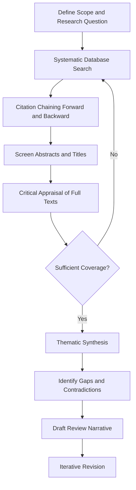

## Literature Review and Scientific Writing in Materials Science

### Purpose and Scope

Literature review and scientific writing form the communicative backbone of materials science research. A literature review situates new work within the existing body of knowledge, identifies gaps, and justifies research direction, while scientific writing translates experimental and computational findings into a reproducible, peer-verifiable record. In materials science specifically, this involves synthesizing information across disciplines — physics, chemistry, mechanical engineering — and interpreting structure-property-processing-performance relationships from prior work.

**Key Points**

- Literature reviews are not mere summaries; they are critical syntheses that evaluate methodology, identify contradictions, and expose unresolved questions.
- Materials science writing must precisely link microstructure, processing conditions, and measured properties, since ambiguity here undermines reproducibility.
- Both skills are iterative and improve through structured practice, not innate talent.

### The Literature Review Process

#### 1. Defining Scope and Research Questions

Before searching, the researcher must define boundaries: material system (e.g., Ni-based superalloys), property of interest (e.g., creep resistance), and processing route (e.g., additive manufacturing). A poorly scoped review leads to unmanageable source volume or missed critical work.

#### 2. Systematic Literature Search

**Key Points**

- Primary databases: Web of Science, Scopus, and specialized repositories like the ASM Alloy Center Database or the Materials Project for computational data.
- Boolean search construction: combine material class, property, and process terms using AND/OR/NOT operators (e.g., `("titanium alloy" OR "Ti-6Al-4V") AND ("fatigue" OR "fatigue life") AND ("additive manufacturing" OR "selective laser melting")`).
- Citation chaining: forward citation tracking (who cited this seminal paper) and backward tracking (what did this paper cite) reveal both foundational work and recent developments.
- Grey literature (theses, conference proceedings, technical reports from ASM, TMS, MRS) often contains preliminary data absent from journals.

#### 3. Source Evaluation and Critical Appraisal

Not all sources carry equal weight. Evaluation criteria include:

| Criterion | Consideration |
| --- | --- |
| Journal impact and rigor | Peer-reviewed venues (Acta Materialia, Scripta Materialia, Journal of Materials Science) vs. predatory or non-reviewed outlets |
| Methodological soundness | Sample size, characterization technique appropriateness (e.g., using XRD alone to claim single-phase purity is often insufficient) |
| Reproducibility | Are processing parameters, heat treatment schedules, and testing standards (ASTM/ISO) fully specified? |
| Recency vs. foundational value | Recent papers show current consensus; older papers (e.g., Hall-Petch's original 1951/1953 papers) establish theoretical basis |
| Conflicting results | Divergent findings on the same system may indicate uncontrolled variables (e.g., trace impurities, cooling rate differences) |

#### 4. Synthesis Strategies

Rather than a chronological listing (a common novice error), effective reviews organize by theme, mechanism, or debate:

- **Thematic organization**: group by processing method, then discuss property outcomes within each.
- **Chronological-thematic hybrid**: trace how understanding of a mechanism (e.g., precipitation hardening in Al-Cu alloys) evolved, highlighting paradigm shifts.
- **Methodological organization**: compare experimental vs. computational (DFT, CALPHAD, phase-field) approaches to the same question.
- Identify explicit **research gaps**: unexplored composition ranges, untested environmental conditions, lack of in-situ characterization, or unresolved mechanistic disputes.

### Structuring a Materials Science Literature Review

A standalone review article or a dissertation review chapter typically follows:

1. **Introduction**: broad context, technological motivation (e.g., why lightweight alloys matter for aerospace fuel efficiency).
2. **Fundamental background**: relevant theory (thermodynamics, crystallography, deformation mechanisms).
3. **Body sections organized by subtopic**: e.g., for a review on high-entropy alloys — (a) compositional design principles, (b) phase stability and CALPHAD predictions, (c) mechanical property trends, (d) corrosion behavior.
4. **Critical synthesis and unresolved questions**.
5. **Conclusion and research direction statement**, often transitioning directly into the thesis's own research objectives.

### Scientific Writing Principles in Materials Science

#### Precision in Terminology

Materials science demands exactness: "strength" must specify yield strength, ultimate tensile strength, or fracture strength; "hardness" must specify the scale (Vickers, Rockwell, Brinell) and load. Ambiguous terminology is a leading cause of irreproducibility complaints in the field.

#### The IMRaD Structure

Most materials science journal articles follow Introduction, Methods, Results, and Discussion (IMRaD):

- **Introduction**: motivation, literature context, explicit knowledge gap, stated hypothesis or objective.
- **Materials and Methods**: full processing history (alloy composition, casting/AM parameters, heat treatment schedule with exact temperatures, times, and cooling rates), characterization techniques (SEM/TEM model and settings, XRD parameters, mechanical testing standards), and statistical treatment of data.
- **Results**: objective presentation of data — micrographs, stress-strain curves, diffraction patterns — without interpretive claims.
- **Discussion**: interpretation, mechanism proposal, comparison to literature values, and acknowledgment of limitations.

**Key Points**

- Methods sections in materials science must be detailed enough for independent replication; omitting heat treatment ramp rates or quench media is a common and serious deficiency.
- Results and Discussion should remain separated: describing *what* was observed (Results) is distinct from *why* it occurred (Discussion).

#### Data Presentation Conventions

- Stress-strain curves: label axes with units (MPa, %), indicate loading rate.
- Micrographs: include scale bars, imaging mode (secondary electron, backscattered electron, bright-field TEM), and magnification.
- Phase diagrams and CALPHAD outputs: cite the thermodynamic database version used.
- Error bars and statistics: specify whether error bars represent standard deviation, standard error, or confidence intervals; report sample size ($n$).

**Example**

A properly specified methods sentence:

"Ti-6Al-4V samples were solution treated at $955\,°C$ for $1\,\text{h}$, water quenched, then aged at $535\,°C$ for $4\,\text{h}$ (air cooled), following ASTM B348 guidelines; tensile tests were conducted per ASTM E8 at a strain rate of $10^{-3}\,\text{s}^{-1}$."

This contrasts with an inadequate version: "Samples were heat treated and then tested for strength" — which lacks reproducibility.

#### Common Pitfalls

| Pitfall | Consequence |
| --- | --- |
| Vague processing descriptions | Irreproducible results |
| Overgeneralizing from limited data | Claims not supported by sample size or conditions tested |
| Confusing correlation with causation (e.g., grain size and hardness without controlling for texture or precipitate density) | Misleading mechanistic claims |
| Citation of secondary sources instead of original data | Propagation of errors (citation drift) |
| Passive voice overuse obscuring actor/responsibility in procedures | Reduced clarity, though passive voice remains conventional in Methods sections |

[Inference] Reviewers in top-tier materials journals increasingly request explicit uncertainty quantification (error propagation for calculated quantities like activation energy from Arrhenius fits), reflecting a broader push toward reproducibility standards, though exact requirements vary by journal and are not universally codified.

### Citation Management and Referencing Standards

- Reference managers (Zotero, EndNote, Mendeley) are standard for tracking large source sets.
- Citation styles vary by publisher: Elsevier journals (Acta Materialia) often use numbered Vancouver-style; ACS journals use author-date variants.
- Proper attribution of prior data when replotting or reproducing figures requires explicit permission and citation, distinct from citing textual claims.

### Peer Review and Revision

Understanding the peer review process improves both reading and writing:

- Reviewers assess novelty, technical soundness, and clarity of contribution relative to existing literature — reinforcing why the literature review must be current and comprehensive.
- Responding to reviewer comments requires a point-by-point rebuttal document, addressing each concern with either revised text or reasoned justification.
- Revision cycles often require additional characterization (e.g., a reviewer requesting TEM confirmation of a phase identified only by XRD).

### Tools and Resources

- **Reference/writing tools**: LaTeX (common in physics-adjacent materials subfields) with BibTeX/BibLaTeX; Overleaf for collaborative drafting.
- **Data and literature repositories**: Materials Project, NIMS MatNavi, Web of Science, Google Scholar.
- **Plagiarism and integrity checking**: iThenticate is commonly used by journals pre-publication.

**Next Steps**

- Research Ethics and Data Integrity in Materials Science
- Statistical Methods for Materials Characterization Data
- Design of Experiments (DOE) in Alloy Development
- Grant Writing and Research Proposal Development
- Presenting Research: Conference Posters and Technical Talks
- Reproducibility and Open Data Practices in Materials Research
- Patents and Intellectual Property in Materials Innovation