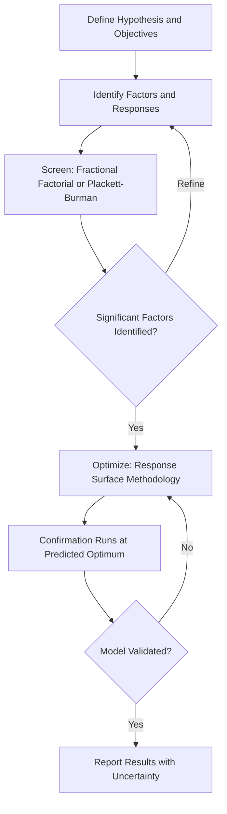

## Experimental Design in Materials Research

### Purpose and Scope

Experimental design in materials research provides the statistical and methodological framework for planning investigations that yield valid, reproducible, and efficiently obtained conclusions about processing-structure-property relationships. Poorly designed experiments waste resources, confound variables, and produce results that cannot support the causal claims researchers wish to make. In materials science, this is complicated by multi-scale phenomena, long processing times (heat treatments, aging), destructive testing, and expensive characterization.

**Key Points**

- Experimental design determines *what* to vary, *how much* to vary it, and *in what combinations*, before any sample is fabricated.
- Confounding variables — often processing artifacts (e.g., furnace position affecting cooling rate) — are the most common source of irreproducible materials science findings.
- Statistical rigor and domain knowledge of materials behavior must be combined; a statistically optimal design that ignores metallurgical constraints (e.g., solubility limits) is not practically useful.

### Foundational Concepts

#### Variables and Their Classification

| Variable Type | Definition | Materials Science Example |
| --- | --- | --- |
| Independent (factor) | Deliberately varied input | Aging temperature, alloy composition, strain rate |
| Dependent (response) | Measured outcome | Yield strength, hardness, corrosion rate |
| Controlled | Held constant | Sample geometry, surface finish, testing environment |
| Nuisance/lurking | Uncontrolled but influential | Furnace hot-zone variation, ambient humidity during testing, operator technique |
| Confounding | Varies systematically with the factor, obscuring causality | Grain size changing with both temperature and time in a single-variable-at-a-time study |

#### Hypothesis Formulation

A well-formed research hypothesis in materials science should be falsifiable and mechanistically grounded. Example: "Increasing Mg content from 0.5 to 2.0 wt% in Al-Si-Mg casting alloys increases yield strength via enhanced Mg₂Si precipitation density, independent of Si morphology changes." This is preferable to a vague hypothesis like "Mg improves strength," since it specifies mechanism and controls for a known confound (Si morphology).

#### Replication, Randomization, and Blocking

**Key Points**

- **Replication**: distinguishes true effects from measurement noise and material variability (e.g., casting porosity differs sample to sample); minimum $n=3$ is a common convention, though power analysis should determine actual requirements.
- **Randomization**: sample testing order, furnace loading position, and specimen selection from a batch should be randomized to prevent systematic bias.
- **Blocking**: grouping experiments by a known nuisance factor (e.g., "furnace run" or "raw material lot") so its effect can be statistically separated from the factor of interest.

### Classical Experimental Design Strategies

#### One-Factor-at-a-Time (OFAT)

The traditional approach: vary one parameter while holding others fixed. While intuitive, OFAT cannot detect **interaction effects** (e.g., the effect of aging time on hardness may depend on aging temperature) and is statistically inefficient, requiring many runs to explore a parameter space.

#### Full Factorial Design

Tests all combinations of factor levels. For $k$ factors each at $L$ levels, the number of runs is $L^k$. A 3-factor, 2-level full factorial ($2^3$) requires 8 runs and captures all main effects and interactions.

**Example**

Investigating the effect of solutionizing temperature (2 levels), aging temperature (2 levels), and aging time (2 levels) on hardness of an Al alloy requires $2^3 = 8$ experimental runs, systematically covering all combinations rather than the 6+ runs of an OFAT approach that would still miss interactions.

#### Fractional Factorial Design

When full factorial designs become impractical (e.g., $2^7 = 128$ runs), fractional factorial designs test a carefully chosen subset, sacrificing resolution of higher-order interactions (which are often negligible) to reduce runs. Design resolution (III, IV, V) indicates which effects are confounded ("aliased") with which others.

#### Response Surface Methodology (RSM)

Used for optimization once significant factors are identified. Central Composite Design (CCD) and Box-Behnken designs fit quadratic models to map curved response surfaces (e.g., finding the aging temperature/time combination that maximizes strength while maintaining ductility above a threshold).

$$Y = \beta_0 + \sum_{i=1}^{k}\beta_i X_i + \sum_{i=1}^{k}\beta_{ii}X_i^2 + \sum_{i<j}\beta_{ij}X_iX_j + \epsilon$$

where $Y$ is the response (e.g., hardness), $X_i$ are coded factor levels, and $\epsilon$ is random error.

#### Taguchi (Orthogonal Array) Methods

Widely used in industrial materials/process optimization for robustness ("quality engineering"). Orthogonal arrays (e.g., $L_9$, $L_{18}$) reduce run count while estimating main effects, and the signal-to-noise ratio ($S/N$) framework identifies factor settings that minimize sensitivity to uncontrolled noise variables (e.g., minor composition drift in production).

[Inference] Taguchi methods are favored in production-oriented process optimization (e.g., optimizing welding or casting parameters) more than in fundamental mechanistic research, since their confounding structure can obscure interaction effects that fundamental studies often seek to characterize; this is a general disciplinary tendency rather than a strict rule.

### Materials-Specific Design Considerations

#### Sample Size and Statistical Power

Given the cost of materials testing (machining, long heat treatments, destructive mechanical tests), power analysis balances statistical confidence against resource constraints. The sample size $n$ needed to detect an effect size $d$ with power $1-\beta$ at significance $\alpha$ follows standard power formulas, but materials scientists must also account for inherent material variability (e.g., casting porosity distributions, powder feedstock batch variation in additive manufacturing).

#### Controlling for Microstructural Confounds

- **Grain size vs. texture**: thermomechanical processing that changes grain size often simultaneously alters crystallographic texture; isolating grain size effects requires designs that decouple these (e.g., comparing equiaxed vs. textured samples of matched grain size).
- **Porosity in additive manufacturing**: build parameters (laser power, scan speed, hatch spacing) interact non-trivially with resulting porosity and microstructure; DOE approaches (e.g., process maps from full/fractional factorials) are standard for AM parameter optimization.
- **Batch-to-batch feedstock variation**: raw material lot should be treated as a blocking variable, not ignored.

#### Characterization Technique Selection as Part of Design

Experimental design extends beyond fabrication parameters to measurement strategy:

- Destructive vs. non-destructive testing trade-offs (e.g., in-situ synchrotron XRD monitoring phase transformation vs. ex-situ quenching-and-sectioning).
- Statistical sampling for microstructural characterization (e.g., number of SEM fields of view needed for representative grain size measurement per ASTM E112).
- Selecting complementary techniques to avoid single-technique bias (e.g., confirming XRD phase identification with TEM selected-area diffraction).

### Design of Experiments (DOE) Software and Workflow

Common tools include Minitab, JMP, Design-Expert, and open-source options (Python's `pyDOE2`, R's `DoE.base`). A typical DOE workflow:

1. Define factors, levels, and responses.
2. Select design type (screening vs. optimization) based on prior knowledge and resource budget.
3. Generate the design matrix (randomized run order).
4. Execute experiments, recording all nuisance variables.
5. Fit statistical model (ANOVA for factorial designs; regression for RSM).
6. Validate model with confirmation runs at predicted optimal or interesting conditions.

**Example**

An ANOVA table from a $2^3$ factorial hardness study might report:

| Source | Sum of Squares | df | F-value | p-value |
| --- | --- | --- | --- | --- |
| Aging Temp (A) | 245.3 | 1 | 18.2 | 0.003 |
| Aging Time (B) | 89.1 | 1 | 6.6 | 0.042 |
| A × B interaction | 156.7 | 1 | 11.6 | 0.011 |
| Error | 54.0 | 4 | — | — |

A significant A × B interaction ($p = 0.011$) indicates the effect of aging time depends on temperature — information an OFAT study would have missed entirely.

### Data Analysis and Interpretation

- **ANOVA (Analysis of Variance)**: partitions variance to determine which factors and interactions are statistically significant.
- **Regression modeling**: quantifies the magnitude and direction of factor effects for prediction and optimization.
- **Residual analysis**: checking normality, homoscedasticity, and independence of residuals validates model assumptions; violated assumptions (e.g., increasing variance at higher hardness values) may require data transformation.
- **Confirmation experiments**: essential final step — a model's predicted optimum must be experimentally validated, since extrapolation beyond the tested design space is unreliable.

### Common Pitfalls

| Pitfall | Consequence |
| --- | --- |
| Insufficient replication | Cannot distinguish real effects from material/measurement noise |
| Ignoring interaction effects (OFAT bias) | Missed optimal conditions, incomplete mechanistic understanding |
| Uncontrolled nuisance variables (furnace position, humidity) | Confounded results, poor reproducibility |
| Extrapolating RSM models beyond tested range | Invalid predictions, since polynomial models often diverge outside fitted domain |
| Treating statistically significant as practically significant | Effect may be real but too small to matter for application (e.g., 2 MPa strength increase) |

**Next Steps**

- Statistical Methods for Materials Characterization Data
- Design of Experiments (DOE) in Alloy Development
- Reproducibility and Open Data Practices in Materials Research
- High-Throughput and Combinatorial Materials Screening
- Uncertainty Quantification in Materials Modeling and Testing
- Literature Review and Scientific Writing in Materials Science
- Machine Learning-Guided Materials Discovery and Design of Experiments