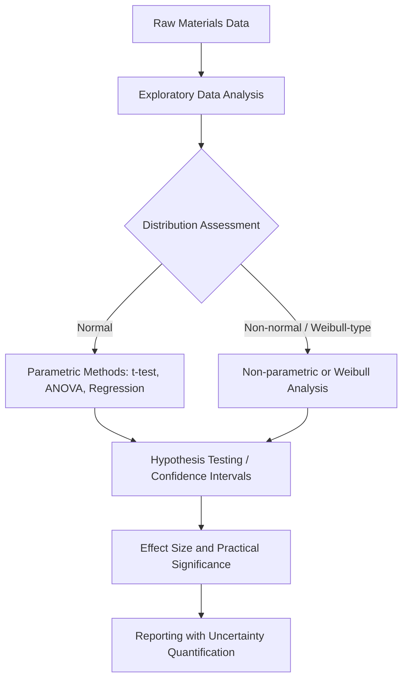

## Statistical Analysis of Materials Data

### Purpose and Scope

Statistical analysis of materials data provides the quantitative framework for extracting reliable conclusions from inherently variable measurements — mechanical properties, microstructural features, and compositional data all exhibit natural scatter arising from processing heterogeneity, measurement uncertainty, and intrinsic material variability. Proper statistical treatment distinguishes genuine effects from noise, quantifies confidence in reported values, and enables valid comparisons across datasets, processing conditions, or material systems.

**Key Points**

- Materials data is rarely normally distributed by default; distribution choice (normal, Weibull, lognormal) must be justified by the underlying physical failure or variation mechanism.
- Reporting a single value without uncertainty (e.g., "yield strength = 450 MPa") is scientifically incomplete; standard deviation, confidence intervals, or full distributional information are expected.
- Statistical significance and practical/engineering significance are distinct; a statistically detectable difference may be too small to matter for design purposes.

### Descriptive Statistics for Materials Properties

#### Central Tendency and Dispersion

For a property dataset (e.g., $n$ tensile strength measurements), the sample mean and standard deviation are:

$$\bar{x} = \frac{1}{n}\sum_{i=1}^{n}x_i \qquad s = \sqrt{\frac{1}{n-1}\sum_{i=1}^{n}(x_i - \bar{x})^2}$$

The use of $n-1$ (Bessel's correction) rather than $n$ corrects the bias in estimating population variance from a sample.

**Key Points**

- Coefficient of variation ($CV = s/\bar{x}$) allows comparison of relative scatter across properties with different units or magnitudes (e.g., comparing strength variability to elongation variability).
- Median and interquartile range are more robust than mean and standard deviation when outliers are present (e.g., a single anomalous casting defect skewing a small dataset).

#### Distributions Relevant to Materials Science

| Distribution | Typical Application | Rationale |
| --- | --- | --- |
| Normal (Gaussian) | Many continuous properties (hardness, modulus) under well-controlled processing | Central Limit Theorem applies when variation arises from many small independent sources |
| Weibull | Fracture strength of brittle materials (ceramics, glasses), fatigue life | Models "weakest-link" failure — failure initiates at the most severe flaw |
| Lognormal | Grain size distributions, particle size in powders, fatigue life in some ductile systems | Arises when the underlying process is multiplicative rather than additive |
| Binomial/Poisson | Defect counts (pores per unit volume, inclusion counts) | Discrete, rare-event count data |

#### The Weibull Distribution in Materials Failure Analysis

The two-parameter Weibull distribution is foundational for brittle material strength and fatigue life analysis:

$$P_f(\sigma) = 1 - \exp\left[-\left(\frac{\sigma}{\sigma_0}\right)^m\right]$$

where $P_f$ is the probability of failure at stress $\sigma$, $\sigma_0$ is the characteristic strength (scale parameter), and $m$ is the Weibull modulus (shape parameter) — a higher $m$ indicates less scatter and more consistent strength (fewer/more uniform flaw populations).

**Example**

A ceramic with $m = 5$ shows substantially more strength scatter than one with $m = 20$; component design for the low-$m$ material requires a larger safety margin below the mean strength to achieve the same failure probability, since the strength distribution has a longer low-strength tail.

[Inference] Weibull moduli for engineering ceramics are commonly reported in the range of roughly 5–15 depending on processing quality and flaw population control, though exact values are highly process- and material-specific and should be determined experimentally rather than assumed.

### Inferential Statistics

#### Hypothesis Testing

Comparing two processing conditions (e.g., two heat treatment schedules) typically involves a two-sample t-test (assuming approximate normality and comparable variances) or a non-parametric alternative (Mann-Whitney U) when normality is questionable.

$$t = \frac{\bar{x}_1 - \bar{x}_2}{\sqrt{\dfrac{s_1^2}{n_1} + \dfrac{s_2^2}{n_2}}}$$

The resulting $p$-value is compared against a pre-chosen significance threshold (commonly $\alpha = 0.05$) to decide whether to reject the null hypothesis of no difference.

**Key Points**

- Multiple comparisons (e.g., comparing 5 alloy compositions pairwise) inflate the false-positive rate; corrections (Bonferroni, Tukey HSD) are required.
- ANOVA extends the two-sample comparison to three or more groups, partitioning total variance into between-group and within-group components.
- Effect size (e.g., Cohen's $d$) should be reported alongside $p$-values, since $p$-values alone do not convey magnitude of difference.

#### Confidence Intervals

A 95% confidence interval for the mean communicates the range within which the true population mean is expected to lie, given repeated sampling:

$$\bar{x} \pm t_{\alpha/2, n-1}\frac{s}{\sqrt{n}}$$

Confidence intervals are generally more informative for engineering decision-making than bare $p$-values, since they convey both significance and practical magnitude.

#### Regression Analysis

Linear and nonlinear regression quantify relationships between processing/microstructural variables and properties:

- **Hall-Petch relationship**: $\sigma_y = \sigma_0 + k_y d^{-1/2}$, fit via linear regression of yield strength against inverse-square-root grain size.
- **Arrhenius-type relationships**: for temperature-dependent phenomena (diffusion coefficients, creep rates), linearization via $\ln(\text{rate})$ vs. $1/T$ allows extraction of activation energy from the slope.
- Regression diagnostics (residual plots, $R^2$, and importantly $R^2_{adj}$ for multi-variable models) must be checked; a high $R^2$ with a poor residual pattern (e.g., curvature) indicates model misspecification.

### Outlier Detection and Data Quality

- **Grubbs' test** and **Dixon's Q-test** provide statistical criteria for flagging outliers in small datasets, but a statistical outlier should be cross-checked against a physical cause (e.g., a documented processing anomaly) before exclusion.
- Data should never be removed solely because it inconveniently deviates from expectation; documented justification is required for scientific integrity.
- Chauvenet's criterion is another classical method occasionally used, though modern practice favors robust statistics or explicit justification over automated rejection rules.

### Uncertainty Propagation

When derived quantities are computed from multiple measured variables (e.g., activation energy from an Arrhenius fit, or fracture toughness from load and crack length), uncertainty must be propagated through the calculation:

$$\delta f = \sqrt{\sum_{i=1}^{n}\left(\frac{\partial f}{\partial x_i}\right)^2 (\delta x_i)^2}$$

This first-order propagation of error (assuming independent, uncorrelated uncertainties in each $x_i$) is standard for reporting derived material property uncertainties.

### Design of Experiments Connection: ANOVA in Practice

**Example**

An ANOVA analysis of a $2^2$ factorial study (aging temperature × aging time on yield strength) with $n=3$ replicates per condition might yield:

| Source | SS | df | MS | F | p-value |
| --- | --- | --- | --- | --- | --- |
| Temperature | 1240 | 1 | 1240 | 22.1 | 0.001 |
| Time | 380 | 1 | 380 | 6.8 | 0.030 |
| Temp × Time | 95 | 1 | 95 | 1.7 | 0.223 |
| Error | 448 | 8 | 56 | — | — |

Here, the non-significant interaction ($p = 0.223$) suggests temperature and time act independently on yield strength within the tested range, simplifying subsequent process optimization.

### Statistical Software and Tools

- **General-purpose**: Python (`scipy.stats`, `statsmodels`, `pandas`), R, MATLAB Statistics Toolbox.
- **DOE/industrial statistics**: Minitab, JMP, Design-Expert.
- **Weibull-specific analysis**: dedicated reliability software (ReliaSoft Weibull++) or `scipy.stats.weibull_min` / `reliability` package in Python.
- Median-rank regression and maximum likelihood estimation (MLE) are the two standard methods for fitting Weibull parameters, with MLE generally preferred for larger sample sizes due to better statistical efficiency.

### Common Pitfalls

| Pitfall | Consequence |
| --- | --- |
| Assuming normality without checking | Invalid p-values and confidence intervals, especially with skewed data like fatigue life |
| Reporting mean without sample size or uncertainty | Unverifiable, non-reproducible claims |
| Discarding outliers without physical justification | Data manipulation, biased conclusions |
| Confusing correlation (regression $R^2$) with causal mechanism | Overinterpretation of empirical fits lacking mechanistic basis |
| Small sample sizes treated as definitive (e.g., $n=2$ or $3$) | Insufficient statistical power, unreliable variance estimates |
| Ignoring multiple comparison correction | Inflated false-positive rate across many pairwise tests |

**Next Steps**

- Experimental Design in Materials Research
- Weibull Analysis and Reliability Engineering for Brittle Materials
- Uncertainty Quantification in Materials Modeling and Testing
- Machine Learning-Guided Materials Discovery and Design of Experiments
- Fatigue and Fracture Statistics (S-N Curves, Probabilistic Design)
- Literature Review and Scientific Writing in Materials Science