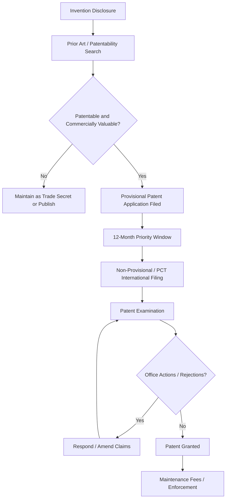

## Patents and Intellectual Property in Materials Innovation

### Purpose and Scope

Intellectual property (IP) protection is a critical mechanism by which materials science research is translated into commercial value while incentivizing continued innovation. Materials innovations — novel alloys, processing methods, coatings, composites, and characterization techniques — present distinctive IP challenges due to the difficulty of defining compositional boundaries, proving novelty over natural variation, and demonstrating non-obviousness in an incrementally evolving field.

**Key Points**

- Patents grant a time-limited exclusive right to exclude others from making, using, or selling an invention, in exchange for public disclosure.
- Materials patents commonly claim compositions of matter, processes, and/or articles of manufacture — each requiring different claiming strategies.
- IP strategy should be considered early in the research process, since public disclosure (including some publications and conference presentations) can forfeit patent rights in many jurisdictions.

### Forms of Intellectual Property Relevant to Materials Science

| IP Type | Protects | Duration | Materials Science Relevance |
| --- | --- | --- | --- |
| Utility Patent | Novel, useful, non-obvious inventions (compositions, processes, devices) | ~20 years from filing (jurisdiction-dependent) | New alloys, processing routes, coatings, composite structures |
| Trade Secret | Confidential information providing competitive advantage | Indefinite, if secrecy maintained | Proprietary processing parameters, heat treatment schedules not disclosed in patents |
| Design Patent/Registered Design | Ornamental, non-functional appearance | ~15 years (US design patents) | Product form factor, not typically core to materials composition claims |
| Trademark | Brand identifiers | Indefinite, with renewal | Commercial alloy trade names (e.g., Inconel, Hastelloy) |
| Copyright | Original creative/literary works | Life of author + 70 years (typical) | Software for materials modeling, technical documentation (not the underlying science) |

### Patentability Requirements

For a materials invention to be patentable, it generally must satisfy:

1. **Novelty**: the invention must not be disclosed in prior art (existing patents, publications, public use) anywhere, before the effective filing date.
2. **Non-obviousness (Inventive Step)**: the invention must not be an obvious modification of existing art to a person having ordinary skill in the art (PHOSITA). This is often the most contested criterion for incremental compositional changes.
3. **Utility/Industrial Applicability**: the invention must have a specific, credible, practical use.
4. **Enablement and Written Description**: the patent specification must describe the invention with sufficient detail that a person skilled in the art could reproduce it without undue experimentation.

**Key Points**

- For alloy compositions, novelty is often established via specific elemental ranges that do not overlap with prior art, even if broader compositional families are known.
- Non-obviousness for materials is frequently argued via **unexpected results** — demonstrating that a property improvement (e.g., synergistic strengthening) could not have been predicted from known individual element effects.
- Enablement in materials patents typically requires disclosed processing parameters (composition, heat treatment, working steps) sufficient for replication, similar in spirit to scientific reproducibility standards.

### Anatomy of a Materials Patent

#### Structure

1. **Title**: concise description of the invention (e.g., "High-Strength Aluminum-Lithium Alloy and Method of Manufacture").
2. **Background**: field of invention, discussion of prior art limitations the invention addresses.
3. **Summary**: brief overview of the invention's key features and advantages.
4. **Detailed Description**: full disclosure — composition ranges, processing conditions, examples, characterization data (often including comparative examples vs. prior art).
5. **Claims**: the legally operative portion defining the scope of protection.
6. **Drawings**: microstructure images, phase diagrams, process flow diagrams where applicable.

#### Claim Types for Materials Inventions

| Claim Type | Example Focus |
| --- | --- |
| Composition of matter | "An alloy consisting essentially of, by weight: 4.0–4.9% Cu, 1.2–1.8% Mg, 0.3–0.9% Mn, balance Al and incidental impurities." |
| Process/method | "A method of heat treating an aluminum alloy comprising solution treating at $X$–$Y$ °C, quenching, and aging at $A$–$B$ °C for $C$–$D$ hours." |
| Product-by-process | Claims a product defined by the process used to make it, used when the product's structure is difficult to characterize directly |
| Article/device | A component or structure incorporating the novel material (e.g., "A turbine blade comprising the alloy of claim 1.") |

**Example**

A composition claim commonly uses transitional phrases with distinct legal meaning:

- "comprising" — open-ended, permits additional unrecited elements.
- "consisting of" — closed, excludes any element not listed.
- "consisting essentially of" — closed to elements that would materially affect the basic characteristics, but permits trace/incidental impurities — very common in alloy claims to exclude unlisted elements that could meaningfully alter properties while allowing normal impurity levels.

### The Patent Application Process

**Key Points**

- A **provisional application** establishes an early priority date with lower formal requirements, giving 12 months to file a full non-provisional application — commonly used to quickly secure priority while research and commercial evaluation continue.
- The **Patent Cooperation Treaty (PCT)** allows a single international application to preserve the right to seek patent protection in over 150 member countries, deferring country-specific filing decisions and costs.
- Prior art searches (via USPTO, EPO Espacenet, Google Patents, WIPO PATENTSCOPE) should be conducted before significant R&D investment, and again before filing.

### Prior Art Considerations Specific to Materials Science

- **Compositional overlap**: even partial overlap of claimed elemental ranges with a prior art reference can defeat novelty; narrow, well-supported ranges backed by experimental data are more defensible.
- **Inherent disclosure**: if a prior art composition or process inherently produces the claimed property (even if not explicitly stated), it may still anticipate the claim.
- **Publication timing**: many jurisdictions (e.g., under the America Invents Act in the US) have grace periods for inventor's own disclosures, but most other countries operate on strict "absolute novelty" — any public disclosure before filing (including a conference poster or journal preprint) can bar patentability internationally.

[Inference] Because grace period rules differ significantly between jurisdictions (e.g., a 12-month grace period in the US vs. no grace period in much of Europe and Asia for third-party disclosures), the safest general practice in industrial and academic materials research is to file a patent application before any public disclosure, though exact strategy depends on jurisdiction-specific legal advice.

### Trade Secrets vs. Patents: Strategic Considerations

| Factor | Favors Patent | Favors Trade Secret |
| --- | --- | --- |
| Reverse-engineerability | Composition/structure easily determined by competitors (e.g., via chemical analysis) | Process is difficult to reverse-engineer (e.g., precise furnace atmosphere control, proprietary cooling profiles) |
| Product lifecycle | Long product lifecycle justifying 20-year exclusivity investment | Rapidly evolving field where secrecy may outlast typical patent value |
| Enforcement capability | Resources available to monitor and enforce against infringement | Difficulty proving infringement of a hidden process |
| Disclosure requirement | Willing to publicly disclose in exchange for exclusivity | Disclosure would materially aid competitors beyond the protection gained |

**Key Points**

- Many industrial materials processes combine both: composition may be patented (since it can be determined via reverse engineering/chemical analysis) while precise process parameters remain trade secrets (since they are difficult to reverse-engineer from the final product).
- Trade secret protection requires demonstrable "reasonable measures" to maintain secrecy (NDAs, access controls, documented confidentiality policies).

### Freedom to Operate (FTO) and Infringement Considerations

Before commercializing a new material or process, an FTO analysis assesses whether the intended activity would infringe existing valid patents held by others — distinct from patentability of one's own invention. A material can be independently patentable (novel and non-obvious) while its practice still infringes a broader, dominating patent held by a third party.

**Key Points**

- Claim construction (interpreting the precise legal scope of patent claims) is central to both prosecution and litigation; small differences in claim language (e.g., a composition range boundary) can determine infringement outcomes.
- Licensing agreements (exclusive, non-exclusive, cross-licensing) are common resolutions when FTO analysis identifies blocking patents.

### University and Institutional IP Considerations

- Most research universities claim ownership of inventions made using institutional resources (per invention assignment agreements signed by researchers/students), subject to inventor royalty-sharing policies.
- Technology transfer offices (TTOs) typically manage the patenting and licensing process for university-derived materials innovations.
- Publication clearance processes at universities and industry often require IP review before submission, given the public disclosure/novelty risk discussed above.

### Common Pitfalls

| Pitfall | Consequence |
| --- | --- |
| Public disclosure (paper, poster, thesis defense) before filing | Loss of patent rights in absolute-novelty jurisdictions; potential loss even domestically after grace period expires |
| Overly broad claims without sufficient supporting examples | Rejection for lack of enablement/written description, or later invalidation |
| Overly narrow claims | Easy for competitors to design around with minor compositional changes |
| Neglecting FTO analysis | Commercialization may infringe a third party's dominating patent despite one's own patent being valid |
| Treating a patent as scientific validation | Patent grant confirms novelty/non-obviousness/utility as legal matters, not necessarily rigorous scientific/statistical validation of performance claims |

**Next Steps**

- Technology Transfer and Commercialization of Materials Research
- Research Ethics and Data Integrity in Materials Science
- Literature Review and Scientific Writing in Materials Science
- Grant Writing and Research Proposal Development
- Industry-Academia Collaboration in Materials R&D
- Regulatory Standards and Certification (ASTM, ISO) in Materials Qualification