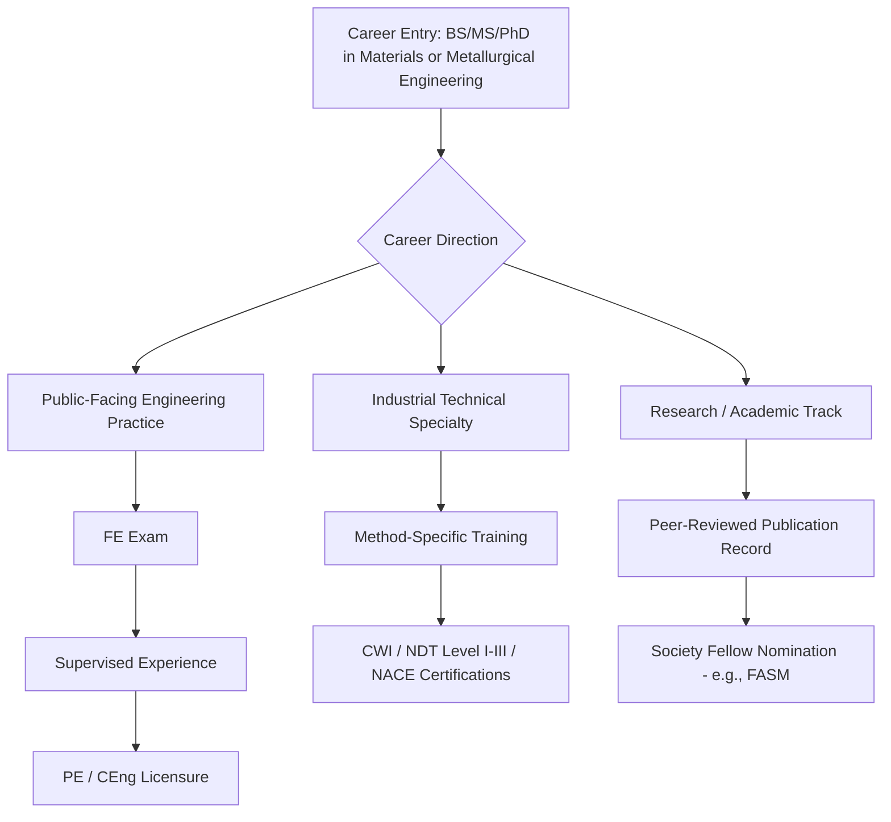

## Professional Certifications in Metallurgy and Materials

### Overview

Professional certification in metallurgy and materials science validates specialized competency beyond a degree, typically through examination, documented experience, and continuing education. Certifications generally fall into three categories: engineering licensure (legal authority to practice/sign off on public-facing engineering work), technical specialty certifications (process- or discipline-specific competency, e.g., welding inspection, NDT), and professional society credentials (peer-recognized standing, e.g., Fellow grades). Requirements, governing bodies, and legal weight vary significantly by country, so this content should be verified against the specific jurisdiction and issuing body relevant to the reader.

**Key Points**

- Licensure (e.g., PE in the US) is legally regulated and required for certain public-facing engineering signoffs; technical specialty certifications (e.g., welding, NDT) are generally not legally mandated but are often required contractually or by industry standards
- [Unverified: certification requirements, fee structures, and renewal cycles change periodically; readers should confirm current requirements directly with the issuing body before relying on this content for exam or licensure planning]

### Engineering Licensure

**Professional Engineer (PE) — United States**

Administered by NCEES (National Council of Examiners for Engineering and Surveying) and individual state boards.

- Pathway: ABET-accredited degree → Fundamentals of Engineering (FE) exam → supervised experience (typically 4 years) → Principles and Practice of Engineering (PE) exam in a specific discipline
- Metallurgical/materials-specific PE exams exist under relevant discipline categories; availability and exact exam naming can shift, so current NCEES exam offerings should be checked directly
- Legal significance: required to stamp/seal engineering documents for public infrastructure and certain regulated industries in the US

**Chartered Engineer (CEng) — United Kingdom / Commonwealth**

Administered through UK Engineering Council-licensed institutions, notably IOM3 (Institute of Materials, Minerals and Mining) for materials/metallurgy.

- Pathway: accredited MEng (or BEng + further learning) → structured training and professional development → professional review interview
- Related grades: Incorporated Engineer (IEng), Engineering Technician (EngTech), each with distinct academic/experience thresholds

**Professional Engineer — Other Jurisdictions**

Analogous licensure/chartership systems exist in Canada (P.Eng., via Engineers Canada member associations), Australia (CPEng, via Engineers Australia), the Philippines (PRC-administered licensure exam for specific engineering disciplines), and other countries, each with distinct academic and examination requirements.

### Technical Specialty Certifications

**Welding**

- **CWI (Certified Welding Inspector)** — American Welding Society (AWS): covers welding codes, inspection, NDT basics for weld quality; widely required in fabrication, oil & gas, and structural industries
- **International Welding Engineer/Technologist/Specialist/Practitioner (IWE/IWT/IWS/IWP)** — International Institute of Welding (IIW) diploma system, recognized across many countries with harmonized training/examination frameworks

**Nondestructive Testing (NDT)**

- Certification per **ASNT SNT-TC-1A** (employer-based certification program) or **ASNT CP-189** / **ISO 9712** (central certification body model)
- Method-specific and level-based: Level I, II, III in methods such as ultrasonic testing (UT), radiographic testing (RT), magnetic particle testing (MT), liquid penetrant testing (PT), eddy current testing (ET)
- Level III typically requires the broadest theoretical knowledge and can certify/oversee Level I and II personnel

**Corrosion**

- **NACE/AMPP Certifications** (NACE International merged into AMPP — Association for Materials Protection and Performance): Cathodic Protection (CP) Specialist/Technician, Coating Inspector Program (CIP), Corrosion Technologist, Materials Selection and Design Specialist

**Quality and Materials Testing**

- **ASQ Certified Quality Engineer (CQE)**: broader quality-systems certification relevant to materials/manufacturing quality roles
- **Six Sigma certifications (Green Belt/Black Belt)**: process improvement methodology, common in manufacturing-adjacent materials roles

**Heat Treatment**

- Certifications and training through bodies such as ASM International's heat treatment programs, relevant for personnel responsible for thermal processing quality control

### Professional Society Credentials

| Society | Region/Scope | Relevant Grades/Credentials |
| --- | --- | --- |
| ASM International | Global (US-based) | Member, Fellow (FASM) |
| TMS (The Minerals, Metals & Materials Society) | Global (US-based) | Member, Fellow |
| IOM3 (Institute of Materials, Minerals and Mining) | UK/global | AMIMMM, MIMMM, Chartered routes (CEng, CSci, CEnv) |
| AIST (Association for Iron & Steel Technology) | Steel industry focus | Member, technical committees |
| NACE/AMPP | Corrosion/materials protection | Certified specialist tracks (listed above) |

Fellow-grade recognition (e.g., FASM) is typically awarded based on sustained professional contribution and peer nomination rather than examination, distinguishing it from competency-based certification.

### Certification Pathway Comparison

### Choosing a Certification Path

**Key Points**

- Licensure (PE/CEng) is most relevant for roles involving legal responsibility for public safety, infrastructure design, or regulated engineering signoff
- Specialty certifications (CWI, NDT levels, NACE) are typically driven by industry code requirements (e.g., ASME, API, AWS D1.1) mandating certified personnel for specific inspection/quality functions
- Society credentials (Fellow grades, chartership) carry professional recognition value and, in chartership systems (CEng/CSci), may carry formal standing recognized by employers and regulators
- Some certifications require periodic renewal via continuing education units (CEUs) or re-examination; lapsing certification can affect eligibility to perform certain regulated work

### Continuing Education and Maintenance

Most licensure and many specialty certifications require ongoing continuing education (CEU/PDH credits) to maintain active status, reflecting the field's evolving standards (e.g., updated ASME/API codes, new NDT methods, evolving material qualification standards). Requirements (credit hours, renewal period, acceptable activity types) are body-specific and should be confirmed directly with the certifying organization.

**Related Topics**

- Materials Testing Standards (ASTM, ISO, ASME)
- Quality Management Systems in Manufacturing (ISO 9001, AS9100)
- Failure Analysis and Root Cause Investigation Methodology
- Welding Metallurgy and Weld Qualification Procedures
- Corrosion Engineering and Cathodic Protection Design
- Technical Report Writing and Peer Review in Materials Science