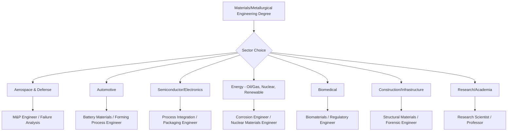

## Industry Sectors Employing Materials Engineers

### Overview

Materials engineers apply structure-property-processing-performance principles across nearly every manufacturing and technology sector, since material selection and failure prevention are foundational to almost any engineered product. Sector demand fluctuates with macroeconomic and technology cycles (e.g., EV battery materials demand, semiconductor packaging materials, additive manufacturing qualification), so current hiring trends should be verified against up-to-date labor market data rather than treated as static.

**Key Points**

- Materials engineering roles span the full value chain: raw material/feedstock production, primary processing, component manufacturing, quality/failure analysis, and end-of-life/recycling
- Cross-sector mobility is common since core competencies (metallurgy, polymers, ceramics, composites, corrosion, failure analysis) transfer across industries

### Aerospace and Defense

- **Focus areas**: high-temperature nickel superalloys, titanium alloys, aluminum-lithium alloys, carbon-fiber composites, thermal barrier coatings, additive manufacturing qualification
- **Key concerns**: fatigue life, fracture toughness, weight-to-strength optimization, extreme temperature/environment performance, strict traceability and certification (AS9100, NADCAP)
- **Representative roles**: materials & process (M&P) engineer, failure analysis engineer, additive manufacturing qualification engineer

### Automotive

- **Focus areas**: advanced high-strength steels (AHSS), aluminum body panels, battery materials (cathode/anode/electrolyte chemistry for EVs), lightweighting composites, powertrain metallurgy
- **Key concerns**: crashworthiness, weight reduction for fuel/energy efficiency, cost-at-scale, corrosion resistance, battery thermal/mechanical stability
- **Representative roles**: materials selection engineer, battery materials engineer, forming/stamping process engineer

### Semiconductor and Electronics

- **Focus areas**: silicon wafer processing, thin-film deposition, interconnect metallization (Cu, W), packaging materials, solder alloys, dielectric materials, wide-bandgap semiconductors (SiC, GaN)
- **Key concerns**: defect density, thermal management, electromigration resistance, miniaturization limits
- **Representative roles**: process integration engineer, packaging materials engineer, failure analysis engineer (electronics)

### Energy (Conventional and Renewable)

- **Oil & gas**: pipeline steel metallurgy, sour-service materials (NACE MR0175), corrosion/cathodic protection, offshore materials
- **Nuclear**: reactor-grade zirconium alloys, radiation damage resistance, cladding materials, spent fuel containment
- **Renewable energy**: wind turbine blade composites, solar photovoltaic materials (silicon, thin-film, perovskites), grid-scale battery storage materials
- **Key concerns**: long-service-life integrity, extreme environment resistance (radiation, high-pressure/temperature, marine), regulatory compliance

### Biomedical and Medical Devices

- **Focus areas**: biocompatible alloys (Ti-6Al-4V, CoCrMo, nitinol), bioceramics, biodegradable polymers, implant surface engineering (coatings, porous structures for osseointegration)
- **Key concerns**: biocompatibility, corrosion/wear in physiological environment, sterilization compatibility, regulatory approval (FDA, ISO 13485)
- **Representative roles**: biomaterials engineer, implant design/materials engineer, regulatory/quality engineer

### Construction and Civil Infrastructure

- **Focus areas**: structural steel, reinforced concrete durability, corrosion-resistant rebar/coatings, fire-resistant materials, sustainable/low-carbon cement alternatives
- **Key concerns**: long-term durability, cost-effectiveness at scale, code compliance, seismic performance
- **Representative roles**: structural materials engineer, corrosion consultant, forensic/failure investigation engineer

### Consumer Products and Packaging

- **Focus areas**: polymer selection for durability/cost, bio-based and recyclable packaging materials, coatings, textiles
- **Key concerns**: cost optimization at high volume, sustainability/recyclability, aesthetic and tactile properties
- **Representative roles**: packaging materials engineer, product development engineer

### Manufacturing, Metals Production, and Mining

- **Focus areas**: primary metal production (steelmaking, aluminum smelting), alloy development, metal forming/casting/forging process engineering, additive manufacturing
- **Key concerns**: process efficiency, yield/scrap reduction, microstructure-property control at scale, energy consumption
- **Representative roles**: process metallurgist, foundry/casting engineer, quality control metallurgist

### Research, Academia, and National Laboratories

- **Focus areas**: fundamental materials discovery, computational materials science, advanced characterization method development, materials-by-design and machine-learning-accelerated discovery
- **Key concerns**: publication and funding cycles, long time horizons from discovery to industrial deployment
- **Representative roles**: research scientist, postdoctoral researcher, professor, national lab staff scientist

### Sector Comparison: Typical Priorities

| Sector | Primary Material Driver | Typical Failure Concern |
| --- | --- | --- |
| Aerospace | Strength-to-weight, high-temp performance | Fatigue, creep |
| Automotive | Cost at scale, weight reduction | Crash performance, corrosion |
| Semiconductor | Miniaturization, purity | Electromigration, thermal stress |
| Energy (nuclear) | Radiation tolerance | Embrittlement, cladding failure |
| Biomedical | Biocompatibility | Wear debris, corrosion in vivo |
| Construction | Durability, cost | Corrosion, fatigue over decades |

### Career Pathway Flow

### Cross-Cutting Skill Areas

**Key Points**

- Failure analysis, corrosion engineering, and quality/certification knowledge transfer across virtually all sectors above
- Computational materials tools (CALPHAD, DFT, ML-driven materials discovery) are increasingly relevant across aerospace, automotive, semiconductor, and energy sectors alike
- Regulatory literacy (FDA for biomedical, NADCAP/AS9100 for aerospace, API/NACE for oil & gas) is often sector-specific and represents a meaningful differentiator in hiring
- [Unverified: specific hiring demand, salary ranges, and growth projections by sector are time-sensitive and should be checked against current labor market/industry association data rather than relied upon from static training knowledge]

**Related Topics**

- Failure Analysis and Root Cause Investigation Methodology
- Professional Certifications in Metallurgy and Materials
- Computational Materials Science and Materials Informatics
- Materials Selection and Design Methodology
- Quality Management Systems in Manufacturing