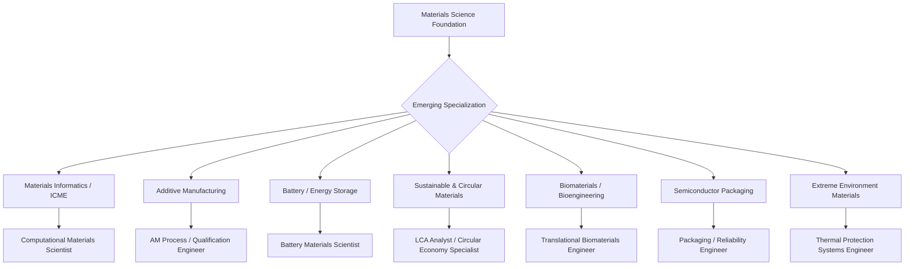

## Emerging Career Pathways in Materials Science

### Overview

Beyond traditional metallurgy, process engineering, and quality roles, materials science is expanding into hybrid career paths that combine domain expertise with computation, data science, sustainability policy, and manufacturing innovation. These pathways are growing largely in response to three converging drivers: the Materials Genome Initiative and computational materials acceleration, decarbonization/circular economy pressure on materials-intensive industries, and the maturation of additive manufacturing and other digitally-native production methods. Because this is a fast-evolving space, specific role titles, hiring volumes, and tooling should be checked against current sources rather than assumed static.

**Key Points**

- Emerging pathways are typically hybrids — materials fundamentals combined with a second competency (coding, data science, regulatory/policy, or advanced manufacturing operations) — rather than entirely new disciplines
- [Unverified: growth rates and job-market sizing for these pathways are time-sensitive and vary by source methodology; treat any specific figures from external sources with appropriate caution and verify against recent labor-market data]

### Materials Informatics and Computational Materials Engineering

Materials informatics applies data science and machine learning to accelerate materials discovery, property prediction, and process optimization, often integrated with the ICME (Integrated Computational Materials Engineering) framework.

- **Core tools/methods**: CALPHAD (thermodynamic/phase equilibrium modeling), density functional theory (DFT), molecular dynamics (MD), machine-learned interatomic potentials, high-throughput screening pipelines, materials databases (Materials Project, AFLOW, OQMD)
- **Emerging skill demand**: Python/scripting for materials workflows, surrogate/ML modeling of structure-property relationships, active learning for experimental design, digital twins of manufacturing processes
- **Representative roles**: computational materials scientist, ICME engineer, materials informatics scientist, digital materials engineer

### Additive Manufacturing (AM) Specialization

AM has matured from prototyping into qualified production for aerospace, medical, and tooling applications, creating dedicated career tracks distinct from traditional manufacturing engineering.

- **Focus areas**: powder feedstock characterization, process parameter development (laser/electron beam power, scan strategy), in-situ process monitoring, post-processing (HIP, heat treatment) for AM-specific microstructures, qualification and certification of AM parts for regulated industries
- **Representative roles**: AM process engineer, powder metallurgy specialist, AM qualification/certification engineer

### Battery and Energy Storage Materials

Driven by electrification of transportation and grid-scale storage, this pathway focuses on electrochemical materials development and scale-up.

- **Focus areas**: cathode/anode chemistry (NMC, LFP, silicon-anode, solid-state electrolytes), cell/pack materials integration, recycling and second-life battery materials, fast-charging degradation mechanisms
- **Representative roles**: battery materials scientist, electrochemical materials engineer, battery recycling process engineer

### Sustainable and Circular Materials Roles

- **Focus areas**: life cycle assessment (LCA) specialists, low-carbon materials development (e.g., green steel via hydrogen direct reduction, low-clinker cement), design-for-recyclability, extended producer responsibility (EPR) compliance
- **Representative roles**: sustainability materials engineer, LCA analyst, circular economy materials specialist, ESG/materials compliance roles within larger corporations

### Biomaterials and Bioengineering Interfaces

- **Focus areas**: tissue engineering scaffolds, 3D-bioprinted materials, regenerative medicine materials, biosensor materials, drug-delivery material systems
- **Representative roles**: biomaterials research scientist, translational biomaterials engineer (bridging lab research and clinical/regulatory pathways)

### Semiconductor and Advanced Packaging (Expanding Demand)

Growing investment in domestic semiconductor manufacturing capacity in multiple regions has increased demand for materials expertise specific to advanced packaging and heterogeneous integration.

- **Focus areas**: advanced packaging materials (interposers, underfill, thermal interface materials), wide-bandgap semiconductor materials (SiC, GaN) for power electronics, EUV lithography materials (photoresists, pellicles)
- **Representative roles**: packaging materials engineer, process integration engineer, yield/reliability engineer

### Materials for Extreme and Novel Environments

- **Focus areas**: space/in-orbit manufacturing materials, hypersonic vehicle thermal protection systems, fusion reactor first-wall materials, deep-sea and extreme-pressure materials
- **Representative roles**: extreme-environment materials engineer, thermal protection systems engineer (aerospace/defense-adjacent)

### Career Pathway Landscape

### Skill Development Recommendations

**Key Points**

- Programming proficiency (Python especially) is increasingly a baseline expectation for computational-adjacent materials roles, not a specialized add-on
- Cross-training in adjacent domains — electrochemistry for battery roles, regulatory science for biomedical/sustainability roles, statistics/ML for informatics roles — differentiates candidates for hybrid pathways
- Participation in open materials databases, benchmark challenges, or contribution to open-source materials science tools (e.g., pymatgen, ASE) can serve as a practical portfolio-building strategy for computational pathways
- Industry certifications (see Professional Certifications in Metallurgy and Materials) remain relevant even in emerging pathways, particularly for regulated sectors like aerospace AM qualification and biomedical materials

### Caveats on Forecasting Emerging Fields

[Speculation: the relative growth trajectory of these pathways compared to traditional metallurgy/process roles is difficult to forecast with precision and is sensitive to policy shifts (e.g., semiconductor incentive programs, EV subsidy changes, decarbonization regulation), funding cycles, and macroeconomic conditions; readers planning career decisions around these pathways should consult current labor-market data and industry-specific forecasts rather than relying solely on general trend descriptions.]

**Related Topics**

- Computational Materials Science and Materials Informatics
- Additive Manufacturing Process Qualification
- Battery Materials and Electrochemical Energy Storage
- Life Cycle Assessment (LCA) Methodology
- Professional Certifications in Metallurgy and Materials
- Industry Sectors Employing Materials Engineers