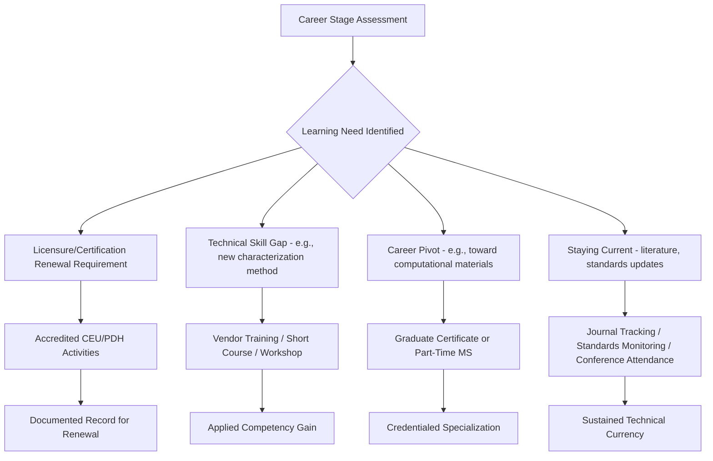

## Continuing Education and Lifelong Learning in the Field

### Overview

Materials science and metallurgy evolve continuously through new alloy systems, processing technologies, characterization techniques, and regulatory/sustainability requirements, making structured lifelong learning a practical necessity rather than an optional professional add-on. Continuing education spans formal credit-bearing paths (continuing education units, graduate certificates), informal professional development (conferences, workshops, self-directed study), and increasingly, digital/online learning platforms.

**Key Points**

- Continuing education is often a formal requirement for maintaining licensure or specialty certification, not merely a career-development preference (see Professional Certifications in Metallurgy and Materials)
- The rate of change in some subfields (computational materials tools, additive manufacturing, battery materials) is fast enough that a single academic degree does not remain sufficient across an entire career
- [Unverified: specific CEU/PDH numeric requirements and renewal cycles are body- and jurisdiction-specific and should be confirmed with the relevant licensing/certifying body rather than assumed from general description]

### Continuing Education Units (CEUs) and Professional Development Hours (PDHs)

Most licensure bodies (state PE boards) and many specialty certifications (NDT Level III, CWI) require periodic accumulation of CEU/PDH credits to maintain active status.

- **Typical qualifying activities**: attending accredited short courses/webinars, conference technical sessions, published technical papers/articles, teaching or committee participation in a professional society, structured on-the-job training documented per body-specific guidelines
- **Renewal cycle structure**: most licensure renewal cycles run 1–3 years depending on jurisdiction, with credit requirements distributed across that window rather than concentrated at renewal time
- **Key concern**: credit-tracking discipline — many professionals lose active status not from lack of engagement but from poor recordkeeping of qualifying activity

### Professional Society Conferences and Technical Meetings

Major materials-focused societies run recurring technical conferences that combine peer-reviewed presentations, short courses, and networking:

| Society | Representative Events |
| --- | --- |
| TMS (The Minerals, Metals & Materials Society) | TMS Annual Meeting & Exhibition |
| ASM International | MS&T (Materials Science & Technology, jointly organized with TMS/ACerS/AIST) |
| AIST | AISTech |
| NACE/AMPP | AMPP Annual Conference + Expo |
| MRS (Materials Research Society) | MRS Spring/Fall Meetings |
| IOM3 | Materials science-focused congresses and regional events |

Conference short courses and tutorial sessions are frequently structured specifically to qualify for CEU/PDH credit, making them a dual-purpose activity (technical currency + credential maintenance).

### Graduate Certificates and Advanced Degrees

- **Graduate certificates**: focused, typically 4–6 course sequences in a specialization (e.g., welding engineering, corrosion engineering, additive manufacturing) offered by university extension/professional programs, often designed for working engineers without requiring a full master's commitment
- **Part-time/executive MS programs**: increasingly common in materials-adjacent specializations (e.g., MS in Materials Science with a manufacturing or data-analytics concentration) structured for working professionals
- **PhD as a mid-career pivot**: less common but occurs particularly for professionals moving toward research leadership or academic roles

### Online and Self-Directed Learning

- **MOOCs and structured online courses**: platforms hosting university-affiliated materials science and engineering content (e.g., MIT OpenCourseWare-style materials, Coursera/edX university partnerships) provide accessible foundational and specialized content
- **Vendor/instrument training**: characterization equipment manufacturers (electron microscopy, XRD, mechanical testing) often provide dedicated technique-specific training tied to instrumentation the professional uses directly
- **Open technical literature and preprint tracking**: following journals (Acta Materialia, Materials Science and Engineering A, Journal of Materials Science) and preprint servers keeps practitioners current on research-level developments even outsideformal coursework
- **Standards body updates**: tracking revisions to ASTM, ISO, ASME, and API standards relevant to one's specialty is a continuous, low-formality but essential learning activity, since standards updates directly affect qualified practice

**Key Points**

- Self-directed learning generally does not automatically qualify for CEU/PDH credit unless documented and submitted per the specific licensing body's guidelines — informal study builds competency but professionals should verify credit-eligibility separately
- Vendor training on specific instrumentation is often the most direct route to closing a practical skills gap for characterization-heavy roles

### Professional Society Membership as a Learning Infrastructure

Beyond conferences, society membership typically provides:

- Technical committee participation (direct exposure to standards development and emerging practice)
- Local/regional chapter meetings and site visits
- Mentorship programs pairing early-career and experienced professionals
- Access to member-only technical literature, webinar archives, and property/database tools (e.g., ASM's alloy phase diagram and material property databases)

### Structuring a Lifelong Learning Plan

### Emerging Learning Modalities

- **Digital badging and micro-credentials**: shorter, stackable credentials for specific competencies (e.g., a specific NDT method, a specific computational tool), increasingly offered alongside traditional certificates
- **Simulation- and VR-based training**: emerging in areas like weld inspection training and hazardous-environment procedures, allowing practice without material/safety risk [Inference: adoption maturity varies significantly by training provider and is not yet standardized across the field]
- **AI-assisted literature synthesis and learning tools**: increasingly used to accelerate literature review and identify emerging trends, though professional judgment remains necessary to validate synthesized content against primary sources

### Practical Barriers and Considerations

**Key Points**

- Cost and employer support vary significantly; some employers fully fund conference attendance and certification renewal, while others require self-funding, which affects accessibility particularly for early-career professionals
- Time availability against production/project deadlines is a commonly cited practical barrier to sustained continuing education engagement
- Geographic access to in-person conferences/workshops has been partially mitigated by the growth of virtual and hybrid conference formats, though hands-on technique training (e.g., microscopy, welding) still typically requires in-person components

**Related Topics**

- Professional Certifications in Metallurgy and Materials
- Industry Sectors Employing Materials Engineers
- Emerging Career Pathways in Materials Science
- Technical Report Writing and Peer Review in Materials Science
- Materials Standards Organizations (ASTM, ISO, ASME, API)