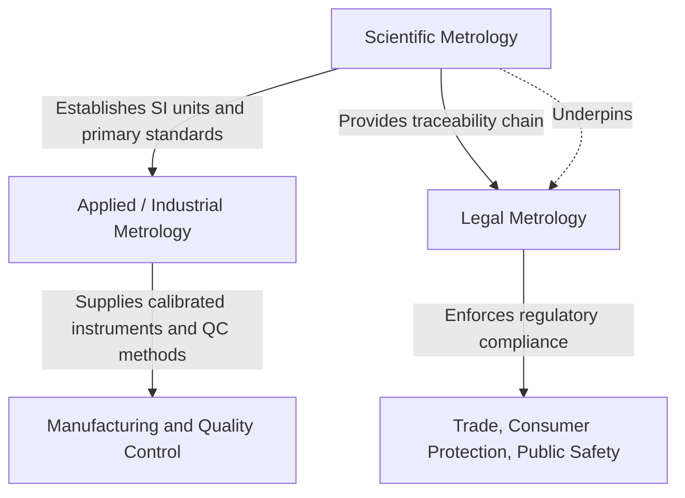

## Definition and Scope of Metrology

### Definition

Metrology is the science of measurement, encompassing all theoretical and practical aspects of measurement regardless of the measurement's uncertainty or the field of application. The term derives from the Greek *metron* (measure) and *logos* (study). The International Bureau of Weights and Measures (BIPM), through the *International Vocabulary of Metrology* (VIM), formally defines metrology as the science of measurement and its application, covering all aspects of measurement theory and practice, whatever the measurement uncertainty and field of application.

Metrology is not limited to the physical act of taking a measurement; it also includes the theoretical foundations that make measurement meaningful (units, quantities, scales), the practical means of realizing measurement (instruments, standards, procedures), and the statistical/mathematical treatment of measurement results (uncertainty, traceability, calibration).

### Core Objectives

- Establish a consistent, universally accepted system of units (the International System of Units, SI)
- Ensure the traceability of measurement results to recognized standards
- Quantify and manage measurement uncertainty
- Enable comparability of measurement results across time, location, and instrumentation
- Support conformity assessment (verifying that a product or process meets specified requirements)

### Scope: The Three Branches of Metrology

Metrology is conventionally divided into three interrelated branches, a classification adopted by the BIPM and widely used in national metrology institutes (NMIs):

#### Scientific (Fundamental) Metrology

Concerned with the establishment of measurement units, the development of new measurement methods, the realization of measurement standards, and the transfer of traceability from these standards to industry and society. This branch operates at the highest metrological level — typically within NMIs (e.g., NIST in the United States, PTB in Germany, NPL in the United Kingdom, or the Philippines' own National Metrology Laboratory under DOST-ITDI).

**Example**: Realizing the kilogram via the Kibble balance, which relates mechanical power to electrical power using the Planck constant, following the 2019 redefinition of the SI base units.

#### Applied (Industrial) Metrology

Concerned with the application of measurement science to manufacturing and other processes, ensuring the suitability of measurement instruments, their calibration, and quality control in industrial contexts. This is the branch most directly relevant to precision metrology and quality control in a manufacturing or engineering setting.

**Example**: Calibrating a coordinate measuring machine (CMM) used to verify the dimensional tolerances of a machined automotive part.

#### Legal Metrology

Concerned with regulatory requirements for measurements and measuring instruments, primarily for the protection of consumers, public health, safety, and the environment. Legal metrology governs measuring instruments used in trade (e.g., fuel pumps, weighing scales in commerce, utility meters).

**Example**: Government-mandated periodic verification of supermarket weighing scales to prevent commercial fraud, often carried out by a national Bureau of Legal Metrology or equivalent agency (in the Philippines, this falls under the DTI's Bureau of Philippine Standards / Legal Metrology Service).

### Key Concepts Underpinning Metrological Scope

- **Measurand**: The specific quantity subject to measurement (e.g., the diameter of a shaft)
- **Measurement unit**: A defined reference quantity used as a basis for comparison (e.g., the metre)
- **Traceability**: An unbroken chain of calibrations linking a measurement result to a national or international standard
- **Measurement uncertainty**: A parameter characterizing the dispersion of values that could reasonably be attributed to the measurand
- **Calibration**: The operation establishing the relationship between instrument indications and corresponding known reference values

### Relationship Between the Branches

### Scope in the Context of Precision Metrology & Quality Control

Within precision metrology and quality control specifically, the discipline's scope narrows to:

- Dimensional metrology (length, angle, form, surface texture measurement)
- Mass, force, and pressure metrology as applied to test equipment calibration
- Statistical process control (SPC) as a downstream application of measurement data
- Gauge Repeatability and Reproducibility (Gauge R&R) studies to validate measurement system capability
- Instrument calibration intervals and traceability documentation (e.g., ISO/IEC 17025 accreditation requirements)

[Inference] The precise organizational boundaries between applied and legal metrology can vary by jurisdiction; some countries merge industrial calibration oversight and legal metrology enforcement under a single agency, while others separate them entirely.

### Historical Note

Formal metrology emerged from the need for trade consistency; the Metre Convention of 1875 established the BIPM and formalized international cooperation on measurement standards, a foundational milestone that underlies the modern SI system still in use today.

**Related Topics**

- History and evolution of measurement standards (from artifact standards to physical constants)
- The International System of Units (SI): base and derived units
- Traceability and the calibration hierarchy (primary, secondary, working standards)
- Measurement uncertainty: GUM (Guide to the Expression of Uncertainty in Measurement) framework
- Role of national metrology institutes (NMIs) and international arrangements (CIPM MRA)
- ISO/IEC 17025: General requirements for the competence of testing and calibration laboratories