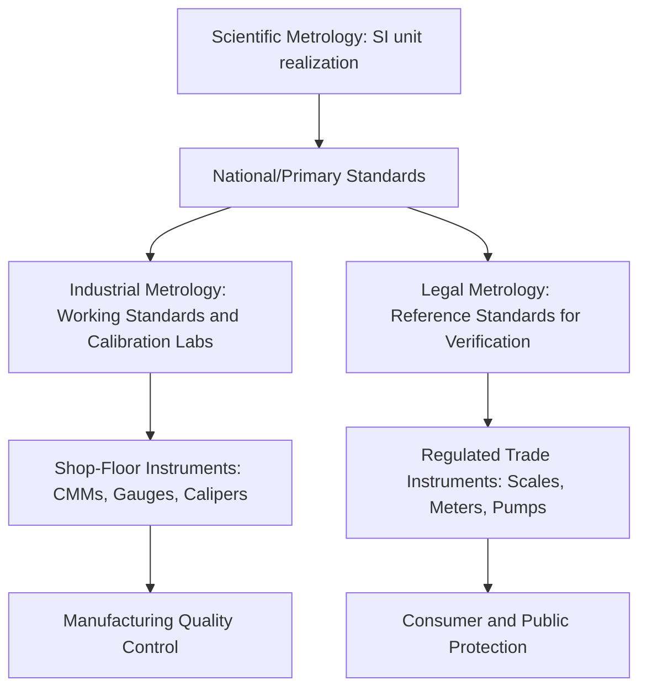

## Legal, Scientific, and Industrial Metrology

### Overview

Metrology is subdivided into three interdependent branches — scientific, industrial, and legal — distinguished by their objectives, institutional context, and level of measurement traceability. This tripartite classification, formalized by the BIPM, structures how measurement science flows from fundamental standards to real-world application and regulation.

### Scientific Metrology

#### Definition and Purpose

Scientific (or fundamental) metrology is concerned with the organization and development of measurement standards and their maintenance at the highest level of accuracy achievable. It operates at the top of the traceability pyramid, defining and realizing the SI base units.

#### Key Activities

- Development and refinement of primary measurement standards (e.g., realizing the second via the caesium-133 atomic transition)
- Research into new measurement principles and techniques
- International comparison of national standards (key comparisons under the CIPM Mutual Recognition Arrangement)
- Determination of fundamental physical constants used to define SI units (Planck constant, elementary charge, Boltzmann constant, Avogadro constant)

#### Institutional Context

Conducted by national metrology institutes (NMIs) such as NIST (USA), PTB (Germany), NPL (UK), NMIJ (Japan), and coordinated internationally through the BIPM under the Metre Convention.

**Example**: Realization of the ohm and the volt using quantum electrical standards — the quantum Hall effect for resistance and the Josephson effect for voltage — providing reproducibility independent of any physical artifact.

### Industrial (Applied) Metrology

#### Definition and Purpose

Industrial metrology applies measurement science to manufacturing, engineering, and quality assurance processes. Its purpose is to ensure that measuring instruments used in production are fit for purpose, properly calibrated, and traceable to national/international standards, thereby supporting product quality, interchangeability, and process control.

#### Key Activities

- Calibration of working-level instruments (calipers, micrometers, CMMs, torque wrenches, pressure gauges)
- Measurement system analysis (Gauge R&R, bias and linearity studies)
- Statistical process control (SPC) using measurement data
- Establishing calibration intervals and uncertainty budgets for shop-floor instruments
- Compliance with quality management frameworks such as ISO 9001 and calibration-specific accreditation under ISO/IEC 17025

#### Institutional Context

Typically implemented at the level of manufacturing companies, in-house calibration laboratories, third-party accredited calibration labs, and industry-specific standards bodies. This is the branch most directly relevant to day-to-day precision metrology and quality control work.

**Example**: A CMM used to inspect a machined engine block is calibrated against traceable gauge blocks and reference artifacts on a defined interval (e.g., annually), with the calibration certificate stating measurement uncertainty per ISO/IEC 17025.

### Legal Metrology

#### Definition and Purpose

Legal metrology encompasses the statutory and regulatory requirements applied to measurements and measuring instruments used in contexts affecting public interest — trade, health, safety, and the environment. Its central goal is consumer and public protection through mandated accuracy and periodic verification of instruments.

#### Key Activities

- Type approval / pattern approval of measuring instruments before commercial use
- Initial verification and periodic re-verification (in-service inspection) of instruments in trade
- Market surveillance and enforcement against non-compliant devices
- Setting maximum permissible errors (MPE) for regulated instrument classes

#### Institutional Context

Enforced by government agencies (Bureau of Legal Metrology or equivalent). In the Philippines, this function is carried out by the Department of Trade and Industry (DTI) through its Legal Metrology Service, which regulates instruments such as fuel dispensers, weighing scales in commerce, and utility meters. Internationally, the International Organization of Legal Metrology (OIML) issues recommendations that many national regulations are based on.

**Example**: A retail weighing scale used to sell produce by weight must be verified and sealed by a legal metrology inspector; using an unverified or tampered scale in commerce is a statutory offense in most jurisdictions.

### Comparative Summary

| Aspect | Scientific | Industrial | Legal |
| --- | --- | --- | --- |
| Primary goal | Define/realize units | Ensure product quality & process control | Protect public interest in trade |
| Typical actor | NMIs (NIST, PTB, NPL) | Manufacturers, calibration labs | Government regulatory bodies |
| Traceability level | Primary/reference standards | Working standards, traceable to NMI | Verified instruments, traceable to legal reference standards |
| Governing framework | CIPM MRA, SI definitions | ISO/IEC 17025, ISO 9001 | OIML recommendations, national legal metrology acts |
| Example instrument | Kibble balance, atomic clock | CMM, micrometer, torque wrench | Commercial weighing scale, fuel pump meter |

### Interrelationship and Traceability Flow

### Relevance to Precision Metrology & Quality Control

Industrial metrology forms the operational core of most quality control systems: it is the branch responsible for ensuring that measuring equipment used to accept or reject parts is itself accurate and traceable. Scientific metrology underpins this indirectly by providing the standards to which industrial calibration ultimately traces. Legal metrology becomes relevant in quality control contexts where a manufactured product itself is a measuring instrument subject to regulation (e.g., a company manufacturing weighing scales must satisfy legal metrology type-approval requirements in addition to internal QC).

[Inference] The specific division of regulatory responsibility between industrial and legal metrology bodies can differ by country; some NMIs also perform legal metrology functions directly, while others delegate this to a separate trade or standards agency.

**Related Topics**

- International System of Units (SI) and unit realization methods
- Traceability chains and the calibration hierarchy
- OIML recommendations and international legal metrology harmonization
- ISO/IEC 17025 accreditation for calibration and testing laboratories
- Measurement uncertainty and the GUM framework
- Gauge R&R and measurement system analysis in industrial QC