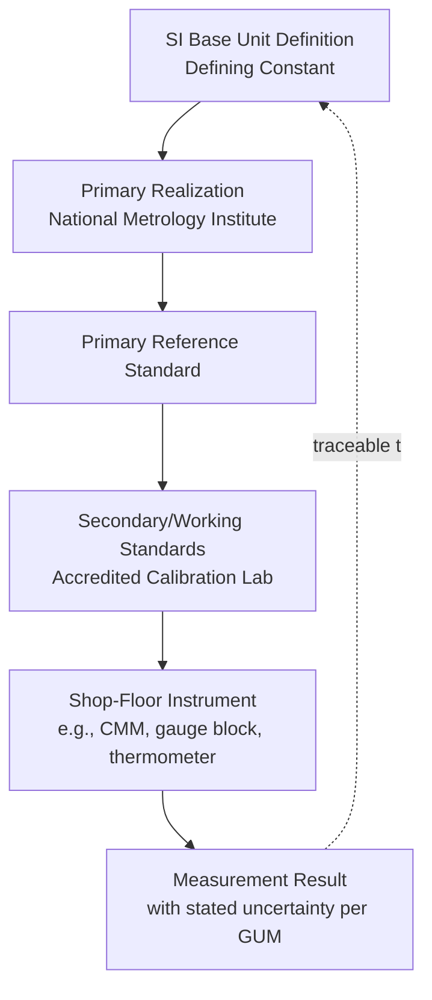

## The International System of Units

### Overview

The International System of Units (SI, from the French *Système International d'Unités*) is the globally coordinated system of measurement units maintained by the General Conference on Weights and Measures (CGPM) through the International Bureau of Weights and Measures (BIPM). In precision metrology and quality control, SI provides the traceable, internationally reproducible foundation upon which every calibration, measurement result, and uncertainty statement depends.

### Historical Development

- **1875**: The Metre Convention (*Convention du Mètre*) established an international framework for uniform units, founding the BIPM.
- **1960**: The 11th CGPM formally established "Le Système International d'Unités" (SI), consolidating the MKS (meter-kilogram-second) system with electrical and other units.
- **2019 (May 20)**: The SI underwent its most significant revision — the "New SI" — redefining all seven base units in terms of invariant constants of nature, eliminating dependence on physical artifacts (notably the International Prototype of the Kilogram, "Le Grand K").

### The Seven Base Units

| Quantity | Unit Name | Symbol | Defining Constant |
| --- | --- | --- | --- |
| Time | second | s | Cesium-133 hyperfine transition frequency, $\Delta\nu_{Cs}=9192631770$ Hz |
| Length | metre | m | Speed of light in vacuum, $c=299792458$ m/s |
| Mass | kilogram | kg | Planck constant, $h=6.62607015\times10^{-34}$ J·s |
| Electric current | ampere | A | Elementary charge, $e=1.602176634\times10^{-19}$ C |
| Thermodynamic temperature | kelvin | K | Boltzmann constant, $k=1.380649\times10^{-23}$ J/K |
| Amount of substance | mole | mol | Avogadro constant, $N_A=6.02214076\times10^{23}$ mol⁻¹ |
| Luminous intensity | candela | cd | Luminous efficacy of 540 THz radiation, $K_{cd}=683$ lm/W |

**Key Points**

- All seven defining constants are now fixed numerical values with zero uncertainty by definition.
- This removes the "artifact problem": no base unit depends on a physical object that could drift, be damaged, or lack global accessibility.
- Realizations of the units (e.g., a working kilogram standard via a Kibble balance or the X-ray crystal density method) can still carry measurement uncertainty, but the *definition* itself is exact.

### Derived Units

Derived units are formed by algebraic combination of base units according to the physical relationships that define the quantities. Examples relevant to metrology and QC:

- Force: newton, $\mathrm{N}=\mathrm{kg{\cdot}m{\cdot}s^{-2}}$
- Pressure/stress: pascal, $\mathrm{Pa}=\mathrm{N/m^2}=\mathrm{kg{\cdot}m^{-1}{\cdot}s^{-2}}$
- Energy: joule, $\mathrm{J}=\mathrm{N{\cdot}m}$
- Frequency: hertz, $\mathrm{Hz}=\mathrm{s^{-1}}$
- Electric resistance: ohm, $\Omega=\mathrm{V/A}$
- Plane angle: radian, rad (dimensionless, $\mathrm{m/m}$)
- Some 22 derived units have special names (newton, pascal, watt, volt, etc.); all others are expressed as combinations of base units (e.g., density in $\mathrm{kg/m^3}$).

### SI Prefixes

SI prefixes scale units by powers of 10, critical for expressing metrology tolerances at appropriate resolution (e.g., micrometers for dimensional tolerances, nanoseconds for time-of-flight sensors).

| Prefix | Symbol | Factor |
| --- | --- | --- |
| tera | T | $10^{12}$ |
| giga | G | $10^{9}$ |
| mega | M | $10^{6}$ |
| kilo | k | $10^{3}$ |
| — | — | $10^{0}$ |
| milli | m | $10^{-3}$ |
| micro | µ | $10^{-6}$ |
| nano | n | $10^{-9}$ |
| pico | p | $10^{-12}$ |
| femto | f | $10^{-15}$ |

Since the 2022 CGPM, additional prefixes **ronna** (R, $10^{27}$), **quetta** (Q, $10^{30}$), **ronto** (r, $10^{-27}$), and **quecto** (q, $10^{-30}$) extend the range.

### Relevance to Precision Metrology & Quality Control

- **Traceability**: ISO/IEC 17025 requires calibration results to be traceable to SI through an unbroken chain of comparisons, each with stated uncertainty. National Metrology Institutes (NIST, NPL, PTB, etc.) realize SI units and disseminate them via calibration hierarchies down to shop-floor instruments.
- **Uncertainty budgets**: Because base units are now defined by exact constants, uncertainty in a calibration stems entirely from the *realization* and *dissemination* chain (e.g., interferometer alignment, thermal expansion corrections), not from the definition itself — this is the practical basis for GUM (Guide to the Expression of Uncertainty in Measurement) uncertainty analysis.
- **Dimensional metrology**: Length measurements (CMMs, gauge blocks, laser interferometry) trace to the metre via the defined speed of light, typically through iodine-stabilized helium-neon lasers as practical realizations.
- **Mass metrology**: Modern primary mass standards use Kibble balances (relating mechanical and electrical power to realize the kilogram via $h$) or the X-ray crystal density (XRCD) method, replacing reliance on physical prototype artifacts.
- **Temperature metrology**: Realized via the International Temperature Scale (ITS-90) as a practical approximation to the thermodynamic kelvin, using fixed points (triple point of water, freezing points of metals) and interpolating instruments.

### Diagram: SI Base Unit Interdependencies (svg_diagram)

<svg xmlns="http://www.w3.org/2000/svg" viewBox="0 0 780 420">
<rect x="0" y="0" width="780" height="420" fill="#ffffff" />
<text x="390" y="25" font-size="16" font-weight="bold" text-anchor="middle" fill="#111111">SI Base Units and Defining Constants (svg_diagram)</text>

<rect x="30" y="60" width="150" height="60" rx="6" fill="#e8f0fe" stroke="#4285f4" />
<text x="105" y="82" font-size="12" text-anchor="middle" fill="#111111">second (s)</text>
<text x="105" y="98" font-size="10" text-anchor="middle" fill="#333333">Δν(Cs) hyperfine</text>

<rect x="220" y="60" width="150" height="60" rx="6" fill="#e8f0fe" stroke="#4285f4" />
<text x="295" y="82" font-size="12" text-anchor="middle" fill="#111111">metre (m)</text>
<text x="295" y="98" font-size="10" text-anchor="middle" fill="#333333">c (speed of light)</text>

<rect x="410" y="60" width="150" height="60" rx="6" fill="#e8f0fe" stroke="#4285f4" />
<text x="485" y="82" font-size="12" text-anchor="middle" fill="#111111">kilogram (kg)</text>
<text x="485" y="98" font-size="10" text-anchor="middle" fill="#333333">h (Planck constant)</text>

<rect x="600" y="60" width="150" height="60" rx="6" fill="#e8f0fe" stroke="#4285f4" />
<text x="675" y="82" font-size="12" text-anchor="middle" fill="#111111">ampere (A)</text>
<text x="675" y="98" font-size="10" text-anchor="middle" fill="#333333">e (elementary charge)</text>

<rect x="30" y="160" width="150" height="60" rx="6" fill="#fef7e0" stroke="#f9ab00" />
<text x="105" y="182" font-size="12" text-anchor="middle" fill="#111111">kelvin (K)</text>
<text x="105" y="198" font-size="10" text-anchor="middle" fill="#333333">k (Boltzmann const.)</text>

<rect x="220" y="160" width="150" height="60" rx="6" fill="#fef7e0" stroke="#f9ab00" />
<text x="295" y="182" font-size="12" text-anchor="middle" fill="#111111">mole (mol)</text>
<text x="295" y="198" font-size="10" text-anchor="middle" fill="#333333">N_A (Avogadro const.)</text>

<rect x="410" y="160" width="150" height="60" rx="6" fill="#fef7e0" stroke="#f9ab00" />
<text x="485" y="182" font-size="12" text-anchor="middle" fill="#111111">candela (cd)</text>
<text x="485" y="198" font-size="10" text-anchor="middle" fill="#333333">K_cd (luminous efficacy)</text>

<ellipse cx="390" cy="300" rx="140" ry="45" fill="#e6f4ea" stroke="#34a853" />
<text x="390" y="295" font-size="13" font-weight="bold" text-anchor="middle" fill="#111111">SI</text>
<text x="390" y="313" font-size="11" text-anchor="middle" fill="#333333">7 defining constants, exact by definition</text>

<line x1="105" y1="120" x2="330" y2="270" stroke="#999999" stroke-width="1" />
<line x1="295" y1="120" x2="360" y2="258" stroke="#999999" stroke-width="1" />
<line x1="485" y1="120" x2="420" y2="258" stroke="#999999" stroke-width="1" />
<line x1="675" y1="120" x2="460" y2="270" stroke="#999999" stroke-width="1" />
<line x1="105" y1="160" x2="330" y2="320" stroke="#999999" stroke-width="1" />
<line x1="295" y1="160" x2="360" y2="340" stroke="#999999" stroke-width="1" />
<line x1="485" y1="160" x2="420" y2="340" stroke="#999999" stroke-width="1" />

<text x="390" y="400" font-size="10" text-anchor="middle" fill="`#666666`">Derived units (N, Pa, J, Ω, etc.) are algebraic combinations of the base units above</text>

</svg>

### Diagram: SI Traceability Chain in Calibration

### Example: Practical Realization of the Metre

A common laboratory realization uses an iodine-stabilized He-Ne laser interferometer:

1. The laser frequency is locked to a hyperfine absorption line of molecular iodine, providing a highly stable and reproducible frequency reference.
2. Given the defined value $c=299792458$ m/s, the wavelength is computed as $\lambda=c/f$.
3. This wavelength serves as a ruler for interferometric length measurement, traceable directly to the SI definition of the metre through the fixed value of $c$.

[Inference] The specific frequency stability achieved depends on the particular laser system, environmental control (vacuum, temperature stabilization), and iodine cell design used in a given laboratory.

### Common Pitfalls in QC Contexts

- Confusing **mass** and **weight**: mass (kg) is an SI base quantity; weight is a force (N), dependent on local gravitational acceleration — critical when calibrating balances at different altitudes/latitudes.
- Misapplying prefixes (e.g., confusing µm and mm) in dimensional tolerance callouts — a frequent source of nonconformance in manufacturing drawings.
- Treating a calibration certificate's stated value as exact rather than reporting it with its associated expanded uncertainty and coverage factor, as required by ISO/IEC 17025 and GUM.
- Assuming legacy artifact-based definitions (e.g., "the kilogram is the mass of a specific cylinder in Sèvres") still apply post-2019; the artifact is now merely a high-precision *realization*, not the *definition*.

### Related Topics

- Traceability and Calibration Hierarchies
- The Guide to the Expression of Uncertainty in Measurement (GUM)
- ISO/IEC 17025: General Requirements for Testing and Calibration Laboratories
- Realization of the Kilogram: Kibble Balance and XRCD Method
- International Temperature Scale of 1990 (ITS-90)
- Dimensional Metrology: Gauge Blocks and Laser Interferometry
- Measurement Uncertainty and Coverage Factors