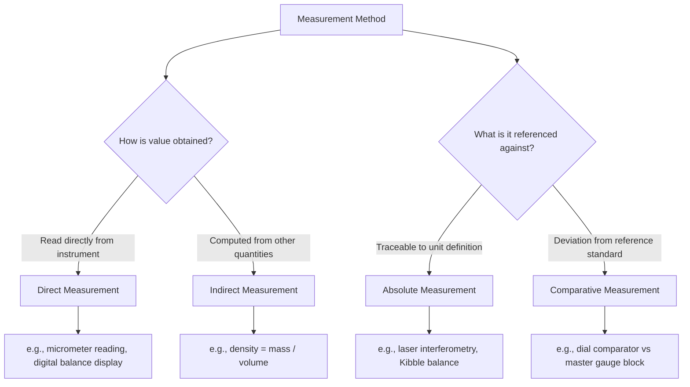

## Direct, Indirect, Absolute, and Comparative Measurement

### Overview

Measurement methods in metrology are classified along two independent axes: **how** the value is obtained relative to the quantity being measured (direct vs. indirect), and **what** it is measured against (absolute vs. comparative). Understanding these classifications is fundamental to selecting appropriate instrumentation, estimating uncertainty sources, and designing sound calibration and inspection procedures.

### Direct Measurement

A **direct measurement** yields the value of the measurand by reading it straight from an instrument scale or display, without needing to calculate it from other measured quantities.

**Key Points**

- The measurand is compared directly against a graduated scale or reference embodying the unit.
- Examples: reading a length with a steel rule, reading mass on a digital balance, reading temperature on a mercury thermometer, reading diameter with a micrometer or vernier caliper.
- Uncertainty sources are typically limited to instrument resolution, calibration error, parallax (for analog scales), and operator reading technique.

**Example**

Measuring the outer diameter of a shaft with a digital micrometer: the value (e.g., 25.014 mm) is read directly from the display — no further calculation is required to obtain the measurand.

### Indirect Measurement

An **indirect measurement** determines the value of the measurand by measuring one or more *other* quantities and computing the result through a known functional relationship.

**Key Points**

- Requires an explicit mathematical model relating the measured input quantities to the output measurand.
- Combined uncertainty must be propagated from each input quantity's uncertainty via the GUM law of propagation of uncertainty.
- Introduces additional uncertainty sources: correlation between inputs, sensitivity coefficients (partial derivatives), and model/formula validity.

**Example**

Determining the density $\rho$ of a machined part by measuring its mass $m$ (direct, via balance) and its volume $V$ (computed from dimensional measurements of length, width, height):

$$\rho=\frac{m}{V}$$

The combined standard uncertainty $u_c(\rho)$ is propagated as:

$$u_c(\rho)=\sqrt{\left(\frac{\partial\rho}{\partial m}\right)^2u^2(m)+\left(\frac{\partial\rho}{\partial V}\right)^2u^2(V)}$$

Another classic example: measuring electrical power $P=VI$ by direct measurement of voltage $V$ and current $I$.

### Absolute Measurement

An **absolute measurement** determines the measurand's value referenced directly to the definition of the unit (or a primary/traceable realization of it), without comparing the workpiece to a physical standard of nominally the same value.

**Key Points**

- The result is expressed as a full numerical value traceable through the SI chain, not as a deviation from a reference artifact.
- Often used at the primary/national-standards level, or wherever a self-contained physical principle realizes the unit.
- Example: laser interferometry measuring displacement directly from the wavelength of stabilized laser light (traceable to the metre's definition via $c$); using a Kibble balance to realize mass from electrical quantities and $h$; using a primary pressure balance (dead-weight tester) to realize pressure from force and area.

### Comparative (Relative) Measurement

A **comparative measurement** (also called relative or differential measurement) determines the measurand by comparing it against a physical reference standard of similar nominal value and measuring only the *difference*.

**Key Points**

- Exploits the fact that comparing two nearly-equal quantities can often be done with far higher resolution and lower uncertainty than an absolute measurement of either alone.
- Common in dimensional metrology: comparator measurements against gauge blocks, mass comparisons against calibrated weights on a mass comparator, null-balance methods in electrical metrology (e.g., Wheatstone bridge).
- The uncertainty of the comparative result depends heavily on the uncertainty of the reference standard used, plus the resolution of the comparison mechanism.

**Example**

A length comparator (e.g., an electronic height gauge or optical comparator) measures a gauge block's deviation from a master gauge block of nominal length 25 mm. If the instrument reads $+0.8\ \mu\mathrm{m}$ relative to the master (with certified length $25.0002\ \mathrm{mm}$), the test block's length is:

$$L_{test}=L_{master}+\Delta=25.0002\ \mathrm{mm}+0.0008\ \mathrm{mm}=25.0010\ \mathrm{mm}$$

### Combined Classification Matrix

These two axes are independent, so a measurement method can be described by combining both dimensions:

|  | Direct | Indirect |
| --- | --- | --- |
| **Absolute** | Reading length via laser interferometer wavelength count | Computing density from independently, absolutely measured mass and volume |
| **Comparative** | Reading deviation on a dial comparator against a master gauge block | Determining an unknown resistance via a Wheatstone bridge null balance (comparison of ratios) |

### Diagram: Classification of Measurement Methods

### Application to Precision Metrology & QC

- **Method selection trade-off**: Comparative methods often achieve lower measurement uncertainty than absolute methods for high-precision applications (e.g., gauge block calibration), because systematic errors common to both the reference and the test item partially cancel.
- **Traceability chains**: Absolute measurements at the top of a calibration hierarchy (national metrology institutes) establish primary/reference standards; these are then used to perform comparative calibrations of working standards and shop-floor equipment further down the chain.
- **Uncertainty budgeting**: Indirect measurements require a documented mathematical model (per GUM Type B and Type A analysis) — QC procedures should explicitly state the functional relationship used and the propagation method, as this is frequently scrutinized in ISO/IEC 17025 assessments.
- **Instrument selection in production QC**: Comparators (electronic gauges, air gauges) are widely used on production floors for rapid, high-resolution comparative inspection against go/no-go limits, rather than absolute measurement of every dimension.

### Common Pitfalls

- Assuming a "direct-reading" digital instrument (e.g., digital caliper) performs an *absolute* measurement — internally, many such instruments use comparative or interpolation techniques (e.g., capacitive or optical encoders referenced to internal scales), and their traceability still depends on periodic calibration against reference standards.
- Neglecting correlation between input quantities in indirect measurements — if the same instrument or environmental condition affects multiple inputs (e.g., temperature affecting both a length gauge and the workpiece), the uncertainty propagation formula must include covariance terms, not just independent-variance summation.
- Using a comparative method without accounting for the uncertainty of the reference standard itself — the comparison only reveals a *difference*; overall uncertainty must include $u(L_{master})$, not just the comparator's resolution.

### Related Topics

- Traceability and Calibration Hierarchies
- Measurement Uncertainty and the GUM Law of Propagation of Uncertainty
- Gauge Block Calibration and Comparators
- Null-Balance and Bridge Measurement Techniques
- Type A and Type B Uncertainty Evaluation
- Systematic Error Cancellation in Comparative Methods