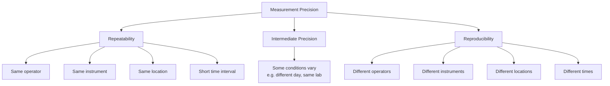

## Repeatability and Reproducibility

### Overview

Repeatability and reproducibility are the two formal precision conditions defined by the *International Vocabulary of Metrology* (VIM) and ISO 5725, describing the closeness of agreement between measurement results obtained under different sets of specified conditions. Together they quantify random variation in a measurement system and form the statistical backbone of Measurement Systems Analysis (MSA), Gauge R&R studies, and interlaboratory comparisons.

### Repeatability

**Repeatability** (formally, *measurement repeatability*, VIM 2.20) is precision under a set of repeatability conditions of measurement — conditions that include the same measurement procedure, same operators, same measuring system, same operating conditions, and same location, with replicate measurements taken over a short period of time.

**Key Points**

- Isolates the inherent random variation of the measurement process itself, with all other factors held as constant as possible.
- Typically the smallest source of measurement variation in a well-controlled system, since it excludes operator-to-operator, day-to-day, and instrument-to-instrument effects.
- Quantified as the standard deviation (repeatability standard deviation, $s_r$) or the repeatability limit $r$ of replicate measurements under these fixed conditions.

**Example**

An operator measures the same gauge block 10 times consecutively with the same micrometer, in the same lab session, without removing and remounting between readings in a way that changes setup conditions. The standard deviation of these 10 readings is the **repeatability standard deviation** $s_r$.

$$s_r=\sqrt{\frac{1}{n-1}\sum_{i=1}^{n}(x_i-\bar{x})^2}$$

### Reproducibility

**Reproducibility** (VIM 2.25) is precision under reproducibility conditions of measurement — conditions that include different locations, operators, measuring systems, and/or different times, but with replicate measurements on the same or similar objects.

**Key Points**

- Captures the *between-condition* variation — how much results differ when the measurement is repeated by different appraisers, on different instruments, at different sites, or in different labs.
- Is generally larger than repeatability, since it aggregates additional variance components.
- Central to interlaboratory comparison / proficiency testing programs, where multiple accredited labs measure the same reference item and the spread of results characterizes reproducibility across the measurement community.

**Example**

Three different operators each measure the same set of parts using three nominally identical coordinate measuring machines (CMMs) located in three different plants. The variation observed across all these results — combining operator, instrument, and location effects — characterizes **reproducibility**.

### Intermediate Precision (the Middle Ground)

ISO 5725 and analytical chemistry practice also define **intermediate precision**: conditions that vary *some* elements (e.g., different day, different operator, same lab, same instrument) but not all the elements varied under full reproducibility conditions. This is the condition most commonly assessed in a single-laboratory Gauge R&R study.

| Precision Condition | Operator | Instrument | Location | Time |
| --- | --- | --- | --- | --- |
| Repeatability | Same | Same | Same | Short interval |
| Intermediate precision | May vary | Usually same | Same | Days/weeks |
| Reproducibility | Different | Different | Different | Different |

### Statistical Model: Variance Components

In an ANOVA-based Gauge R&R study, total measurement variance is decomposed as:

$$\sigma_{total}^2=\sigma_{part}^2+\sigma_{repeatability}^2+\sigma_{reproducibility}^2$$

where $\sigma_{reproducibility}^2$ further decomposes into operator variance and operator-by-part interaction variance:

$$\sigma_{reproducibility}^2=\sigma_{operator}^2+\sigma_{operator\times part}^2$$

The combined **Gauge R&R** variance is:

$$\sigma_{GRR}^2=\sigma_{repeatability}^2+\sigma_{reproducibility}^2$$

**%GRR**, used to judge measurement system acceptability, is typically expressed as:

$$\%GRR=100\times\frac{\sigma_{GRR}}{\sigma_{total}}\quad\text{or}\quad100\times\frac{6\sigma_{GRR}}{\text{Tolerance}}$$

**Key Points**

- AIAG MSA guidelines commonly cite: %GRR < 10% = acceptable measurement system; 10–30% = may be acceptable depending on application; > 30% = generally unacceptable.
- [Inference] Specific acceptance thresholds vary by industry standard, application criticality, and the referenced MSA edition; some sectors apply stricter or more application-specific criteria.

### Diagram: Repeatability vs. Reproducibility Conditions

### Diagram: Gauge R&R Variance Decomposition (svg_diagram)

<svg xmlns="http://www.w3.org/2000/svg" viewBox="0 0 700 280">
<rect x="0" y="0" width="700" height="280" fill="#ffffff" />
<text x="350" y="24" font-size="16" font-weight="bold" text-anchor="middle" fill="#111111">Total Measurement Variance Decomposition (svg_diagram)</text>
<rect x="230" y="50" width="240" height="45" rx="6" fill="#e6f4ea" stroke="#34a853" />
<text x="350" y="77" font-size="12" font-weight="bold" text-anchor="middle" fill="#111111">Total Observed Variance</text>
<rect x="60" y="140" width="180" height="45" rx="6" fill="#e8f0fe" stroke="#4285f4" />
<text x="150" y="167" font-size="12" text-anchor="middle" fill="#111111">Part-to-Part Variance</text>
<rect x="260" y="140" width="180" height="45" rx="6" fill="#fef7e0" stroke="#f9ab00" />
<text x="350" y="167" font-size="12" text-anchor="middle" fill="#111111">Gauge R&amp;R Variance</text>
<rect x="470" y="140" width="200" height="45" rx="6" fill="#fce8e6" stroke="#ea4335" />
<text x="570" y="160" font-size="11" text-anchor="middle" fill="#111111">(GRR further splits</text>
<text x="570" y="175" font-size="11" text-anchor="middle" fill="#111111">below)</text>
<rect x="230" y="220" width="180" height="45" rx="6" fill="#fef7e0" stroke="#f9ab00" />
<text x="320" y="247" font-size="11" text-anchor="middle" fill="#111111">Repeatability (EV)</text>
<rect x="430" y="220" width="180" height="45" rx="6" fill="#fef7e0" stroke="#f9ab00" />
<text x="520" y="247" font-size="11" text-anchor="middle" fill="#111111">Reproducibility (AV)</text>
<line x1="300" y1="95" x2="150" y2="140" stroke="#999999" stroke-width="1" />
<line x1="380" y1="95" x2="350" y2="140" stroke="#999999" stroke-width="1" />
<line x1="320" y1="185" x2="320" y2="220" stroke="#999999" stroke-width="1" />
<line x1="380" y1="185" x2="520" y2="220" stroke="#999999" stroke-width="1" />
</svg>

### Application to Precision Metrology & QC

- **Gauge R&R (MSA) studies**: The standard AIAG methodology (crossed or nested ANOVA/Average-Range method) explicitly separates repeatability ("Equipment Variation," EV) from reproducibility ("Appraiser Variation," AV) to diagnose whether measurement system variation stems from the instrument itself or from operator/setup differences.
- **Calibration interval and method validation**: Repeatability studies (short-term, single-operator) are used to establish an instrument's baseline precision specification; reproducibility studies (across labs or operators) support broader validation claims and are central to ISO/IEC 17025 proficiency testing requirements.
- **ISO 5725 series**: Provides the formal statistical methodology for determining repeatability and reproducibility standard deviations ($s_r$, $s_R$) and limits ($r$, $R$) for standard test methods, widely referenced in materials testing and analytical QC.
- **Root-cause diagnosis**: A large repeatability component points to equipment issues (wear, fixturing, resolution); a large reproducibility component points to training, procedure, or calibration-consistency issues across operators/instruments — driving different corrective actions.

### Common Pitfalls

- Conducting a repeatability study but reporting it as if it characterizes the full measurement system — repeatability alone typically understates total measurement variation because it excludes operator and instrument-to-instrument effects.
- Confusing repeatability/reproducibility (precision concepts, no reference to a true value) with trueness/accuracy (which require comparison to a known reference value) — a highly repeatable and reproducible system can still be biased.
- Failing to randomize measurement order in a Gauge R&R study, which can introduce confounding trends (e.g., thermal drift, operator fatigue) that inflate or mask the true reproducibility component.
- Applying a fixed %GRR acceptance threshold universally without considering the specific tolerance, process capability requirements, or criticality of the application.

### Related Topics

- Gauge Repeatability and Reproducibility (Gauge R&R) Studies
- Accuracy, Precision, Resolution, and Sensitivity
- ISO 5725: Accuracy (Trueness and Precision) of Measurement Methods
- Measurement Systems Analysis (MSA) per AIAG
- ANOVA Method for Variance Component Estimation
- Interlaboratory Comparisons and Proficiency Testing