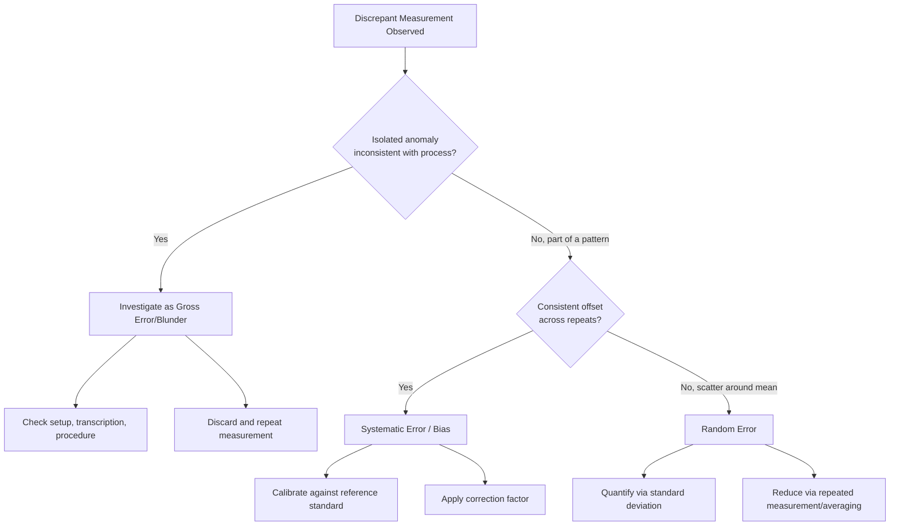

## Systematic, Random, and Gross Errors

### Overview

Every measurement deviates to some degree from the true value of the measurand. Classical error theory groups the causes of these deviations into three categories — systematic, random, and gross errors — each with distinct sources, statistical behavior, and mitigation strategies. This classification, while largely superseded in formal uncertainty analysis by the GUM's Type A/Type B framework, remains foundational for understanding measurement behavior and diagnosing quality problems in practice.

### Systematic Error

**Systematic error** (VIM 2.17) is the component of measurement error that, in replicate measurements, remains constant or varies in a predictable manner. It is associated with **bias** — a systematic, reproducible offset between the measured value and the true value.

**Key Points**

- Systematic errors do *not* average out with repeated measurements; they shift the entire distribution of results away from the true value.
- Common sources: instrument calibration offset, zero error, instrument wear, environmental effects not corrected for (temperature, humidity, pressure), incorrect measurement technique, and observer/parallax bias.
- Once identified and quantified, systematic error can typically be corrected for by applying a **correction** (an additive or multiplicative adjustment) to compensate for the known bias.
- Can be constant (e.g., a fixed zero offset) or variable (e.g., a linear drift with temperature, a proportional scale error).

**Example**

A micrometer with an uncorrected zero error of $+0.02$ mm will read every measurement 0.02 mm too high, regardless of the true dimension. Once identified via calibration, a correction of $-0.02$ mm can be applied to all subsequent readings.

### Random Error

**Random error** (VIM 2.19) is the component of measurement error that varies unpredictably in replicate measurements, typically assumed to arise from unpredictable or stochastic temporal and spatial variations of influence quantities.

**Key Points**

- Causes results to scatter around the mean value in an unpredictable manner from one measurement to the next.
- Common sources: electronic noise, minor fluctuations in environmental conditions, operator reading variability, friction/backlash in mechanical linkages, and Brownian-type disturbances in sensitive instruments.
- Cannot be corrected for individual readings (its value is unknown and unpredictable for any single measurement), but its *effect* can be reduced by averaging multiple readings — the standard uncertainty of the mean decreases as $1/\sqrt{n}$ for $n$ independent observations.
- Statistically characterized via standard deviation and forms the basis for **Type A** uncertainty evaluation (statistical analysis of a series of observations) per the GUM.

**Example**

Ten repeat readings of a gauge block scatter randomly between 25.001 mm and 25.004 mm due to minor vibration and thermal fluctuation in the lab. The standard deviation of these readings quantifies the random error's typical magnitude.

$$u(\bar{x})=\frac{s}{\sqrt{n}}$$

where $s$ is the sample standard deviation of $n$ observations and $u(\bar{x})$ is the standard uncertainty of the mean.

### Gross Error (Blunder)

**Gross error**, also called a **blunder** or **mistake**, is a significant deviation caused by human error, equipment malfunction, or procedural failure — not a stable statistical property of the measurement process.

**Key Points**

- Not part of formal statistical error theory; gross errors are typically treated as outliers to be identified and excluded (with documented justification), not modeled probabilistically.
- Common sources: misreading a scale (e.g., transposing digits), incorrect instrument setup, using the wrong measurement procedure, arithmetic/transcription errors, equipment failure during measurement, or measuring the wrong feature/part.
- Detected via outlier tests (e.g., Grubbs' test, Dixon's Q test), sanity checks against expected values, or simply through experienced judgment and procedural review.
- Should never be "corrected" statistically — a gross error indicates the measurement itself is invalid and should be discarded and repeated, not adjusted.

**Example**

An operator transcribes a caliper reading of 25.42 mm as "24.52 mm" due to a transposition error. This is a gross error/blunder, distinct from either systematic bias or random scatter, and must be caught through review or repeat measurement rather than statistically averaged in with valid data.

### Comparative Summary

| Error Type | Behavior on Repetition | Predictable? | Correctable? | Statistical Treatment |
| --- | --- | --- | --- | --- |
| Systematic | Constant or predictably varying | Yes (once characterized) | Yes, via correction | Bias estimation, calibration correction |
| Random | Unpredictable scatter | No (individually) | No (only reduced via averaging) | Standard deviation, Type A uncertainty |
| Gross | Anomalous, non-recurring | No | N/A — discard and repeat | Outlier detection tests |

### Diagram: Error Classification and Effect on Measurement Distribution (svg_diagram)

<svg xmlns="http://www.w3.org/2000/svg" viewBox="0 0 740 320">
<rect x="0" y="0" width="740" height="320" fill="#ffffff" />
<text x="370" y="24" font-size="16" font-weight="bold" text-anchor="middle" fill="#111111">Effect of Error Types on Measurement Distribution (svg_diagram)</text>

<line x1="100" y1="60" x2="100" y2="280" stroke="#34a853" stroke-width="2" stroke-dasharray="4,3" />
<text x="100" y="50" font-size="10" text-anchor="middle" fill="#34a853">True Value</text>

<path d="M 60,120 Q 100,80 140,120" fill="none" stroke="#4285f4" stroke-width="2" />
<text x="230" y="105" font-size="11" fill="#111111">No systematic error, small random error</text>
<text x="230" y="120" font-size="10" fill="#666666">(centered, tight spread)</text>

<path d="M 260,170 Q 300,130 340,170" fill="none" stroke="#ea4335" stroke-width="2" />
<line x1="300" y1="130" x2="300" y2="185" stroke="#ea4335" stroke-width="1" stroke-dasharray="2,2" />
<text x="430" y="155" font-size="11" fill="#111111">Systematic error (bias)</text>
<text x="430" y="170" font-size="10" fill="#666666">(shifted from true value, tight spread)</text>

<path d="M 40,220 Q 100,140 160,220" fill="none" stroke="#f9ab00" stroke-width="2" />
<text x="230" y="215" font-size="11" fill="#111111">Random error only</text>
<text x="230" y="230" font-size="10" fill="#666666">(centered on true value, wide spread)</text>

<circle cx="600" cy="260" r="5" fill="#000000" />
<text x="600" y="245" font-size="11" text-anchor="middle" fill="#111111">Gross error</text>
<text x="600" y="280" font-size="10" text-anchor="middle" fill="#666666">(isolated outlier, discard)</text>
<line x1="40" y1="290" x2="700" y2="290" stroke="#999999" stroke-width="1" />
<text x="370" y="308" font-size="10" text-anchor="middle" fill="#666666">Measured value axis</text>
</svg>

### Diagram: Error Diagnosis Workflow

### Application to Precision Metrology & QC

- **Calibration certificates**: Distinguish bias (systematic, reported as a "correction" or "error of indication") from repeatability (random, reported as part of the uncertainty budget) — both contribute to, but are treated differently within, the expanded uncertainty statement.
- **Statistical Process Control (SPC)**: Control charts are specifically designed to distinguish "common cause" variation (analogous to random error, inherent to a stable process) from "special cause" variation (analogous to systematic shifts or gross errors, signaling an assignable cause requiring investigation).
- **Uncertainty budgets (GUM)**: The classical systematic/random dichotomy maps imperfectly onto the GUM's Type A (statistical, typically random-error-driven) and Type B (all other methods, including known systematic effects) evaluation categories — practitioners should understand both frameworks since older literature and instrument specifications still use the classical terminology.
- **Root cause analysis**: Correctly classifying an observed measurement discrepancy (bias vs. scatter vs. blunder) directs the appropriate corrective action — recalibration for systematic error, process/environmental control for random error, and training/procedural review for gross errors.

### Common Pitfalls

- Attempting to statistically "correct" a suspected gross error rather than discarding and repeating the measurement — blunders are not part of the underlying statistical error model and including them corrupts both mean and variance estimates.
- Assuming increasing the number of repeat measurements will reduce systematic error — averaging only reduces the *random* component; systematic error remains fully present in the average unless independently identified and corrected via calibration.
- Failing to distinguish "no correction has been applied" from "no systematic error is present" — an uncalibrated instrument may have significant systematic error that is simply undocumented, not absent.
- Misapplying outlier-rejection tests (e.g., Grubbs' test) as a routine data-cleaning step rather than reserving them for measurements with a documented, defensible reason to suspect a gross error.

### Related Topics

- Measurement Uncertainty: Type A and Type B Evaluation (GUM)
- Accuracy, Precision, Resolution, and Sensitivity
- Statistical Process Control (SPC) and Control Charts
- Calibration Correction and Bias Estimation
- Outlier Detection Methods (Grubbs' Test, Dixon's Q Test)
- Repeatability and Reproducibility