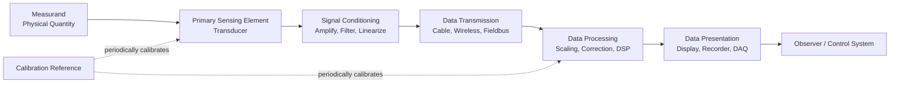
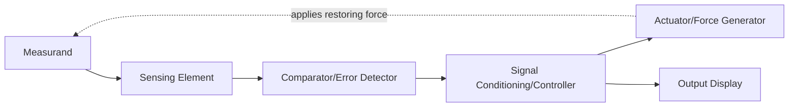

## Elements of a Measurement System

### Overview

A measurement system is the complete chain of functional elements that converts a physical quantity (the measurand) into a usable, interpretable output — typically a displayed number, a recorded signal, or a control action. Understanding the generalized structure of a measurement system allows metrologists to systematically identify error sources, uncertainty contributors, and points of calibration throughout the entire measurement chain, from sensing to final indication.

### The Generalized Measurement System Model

Classical instrumentation theory (per Doebelin, ISA, and standard metrology texts) decomposes a measurement system into a sequence of functional stages. Not every instrument contains every stage explicitly, and some stages may be combined in a single physical component, but the functional model applies broadly across mechanical, electrical, optical, and digital measurement systems.

**Key Points**

- The model is functional, not necessarily physical — a single component (e.g., a strain-gauge load cell) may perform several functional stages (sensing and transduction) simultaneously.
- Understanding this decomposition is essential for uncertainty budgeting, since each stage can independently contribute error and must often be individually calibrated or characterized.

### 1. Primary Sensing Element (Transducer/Sensor)

The element that first detects and responds to the measurand, converting the physical quantity into a detectable form (often, but not always, an analogous physical or electrical signal).

**Key Points**

- Directly interacts with the measurand; its response characteristics (linearity, sensitivity, hysteresis, range) fundamentally limit overall system performance.
- Examples: a thermocouple junction sensing temperature, a strain gauge sensing mechanical strain, a piezoelectric crystal sensing force/pressure, a stylus tip sensing surface profile.

### 2. Variable Conversion / Signal Conditioning Element

Converts the sensed signal (often a low-level, non-electrical, or otherwise inconvenient form) into a more suitable form for further processing — commonly an electrical voltage or current.

**Key Points**

- Includes amplification, filtering (noise reduction), linearization, bridge excitation and balancing (e.g., Wheatstone bridge circuits for strain gauges), and analog-to-digital conversion.
- A major source of both systematic error (nonlinearity, gain error) and random error (electronic noise) in the overall system.

**Example**

A strain gauge's small resistance change (typically fractions of an ohm) is converted to a measurable voltage via a Wheatstone bridge circuit, then amplified by an instrumentation amplifier before digitization.

### 3. Data Transmission Element

Carries the signal from the point of measurement to the point of processing, display, or recording — potentially over significant distance or through a communication network.

**Key Points**

- Introduces potential error sources: cable resistance/lead-wire effects (particularly critical for RTDs and strain gauges), electromagnetic interference (EMI), signal attenuation, and — in digital transmission — quantization or communication-protocol-related latency/data-loss.
- In modern systems, may include wired (analog 4–20 mA current loop, digital fieldbus) or wireless (Bluetooth, Wi-Fi, industrial IoT protocols) transmission.

### 4. Data Processing / Manipulation Element

Performs computation on the transmitted signal — scaling, unit conversion, compensation for known systematic effects (e.g., temperature compensation), statistical processing, or application of a calibration curve/correction.

**Key Points**

- Increasingly implemented in embedded firmware or software (digital signal processing, DSP) in modern instruments rather than analog circuitry.
- This is where correction factors derived from calibration are typically applied — e.g., linearization tables, polynomial fit corrections, or cold-junction compensation for thermocouples.

### 5. Data Presentation / Recording Element

The final stage, presenting the processed measurement value to the observer or recording it for later use.

**Key Points**

- Includes analog displays (dial gauges, pointer/scale mechanisms), digital displays (LCD/LED readouts), chart recorders, data loggers, and computer-based data acquisition (DAQ) software/databases.
- The resolution and update rate of this stage set practical limits on the perceivable output, even if upstream stages have finer inherent capability (see Resolution, covered separately).

### Diagram: Generalized Measurement System Block Diagram

### Feedback and Closed-Loop Measurement Systems

Some measurement systems incorporate a feedback path, where the output influences the input stage — common in servo-based and null-balance instruments.

**Example**

A servo-balance analytical mass comparator applies an electromagnetic force to null the deflection caused by an unknown mass, then infers the mass value from the current required to maintain balance — a closed-loop (feedback) measurement architecture, as opposed to an open-loop deflection-type balance.

### Diagram: Measurement Chain and Uncertainty Contribution Points (svg_diagram)

<svg xmlns="http://www.w3.org/2000/svg" viewBox="0 0 760 260">
<rect x="0" y="0" width="760" height="260" fill="#ffffff" />
<text x="380" y="24" font-size="16" font-weight="bold" text-anchor="middle" fill="#111111">Measurement Chain: Each Stage Contributes Uncertainty (svg_diagram)</text>
<rect x="20" y="70" width="120" height="55" rx="6" fill="#e8f0fe" stroke="#4285f4" />
<text x="80" y="95" font-size="11" text-anchor="middle" fill="#111111">Sensing</text>
<text x="80" y="110" font-size="9" text-anchor="middle" fill="#333333">(nonlinearity, hysteresis)</text>
<rect x="170" y="70" width="120" height="55" rx="6" fill="#e8f0fe" stroke="#4285f4" />
<text x="230" y="95" font-size="11" text-anchor="middle" fill="#111111">Conditioning</text>
<text x="230" y="110" font-size="9" text-anchor="middle" fill="#333333">(gain error, noise)</text>
<rect x="320" y="70" width="120" height="55" rx="6" fill="#e8f0fe" stroke="#4285f4" />
<text x="380" y="95" font-size="11" text-anchor="middle" fill="#111111">Transmission</text>
<text x="380" y="110" font-size="9" text-anchor="middle" fill="#333333">(lead resistance, EMI)</text>
<rect x="470" y="70" width="120" height="55" rx="6" fill="#e8f0fe" stroke="#4285f4" />
<text x="530" y="95" font-size="11" text-anchor="middle" fill="#111111">Processing</text>
<text x="530" y="110" font-size="9" text-anchor="middle" fill="#333333">(rounding, algorithm)</text>
<rect x="620" y="70" width="120" height="55" rx="6" fill="#e8f0fe" stroke="#4285f4" />
<text x="680" y="95" font-size="11" text-anchor="middle" fill="#111111">Presentation</text>
<text x="680" y="110" font-size="9" text-anchor="middle" fill="#333333">(resolution, display lag)</text>
<line x1="140" y1="97" x2="170" y2="97" stroke="#333333" stroke-width="1.5" marker-end="url(#arrow)" />
<line x1="290" y1="97" x2="320" y2="97" stroke="#333333" stroke-width="1.5" />
<line x1="440" y1="97" x2="470" y2="97" stroke="#333333" stroke-width="1.5" />
<line x1="590" y1="97" x2="620" y2="97" stroke="#333333" stroke-width="1.5" />
<rect x="220" y="170" width="320" height="55" rx="6" fill="#fef7e0" stroke="#f9ab00" />
<text x="380" y="195" font-size="11" font-weight="bold" text-anchor="middle" fill="#111111">Combined Standard Uncertainty</text>
<text x="380" y="212" font-size="9" text-anchor="middle" fill="#333333">u_c = √(u₁² + u₂² + u₃² + u₄² + u₅²)</text>
<line x1="80" y1="125" x2="300" y2="170" stroke="#999999" stroke-width="1" />
<line x1="230" y1="125" x2="330" y2="170" stroke="#999999" stroke-width="1" />
<line x1="380" y1="125" x2="380" y2="170" stroke="#999999" stroke-width="1" />
<line x1="530" y1="125" x2="430" y2="170" stroke="#999999" stroke-width="1" />
<line x1="680" y1="125" x2="460" y2="170" stroke="#999999" stroke-width="1" />
</svg>

### Application to Precision Metrology & QC

- **Uncertainty budget construction**: Per GUM methodology, each functional stage in the measurement chain is treated as a potential independent uncertainty source; a complete uncertainty budget explicitly enumerates contributions from sensing, conditioning, transmission, processing, and presentation/resolution.
- **Calibration scope definition**: End-to-end (system-level) calibration verifies the complete chain's output against a traceable reference; component-level calibration (e.g., calibrating only the signal-conditioning amplifier) verifies an individual stage — both are valid strategies depending on where errors are suspected or where practical access allows.
- **Troubleshooting measurement discrepancies**: Systematically working through each stage of the model (Is the sensor responding correctly? Is the conditioning circuit introducing drift? Is the transmission path affected by interference? Is the display resolution adequate?) provides a structured diagnostic approach for QC investigations.
- **DAQ system design**: In modern automated inspection and QC systems (e.g., in-line gauging with PLC/DAQ integration), explicitly identifying each functional stage supports proper system validation, IQ/OQ/PQ (Installation/Operational/Performance Qualification) documentation, and traceability record-keeping.

### Common Pitfalls

- Calibrating only the sensing element (e.g., a load cell in isolation) and assuming this validates the entire measurement system — signal conditioning, transmission, and processing stages can each introduce additional, uncorrected error not captured by sensor-only calibration.
- Ignoring lead-wire/transmission effects in precision applications — e.g., in RTD temperature measurement, lead-wire resistance can introduce significant systematic error unless a 3-wire or 4-wire measurement configuration is used to cancel it out.
- Assuming digital processing stages are inherently error-free — rounding, truncation, fixed-point arithmetic limitations, and algorithmic assumptions (e.g., an incorrect linearization polynomial) are legitimate uncertainty sources that are often overlooked.
- Neglecting the final presentation stage's resolution as a genuine uncertainty contributor (often modeled as a rectangular distribution with half-width equal to half the resolution) when constructing a complete Type B uncertainty evaluation.

### Related Topics

- Measurement Uncertainty and the GUM Law of Propagation of Uncertainty
- Signal Conditioning: Amplification, Filtering, and Linearization
- Traceability and Calibration Hierarchies
- Data Acquisition (DAQ) Systems in Quality Control
- Accuracy, Precision, Resolution, and Sensitivity
- Feedback and Null-Balance Measurement Instruments