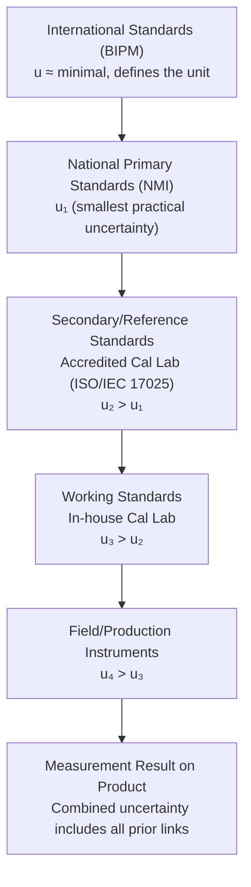

## Hierarchy of Measurement Standards

### Overview

The hierarchy of measurement standards is the tiered structure of reference standards through which the value of a unit is disseminated from its primary realization at a national or international level down to the working instruments used in day-to-day industrial measurement. This hierarchy is the physical and organizational embodiment of **metrological traceability** — the unbroken chain of calibrations, each with a documented measurement uncertainty, linking any measurement result back to the SI.

### The Standards Hierarchy Levels

**Key Points**

- Each level in the hierarchy is calibrated against the level immediately above it, with an associated, documented, and typically increasing measurement uncertainty as one moves down the chain.
- The hierarchy exists to protect the very top of the chain (primary/international standards) from wear, damage, and overuse, while allowing broad practical access to the unit at working levels.
- The general structure (from highest to lowest metrological authority): International standards → Primary/National standards → Secondary (reference) standards → Working standards → Field/production instruments.

### 1. International Standards

Maintained by the **International Bureau of Weights and Measures (BIPM)** in Sèvres, France, under the authority of the Metre Convention (1875) and the CGPM.

**Key Points**

- The BIPM coordinates international comparisons ("key comparisons") between National Metrology Institutes (NMIs) to ensure global equivalence of national measurement standards.
- Since the 2019 SI redefinition, no artifact-based international prototype remains for any base unit; international standards now consist of agreed realizations of the defining constants and coordinated comparison protocols (e.g., the CIPM Mutual Recognition Arrangement, CIPM MRA).
- [Unverified] The historical International Prototype of the Kilogram (IPK), formerly housed at BIPM, is retained for historical/reference purposes but is no longer the legal definition of the kilogram.

### 2. National (Primary) Standards

Maintained by each country's **National Metrology Institute (NMI)** — e.g., NIST (USA), NPL (UK), PTB (Germany), NMIJ (Japan), NIM (China).

**Key Points**

- Represent the highest-level realization of SI units within a given country, typically achieving the lowest attainable measurement uncertainty nationally.
- Directly realize the SI base/derived units via primary methods (e.g., Kibble balances for mass, iodine-stabilized lasers for length, triple-point cells for temperature).
- Participate in international key comparisons (coordinated by the BIPM's Consultative Committees) to demonstrate equivalence with other NMIs' primary standards.
- Typically not used for routine industrial calibration directly; instead, they calibrate secondary/reference standards held by accredited calibration laboratories.

### 3. Secondary (Reference) Standards

Held by **accredited calibration laboratories** (e.g., labs accredited to ISO/IEC 17025) or large industrial metrology departments; calibrated directly against national primary standards or via an NMI-accredited chain.

**Key Points**

- Serve as the practical link between the NMI and the broader population of working standards used across industry.
- Accreditation bodies (e.g., A2LA, UKAS, NVLAP, DAkkS) assess calibration laboratories against ISO/IEC 17025 to formally recognize their competence to issue traceable calibration certificates.
- Typically have somewhat higher uncertainty than national primary standards but substantially lower uncertainty than working-level instruments.

### 4. Working Standards

Used for routine calibration of **field/production/shop-floor instruments**; calibrated periodically against secondary/reference standards.

**Key Points**

- Represent the standards a typical in-house calibration lab or metrology department uses to calibrate the day-to-day measuring equipment on a factory floor.
- Examples: a set of calibrated gauge blocks used to check micrometers, a calibrated reference mass set used to verify production balances, a calibrated thermocouple reference used to check process thermometers.
- Subject to periodic recalibration at intervals determined by risk, drift history, usage frequency, and manufacturer recommendations (per ISO 10012 and internal calibration-interval-determination procedures).

### 5. Field / Production Instruments

The instruments actually used for **direct measurement and inspection** of parts, products, or processes on the production floor or in the field.

**Key Points**

- Represent the base of the pyramid — the largest population of devices, with the highest typical measurement uncertainty in the chain, but also the most operationally relevant for day-to-day QC decisions.
- Traceability to SI is established through the unbroken chain of calibrations linking this instrument, through working and reference standards, ultimately to national/international primary standards.

### Diagram: The Traceability Pyramid (svg_diagram)

<svg xmlns="http://www.w3.org/2000/svg" viewBox="0 0 640 420">
<rect x="0" y="0" width="640" height="420" fill="#ffffff" />
<text x="320" y="24" font-size="16" font-weight="bold" text-anchor="middle" fill="#111111">Hierarchy of Measurement Standards (svg_diagram)</text>
<polygon points="320,50 380,110 260,110" fill="#34a853" stroke="#1e7e34" />
<text x="320" y="90" font-size="11" text-anchor="middle" fill="#ffffff">International</text>
<text x="320" y="103" font-size="9" text-anchor="middle" fill="#ffffff">(BIPM)</text>
<polygon points="260,110 380,110 420,170 220,170" fill="#4285f4" stroke="#2a5db0" />
<text x="320" y="145" font-size="11" text-anchor="middle" fill="#ffffff">National / Primary</text>
<text x="320" y="158" font-size="9" text-anchor="middle" fill="#ffffff">(NMIs: NIST, PTB, NPL...)</text>
<polygon points="220,170 420,170 460,230 180,230" fill="#f9ab00" stroke="#c98000" />
<text x="320" y="205" font-size="11" text-anchor="middle" fill="#111111">Secondary / Reference</text>
<text x="320" y="218" font-size="9" text-anchor="middle" fill="#111111">(ISO/IEC 17025 accredited labs)</text>
<polygon points="180,230 460,230 500,290 140,290" fill="#fce8e6" stroke="#ea4335" />
<text x="320" y="265" font-size="11" text-anchor="middle" fill="#111111">Working Standards</text>
<text x="320" y="278" font-size="9" text-anchor="middle" fill="#111111">(in-house calibration lab)</text>
<polygon points="140,290 500,290 540,350 100,350" fill="#e0e0e0" stroke="#999999" />
<text x="320" y="325" font-size="11" text-anchor="middle" fill="#111111">Field / Production Instruments</text>
<text x="320" y="338" font-size="9" text-anchor="middle" fill="#111111">(micrometers, thermometers, CMMs...)</text>

<text x="580" y="90" font-size="9" fill="`#666666`">Lowest uncertainty</text>

<text x="580" y="330" font-size="9" fill="`#666666`">Highest uncertainty</text>

<line x1="570" y1="100" x2="570" y2="320" stroke="`#999999`" stroke-width="1" marker-end="url(#arrow2)" />

</svg>

### Diagram: Traceability Flow with Uncertainty Growth

### Uncertainty Growth Through the Chain

Each calibration transfer adds its own uncertainty contribution. The combined uncertainty at any level $n$ is approximately:

$$u_n=\sqrt{u_{n-1}^2+u_{cal,n}^2}$$

where $u_{n-1}$ is the uncertainty inherited from the level above and $u_{cal,n}$ is the uncertainty introduced by the calibration process at level $n$ (including the comparison method, environmental effects, and the reference standard's own uncertainty contribution).

**Key Points**

- This is why measurement uncertainty generally grows monotonically down the hierarchy — a shop-floor micrometer cannot have lower uncertainty than the working standard used to calibrate it.
- A well-designed calibration hierarchy typically targets a **test uncertainty ratio (TUR)** of at least 4:1 (often 10:1) between each level's uncertainty and the tolerance or uncertainty of the level being calibrated, to avoid excessive uncertainty accumulation.

### Application to Precision Metrology & QC

- **ISO/IEC 17025 accreditation**: Formally requires calibration laboratories to demonstrate an unbroken traceability chain, with documented uncertainty at each link, from their working/reference standards back to SI (via CIPM MRA-recognized NMI calibrations).
- **Calibration certificate review**: QC personnel reviewing incoming calibration certificates should verify the traceability statement explicitly references an accredited chain (accreditation body logo/number, NMI reference) rather than a vague or unsubstantiated "traceable to NIST" claim.
- **Internal metrology lab structuring**: Organizations with substantial calibration needs often maintain their own working-standard hierarchy internally (primary in-house references calibrated externally by an accredited lab, cascading down to production floor gauges), reducing calibration turnaround time and cost versus external calibration of every instrument.
- **Risk-based calibration intervals**: The position of an instrument within the hierarchy (and the criticality of measurements it supports) informs calibration interval determination — working/reference standards are typically calibrated more frequently and with tighter control than field instruments of lower criticality.

### Common Pitfalls

- Accepting a calibration certificate's traceability claim at face value without verifying the issuing lab's accreditation status and scope — not all "calibration certificates" originate from an accredited, SI-traceable chain.
- Assuming higher position in the hierarchy always means "better" for a given application — using an overly high-precision (and expensive/fragile) reference standard for routine production QC is often impractical; the goal is an *appropriate* TUR at each level, not maximum precision everywhere.
- Neglecting to account for the reference standard's own calibration uncertainty when computing the combined uncertainty of a calibration — treating the "master" as if it were exact introduces an unaccounted uncertainty component.
- Allowing calibration intervals for working/reference standards to lapse, which breaks the documented traceability chain and can invalidate all measurements made using instruments calibrated against them during the lapse.

### Related Topics

- Traceability and the SI (International System of Units)
- ISO/IEC 17025: General Requirements for Testing and Calibration Laboratories
- CIPM Mutual Recognition Arrangement (CIPM MRA)
- Calibration Interval Determination
- Test Uncertainty Ratio (TUR) and Measurement Decision Risk
- Measurement Uncertainty and the GUM Law of Propagation of Uncertainty