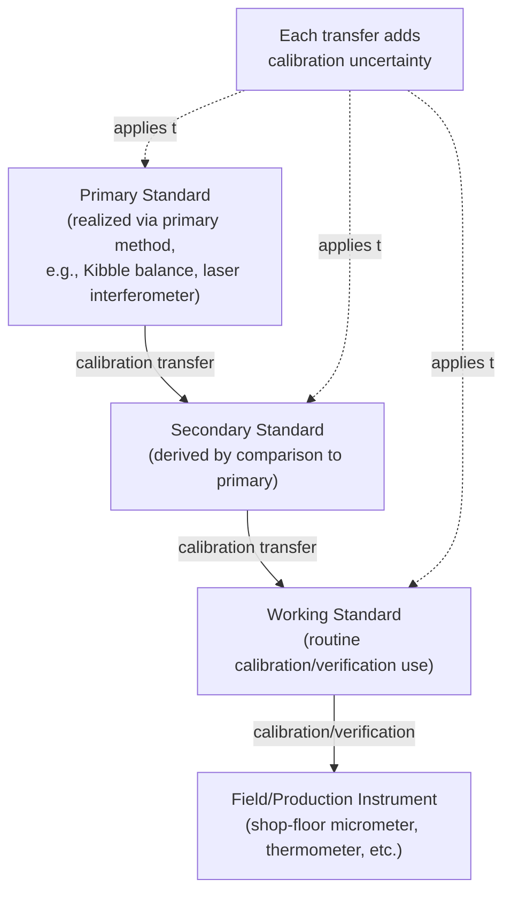

## Primary, Secondary, and Working Standards

### Overview

Primary, secondary, and working standards are the functional classifications of physical measurement standards according to their role within a calibration hierarchy, as defined by the *International Vocabulary of Metrology* (VIM). While closely related to the hierarchical structure of national/international/reference/working levels, this classification specifically concerns the **status and function of a standard relative to how it was established and how it is used**, rather than the organizational tier that holds it.

### Primary Standard

A **primary standard** (VIM 5.4) is a measurement standard established using a primary reference measurement procedure, or created as an artifact chosen by convention.

**Key Points**

- A primary standard's value is established *without reference to another standard of the same quantity* — it derives its value either directly from the definition of the unit (a primary method) or by convention (a conventional/artifact reference).
- Primary methods are measurement procedures having the highest metrological quality, whose operation can be completely described and understood, with a complete uncertainty statement expressible in SI units without reference to an external standard of the same quantity.
- Historically, some primary standards were artifacts (e.g., the former International Prototype Kilogram); since the 2019 SI redefinition, all base units are realized via primary *methods* referencing fixed constants, though artifact-type conventional references still exist for certain derived or practical quantities.

**Example**

A Kibble balance realizing the kilogram directly from the Planck constant $h$, or an iodine-stabilized helium-neon laser realizing the metre directly from the defined speed of light $c$, are primary standards — their values derive from fundamental physical constants, not from comparison to another mass or length standard.

### Secondary Standard

A **secondary standard** is a measurement standard established through calibration against a primary standard of the same quantity.

**Key Points**

- Its value is *derived by comparison* to a primary standard, rather than through an independent primary realization.
- Secondary standards inherit the uncertainty of the primary standard used to calibrate them, plus the additional uncertainty introduced by the comparison/calibration process itself.
- Typically maintained by National Metrology Institutes or top-tier accredited calibration laboratories, and used to disseminate the unit further down the traceability chain without requiring every downstream user to access the primary standard directly.

**Example**

A set of stainless-steel reference mass standards calibrated directly against a national Kibble balance realization (or against the historical mass artifact chain) constitutes a secondary standard — its value is established by comparison, not by independent primary realization.

### Working Standard

A **working standard** (VIM 5.7) is a measurement standard that is used routinely to calibrate or verify measuring instruments or measuring systems.

**Key Points**

- Working standards are usually calibrated against a secondary (or occasionally primary) standard, and are the standards actually used "on the bench" for routine calibration activities.
- Because they are used frequently — potentially subject to wear, contamination, or handling damage — working standards are typically recalibrated more often than the secondary/reference standards above them in the hierarchy.
- A working standard is itself sometimes further subdivided into a **reference standard** (the highest-metrological-quality standard available at a given location, used to calibrate other working standards there) and **routine working standards** used for day-to-day calibration/verification.

**Example**

A calibrated set of Grade 0 gauge blocks kept in an in-house metrology lab, used weekly to verify the accuracy of production micrometers and calipers, is a working standard — periodically sent out for recalibration against a secondary (or primary) reference at an accredited external lab.

### Comparative Summary

| Standard Type | How Value is Established | Typical Custodian | Usage Frequency | Recalibration Interval |
| --- | --- | --- | --- | --- |
| Primary | Direct realization via primary method or convention | NMI (national/international level) | Rare; protected from routine use | Very long / continuous monitoring |
| Secondary | Calibration against a primary standard | NMI or top-tier accredited lab | Occasional; disseminates the unit | Long (years) |
| Working | Calibration against a secondary standard | In-house metrology lab, calibration lab floor | Frequent; routine calibration work | Short (months to ~1–2 years) |

### Diagram: Primary → Secondary → Working Standard Flow

### Diagram: Primary vs. Secondary vs. Working Standard Roles (svg_diagram)

<svg xmlns="http://www.w3.org/2000/svg" viewBox="0 0 720 300">
<rect x="0" y="0" width="720" height="300" fill="#ffffff" />
<text x="360" y="24" font-size="16" font-weight="bold" text-anchor="middle" fill="#111111">Standard Classification by Function (svg_diagram)</text>
<rect x="40" y="60" width="190" height="100" rx="8" fill="#e6f4ea" stroke="#34a853" />
<text x="135" y="85" font-size="12" font-weight="bold" text-anchor="middle" fill="#111111">Primary Standard</text>
<text x="135" y="105" font-size="10" text-anchor="middle" fill="#333333">Value from primary method</text>
<text x="135" y="120" font-size="10" text-anchor="middle" fill="#333333">or defining constant</text>
<text x="135" y="140" font-size="10" text-anchor="middle" fill="#333333">No reference to another</text>
<text x="135" y="153" font-size="10" text-anchor="middle" fill="#333333">standard of same quantity</text>
<rect x="265" y="60" width="190" height="100" rx="8" fill="#e8f0fe" stroke="#4285f4" />
<text x="360" y="85" font-size="12" font-weight="bold" text-anchor="middle" fill="#111111">Secondary Standard</text>
<text x="360" y="105" font-size="10" text-anchor="middle" fill="#333333">Value from calibration</text>
<text x="360" y="120" font-size="10" text-anchor="middle" fill="#333333">against primary standard</text>
<text x="360" y="140" font-size="10" text-anchor="middle" fill="#333333">Disseminates the unit</text>
<text x="360" y="153" font-size="10" text-anchor="middle" fill="#333333">beyond the NMI</text>
<rect x="490" y="60" width="190" height="100" rx="8" fill="#fef7e0" stroke="#f9ab00" />
<text x="585" y="85" font-size="12" font-weight="bold" text-anchor="middle" fill="#111111">Working Standard</text>
<text x="585" y="105" font-size="10" text-anchor="middle" fill="#333333">Value from calibration</text>
<text x="585" y="120" font-size="10" text-anchor="middle" fill="#333333">against secondary standard</text>
<text x="585" y="140" font-size="10" text-anchor="middle" fill="#333333">Used routinely for</text>
<text x="585" y="153" font-size="10" text-anchor="middle" fill="#333333">day-to-day calibration</text>
<line x1="230" y1="110" x2="265" y2="110" stroke="#333333" stroke-width="1.5" />
<line x1="455" y1="110" x2="490" y2="110" stroke="#333333" stroke-width="1.5" />

<text x="135" y="200" font-size="10" text-anchor="middle" fill="`#666666`">Least frequently used</text>

<text x="360" y="200" font-size="10" text-anchor="middle" fill="`#666666`">Moderate use</text>

<text x="585" y="200" font-size="10" text-anchor="middle" fill="`#666666`">Most frequently used</text>

<text x="135" y="220" font-size="10" text-anchor="middle" fill="`#666666`">Lowest uncertainty</text>

<text x="360" y="220" font-size="10" text-anchor="middle" fill="`#666666`">Low uncertainty</text>

<text x="585" y="220" font-size="10" text-anchor="middle" fill="`#666666`">Higher uncertainty</text>

</svg>

### Application to Precision Metrology & QC

- **Calibration program design**: Organizations building an internal metrology capability typically procure working standards traceable through an accredited chain to secondary/primary standards, rather than attempting to maintain primary-level capability in-house (which is generally impractical outside NMIs).
- **Uncertainty budgeting**: When constructing an uncertainty budget for a shop-floor measurement, the uncertainty of the working standard used for the most recent calibration is a mandatory input — this value should be taken directly from that standard's own calibration certificate, itself traceable through the secondary/primary chain.
- **ISO/IEC 17025 documentation**: Accredited laboratories must document which of their standards are treated as reference/working standards for a given calibration and demonstrate that these are calibrated at appropriate intervals against higher-level (secondary or primary, as applicable) standards.
- **Protecting primary/secondary standards**: Because uncertainty and cost both increase sharply with metrological quality, organizations deliberately shield primary and secondary-level standards from routine handling, reserving them for periodic calibration of working standards rather than daily instrument checks.

### Common Pitfalls

- Conflating "primary standard" with "national standard" — a primary standard is defined by *how* its value was established (via a primary method), not by which organizational tier holds it; a secondary standard can also be held at the national level.
- Using a working standard beyond its calibration interval or without verifying its calibration history, which breaks the documented traceability chain even though the working standard is "only" at the bottom tier of the primary/secondary/working classification.
- Assuming a "reference standard" and a "working standard" are the same thing — in practice, many labs distinguish an internal reference standard (highest quality available on-site, rarely used directly) from routine working standards calibrated against it.
- Overlooking that a primary standard realized via a primary *method* still carries measurement uncertainty from the realization process itself, even though its defining constant has zero uncertainty by definition — "primary" does not mean "uncertainty-free" in practice.

### Related Topics

- Hierarchy of Measurement Standards
- Traceability and the SI (International System of Units)
- Primary Methods of Measurement (Kibble Balance, Laser Interferometry)
- ISO/IEC 17025: General Requirements for Testing and Calibration Laboratories
- Calibration Interval Determination
- Measurement Uncertainty and the GUM Law of Propagation of Uncertainty