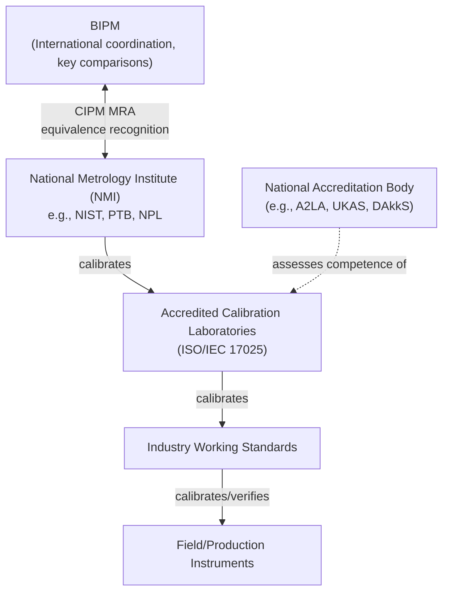

## National Metrology Institutes

### Overview

A **National Metrology Institute (NMI)** is the organization designated by a country's government as having national responsibility for developing and maintaining measurement standards for the physical quantities defined by the International System of Units (SI). NMIs form the apex of each nation's calibration hierarchy and serve as the primary interface between international standards (maintained by the BIPM) and the traceability chains used within their own countries.

### Role and Function

**Key Points**

- Realize SI base and derived units at the highest achievable level of accuracy within a country, using primary measurement methods.
- Maintain and disseminate national primary and, in some cases, secondary standards to accredited calibration laboratories, industry, and other government bodies.
- Participate in international key comparisons coordinated by the BIPM's Consultative Committees, demonstrating the equivalence of their national standards with those of other NMIs — the technical foundation of the CIPM Mutual Recognition Arrangement (CIPM MRA).
- Often conduct metrology research (developing new primary measurement methods), support national legal metrology (trade, safety, and regulatory measurement requirements), and provide calibration and consultancy services to industry.
- May also engage in accreditation-adjacent activities, though formal laboratory accreditation is often delegated to a separate national accreditation body (e.g., in the US, NIST is the NMI while accreditation of calibration/testing labs is performed by bodies like A2LA or NVLAP).

### Representative National Metrology Institutes

| Country/Region | NMI | Notes |
| --- | --- | --- |
| United States | National Institute of Standards and Technology (NIST) | Operates under the U.S. Department of Commerce |
| United Kingdom | National Physical Laboratory (NPL) | One of the oldest NMIs, founded 1900 |
| Germany | Physikalisch-Technische Bundesanstalt (PTB) | Major contributor to primary realizations (e.g., Kibble balance research) |
| France | Laboratoire national de métrologie et d'essais (LNE) | Hosts BIPM headquarters-adjacent coordination role |
| Japan | National Metrology Institute of Japan (NMIJ), part of AIST | — |
| China | National Institute of Metrology (NIM) | — |
| International coordinating body (not a national NMI) | International Bureau of Weights and Measures (BIPM) | Based in Sèvres, France; coordinates, does not supersede, national NMIs |

[Unverified] Institute names, parent organizations, and organizational scope can change over time via national legislation or reorganization; the roles and general responsibilities described here reflect the standard NMI model broadly consistent across countries.

### The NMI's Position in the Traceability Chain

### Core Activities of an NMI

**Key Points**

- **Primary realization**: Developing and operating primary measurement standards (e.g., Kibble balances for mass, cesium/optical atomic clocks for time, iodine-stabilized lasers for length).
- **Dissemination**: Calibrating reference-level standards for accredited laboratories and, in some cases, directly for industry or government.
- **International comparison**: Participating in BIPM-coordinated key comparisons and supplementary comparisons to validate the international equivalence of national measurement capabilities, documented in the BIPM Key Comparison Database (KCDB).
- **Legal metrology support**: Providing the technical basis for regulatory measurement requirements (e.g., fuel pump accuracy, trade weighing, breathalyzer calibration), often coordinated with a separate legal metrology authority.
- **Metrology research and development**: Advancing measurement science itself — developing new or improved primary methods, investigating new sensor technologies, and contributing to international standard-setting discussions (e.g., contributing research that informed the 2019 SI redefinition).

### Diagram: NMI Functions (svg_diagram)

<svg xmlns="http://www.w3.org/2000/svg" viewBox="0 0 700 300">
<rect x="0" y="0" width="700" height="300" fill="#ffffff" />
<text x="350" y="24" font-size="16" font-weight="bold" text-anchor="middle" fill="#111111">Core Functions of a National Metrology Institute (svg_diagram)</text>
<ellipse cx="350" cy="150" rx="90" ry="45" fill="#34a853" stroke="#1e7e34" />
<text x="350" y="145" font-size="12" font-weight="bold" text-anchor="middle" fill="#ffffff">NMI</text>
<text x="350" y="162" font-size="9" text-anchor="middle" fill="#ffffff">(e.g. NIST, PTB)</text>
<rect x="40" y="40" width="150" height="55" rx="6" fill="#e8f0fe" stroke="#4285f4" />
<text x="115" y="63" font-size="10" text-anchor="middle" fill="#111111">Primary Realization</text>
<text x="115" y="78" font-size="9" text-anchor="middle" fill="#333333">Kibble balance, atomic clocks</text>
<rect x="510" y="40" width="150" height="55" rx="6" fill="#e8f0fe" stroke="#4285f4" />
<text x="585" y="63" font-size="10" text-anchor="middle" fill="#111111">International Comparison</text>
<text x="585" y="78" font-size="9" text-anchor="middle" fill="#333333">BIPM key comparisons</text>
<rect x="40" y="210" width="150" height="55" rx="6" fill="#fef7e0" stroke="#f9ab00" />
<text x="115" y="233" font-size="10" text-anchor="middle" fill="#111111">Dissemination</text>
<text x="115" y="248" font-size="9" text-anchor="middle" fill="#333333">Calibrate accredited labs</text>
<rect x="510" y="210" width="150" height="55" rx="6" fill="#fef7e0" stroke="#f9ab00" />
<text x="585" y="233" font-size="10" text-anchor="middle" fill="#111111">Legal Metrology Support</text>
<text x="585" y="248" font-size="9" text-anchor="middle" fill="#333333">Trade, safety regulation</text>
<rect x="275" y="240" width="150" height="45" rx="6" fill="#fce8e6" stroke="#ea4335" />
<text x="350" y="263" font-size="10" text-anchor="middle" fill="#111111">Metrology Research &amp; R&amp;D</text>
<line x1="190" y1="70" x2="270" y2="130" stroke="#999999" stroke-width="1" />
<line x1="510" y1="70" x2="430" y2="130" stroke="#999999" stroke-width="1" />
<line x1="190" y1="235" x2="270" y2="170" stroke="#999999" stroke-width="1" />
<line x1="510" y1="235" x2="430" y2="170" stroke="#999999" stroke-width="1" />
<line x1="350" y1="195" x2="350" y2="240" stroke="#999999" stroke-width="1" />
</svg>

### The CIPM Mutual Recognition Arrangement (CIPM MRA)

**Key Points**

- Signed in 1999, the CIPM MRA is the framework through which NMIs demonstrate the international equivalence of their national measurement standards and the calibration/measurement certificates they issue.
- Underpinned by a documented set of Calibration and Measurement Capabilities (CMCs) for each NMI, published in the BIPM's Key Comparison Database (KCDB), specifying the quantities, ranges, and best measurement uncertainties an NMI can support with international recognition.
- Provides the technical basis for international trade and regulatory acceptance of calibration results without requiring re-calibration in each destination country — a practical enabler of global supply chains reliant on measurement traceability.

### Application to Precision Metrology & QC

- **Traceability documentation**: When a calibration certificate states traceability "to NIST" or "to PTB," QC personnel should understand this means the calibrating lab's own reference standards are, through a documented and unbroken chain, calibrated against or otherwise related to that NMI's primary/secondary standards — not that the item was calibrated directly by the NMI itself.
- **Selecting calibration providers**: Organizations sourcing calibration services should verify a lab's accreditation and traceability claims trace to an NMI with recognized CMCs in the relevant quantity and range (searchable via the BIPM KCDB), rather than accepting an unsubstantiated traceability statement.
- **International trade and regulatory compliance**: The CIPM MRA framework allows a calibration or test certificate issued in one signatory country to be technically recognized internationally, reducing redundant recalibration when products or components cross borders.
- **Root definition source for standards development**: Many national and international standards bodies (ISO, ASTM, IEC) rely on NMI research and primary realizations when defining reference methods and measurement procedures used in industrial QC specifications.

### Common Pitfalls

- Assuming "traceable to NIST" (or any NMI) automatically implies the calibration was performed at, or directly by, that NMI — in practice, traceability usually flows through several intermediate accredited laboratory calibrations.
- Confusing an NMI's role with that of an accreditation body — NMIs realize and disseminate measurement standards; accreditation bodies (a distinct organizational function, sometimes housed separately, sometimes within the same institute) assess laboratory competence against ISO/IEC 17025.
- Treating all "national metrology institutes" as interchangeable in capability — NMI capabilities (CMCs) vary by quantity, range, and achievable uncertainty; a claim of NMI traceability does not by itself guarantee a particular uncertainty level was available for the specific measurement in question.
- Overlooking that legal metrology requirements (e.g., regulated trade measurements) may involve a separate national legal metrology authority distinct from, though often coordinated with, the NMI.

### Related Topics

- Hierarchy of Measurement Standards
- Primary, Secondary, and Working Standards
- ISO/IEC 17025: General Requirements for Testing and Calibration Laboratories
- CIPM Mutual Recognition Arrangement and the BIPM Key Comparison Database
- Legal Metrology and Regulatory Measurement Requirements
- Traceability and the SI (International System of Units)