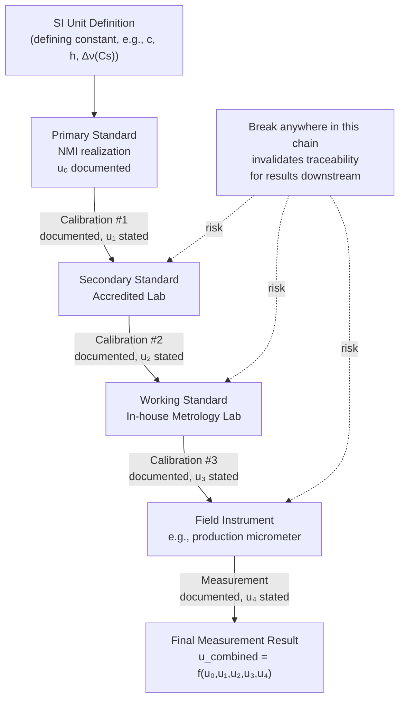

## Metrological Traceability Chains

### Overview

**Metrological traceability** is the property of a measurement result whereby it can be related to a reference (ultimately the SI) through a documented, unbroken chain of calibrations, each contributing to the measurement uncertainty (VIM 2.41). The traceability chain is the formal, auditable pathway — not merely a conceptual hierarchy — through which any single measurement result inherits its connection to the SI. This item formalizes the concept underlying the hierarchy of standards, focusing specifically on what makes a chain valid, complete, and defensible.

### Formal Definition (VIM 2.41)

Per VIM, metrological traceability requires a documented **unbroken chain of calibrations**, each of which contributes to the measurement uncertainty, in which:

1. Each calibration is performed against a reference (a measurement standard or reference material) with a stated measurement uncertainty.
2. Each comparison in the chain is documented.
3. The calibrating laboratories or bodies demonstrate technical competence (typically via accreditation).
4. The chain terminates at appropriate primary measurement standards for the realization of the SI units (or another agreed reference, for non-SI-linked traceability).

**Key Points**

- Traceability is a property of a *result*, not of an instrument — an instrument does not have inherent traceability; rather, a specific measurement made with it, referenced to its documented calibration history, does.
- The chain must be genuinely *unbroken*: a gap (e.g., an expired calibration, an undocumented intermediate comparison, or use of an unaccredited/unverified reference) invalidates the traceability claim for any measurement made during that gap.
- Each link contributes its own uncertainty component; traceability does not imply the result is "accurate," only that its relationship to the reference and the associated uncertainty are documented and defensible.

### Essential Elements of a Valid Traceability Chain

**Key Points**

- **Unbroken sequence of comparisons**: Every standard in the chain, from the field instrument up to the primary/international reference, must be linked by a documented calibration event.
- **Stated uncertainty at each step**: Each calibration certificate in the chain must quantify the measurement uncertainty of that comparison, enabling combined uncertainty to be calculated for the end measurement.
- **Documented calibration procedure**: The method used at each link must be recorded (e.g., which comparator, which environmental conditions, which correction factors were applied).
- **Competent, accredited providers**: Ideally, each calibrating body in the chain is accredited (e.g., to ISO/IEC 17025) or is itself an NMI, providing independent assurance of technical competence.
- **Appropriate reference**: The chain terminates at primary standards realizing the relevant SI unit — or, for certain reference materials/methods without a direct SI linkage, at another internationally or nationally agreed reference.

### Diagram: Anatomy of a Traceability Chain

### Combined Uncertainty Across the Chain

The combined standard uncertainty of a final measurement result reflects the propagated contributions of every calibration step in the chain (assuming independence between steps):

$$u_c=\sqrt{u_0^2+u_1^2+u_2^2+u_3^2+u_4^2+\ldots}$$

**Key Points**

- Each additional link generally increases the combined uncertainty, reinforcing why traceability chains are kept as short as practically possible while still meeting accreditation and competence requirements.
- [Inference] In practice, uncertainty contributions from upper-tier links (primary, secondary standards) are often small relative to contributions from the working standard and the measurement process itself, though this varies substantially by quantity and application.

### Documentation Requirements: The Calibration Certificate

A calibration certificate is the primary documentary evidence of one link in the traceability chain. A defensible certificate typically includes:

**Key Points**

- Identification of the item calibrated and the reference standard(s) used, including the reference standards' own calibration status/certificate numbers.
- The measured values, any correction/bias applied, and the associated measurement uncertainty with a stated coverage factor (commonly $k=2$, approximating a 95% confidence level).
- Environmental conditions during calibration (temperature, humidity, etc.), where relevant to the measurement.
- A statement of traceability, referencing the accreditation body and/or the specific NMI chain, along with the accreditation scope/certificate number.
- The calibration procedure/method reference (e.g., a specific standard or internal procedure document).

### Traceability vs. Calibration vs. Accuracy — Key Distinctions

| Concept | What It Establishes |
| --- | --- |
| Calibration | The relationship between an instrument's indication and a reference value, under specified conditions, at a point in time |
| Traceability | The documented, unbroken chain linking that calibration reference back to SI, with stated uncertainty at each link |
| Accuracy | The closeness of a measured value to the true value (a separate, qualitative property; not guaranteed merely by traceability) |

**Key Points**

- A measurement can be fully traceable yet still have relatively large uncertainty (traceability documents the *chain and its uncertainty*; it does not guarantee a small uncertainty value).
- Conversely, an untraceable measurement might coincidentally be numerically close to the true value, but this cannot be demonstrated or relied upon without a documented chain — traceability is what makes a claimed accuracy defensible and auditable.

### Diagram: Traceability Documentation Flow (svg_diagram)

<svg xmlns="http://www.w3.org/2000/svg" viewBox="0 0 720 260">
<rect x="0" y="0" width="720" height="260" fill="#ffffff" />
<text x="360" y="24" font-size="16" font-weight="bold" text-anchor="middle" fill="#111111">Documentary Evidence Supporting a Traceability Claim (svg_diagram)</text>
<rect x="30" y="60" width="150" height="70" rx="6" fill="#e8f0fe" stroke="#4285f4" />
<text x="105" y="85" font-size="11" text-anchor="middle" fill="#111111">NMI Calibration</text>
<text x="105" y="100" font-size="9" text-anchor="middle" fill="#333333">Certificate + CMC</text>
<text x="105" y="113" font-size="9" text-anchor="middle" fill="#333333">reference in KCDB</text>
<rect x="215" y="60" width="150" height="70" rx="6" fill="#fef7e0" stroke="#f9ab00" />
<text x="290" y="85" font-size="11" text-anchor="middle" fill="#111111">Accredited Lab</text>
<text x="290" y="100" font-size="9" text-anchor="middle" fill="#333333">Certificate + ISO/IEC 17025</text>
<text x="290" y="113" font-size="9" text-anchor="middle" fill="#333333">accreditation scope</text>
<rect x="400" y="60" width="150" height="70" rx="6" fill="#fce8e6" stroke="#ea4335" />
<text x="475" y="85" font-size="11" text-anchor="middle" fill="#111111">In-house Working</text>
<text x="475" y="100" font-size="9" text-anchor="middle" fill="#333333">Standard Certificate</text>
<text x="475" y="113" font-size="9" text-anchor="middle" fill="#333333">+ internal records</text>
<rect x="585" y="60" width="120" height="70" rx="6" fill="#e6f4ea" stroke="#34a853" />
<text x="645" y="85" font-size="11" text-anchor="middle" fill="#111111">Final</text>
<text x="645" y="100" font-size="9" text-anchor="middle" fill="#333333">Measurement</text>
<text x="645" y="113" font-size="9" text-anchor="middle" fill="#333333">Record</text>
<line x1="180" y1="95" x2="215" y2="95" stroke="#333333" stroke-width="1.5" />
<line x1="365" y1="95" x2="400" y2="95" stroke="#333333" stroke-width="1.5" />
<line x1="550" y1="95" x2="585" y2="95" stroke="#333333" stroke-width="1.5" />

<text x="360" y="180" font-size="10" text-anchor="middle" fill="`#666666`">Each link's certificate must be retrievable and current</text>

<text x="360" y="198" font-size="10" text-anchor="middle" fill="`#666666`">for the chain to be considered unbroken at time of use</text>

</svg>

### Application to Precision Metrology & QC

- **ISO/IEC 17025 and ISO 9001 compliance**: Both standards require organizations to maintain evidence of metrological traceability for measurements used in conformity assessment or quality assurance decisions — traceability chains form the audit trail reviewed during accreditation assessments and customer/regulatory audits.
- **Calibration record management**: QC systems must retain and readily retrieve calibration certificates for every standard and instrument in the chain, with expiration/due-date tracking to prevent gaps that would break traceability.
- **Risk-based decision-making**: Measurement decision risk (e.g., using GUM-based uncertainty combined with the tolerance limit, per ISO 14253-1 or similar) depends on having a defensible, traceable uncertainty budget — without an unbroken chain, stated uncertainty cannot be trusted for pass/fail decisions near tolerance boundaries.
- **Supplier and subcontractor calibration management**: Organizations using external calibration providers must verify (and retain evidence of) those providers' own traceability claims and accreditation scope as part of maintaining the organization's own downstream traceability.

### Common Pitfalls

- Treating "the instrument was calibrated" as synonymous with "the measurement is traceable" — traceability requires the *entire documented chain*, not just the most recent calibration event in isolation.
- Allowing a calibration certificate for any standard in the chain to expire without renewal, silently breaking traceability for all measurements made using instruments depending on that standard, even if this isn't immediately apparent from day-to-day operations.
- Accepting a calibration from an unaccredited or unverified source as equivalent to one from an accredited/NMI-linked provider — competence demonstration (via accreditation) is a formal requirement of the VIM traceability definition, not an optional enhancement.
- Confusing internal consistency (e.g., an in-house comparator agreeing with itself over time) with genuine SI traceability — internal check consistency does not substitute for a documented external calibration chain to a competent, traceable source.

### Related Topics

- Hierarchy of Measurement Standards
- Primary, Secondary, and Working Standards
- National Metrology Institutes
- ISO/IEC 17025: General Requirements for Testing and Calibration Laboratories
- Measurement Uncertainty and the GUM Law of Propagation of Uncertainty
- Measurement Decision Risk and Conformity Assessment (ISO 14253-1)