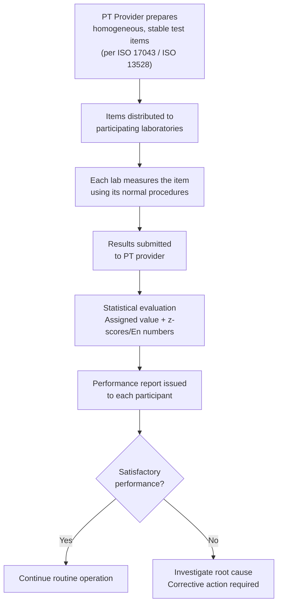

## Interlaboratory Comparisons and Proficiency Testing

### Overview

Interlaboratory comparisons (ILCs) and proficiency testing (PT) are the primary mechanisms by which laboratories demonstrate the ongoing validity of their measurement or testing capabilities through comparison against other independent laboratories, rather than through calibration alone. While calibration establishes traceability of a laboratory's standards to the SI, ILCs and PT provide independent, empirical evidence that a laboratory's entire measurement process — procedure, personnel, equipment, and environment combined — produces results consistent with the wider metrology community.

### Definitions and Distinctions

**Key Points**

- **Interlaboratory comparison (ILC)**: The organization, performance, and evaluation of measurements or tests on the same or similar items by two or more laboratories in accordance with predetermined conditions (per ISO/IEC 17043). This is the broad umbrella term.
- **Proficiency testing (PT)**: A specific type of interlaboratory comparison used to evaluate a laboratory's performance against pre-established criteria — i.e., PT schemes are designed specifically to assess laboratory competence, not merely to compare results for research purposes.
- All PT is a form of ILC, but not all ILCs are PT — some interlaboratory comparisons (e.g., BIPM key comparisons between NMIs) are conducted primarily to establish equivalence of measurement capabilities rather than to formally assess individual laboratory competence for accreditation purposes.

### Purpose and Function

**Key Points**

- **Competence verification**: Provides objective evidence that a laboratory can reliably produce accurate, consistent results, supporting both internal quality assurance and external accreditation requirements.
- **Method validation support**: Helps identify systematic biases or procedural issues that might not surface through internal repeatability/reproducibility studies alone, since PT introduces genuine inter-laboratory variability (different equipment, environments, personnel, and calibration histories).
- **Accreditation requirement**: ISO/IEC 17025 explicitly requires laboratories to participate in PT or other interlaboratory comparisons as part of demonstrating and monitoring the validity of results, typically assessed by accreditation bodies during surveillance audits.
- **Continuous improvement**: Provides a structured, recurring opportunity for a laboratory to detect drift, procedural gaps, or training deficiencies before they affect customer-facing results.

### Typical PT Scheme Workflow

### Statistical Evaluation Methods

**Z-score**

The most common statistic for evaluating a single laboratory's result against the PT assigned (consensus or reference) value:

$$z=\frac{x_{lab}-x_{assigned}}{\sigma_{pt}}$$

where $x_{lab}$ is the laboratory's reported result, $x_{assigned}$ is the PT scheme's assigned reference value, and $\sigma_{pt}$ is the standard deviation for proficiency assessment (fit-for-purpose, often derived from the PT round's data or set by the scheme organizer).

**Key Points**

- $|z|\le2$: satisfactory performance.
- $2<|z|<3$: questionable performance, warrants review.
- $|z|\ge3$: unsatisfactory performance, typically triggers mandatory investigation and corrective action.

**En number (normalized error)**

Used when comparing a laboratory's result against a reference value while accounting for the laboratory's own stated measurement uncertainty — common in calibration (rather than testing) PT schemes:

$$E_n=\frac{x_{lab}-x_{ref}}{\sqrt{U_{lab}^2+U_{ref}^2}}$$

where $U_{lab}$ and $U_{ref}$ are the expanded uncertainties (typically $k=2$) of the laboratory's result and the reference value, respectively.

**Key Points**

- $|E_n|\le1$: satisfactory — the laboratory's result and its stated uncertainty are consistent with the reference value.
- $|E_n|>1$: unsatisfactory — indicates either an incorrect result, an understated uncertainty budget, or both.
- The $E_n$ statistic is particularly informative in calibration metrology because it directly tests whether a laboratory's *claimed uncertainty* is realistic, not just whether its central value is close to the reference.

### Diagram: Z-score and En Interpretation (svg_diagram)

<svg xmlns="http://www.w3.org/2000/svg" viewBox="0 0 700 260">
<rect x="0" y="0" width="700" height="260" fill="#ffffff" />
<text x="350" y="24" font-size="16" font-weight="bold" text-anchor="middle" fill="#111111">PT Performance Statistics: Interpretation Bands (svg_diagram)</text>
<line x1="60" y1="140" x2="640" y2="140" stroke="#333333" stroke-width="1.5" />
<rect x="300" y="120" width="100" height="40" fill="#e6f4ea" opacity="0.7" />
<text x="350" y="180" font-size="10" text-anchor="middle" fill="#111111">|z| ≤ 2</text>
<text x="350" y="195" font-size="9" text-anchor="middle" fill="#333333">Satisfactory</text>
<rect x="220" y="120" width="80" height="40" fill="#fef7e0" opacity="0.7" />
<rect x="400" y="120" width="80" height="40" fill="#fef7e0" opacity="0.7" />
<text x="260" y="180" font-size="10" text-anchor="middle" fill="#111111">2 &lt; |z| &lt; 3</text>
<text x="440" y="180" font-size="10" text-anchor="middle" fill="#111111">2 &lt; |z| &lt; 3</text>
<text x="260" y="195" font-size="9" text-anchor="middle" fill="#333333">Questionable</text>
<text x="440" y="195" font-size="9" text-anchor="middle" fill="#333333">Questionable</text>
<rect x="60" y="120" width="160" height="40" fill="#fce8e6" opacity="0.7" />
<rect x="480" y="120" width="160" height="40" fill="#fce8e6" opacity="0.7" />
<text x="140" y="180" font-size="10" text-anchor="middle" fill="#111111">|z| ≥ 3</text>
<text x="560" y="180" font-size="10" text-anchor="middle" fill="#111111">|z| ≥ 3</text>
<text x="140" y="195" font-size="9" text-anchor="middle" fill="#333333">Unsatisfactory</text>
<text x="560" y="195" font-size="9" text-anchor="middle" fill="#333333">Unsatisfactory</text>
<line x1="350" y1="120" x2="350" y2="160" stroke="#34a853" stroke-width="2" />
<text x="350" y="110" font-size="9" text-anchor="middle" fill="#34a853">Assigned value (z=0)</text>

<text x="350" y="230" font-size="10" text-anchor="middle" fill="`#666666`">Same interpretation bands commonly applied to |Eₙ| using threshold of 1 instead of 2/3</text>

</svg>

### Example: Interpreting a PT Result

A calibration laboratory measures a check standard as part of a PT round, reporting a result of $100.05\ \mathrm{mm}$ with an expanded uncertainty $U_{lab}=0.02\ \mathrm{mm}$ ($k=2$). The PT provider's reference value is $100.02\ \mathrm{mm}$ with $U_{ref}=0.01\ \mathrm{mm}$.

$$E_n=\frac{100.05-100.02}{\sqrt{0.02^2+0.01^2}}=\frac{0.03}{0.0224}\approx1.34$$

Since $|E_n|>1$, this result is flagged as **unsatisfactory** — the discrepancy between the lab's result and the reference value exceeds what the combined stated uncertainties can account for, indicating either an undetected bias in the lab's measurement process or an understated uncertainty budget requiring investigation.

### Standards Governing ILC/PT

**Key Points**

- **ISO/IEC 17043**: General requirements for the competence of providers of proficiency testing schemes — governs how PT schemes themselves must be designed, operated, and statistically evaluated.
- **ISO 13528**: Statistical methods for use in proficiency testing by interlaboratory comparison — provides the detailed statistical procedures (including robust statistics for assigned value determination, such as the algorithm A or median/normalized IQR methods).
- **ISO/IEC 17025 (Section 7.7)**: Requires accredited testing and calibration laboratories to monitor the validity of results, explicitly listing participation in interlaboratory comparisons/PT as a primary monitoring method.

### Application to Precision Metrology & QC

- **Accreditation maintenance**: Accreditation bodies typically require evidence of satisfactory (or appropriately investigated) PT participation as a condition of maintaining ISO/IEC 17025 accreditation, reviewed during periodic surveillance assessments.
- **Uncertainty budget validation**: Consistent unsatisfactory En results across multiple PT rounds often indicate an understated uncertainty budget rather than a one-off measurement error, prompting a full review of the laboratory's GUM-based uncertainty analysis.
- **Method and equipment qualification**: PT participation can support validation of a new measurement method or newly commissioned equipment by providing independent confirmation that results align with the broader metrology community before the method/equipment is released for routine use.
- **Customer and regulatory confidence**: Documented, satisfactory PT history is frequently requested by customers and auditors as supporting evidence of ongoing laboratory competence, beyond the baseline accreditation certificate itself.

### Common Pitfalls

- Treating a single unsatisfactory PT result as an isolated anomaly without investigation — per ISO/IEC 17025, an unsatisfactory result requires documented root-cause investigation and, where appropriate, corrective action, not simply a repeat attempt in the next round.
- Relying solely on z-scores (which ignore the laboratory's own stated uncertainty) when En numbers are more appropriate — particularly in calibration metrology, where the laboratory's uncertainty claim is itself part of what's being validated.
- Selecting PT schemes that do not adequately match the laboratory's actual scope of accreditation (wrong quantity, range, or method), which produces results with limited value for genuinely validating the laboratory's operational competence.
- Assuming PT participation alone is sufficient evidence of ongoing competence without also maintaining a robust internal quality control program (e.g., control charts, routine check standards) between PT rounds — PT typically occurs only periodically (e.g., annually), while internal QC operates continuously.

### Related Topics

- Metrological Traceability Chains
- ISO/IEC 17025: General Requirements for Testing and Calibration Laboratories
- Measurement Uncertainty and the GUM Law of Propagation of Uncertainty
- Statistical Process Control (SPC) and Control Charts
- Repeatability and Reproducibility
- CIPM Mutual Recognition Arrangement and the BIPM Key Comparison Database