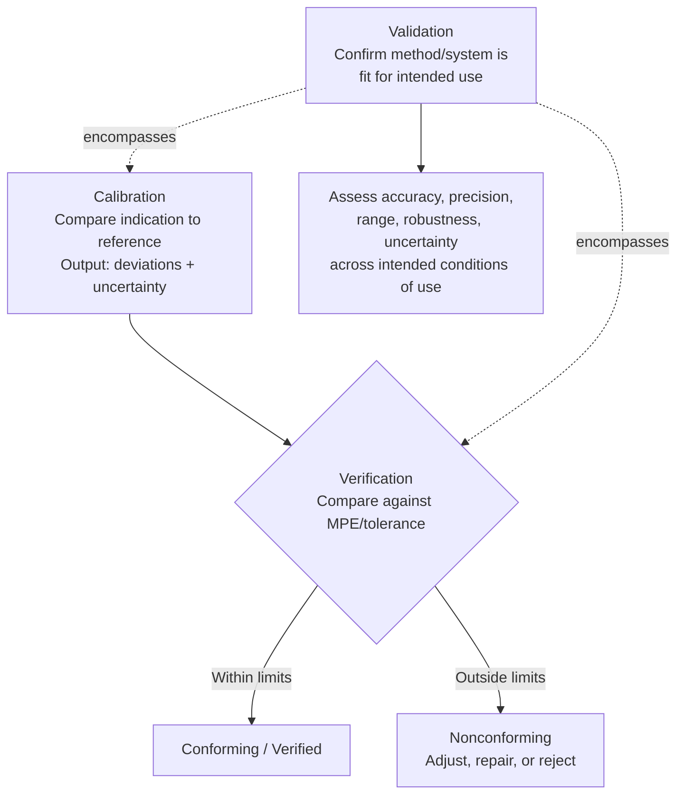

## Calibration versus Verification versus Validation

### Overview

Calibration, verification, and validation are distinct but frequently conflated activities in metrology and quality management. Each answers a different question about a measurement process or system, is governed by different formal definitions (primarily VIM and ISO 9000), and produces different documentary evidence. Correctly distinguishing them is essential for constructing sound quality management procedures and for interpreting calibration certificates, verification reports, and validation studies correctly.

### Calibration

**Calibration** (VIM 2.39) is an operation that, under specified conditions, in a first step establishes a relation between the quantity values with measurement uncertainties provided by measurement standards and corresponding indications with associated measurement uncertainties, and in a second step uses this information to establish a relation for obtaining a measurement result from an indication.

**Key Points**

- Fundamentally a *comparison* activity: the instrument's indication is compared against a traceable reference standard across its range (or at defined points), and the relationship (including any bias/correction) is documented.
- Produces a **calibration certificate** stating measured values, associated corrections, and measurement uncertainty — it does *not* itself include a pass/fail judgment against a tolerance or specification.
- Calibration does not adjust or repair an instrument; if adjustment is performed, it is typically documented as a separate step (before-adjustment and after-adjustment data are often both reported).
- Requires traceability to SI through a documented, unbroken chain of comparisons.

**Example**

A calibration laboratory compares a digital thermometer's readings against a calibrated reference thermometer at five temperature points across its range (0°C, 25°C, 50°C, 75°C, 100°C), recording the deviation at each point and the associated uncertainty. The output is a calibration certificate documenting these deviations — no judgment is made about whether the thermometer is "good enough" for any particular use.

### Verification

**Verification** (per ISO 9000 and VIM 2.44) is the confirmation, through the provision of objective evidence, that specified requirements have been fulfilled.

**Key Points**

- Answers the question: "Does this item conform to a stated requirement or specification?" — inherently involves a pass/fail (or conforming/nonconforming) judgment.
- In a metrology context, instrument verification typically means confirming that an instrument's performance, as established via calibration or direct check, meets a defined **maximum permissible error (MPE)** or tolerance specified for its intended use.
- Verification uses calibration data (or direct comparison to a reference) as *input*, then applies a decision rule against a specification — calibration alone is not verification; verification requires an explicit acceptance criterion.
- Can also apply more broadly (e.g., verifying that a measurement procedure, when followed, produces results meeting requirements) — not exclusively an instrument-level activity.

**Example**

Following the calibration above, verification compares each measured deviation against the thermometer's manufacturer-stated MPE of ±0.2°C. If all five deviations fall within ±0.2°C, the thermometer is verified as conforming to its specified accuracy class; if any deviation exceeds this, it fails verification and may require adjustment, repair, or removal from service.

### Validation

**Validation** (VIM 2.45, ISO 9000) is verification where the specified requirements are adequate for an intended use.

**Key Points**

- Answers a broader question: "Is this method/system/process actually fit for its intended purpose?" — not merely "does it meet a written specification," but "was the specification itself the right one, and does the overall approach work as intended in practice?"
- Often applied to entire **measurement methods** or **test procedures**, not just individual instruments — e.g., validating that a new analytical test method reliably and accurately measures the property of interest across its intended range of use, matrices, and conditions.
- Method validation studies typically assess accuracy/trueness, precision (repeatability and reproducibility), linearity, range, limit of detection/quantification, robustness, and measurement uncertainty — a substantially broader scope than a single-point instrument calibration or verification check.
- In regulated industries (pharmaceuticals, medical devices, aerospace), validation is often a formal, documented, multi-stage process (e.g., IQ/OQ/PQ — Installation Qualification, Operational Qualification, Performance Qualification) required before a measurement system or process may be used for regulated decisions.

**Example**

Before deploying the thermometer (and its associated measurement procedure — including probe placement, stabilization time, and data recording method) for a regulated process temperature-monitoring application, the organization performs a validation study confirming the entire measurement procedure reliably achieves the required accuracy and precision under actual conditions of use — not just that the bare instrument, in isolation, passed calibration/verification.

### Comparative Summary

| Aspect | Calibration | Verification | Validation |
| --- | --- | --- | --- |
| Core question | What is the relationship between indication and true value? | Does this meet a stated requirement? | Is the requirement itself right, and does the method work as intended? |
| Output | Documented values, corrections, uncertainty | Pass/fail against a specification | Confirmation of fitness for intended use, often with a broader performance profile |
| Scope | Typically instrument-level, point-by-point | Instrument or procedure against MPE/tolerance | Often the entire method/system/process |
| Requires a specification/tolerance? | No | Yes | Yes, plus confirmation the spec is adequate |
| Includes judgment/decision? | No | Yes | Yes, and broader |

### Diagram: Relationship Between the Three Activities

### Diagram: Scope Comparison (svg_diagram)

<svg xmlns="http://www.w3.org/2000/svg" viewBox="0 0 700 320">
<rect x="0" y="0" width="700" height="320" fill="#ffffff" />
<text x="350" y="24" font-size="16" font-weight="bold" text-anchor="middle" fill="#111111">Nested Scope: Calibration, Verification, Validation (svg_diagram)</text>
<ellipse cx="350" cy="180" rx="320" ry="110" fill="#fce8e6" stroke="#ea4335" stroke-width="1.5" />
<text x="350" y="80" font-size="12" font-weight="bold" text-anchor="middle" fill="#111111">Validation</text>
<text x="350" y="95" font-size="9" text-anchor="middle" fill="#333333">(Is the whole method fit for intended use?)</text>
<ellipse cx="350" cy="200" rx="220" ry="75" fill="#fef7e0" stroke="#f9ab00" stroke-width="1.5" />
<text x="350" y="140" font-size="12" font-weight="bold" text-anchor="middle" fill="#111111">Verification</text>
<text x="350" y="155" font-size="9" text-anchor="middle" fill="#333333">(Does it meet the stated requirement?)</text>
<ellipse cx="350" cy="220" rx="130" ry="45" fill="#e8f0fe" stroke="#4285f4" stroke-width="1.5" />
<text x="350" y="215" font-size="12" font-weight="bold" text-anchor="middle" fill="#111111">Calibration</text>
<text x="350" y="230" font-size="9" text-anchor="middle" fill="#333333">(What is the deviation from reference?)</text>
</svg>

### Application to Precision Metrology & QC

- **Procedure design**: A robust QC system explicitly documents all three activities where relevant — calibration data as the evidentiary basis, verification decision rules (including how measurement uncertainty is factored into pass/fail decisions near tolerance limits, per ISO 14253-1), and validation studies for any new or modified measurement method before production use.
- **ISO/IEC 17025 alignment**: The standard requires laboratories to both calibrate equipment (Section 6.4/6.5) and validate non-standard or laboratory-developed methods (Section 7.2.2), treating these as related but distinct obligations.
- **Regulatory compliance**: In regulated sectors, validation (often via IQ/OQ/PQ protocols) is typically a prerequisite before a measurement system may be used for product release, safety, or compliance decisions — calibration and verification alone are generally insufficient documentation in these contexts.
- **Instrument lifecycle management**: A typical instrument lifecycle involves initial validation (is this instrument/method type suitable for the application?), periodic calibration (tracking drift over time), and verification at each calibration interval (confirming continued conformance to MPE) — understanding which activity addresses which question prevents gaps in the quality system.

### Common Pitfalls

- Using "calibration" and "verification" interchangeably in procedures or records — a calibration certificate alone does not constitute evidence of conformance to a specification unless an explicit verification/pass-fail step, referencing a stated MPE or tolerance, has also been documented.
- Treating validation as merely "verification, but more thorough" — validation specifically addresses whether the *requirement itself* is appropriate for the intended use, a conceptually distinct question from whether a result meets an already-established requirement.
- Failing to account for measurement uncertainty in the verification decision rule — a result numerically within tolerance may still carry enough uncertainty to make a pass/fail decision unreliable near the tolerance boundary (addressed formally by guard-banding per ISO 14253-1 or similar).
- Skipping method/system validation for a newly implemented or significantly modified measurement procedure, relying only on individual instrument calibration — instrument-level calibration does not, by itself, validate that the complete procedure (including sampling, handling, environmental conditions, and data processing) is fit for its intended purpose.

### Related Topics

- Metrological Traceability Chains
- Measurement Uncertainty and the GUM Law of Propagation of Uncertainty
- Measurement Decision Risk and Conformity Assessment (ISO 14253-1)
- ISO/IEC 17025: General Requirements for Testing and Calibration Laboratories
- Maximum Permissible Error and Instrument Tolerance Classes
- Method Validation: IQ/OQ/PQ Protocols