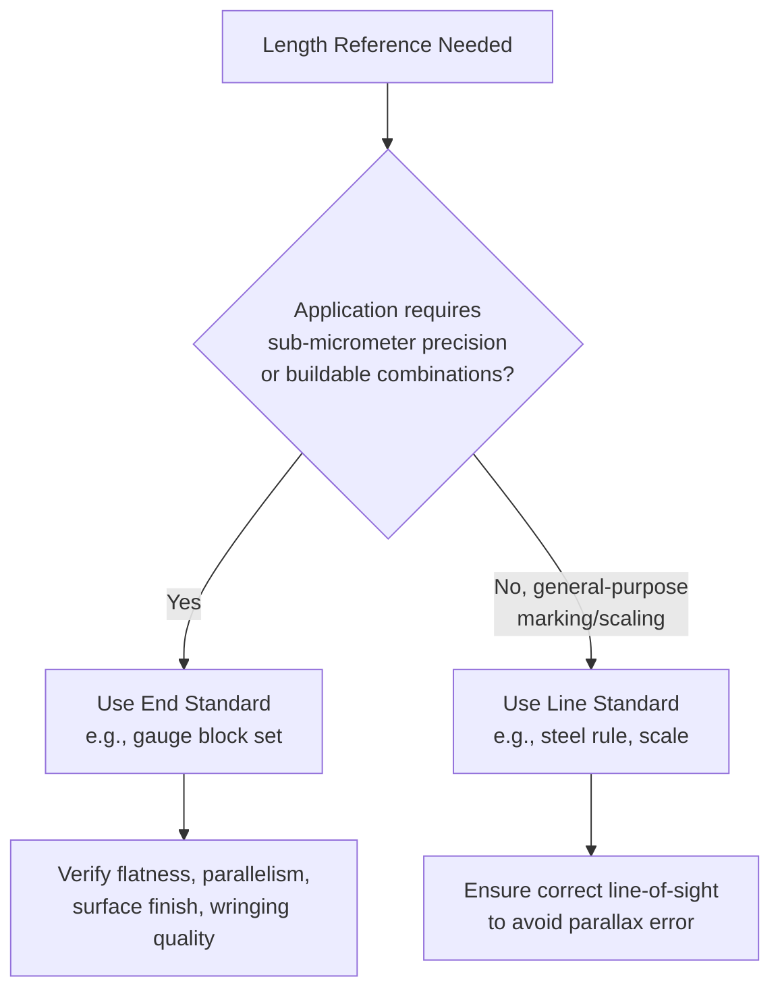

## Line Standards and End Standards

### Overview

Line standards and end standards are the two fundamental physical embodiments used to represent a length (or, more generally, a linear dimension) in dimensional metrology. This classification predates modern non-contact and interferometric methods and remains foundational to understanding how physical length reference artifacts are constructed, used, and calibrated — including their distinct sources of error, appropriate applications, and the specific measurement techniques each demands.

### Line Standards

A **line standard** defines a length as the distance between two engraved (or otherwise marked) lines on a physical body.

**Key Points**

- The length is defined between the **centers of two fine lines**, not between physical end faces — measurement requires a means of accurately locating each line's center, typically via a microscope or optical comparator with a graticule/crosshair.
- Reading a line standard is inherently easier to do with high precision than reading an end standard's terminal faces, because line-center location by optical means is generally more repeatable than physically contacting an end face.
- Susceptible to **parallax error** if the observing instrument's line of sight is not exactly perpendicular to the standard's surface at the line location — the graduation must be viewed along the correct optical axis to avoid systematic error.
- Examples: engineer's steel rules/scales, surveying tapes and bars, yard/metre bars (historically used as primary artifact length standards, such as the pre-1960 international prototype metre bar), and graduated scales on many types of measuring machines.

**Example**

A precision steel scale has two fine lines engraved at nominal positions 0 mm and 500 mm. The certified length is the distance between the centers of these two lines, as measured by a traveling microscope, and is only valid at the standard's specified reference temperature (commonly 20°C) due to thermal expansion.

### End Standards

An **end standard** defines a length as the distance between two flat, parallel end faces of a physical body.

**Key Points**

- The length is defined by direct **mechanical contact** with the two end faces — no optical line-locating step is required, but this introduces sensitivity to surface flatness, parallelism, and contact-force-induced deformation.
- End standards can be **wrung together** (a phenomenon where two extremely flat, clean surfaces adhere via molecular attraction and a thin film of lubricant/air exclusion) to build up composite lengths from a base set — a key practical advantage over line standards.
- Generally capable of higher accuracy than line standards for precision dimensional work, because contact measurement of flat end faces avoids the optical line-location uncertainty inherent to line standards, provided flatness and parallelism are well controlled.
- Examples: gauge blocks (slip gauges), length bars, plug gauges, and ring gauges.

**Example**

A set of gauge blocks (Johansson blocks) includes individual blocks of certified length (e.g., 10.000 mm, 1.005 mm, 1.0005 mm), each defined as the distance between its two lapped, flat, parallel end faces. Blocks are wrung together in combination to build up a required composite length (e.g., combining blocks to achieve 32.4875 mm) with sub-micrometer accuracy.

### Comparative Summary

| Aspect | Line Standard | End Standard |
| --- | --- | --- |
| Length defined between | Centers of two engraved lines | Two flat, parallel end faces |
| Measurement method | Optical (microscope, comparator) | Mechanical contact (comparator, wringing) |
| Key error sources | Parallax, line-width/graduation quality, optical resolution | Flatness, parallelism, surface finish, contact deformation |
| Buildable/combinable | No (fixed length per standard) | Yes (via wringing multiple blocks) |
| Typical accuracy | Good, generally lower than high-grade end standards | Very high (Grade 00/K gauge blocks: sub-micrometer) |
| Examples | Steel rules, metre bars, graduated scales | Gauge blocks, length bars, plug/ring gauges |

### Diagram: Line Standard vs. End Standard Geometry (svg_diagram)

<svg xmlns="http://www.w3.org/2000/svg" viewBox="0 0 760 320">
<rect x="0" y="0" width="760" height="320" fill="#ffffff" />
<text x="380" y="24" font-size="16" font-weight="bold" text-anchor="middle" fill="#111111">Line Standard vs. End Standard (svg_diagram)</text>

<text x="190" y="55" font-size="13" font-weight="bold" text-anchor="middle" fill="`#111111`">Line Standard</text>

<rect x="70" y="80" width="240" height="50" fill="`#e8f0fe`" stroke="`#4285f4`" stroke-width="1.5" />

<line x1="90" y1="80" x2="90" y2="130" stroke="`#111111`" stroke-width="2" />

<line x1="290" y1="80" x2="290" y2="130" stroke="`#111111`" stroke-width="2" />

<line x1="90" y1="150" x2="290" y2="150" stroke="`#ea4335`" stroke-width="1.5" />

<line x1="90" y1="145" x2="90" y2="155" stroke="`#ea4335`" stroke-width="1.5" />

<line x1="290" y1="145" x2="290" y2="155" stroke="`#ea4335`" stroke-width="1.5" />

<text x="190" y="170" font-size="10" text-anchor="middle" fill="`#ea4335`">Length = distance between line centers</text>

<text x="190" y="188" font-size="9" text-anchor="middle" fill="`#666666`">Read via microscope/comparator</text>

<text x="570" y="55" font-size="13" font-weight="bold" text-anchor="middle" fill="`#111111`">End Standard</text>

<rect x="450" y="80" width="240" height="50" fill="`#fef7e0`" stroke="`#f9ab00`" stroke-width="1.5" />

<line x1="450" y1="80" x2="450" y2="130" stroke="`#111111`" stroke-width="3" />

<line x1="690" y1="80" x2="690" y2="130" stroke="`#111111`" stroke-width="3" />

<line x1="450" y1="150" x2="690" y2="150" stroke="`#ea4335`" stroke-width="1.5" />

<line x1="450" y1="145" x2="450" y2="155" stroke="`#ea4335`" stroke-width="1.5" />

<line x1="690" y1="145" x2="690" y2="155" stroke="`#ea4335`" stroke-width="1.5" />

<text x="570" y="170" font-size="10" text-anchor="middle" fill="`#ea4335`">Length = distance between end faces</text>

<text x="570" y="188" font-size="9" text-anchor="middle" fill="`#666666`">Measured via direct contact</text>

<text x="380" y="230" font-size="12" font-weight="bold" text-anchor="middle" fill="`#111111`">End Standards Can Be "Wrung" Together</text>

<rect x="280" y="250" width="80" height="40" fill="`#fef7e0`" stroke="`#f9ab00`" stroke-width="1.5" />

<rect x="360" y="250" width="60" height="40" fill="`#fce8e6`" stroke="`#ea4335`" stroke-width="1.5" />

<text x="380" y="308" font-size="9" text-anchor="middle" fill="`#666666`">Composite length = sum of individual block lengths</text>

</svg>

### Reference Temperature and Thermal Expansion

**Key Points**

- Both line and end standards are certified at a specified **reference temperature**, almost universally $20\,^{\circ}\mathrm{C}$ per international convention (ISO 1 and related standards).
- Deviation from the reference temperature introduces a length change governed by:

$$\Delta L=L_0\cdot\alpha\cdot\Delta T$$

where $L_0$ is the nominal length, $\alpha$ is the material's linear coefficient of thermal expansion, and $\Delta T$ is the deviation from the reference temperature.

- Because end standards (particularly gauge blocks) are used for the most demanding precision comparisons, temperature control and soak time before measurement are critical practical considerations — even small deviations from 20°C can introduce errors comparable to or exceeding the block's calibration uncertainty.

### Diagram: Selection Logic for Line vs. End Standard

### Application to Precision Metrology & QC

- **Gauge block calibration and use**: End standards (gauge blocks) are the primary working and reference standards throughout the dimensional metrology hierarchy — used both for direct comparison calibration of other gauges and for setting/verifying comparators, height gauges, and CMM probes.
- **Historical primary standard**: [Unverified] The former international prototype metre bar (pre-1960 definition) was a line standard, illustrating the historical precedence of line standards at the highest metrological level before optical/interferometric methods and, eventually, the defined-constant SI metre superseded artifact-based definitions.
- **Comparator design**: Instruments designed to measure against line standards (traveling microscopes, optical comparators) differ fundamentally in operating principle from those designed for end standards (mechanical/electronic comparators, coordinate measuring machines using contact or optical probing of flat faces).
- **Traceability chain construction**: Gauge block sets, calibrated via interferometric comparison against reference-grade blocks (themselves traceable to the metre's SI definition), form the backbone of many dimensional metrology traceability chains in manufacturing QC.

### Common Pitfalls

- Failing to account for parallax when reading a line standard — even small angular misalignment between the observer's line of sight and the standard's graduation plane introduces a systematic reading error.
- Neglecting proper wringing technique for end standards (inadequate cleaning, incorrect wringing motion, or attempting to wring blocks of significantly different surface condition) — poor wringing introduces air gaps that add uncertainty to the composite length.
- Measuring or using either standard type without accounting for deviation from the 20°C reference temperature, particularly significant for high-precision end standard applications where thermal expansion can exceed the block's stated calibration uncertainty.
- Assuming all end standards are inherently more accurate than all line standards in every context — grade and calibration quality matter more than the fundamental classification; a poorly maintained or contaminated gauge block can underperform a well-calibrated precision line standard for a given application.

### Related Topics

- The International System of Units (SI)
- Hierarchy of Measurement Standards
- Gauge Block Calibration and Comparators
- Thermal Expansion and Reference Temperature Correction
- Coordinate Measuring Machines (CMM) and Contact/Optical Probing
- Direct, Indirect, Absolute, and Comparative Measurement