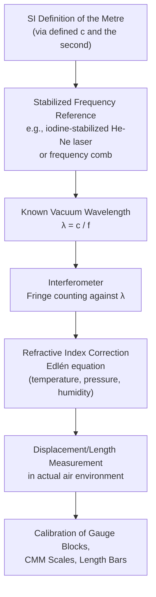

## Wavelength Standard of Length

### Overview

The wavelength standard of length refers to the historical and continuing practice of defining and realizing the unit of length by reference to the wavelength of light, rather than to a physical artifact (such as a metal bar) or engraved line standard. This principle underpins both the 1960–1983 SI definition of the metre and its modern practical realization via laser interferometry, and represents a pivotal shift in metrology from artifact-dependent to physically-invariant length standards.

### Historical Development

**Key Points**

- **1960**: The 11th CGPM redefined the metre in terms of the wavelength of light emitted by a specified transition of krypton-86 (specifically, $1\,650\,763.73$ wavelengths of the orange-red radiation from krypton-86 in vacuum), replacing the earlier artifact-based International Prototype Metre bar.
- This redefinition addressed key limitations of the platinum-iridium bar standard: artifacts can be damaged, are not universally accessible, and their length is not fundamentally invariant or independently reproducible without physical access to the specific artifact.
- **1983**: The 17th CGPM superseded the krypton-86 wavelength definition with the current SI definition, fixing the metre in terms of the defined speed of light $c=299\,792\,458$ m/s and the second — the wavelength-based definition was retired as the formal definition, though wavelength-based interferometric methods remain the dominant *practical realization* technique.

### Why a Wavelength Standard?

**Key Points**

- Electromagnetic radiation of a well-defined, stable atomic or molecular transition provides a length reference that is, in principle, reproducible anywhere in the world without needing to compare against a single physical artifact.
- The relationship between wavelength $\lambda$, frequency $f$, and the speed of light $c$ is:

$$\lambda=\frac{c}{f}$$

- Because $c$ is now an exact defined constant in the SI, and atomic/molecular transition frequencies can be measured and stabilized with extremely high precision, a stabilized light source provides an extremely stable, reproducible "ruler" at the wavelength scale (hundreds of nanometers), enabling interferometric length measurement with sub-nanometer resolution.

### Practical Realization: Laser Interferometry

The dominant modern practical realization of the metre for precision dimensional metrology uses **stabilized laser interferometers**.

**Key Points**

- A common reference source is the **iodine-stabilized helium-neon (He-Ne) laser**, where the laser frequency is locked to a hyperfine absorption line of molecular iodine ($^{127}\mathrm{I}_2$), providing long-term frequency stability and international reproducibility.
- The stabilized laser's wavelength (in vacuum) serves as the interferometric "ruler": as a measurement mirror moves, the interference pattern between a reference beam and a measurement beam produces fringes, with each fringe cycle corresponding to a displacement of $\lambda/2$ (for a simple Michelson-type configuration).
- Fringe-counting interferometry can achieve displacement resolution at the nanometer level, underpinning the calibration of gauge blocks, CMM scales, and other high-precision length artifacts.

**Example**

An iodine-stabilized He-Ne laser operating at approximately 633 nm is used in a Michelson interferometer to measure the displacement of a moving stage. If the interferometer counts 10,000 complete fringe cycles as the stage moves, the displacement is:

$$d=N\cdot\frac{\lambda}{2}=10000\times\frac{633\times10^{-9}\ \mathrm{m}}{2}\approx3.165\ \mathrm{mm}$$

with an uncertainty determined primarily by the laser's frequency stability, refractive index correction for the measurement path (typically air), and fringe-counting/interpolation electronics.

### Environmental Corrections: Refractive Index of Air

**Key Points**

- Because laser interferometry in ambient air measures optical path length, not true geometric (vacuum) length, the measured wavelength must be corrected for the **refractive index of air**, which varies with temperature, pressure, humidity, and $\mathrm{CO}_2$ content.
- The **Edlén equation** (and its subsequent revisions) is the standard formula used to compute the refractive index of air from measured environmental parameters, allowing conversion between the vacuum wavelength and the effective wavelength in the actual measurement environment.
- This environmental correction is often the dominant uncertainty contributor in high-precision interferometric length measurement, exceeding the intrinsic frequency stability of the stabilized laser source itself. [Inference] The relative magnitude of this contribution depends on the specific measurement conditions and the level of environmental control achieved in a given laboratory.

### Diagram: Wavelength-Based Length Realization Chain

### Diagram: Michelson Interferometer for Length Measurement (svg_diagram)

<svg xmlns="http://www.w3.org/2000/svg" viewBox="0 0 700 320">
<rect x="0" y="0" width="700" height="320" fill="#ffffff" />
<text x="350" y="24" font-size="16" font-weight="bold" text-anchor="middle" fill="#111111">Laser Interferometer Length Measurement (svg_diagram)</text>
<rect x="40" y="150" width="90" height="40" rx="4" fill="#e8f0fe" stroke="#4285f4" />
<text x="85" y="174" font-size="10" text-anchor="middle" fill="#111111">Stabilized Laser</text>
<line x1="130" y1="170" x2="280" y2="170" stroke="#ea4335" stroke-width="2" />
<rect x="280" y="150" width="50" height="40" fill="#fef7e0" stroke="#f9ab00" transform="rotate(45 305 170)" />
<text x="305" y="130" font-size="9" text-anchor="middle" fill="#111111">Beam Splitter</text>
<line x1="305" y1="150" x2="305" y2="60" stroke="#ea4335" stroke-width="2" />
<rect x="270" y="30" width="70" height="30" fill="#e6f4ea" stroke="#34a853" />
<text x="305" y="50" font-size="9" text-anchor="middle" fill="#111111">Reference Mirror</text>
<line x1="330" y1="170" x2="500" y2="170" stroke="#ea4335" stroke-width="2" />
<rect x="500" y="150" width="20" height="40" fill="#e6f4ea" stroke="#34a853" />
<text x="560" y="145" font-size="9" text-anchor="middle" fill="#111111">Moving Mirror</text>
<text x="560" y="160" font-size="9" text-anchor="middle" fill="#111111">(on measured</text>
<text x="560" y="173" font-size="9" text-anchor="middle" fill="#111111">stage/artifact)</text>
<line x1="520" y1="170" x2="590" y2="170" stroke="#999999" stroke-width="1" stroke-dasharray="3,3" />
<line x1="305" y1="190" x2="305" y2="260" stroke="#ea4335" stroke-width="2" />
<rect x="270" y="260" width="70" height="30" fill="#fce8e6" stroke="#ea4335" />
<text x="305" y="280" font-size="9" text-anchor="middle" fill="#111111">Detector</text>
<text x="305" y="300" font-size="9" text-anchor="middle" fill="#666666">Fringe pattern → displacement</text>
</svg>

### Diagram: Frequency Combs (Modern Extension)

**Key Points**

- Modern length and frequency metrology increasingly employs **optical frequency combs** — mode-locked lasers producing a spectrum of precisely spaced frequency lines — enabling direct, highly accurate linking between optical frequencies and the microwave-based SI second, further improving the practical realization chain for wavelength-based length standards.
- [Inference] Frequency comb-based systems offer improved traceability and potentially lower uncertainty compared to single-line stabilized lasers in advanced national metrology institute applications, though iodine-stabilized He-Ne lasers remain widely used as practical, cost-effective secondary/working length standards in industrial and calibration laboratory settings.

### Application to Precision Metrology & QC

- **Gauge block calibration**: The highest-accuracy gauge block calibration (interferometric calibration) directly compares a gauge block's length against a known laser wavelength via optical interferometry, representing one of the most direct practical applications of the wavelength standard of length in industrial metrology.
- **CMM scale calibration**: Laser interferometer systems are the standard reference method for calibrating the linear axes of coordinate measuring machines, machine tools, and other precision positioning systems, providing traceable displacement measurement over travel ranges from millimeters to meters.
- **Length bar and reference artifact calibration**: National metrology institutes and top-tier accredited laboratories use laser interferometry as the primary method for realizing and disseminating length standards throughout the traceability hierarchy.
- **Semiconductor and precision manufacturing**: Sub-micrometer and nanometer-scale dimensional metrology (e.g., photolithography stage positioning) relies fundamentally on interferometric, wavelength-referenced displacement measurement for achieving the required positioning accuracy.

### Common Pitfalls

- Neglecting the refractive index correction for the measurement environment (air) when using interferometry outside a vacuum — uncorrected measurements can carry systematic errors substantially larger than the interferometer's intrinsic resolution.
- Assuming a stabilized laser's *nominal* wavelength (e.g., "633 nm" for He-Ne) is sufficiently accurate without accounting for the specific stabilization method and its documented frequency uncertainty — unstabilized or poorly stabilized lasers can exhibit significant wavelength drift unsuitable for precision metrology.
- Confusing the *historical* 1960–1983 krypton-86 wavelength *definition* of the metre with the *current* practical *realization* method using stabilized lasers — the current SI definition is based on the fixed value of $c$, with wavelength-based interferometry serving as the primary practical realization technique, not the formal definition itself.
- Ignoring thermal expansion of the measured artifact itself during interferometric length determination — even with a perfectly accurate wavelength reference, the artifact's own temperature deviation from the 20°C reference temperature introduces additional length uncertainty.

### Related Topics

- The International System of Units (SI)
- Line Standards and End Standards
- Hierarchy of Measurement Standards
- National Metrology Institutes
- Coordinate Measuring Machines (CMM) and Scale Calibration
- Thermal Expansion and Reference Temperature Correction