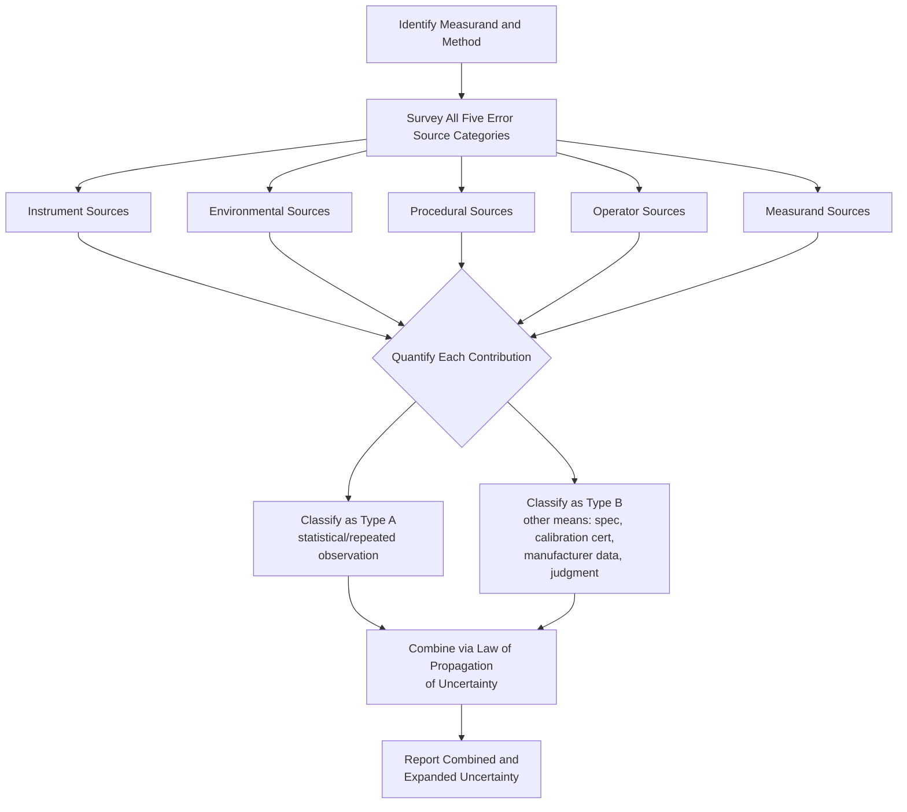

## Sources of Measurement Error

### Overview

Every measurement result deviates from the true value of the measurand to some degree, and this deviation arises from identifiable physical, procedural, and environmental sources. Systematically cataloging these sources is the essential first step in constructing a measurement uncertainty budget (per the GUM) and in diagnosing quality problems traced to measurement rather than to the process or product itself. This item surveys the major categories of error sources encountered across precision metrology and quality control.

### Categorization Framework

**Key Points**

- Error sources are commonly grouped by *where in the measurement chain* they arise: instrument, environment, procedure/method, operator, and the item being measured itself.
- This framework complements, but is distinct from, the classical systematic/random/gross error classification (covered separately) — a given source (e.g., temperature) can contribute both a systematic component (a known, correctable bias) and a random component (unpredictable fluctuation), depending on how well it is characterized and controlled.
- A thorough uncertainty budget systematically works through each category below, asking "does this source apply to my measurement, and if so, how large is its contribution?"

### 1. Instrument-Related Errors

**Key Points**

- **Calibration error/bias**: Deviation between the instrument's indication and the true value, as established (and ideally corrected for) via calibration against a traceable reference.
- **Resolution/quantization**: The finite smallest displayable increment limits how finely a value can be discriminated (see Resolution, covered separately), typically modeled as a rectangular uncertainty distribution with half-width equal to half the resolution.
- **Nonlinearity**: Deviation from a proportional response across the instrument's range — an instrument calibrated at only a few points may have unquantified error at intermediate values if its response is nonlinear.
- **Hysteresis**: Difference in indication depending on the direction of approach to a given value (e.g., approaching from above vs. below), common in mechanical and some electronic sensors.
- **Backlash and mechanical play**: Looseness in mechanical linkages (e.g., lead screws, gear trains) causing inconsistent readings depending on direction of travel or applied force.
- **Drift**: Gradual change in instrument response over time (short-term, e.g., warm-up drift; or long-term, e.g., component aging), relevant to determining appropriate calibration intervals and use conditions.
- **Loading effects**: The act of measuring can alter the measurand itself (e.g., a contact probe deforming a soft material, an electrical meter drawing current that changes the circuit being measured).

### 2. Environmental Errors

**Key Points**

- **Temperature**: Affects both the instrument (thermal expansion of internal components, electronic drift) and the workpiece/measurand (thermal expansion per $\Delta L=L_0\alpha\Delta T$), particularly critical in dimensional metrology referenced to the 20°C standard.
- **Humidity**: Affects hygroscopic materials' dimensions, can introduce corrosion/oxidation on contact surfaces, and affects the refractive index of air in optical/interferometric measurements.
- **Atmospheric pressure**: Affects the refractive index of air (relevant to laser interferometry, per the Edlén equation) and can influence pressure-sensitive instruments.
- **Vibration**: Mechanical disturbance from nearby equipment, foot traffic, or building resonance, introducing noise into sensitive measurements (particularly interferometric and force/mass measurements).
- **Electromagnetic interference (EMI)**: Affects electronic signal transmission and conditioning stages, introducing noise or systematic offsets in electrical/electronic measurement systems.
- **Airborne contamination**: Dust, oil vapor, or particulates affecting optical surfaces, contact surfaces (e.g., gauge block wringing quality), or sensitive electronic components.

### 3. Procedural/Method Errors

**Key Points**

- **Sampling error**: When only a subset of a population or a limited number of points on a part are measured, the measurement may not represent the full population or complete geometric form.
- **Fixturing and setup error**: Incorrect part alignment, clamping-induced distortion, or improper datum establishment relative to the design intent.
- **Measurement procedure deviation**: Failure to follow a validated procedure exactly (e.g., incorrect stabilization/soak time before reading, incorrect probe approach angle or speed).
- **Method bias**: A validated measurement method may itself have an inherent, documented bias relative to a reference method, distinct from any individual instrument's calibration bias.
- **Software/algorithm errors**: In modern digital instruments and CMMs, data processing algorithms (filtering, fitting, compensation routines) can introduce their own systematic or rounding-related errors.

### 4. Operator-Related Errors

**Key Points**

- **Reading error/parallax**: Misjudging an analog scale reading due to viewing angle, particularly significant for line standards and dial/pointer instruments.
- **Interpolation error**: Estimating a value between the finest graduations of an analog scale, introducing operator-dependent variability.
- **Technique variability**: Differences in applied contact force, probing speed, or part handling between operators (or by the same operator over time), a primary contributor to the reproducibility component of measurement system variation.
- **Transcription/recording error**: Mistakes in reading, writing down, or entering a measured value (often classified as a gross error/blunder rather than a systematic operator effect).
- **Cognitive bias**: Unconscious tendency to favor readings consistent with an expected or desired result (particularly relevant in manual pass/fail inspection decisions near a tolerance limit).

### 5. Measurand-Related Errors

**Key Points**

- **Surface condition**: Roughness, contamination, or coatings on the measured surface can affect contact-based measurements (probe tip interaction) or optical measurements (reflectivity, scattering).
- **Material properties**: Elastic deformation under measurement contact force, thermal expansion coefficient uncertainty, or anisotropic material behavior affecting measured dimensions.
- **Geometric form deviations**: Out-of-roundness, flatness deviation, or other form errors on the measurand can cause measured values to depend on exactly where and how the measurement is taken, distinct from the instrument's own capability.
- **Instability of the measurand**: For certain measurands (e.g., a chemical property, a biological sample), the quantity itself may change between preparation and measurement, introducing a time-dependent error source.

### Diagram: Error Source Categories (svg_diagram)

<svg xmlns="http://www.w3.org/2000/svg" viewBox="0 0 740 380">
<rect x="0" y="0" width="740" height="380" fill="#ffffff" />
<text x="370" y="24" font-size="16" font-weight="bold" text-anchor="middle" fill="#111111">Categories of Measurement Error Sources (svg_diagram)</text>
<ellipse cx="370" cy="200" rx="80" ry="45" fill="#e6f4ea" stroke="#34a853" />
<text x="370" y="205" font-size="11" font-weight="bold" text-anchor="middle" fill="#111111">Measurement</text>
<text x="370" y="218" font-size="9" text-anchor="middle" fill="#111111">Result</text>
<rect x="30" y="60" width="150" height="60" rx="6" fill="#e8f0fe" stroke="#4285f4" />
<text x="105" y="85" font-size="11" text-anchor="middle" fill="#111111">Instrument</text>
<text x="105" y="100" font-size="9" text-anchor="middle" fill="#333333">calibration, resolution,</text>
<text x="105" y="112" font-size="9" text-anchor="middle" fill="#333333">nonlinearity, drift</text>
<rect x="560" y="60" width="150" height="60" rx="6" fill="#fef7e0" stroke="#f9ab00" />
<text x="635" y="85" font-size="11" text-anchor="middle" fill="#111111">Environment</text>
<text x="635" y="100" font-size="9" text-anchor="middle" fill="#333333">temperature, humidity,</text>
<text x="635" y="112" font-size="9" text-anchor="middle" fill="#333333">vibration, EMI</text>
<rect x="30" y="290" width="150" height="60" rx="6" fill="#fce8e6" stroke="#ea4335" />
<text x="105" y="315" font-size="11" text-anchor="middle" fill="#111111">Procedure/Method</text>
<text x="105" y="330" font-size="9" text-anchor="middle" fill="#333333">sampling, fixturing,</text>
<text x="105" y="342" font-size="9" text-anchor="middle" fill="#333333">setup, algorithm</text>
<rect x="560" y="290" width="150" height="60" rx="6" fill="#f3e8fd" stroke="#a142f4" />
<text x="635" y="315" font-size="11" text-anchor="middle" fill="#111111">Operator</text>
<text x="635" y="330" font-size="9" text-anchor="middle" fill="#333333">parallax, technique,</text>
<text x="635" y="342" font-size="9" text-anchor="middle" fill="#333333">transcription</text>
<rect x="295" y="290" width="150" height="60" rx="6" fill="#e0e0e0" stroke="#999999" />
<text x="370" y="315" font-size="11" text-anchor="middle" fill="#111111">Measurand</text>
<text x="370" y="330" font-size="9" text-anchor="middle" fill="#333333">surface, material,</text>
<text x="370" y="342" font-size="9" text-anchor="middle" fill="#333333">form deviation</text>
<line x1="150" y1="120" x2="330" y2="180" stroke="#999999" stroke-width="1" />
<line x1="610" y1="120" x2="410" y2="180" stroke="#999999" stroke-width="1" />
<line x1="150" y1="290" x2="330" y2="230" stroke="#999999" stroke-width="1" />
<line x1="610" y1="290" x2="410" y2="230" stroke="#999999" stroke-width="1" />
<line x1="370" y1="290" x2="370" y2="245" stroke="#999999" stroke-width="1" />
</svg>

### Diagram: Building an Uncertainty Budget from Error Sources

### Distinguishing Correctable vs. Uncorrectable Contributions

**Key Points**

- Some sources are **known and correctable** (e.g., a characterized calibration bias, a known thermal expansion offset) — these should be applied as corrections to the reported value, with the *uncertainty of the correction itself* (not the full effect) retained in the uncertainty budget.
- Other sources are **known but not correctable for an individual reading** (e.g., random noise, unpredictable environmental fluctuation) — these contribute directly to the uncertainty budget without a corresponding correction.
- Some sources are **unknown or unquantified** — a thorough error-source review aims to minimize this category, since unidentified error sources cannot be included in the uncertainty budget and represent a risk of understated uncertainty.

### Application to Precision Metrology & QC

- **Uncertainty budget construction (GUM)**: A cause-and-effect (fishbone/Ishikawa) diagram organized around these five categories is a widely used practical tool for systematically identifying all significant contributors before assigning Type A/Type B uncertainty values.
- **Root cause analysis for out-of-tolerance conditions**: When a measurement result unexpectedly falls near or outside a tolerance limit, systematically reviewing each error source category helps distinguish a genuine process/product nonconformance from a measurement-system-induced artifact.
- **Measurement system design and specification**: Understanding which error sources dominate for a given application guides investment decisions — e.g., prioritizing environmental control (temperature-controlled rooms) versus instrument upgrade versus operator training, depending on which category contributes most to the overall uncertainty.
- **Gauge R&R and MSA studies**: Explicitly separate operator-related (reproducibility) from instrument-related (repeatability) contributions, providing empirical, statistically-grounded evidence of which error source categories dominate a specific measurement system in practice.

### Common Pitfalls

- Focusing exclusively on instrument specification sheets (a single error source category) when constructing an uncertainty budget, while overlooking environmental, procedural, operator, and measurand-related contributions that may be equally or more significant.
- Assuming a "calibrated" instrument has no remaining error contribution — calibration quantifies and often allows correction of bias, but the calibration itself carries uncertainty, and other error sources (resolution, drift since calibration, environmental sensitivity) remain independently relevant.
- Treating environmental effects as negligible without verification, particularly for high-precision applications where temperature, humidity, or vibration effects can dominate the total uncertainty budget even in seemingly well-controlled settings.
- Conflating error *sources* (the physical/procedural causes catalogued here) with error *types* (systematic/random/gross, a statistical classification) — a single source (e.g., temperature) can manifest as either type depending on whether and how well it is characterized.

### Related Topics

- Systematic, Random, and Gross Errors
- Measurement Uncertainty and the GUM Law of Propagation of Uncertainty
- Type A and Type B Uncertainty Evaluation
- Accuracy, Precision, Resolution, and Sensitivity
- Elements of a Measurement System
- Gauge Repeatability and Reproducibility (Gauge R&R) Studies