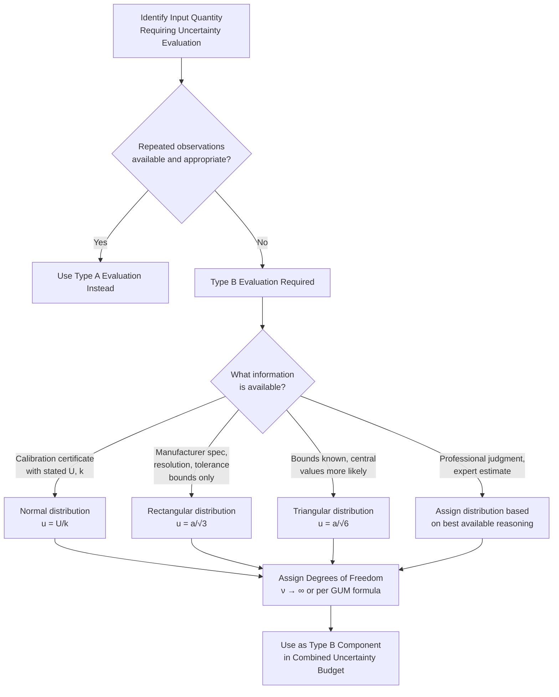

## Type B Uncertainty Evaluation

### Overview

**Type B evaluation** is the second of the two GUM-defined (JCGM 100:2008) methods for evaluating a standard uncertainty component, encompassing any method of evaluation *other than* statistical analysis of a series of observations. Rather than relying on repeated measurements, Type B evaluation draws on prior knowledge, documentary evidence, physical reasoning, or professional judgment to characterize the probability distribution of an input quantity, then derives a standard uncertainty from that assumed or known distribution.

### Formal Definition

Per the GUM, Type B evaluation is the method of evaluating a standard uncertainty by means other than the statistical analysis of a series of observations. Valid sources of information for a Type B evaluation include:

**Key Points**

- Previous measurement data from a well-characterized, similar measurement process (not the current series of observations itself).
- Experience with or general knowledge of the behavior and properties of relevant materials and instruments.
- Manufacturer's specifications, datasheets, and instrument accuracy classes.
- Data provided in calibration certificates and other documented reports.
- Uncertainties assigned to reference data taken from published handbooks or reference standards.
- Professional judgment, informed by relevant technical expertise, where no other quantitative information is available.

### The Core Procedure: Assigning a Distribution and Deriving Standard Uncertainty

Because Type B evaluation does not derive uncertainty from a computed sample standard deviation, the practitioner must instead **assume a probability distribution** consistent with the available information about the quantity's possible values, then compute the standard uncertainty as the standard deviation of that assumed distribution.

**Rectangular (uniform) distribution**

Used when only upper and lower bounds $\pm a$ are known, with no reason to believe any value within that range is more likely than another (e.g., instrument resolution, a manufacturer's stated tolerance with no further distributional information).

$$u(x)=\frac{a}{\sqrt{3}}$$

**Triangular distribution**

Used when values near the center of the range are considered more likely than values near the bounds (e.g., the combined effect of two independent rectangular-distributed sources, or when a manufacturer's specification suggests values cluster toward a nominal value).

$$u(x)=\frac{a}{\sqrt{6}}$$

**Normal (Gaussian) distribution — from a calibration certificate**

Used when a calibration certificate states an expanded uncertainty $U$ at a specified coverage factor $k$ (commonly $k=2$):

$$u(x)=\frac{U}{k}$$

**U-shaped distribution**

Used for certain sinusoidally-varying effects (e.g., some AC mismatch uncertainty contributions in electrical metrology) where extreme values are more probable than central values:

$$u(x)=\frac{a}{\sqrt{2}}$$

### Comparative Summary of Common Distributions

| Distribution | When to Use | Standard Uncertainty Formula |
| --- | --- | --- |
| Rectangular | Only bounds known, all values equally likely | $u=a/\sqrt{3}$ |
| Triangular | Bounds known, central values more likely | $u=a/\sqrt{6}$ |
| Normal (from cert.) | Expanded uncertainty $U$ at coverage factor $k$ stated | $u=U/k$ |
| U-shaped | Sinusoidal/extreme-favoring effect (e.g., some AC phenomena) | $u=a/\sqrt{2}$ |

**Example**

A digital micrometer has a display resolution of 0.001 mm. With no further information, the reading is assumed to be equally likely anywhere within $\pm0.0005$ mm of the displayed value (a rectangular distribution with half-width $a=0.0005$ mm):

$$u(x)=\frac{0.0005}{\sqrt{3}}\approx0.000289\ \mathrm{mm}$$

### Diagram: Type B Distribution Shapes (svg_diagram)

<svg xmlns="http://www.w3.org/2000/svg" viewBox="0 0 760 300">
<rect x="0" y="0" width="760" height="300" fill="#ffffff" />
<text x="380" y="24" font-size="16" font-weight="bold" text-anchor="middle" fill="#111111">Common Type B Probability Distributions (svg_diagram)</text>

<text x="120" y="55" font-size="12" font-weight="bold" text-anchor="middle" fill="`#111111`">Rectangular</text>

<line x1="40" y1="180" x2="200" y2="180" stroke="`#333333`" stroke-width="1" />

<polyline points="60,180 60,100 180,100 180,180" fill="none" stroke="`#4285f4`" stroke-width="2" />

<text x="120" y="200" font-size="9" text-anchor="middle" fill="`#666666`">u = a/√3</text>

<text x="60" y="215" font-size="9" text-anchor="middle" fill="`#666666`">-a</text>

<text x="180" y="215" font-size="9" text-anchor="middle" fill="`#666666`">+a</text>

<text x="380" y="55" font-size="12" font-weight="bold" text-anchor="middle" fill="`#111111`">Triangular</text>

<line x1="300" y1="180" x2="460" y2="180" stroke="`#333333`" stroke-width="1" />

<polyline points="310,180 380,100 450,180" fill="none" stroke="`#f9ab00`" stroke-width="2" />

<text x="380" y="200" font-size="9" text-anchor="middle" fill="`#666666`">u = a/√6</text>

<text x="310" y="215" font-size="9" text-anchor="middle" fill="`#666666`">-a</text>

<text x="450" y="215" font-size="9" text-anchor="middle" fill="`#666666`">+a</text>

<text x="640" y="55" font-size="12" font-weight="bold" text-anchor="middle" fill="`#111111`">Normal</text>

<line x1="560" y1="180" x2="720" y2="180" stroke="`#333333`" stroke-width="1" />

<path d="M 560,180 Q 600,175 620,120 Q 640,80 660,120 Q 680,175 720,180" fill="none" stroke="`#34a853`" stroke-width="2" />

<text x="640" y="200" font-size="9" text-anchor="middle" fill="`#666666`">u = U/k</text>

<text x="120" y="260" font-size="12" font-weight="bold" text-anchor="middle" fill="`#111111`">U-shaped</text>

<line x1="40" y1="285" x2="40" y2="285" stroke="none" />

<path d="M 60,270 Q 90,220 120,270 Q 150,220 180,270" fill="none" stroke="`#a142f4`" stroke-width="2" />

</svg>

### Estimating Degrees of Freedom for Type B Components

**Key Points**

- Unlike Type A evaluation, which yields a naturally finite $\nu=n-1$ from the number of repeated observations, Type B evaluations generally involve **no direct statistical sample**, so degrees of freedom must be assigned by judgment about the reliability of the underlying information.
- A common convention is to treat a Type B evaluation based on solid documentary evidence (e.g., an accredited calibration certificate with a well-established coverage factor) as having **effectively infinite degrees of freedom** ($\nu\to\infty$), reflecting high confidence in the stated uncertainty value.
- Where the Type B evaluation is based on less certain information (e.g., a rough estimate from experience, or a specification with unclear basis), the GUM provides a formula relating the assumed relative uncertainty of the uncertainty estimate itself to an effective degrees of freedom, reflecting reduced confidence.

### Diagram: Type B Evaluation Decision Process

### Type A vs. Type B: Combining Them Equally

**Key Points**

- Once expressed as a standard uncertainty $u(x_i)$, Type A and Type B components are **mathematically indistinguishable** in the law of propagation of uncertainty — both are combined via root-sum-of-squares (or the full covariance-inclusive formula) with their respective sensitivity coefficients.
- This equal treatment is a deliberate and important feature of the GUM framework: it prevents Type A (statistically-derived) uncertainty from being treated as inherently "more rigorous" than well-justified Type B uncertainty, and vice versa — both represent legitimate, quantified states of knowledge about the input quantity.

### Application to Precision Metrology & QC

- **Calibration uncertainty budgets**: The majority of individual components in a typical calibration laboratory's uncertainty budget are Type B — reference standard uncertainty (from its own calibration certificate), resolution, and environmental corrections are all commonly evaluated via Type B methods, with Type A contributing primarily the repeatability component.
- **Instrument specification interpretation**: Correctly converting a manufacturer's stated accuracy specification (often given as a simple $\pm$ tolerance) into a standard uncertainty requires explicit Type B distributional judgment — misapplying a rectangular-distribution divisor of $\sqrt{3}$ where a normal distribution (divisor $k$) is more appropriate (or vice versa) can meaningfully change the resulting uncertainty budget.
- **New or novel measurement setups**: Where no repeated-observation data yet exists (e.g., a newly commissioned measurement system), Type B evaluation, informed by manufacturer data and engineering judgment, is often the only available method for an initial uncertainty estimate pending future Type A characterization.
- **ISO/IEC 17025 documentation**: Assessors reviewing a laboratory's uncertainty budget expect clear justification for each Type B component's assumed distribution and divisor, tracing back to a specific, documented information source rather than an unsubstantiated assumption.

### Common Pitfalls

- Applying the rectangular-distribution divisor ($\sqrt{3}$) by default to every Type B source without considering whether a different distribution (triangular, normal) is actually more appropriate given the available information — this is a common source of both under- and over-estimated uncertainty budgets.
- Treating a calibration certificate's stated expanded uncertainty as already being a standard uncertainty — the stated coverage factor $k$ must be divided out ($u=U/k$) before the value can be used as an input in the law of propagation of uncertainty.
- Assigning infinite degrees of freedom to a Type B evaluation based on weak or uncertain information (e.g., a rough estimate with no documented basis) — this overstates the reliability of that component when it later contributes to the Welch-Satterthwaite effective degrees of freedom calculation.
- Neglecting to document the source and reasoning behind each Type B evaluation — unlike Type A (where the raw data itself provides an audit trail), Type B evaluations rely entirely on the practitioner's documented justification, which is essential for defensibility during an ISO/IEC 17025 assessment.

### Related Topics

- The Guide to the Expression of Uncertainty in Measurement (GUM)
- Type A Uncertainty Evaluation
- Sources of Measurement Error
- Calibration versus Verification versus Validation
- Welch-Satterthwaite Formula and Effective Degrees of Freedom
- ISO/IEC 17025: General Requirements for Testing and Calibration Laboratories