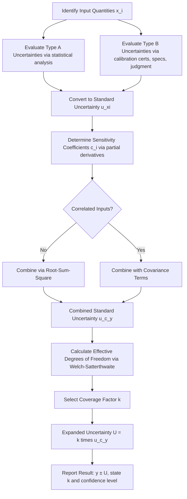

## Combined and Expanded Uncertainty

### Overview

Combined and expanded uncertainty are the two final steps in the GUM (Guide to the Expression of Uncertainty in Measurement) uncertainty evaluation framework. After individual uncertainty contributions are identified and quantified as standard uncertainties $u(x_i)$, they must be combined into a single value representing the total uncertainty of the measurement result, then scaled to provide a stated confidence level suitable for reporting on a calibration certificate or inspection report.

### Conceptual Foundation

**Key Points**

- Combined standard uncertainty $u_c(y)$ represents one standard deviation of the estimated output quantity $y$
- Expanded uncertainty $U$ scales $u_c(y)$ by a coverage factor $k$ to state a confidence interval
- The process assumes the measurement model $y = f(x_1, x_2, \ldots, x_N)$ is known, where $x_i$ are input quantities (e.g., temperature, instrument resolution, reference standard uncertainty)
- This is the terminal calculation stage following Type A and Type B evaluations of individual uncertainty components

### The Measurement Model

Every uncertainty budget begins with a functional relationship between the measurand $y$ and its input quantities:

$$y = f(x_1, x_2, \ldots, x_N)$$

For example, in gauge block calibration by comparison, the measurand (length deviation) might be modeled as:

$$y = L_x - L_s + \delta L_{thermal} + \delta L_{drift}$$

where $L_x$ is the unknown block, $L_s$ is the reference standard, and the remaining terms are correction terms for thermal expansion and drift.

### Combined Standard Uncertainty

#### Uncorrelated Input Quantities

When input quantities $x_i$ are independent (uncorrelated), the combined standard uncertainty is calculated using the **law of propagation of uncertainty** (root-sum-square method), derived from a first-order Taylor series expansion of $f$:

$$u_c(y) = \sqrt{\sum_{i=1}^{N} \left(\frac{\partial f}{\partial x_i}\right)^2 u^2(x_i)}$$

The partial derivative $\frac{\partial f}{\partial x_i}$ is called the **sensitivity coefficient** $c_i$, describing how much the output $y$ changes per unit change in $x_i$.

$$u_c(y) = \sqrt{\sum_{i=1}^{N} c_i^2 \, u^2(x_i)}$$

**Simplified case:** For a purely additive model $y = x_1 + x_2 + \cdots + x_N$ (all sensitivity coefficients equal 1), this reduces to:

$$u_c(y) = \sqrt{u^2(x_1) + u^2(x_2) + \cdots + u^2(x_N)}$$

This simple root-sum-square (RSS) form is common in dimensional metrology uncertainty budgets where corrections are additive (e.g., stylus tip radius correction, thermal expansion correction, reference standard uncertainty).

#### Correlated Input Quantities

When input quantities are not independent (e.g., two measurements sharing the same reference standard or environmental sensor), a covariance term must be added:

$$u_c(y) = \sqrt{\sum_{i=1}^{N} c_i^2 u^2(x_i) + 2\sum_{i=1}^{N-1}\sum_{j=i+1}^{N} c_i c_j \, u(x_i, x_j)}$$

where $u(x_i, x_j) = u(x_i)\,u(x_j)\,r(x_i, x_j)$, and $r(x_i,x_j)$ is the correlation coefficient between $-1$ and $1$.

**Example**

In a CMM (coordinate measuring machine) uncertainty budget, if the same thermal expansion coefficient is used to correct both a length measurement and a straightness measurement, those two uncertainty contributions are correlated and cannot simply be added in quadrature — ignoring this correlation typically underestimates the combined uncertainty.

### Worked Example: Micrometer Measurement

Consider measuring a shaft diameter with a digital micrometer. The uncertainty budget includes:

| Source | Type | Distribution | Standard Uncertainty $u(x_i)$ |
| --- | --- | --- | --- |
| Calibration certificate of micrometer | B | Normal ($k=2$) | $u = 0.5\ \mu m$ |
| Resolution of digital display | B | Rectangular | $u = 0.001/\sqrt{12} = 0.29\ \mu m$ |
| Repeatability (10 readings) | A | Normal (from $s/\sqrt{n}$) | $u = 0.35\ \mu m$ |
| Thermal expansion correction | B | Rectangular | $u = 0.20\ \mu m$ |

Assuming all sensitivity coefficients are 1 (additive model) and no correlation:

$$u_c(y) = \sqrt{0.5^2 + 0.29^2 + 0.35^2 + 0.20^2} = \sqrt{0.25 + 0.084 + 0.1225 + 0.04}$$

$$u_c(y) = \sqrt{0.4965} \approx 0.70\ \mu m$$

### Degrees of Freedom and the Welch-Satterthwaite Equation

Each uncertainty component has an associated **effective degrees of freedom** $\nu_i$, which reflects how reliably that component's value is known:

- Type A evaluations: $\nu_i = n - 1$ (from the number of repeated observations $n$)
- Type B evaluations: often assigned $\nu_i = \infty$ (treated as exactly known), or estimated via $\nu_i \approx \frac{1}{2}\left(\frac{\Delta u(x_i)}{u(x_i)}\right)^{-2}$ if the uncertainty of the uncertainty estimate itself is known

The **effective degrees of freedom** of the combined uncertainty is calculated using the Welch-Satterthwaite formula:

$$\nu_{eff} = \frac{u_c^4(y)}{\displaystyle\sum_{i=1}^{N} \frac{c_i^4 \, u^4(x_i)}{\nu_i}}$$

This value determines which coverage factor to use when a non-standard confidence level or small sample sizes require a Student's-t based expansion rather than the conventional $k=2$ normal approximation.

### Expanded Uncertainty

The combined standard uncertainty $u_c(y)$ represents approximately 68% confidence (1 standard deviation) under a normal distribution assumption — too low for most reporting purposes. The **expanded uncertainty** $U$ scales this to a higher, stated confidence level:

$$U = k \cdot u_c(y)$$

#### Choosing the Coverage Factor $k$

| Coverage Factor $k$ | Confidence Level (Normal Distribution) | Typical Use |
| --- | --- | --- |
| $k = 1$ | ~68.27% | Rarely reported alone |
| $k = 2$ | ~95.45% | **Standard default in most calibration labs** |
| $k = 2.576$ | ~99% | High-consequence measurements |
| $k = 3$ | ~99.73% | Aerospace/safety-critical tolerances |

[Inference] $k = 2$ is used as a practical approximation to 95% confidence assuming near-normal distribution and large effective degrees of freedom; ISO/IEC 17025 accredited laboratories commonly adopt this convention, though the exact coverage factor should be justified in the uncertainty budget per GUM guidance, especially when $\nu_{eff}$ is small.

When $\nu_{eff}$ is small (fewer than ~30), the Student's-t distribution should be used instead of the normal approximation:

$$k = t_{95}(\nu_{eff})$$

where $t_{95}(\nu_{eff})$ is looked up from a Student's-t table at the desired confidence level and effective degrees of freedom.

**Example (continued from micrometer budget)**

Using $k = 2$:

$$U = 2 \times 0.70\ \mu m = 1.40\ \mu m$$

**Reported result:** Diameter $= 12.005\ \text{mm} \pm 1.40\ \mu\text{m}$ ($k=2$, approximately 95% confidence)

### Reporting Requirements

A properly stated expanded uncertainty on a calibration certificate must include:

1. The numerical value of $U$
2. The coverage factor $k$ used
3. The approximate confidence level represented
4. (Optionally) the effective degrees of freedom $\nu_{eff}$ if $k \neq 2$

**Example** standard statement (per ISO/IEC 17025 and GUM conventions):

> "The reported expanded uncertainty is based on a standard uncertainty multiplied by a coverage factor $k = 2$, providing a level of confidence of approximately 95%."

### Uncertainty Budget Table Format

A complete uncertainty budget is typically presented as follows:

| Symbol | Source | Type | Distribution | $u(x_i)$ | $c_i$ | $c_i \cdot u(x_i)$ | $\nu_i$ |
| --- | --- | --- | --- | --- | --- | --- | --- |
| $x_1$ | Reference standard | B | Normal | ... | 1 | ... | $\infty$ |
| $x_2$ | Repeatability | A | Normal | ... | 1 | ... | $n-1$ |
| $x_3$ | Resolution | B | Rectangular | ... | 1 | ... | $\infty$ |
| $x_4$ | Environmental drift | B | Triangular | ... | 1 | ... | $\infty$ |
|  | **Combined** $u_c(y)$ |  |  |  |  | ... | $\nu_{eff}$ |
|  | **Expanded** $U = k u_c(y)$ |  |  |  |  | ... |  |

### Process Flow Diagram

### Visual: Coverage Factor and Confidence Level

<svg xmlns="http://www.w3.org/2000/svg" viewBox="0 0 640 320">
<text x="320" y="24" text-anchor="middle" font-size="16" font-weight="bold" fill="#1a1a1a">Normal Distribution — Coverage Factor vs. Confidence Level (svg_diagram)</text>
<line x1="60" y1="260" x2="580" y2="260" stroke="#333" stroke-width="1.5" />
<path d="M 60 260 Q 150 260 200 120 Q 260 40 320 30 Q 380 40 440 120 Q 490 260 580 260" fill="none" stroke="#2b6cb0" stroke-width="2.5" />
<line x1="230" y1="260" x2="230" y2="70" stroke="#e53e3e" stroke-width="1.5" stroke-dasharray="4,3" />
<line x1="410" y1="260" x2="410" y2="70" stroke="#e53e3e" stroke-width="1.5" stroke-dasharray="4,3" />
<text x="320" y="80" text-anchor="middle" font-size="12" fill="#e53e3e">k = 2 (~95.45%)</text>
<line x1="270" y1="260" x2="270" y2="140" stroke="#38a169" stroke-width="1.5" stroke-dasharray="4,3" />
<line x1="370" y1="260" x2="370" y2="140" stroke="#38a169" stroke-width="1.5" stroke-dasharray="4,3" />
<text x="320" y="155" text-anchor="middle" font-size="12" fill="#38a169">k = 1 (~68.27%)</text>
<text x="320" y="285" text-anchor="middle" font-size="12" fill="#333">Output Quantity y</text>
<text x="320" y="300" text-anchor="middle" font-size="11" fill="#666">y − U ← ─────── y ─────── → y + U</text>
</svg>

### Common Pitfalls

- **Double-counting correlated contributions**: Treating correlated inputs as independent inflates or deflates $u_c(y)$ inaccurately
- **Applying $k=2$ blindly**: With small $\nu_{eff}$ (few repeated measurements), the true 95% coverage factor from the Student's-t distribution can exceed 2 significantly (e.g., $k \approx 4.3$ for $\nu_{eff}=3$)
- **Omitting sensitivity coefficients**: For non-additive models (e.g., involving trigonometric functions in angular metrology, or products/ratios), forgetting $c_i \neq 1$ leads to incorrect scaling of component uncertainties
- **Mixing uncertainty types**: Combining an already-expanded uncertainty (from a calibration certificate, typically $k=2$) directly into an RSS sum without first dividing by its stated $k$ to recover $u(x_i)$

### Standards References

- **JCGM 100:2008** (GUM) — Guide to the Expression of Uncertainty in Measurement, the foundational document defining this framework
- **ISO/IEC 17025:2017** — General requirements for testing and calibration laboratories, mandates uncertainty evaluation and reporting
- **ISO 14253-1** — Application of GPS uncertainty concepts to conformance/non-conformance decision rules in dimensional metrology
- **NIST TN 1297** — Guidelines for evaluating and expressing uncertainty of NIST measurement results (practical implementation guide)

**Related Topics**

- Type A vs. Type B uncertainty evaluation methods
- Sensitivity coefficients and Taylor series linearization
- Student's-t distribution and small-sample coverage factors
- Uncertainty budgets for specific instruments (CMM, gauge blocks, surface roughness testers)
- Conformance decision rules and guard bands (ISO 14253-1)
- Correlation and covariance in multi-parameter measurement systems
- Monte Carlo method for uncertainty propagation (GUM Supplement 1, JCGM 101:2008)
- Traceability chains and calibration hierarchy