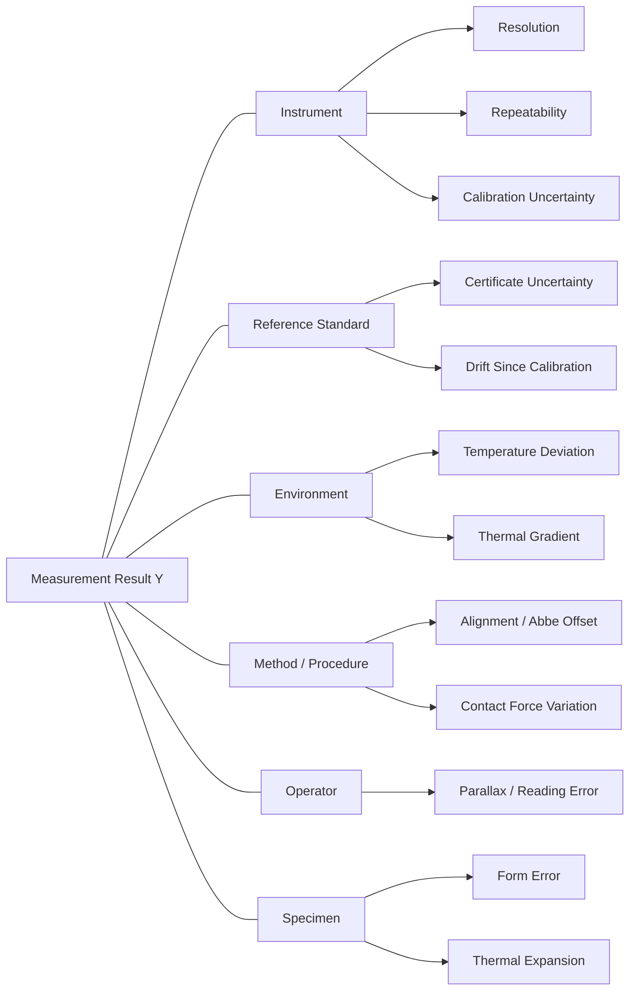

## Uncertainty Budgets

### Definition and Purpose

An uncertainty budget is a structured, itemized accounting of every recognized source of measurement uncertainty in a given measurement process, combined mathematically to yield a single reported uncertainty value associated with a measurement result. It is the practical implementation of the framework described in the *Guide to the Expression of Uncertainty in Measurement* (GUM), published by the JCGM (Joint Committee for Guides in Metrology).

The purpose of an uncertainty budget is threefold:

- To identify and quantify all significant contributors to measurement doubt (instrument, environment, method, operator, reference standards)
- To combine these contributors using statistically valid rules into a single combined standard uncertainty
- To express a final expanded uncertainty that defines an interval within which the true value is believed to lie, at a stated level of confidence

**Key Points**

- An uncertainty budget is not an error calculation — error is the (usually unknowable) difference between a measured value and the true value; uncertainty is a quantified doubt about that measured value.
- A budget is measurement-process-specific. A budget built for a caliper measuring a gauge block at 20°C does not transfer directly to the same caliper measuring a different geometry or at a different temperature.
- ISO/IEC 17025 accredited calibration and testing laboratories are required to estimate and report measurement uncertainty for calibration certificates, making uncertainty budgets a core deliverable of metrology work, not an academic exercise.

### Type A vs. Type B Uncertainty Evaluation

The GUM classifies uncertainty components by **method of evaluation**, not by whether they are "random" or "systematic" (an older, now-discouraged classification).

#### Type A Evaluation

Evaluated by statistical analysis of a series of repeated observations.

$$s(\bar{x}) = \frac{s}{\sqrt{n}}$$

Where $s$ is the experimental standard deviation of the observations and $n$ is the number of repeated measurements. This is the standard uncertainty of the mean, derived directly from data.

#### Type B Evaluation

Evaluated by means other than statistical analysis of repeated observations — manufacturer specifications, calibration certificates, published data, physical constants, experience, or professional judgment.

Type B evaluation requires an assumption about the underlying probability distribution of the quantity, since no repeated-observation data exists to reveal it empirically. Common assumed distributions:

| Distribution | When Used | Divisor to get Standard Uncertainty |
| --- | --- | --- |
| Rectangular (uniform) | Resolution limits, manufacturer tolerance with no further info | $\sqrt{3}$ |
| Triangular | Values more likely near center of an interval | $\sqrt{6}$ |
| Normal (Gaussian) | Calibration certificate reporting expanded uncertainty $U$ and coverage factor $k$ | $k$ (typically 2) |
| U-shaped | Sinusoidal or cyclic variation (e.g. mismatch uncertainty in RF metrology) | $\sqrt{2}$ |

**Example**

A digital caliper has a resolution of $0.01\ \text{mm}$. Assuming a rectangular distribution across the resolution interval, the half-width is $a = 0.005\ \text{mm}$, and the standard uncertainty contribution is:

$$u_{res} = \frac{a}{\sqrt{3}} = \frac{0.005}{\sqrt{3}} \approx 0.00289\ \text{mm}$$

### The Uncertainty Budget Process

#### Step 1: Define the Measurand and Model Equation

Explicitly state what is being measured and construct a mathematical model expressing the output quantity $Y$ as a function of all input quantities $X_i$:

$$Y = f(X_1, X_2, \ldots, X_N)$$

For a simple dimensional measurement (e.g., measuring a gauge block length with a micrometer against a reference standard), the model may include corrections for thermal expansion:

$$L_{20} = L_{ind} + \delta L_{cal} - L_{nom}\left[\alpha_s(t_s - 20) - \alpha_{ref}(t_{ref} - 20)\right]$$

Where $L_{ind}$ is the indicated length, $\delta L_{cal}$ is a correction from the instrument's calibration certificate, $\alpha_s$ and $\alpha_{ref}$ are the thermal expansion coefficients of the specimen and reference, and $t_s$, $t_{ref}$ are their respective temperatures.

#### Step 2: Identify All Input Quantities and Sources

Systematically enumerate every input that could affect the result. A common categorization uses a fishbone (Ishikawa) structure organized around these families:

- **Instrument**: resolution, repeatability, calibration uncertainty, drift, linearity, hysteresis
- **Reference standard**: certified uncertainty, stability since last calibration, traceability chain
- **Environment**: temperature, humidity, vibration, barometric pressure, thermal gradients
- **Method/Procedure**: fixturing, alignment, contact force (for contact instruments), Abbe offset
- **Operator**: reading parallax, technique variability, fatigue
- **Object/Specimen**: form error, surface roughness, material inhomogeneity, thermal mass

#### Step 3: Quantify Each Component as a Standard Uncertainty

Convert every identified source into a standard uncertainty $u(x_i)$ using either Type A (statistical) or Type B (distributional assumption) evaluation, expressed in consistent units (typically the same units as the measurand).

#### Step 4: Determine Sensitivity Coefficients

Each input's contribution to the combined uncertainty is scaled by a **sensitivity coefficient** $c_i$, representing how much the output $Y$ changes per unit change in input $X_i$:

$$c_i = \frac{\partial f}{\partial X_i}$$

For a simple additive or subtractive model, sensitivity coefficients are often $\pm 1$. For a model involving thermal expansion correction, the sensitivity coefficient with respect to temperature is $c = L_{nom} \cdot \alpha$.

The uncertainty contribution of each input to the output is then:

$$u_i(y) = c_i \cdot u(x_i)$$

#### Step 5: Combine Uncertainties (Combined Standard Uncertainty)

Assuming input quantities are uncorrelated, the **combined standard uncertainty** $u_c(y)$ is calculated via root-sum-square (RSS), following the law of propagation of uncertainty:

$$u_c(y) = \sqrt{\sum_{i=1}^{N} \left[c_i \cdot u(x_i)\right]^2}$$

If input quantities are correlated, a covariance term must be added:

$$u_c(y) = \sqrt{\sum_{i=1}^{N}\left[c_i \, u(x_i)\right]^2 + 2\sum_{i=1}^{N-1}\sum_{j=i+1}^{N} c_i c_j \, u(x_i,x_j)}$$

#### Step 6: Determine Effective Degrees of Freedom (if needed)

When a Type A component is based on a small number of observations, or when computing a defensible coverage factor for non-normal budgets, the **Welch-Satterthwaite equation** estimates effective degrees of freedom $\nu_{eff}$:

$$\nu_{eff} = \frac{u_c^4(y)}{\displaystyle\sum_{i=1}^{N} \frac{u_i^4(y)}{\nu_i}}$$

This is primarily relevant when a rigorous Student's t-based coverage factor is required rather than the conventional $k=2$ approximation.

#### Step 7: Calculate Expanded Uncertainty

The **expanded uncertainty** $U$ is obtained by multiplying the combined standard uncertainty by a **coverage factor** $k$:

$$U = k \cdot u_c(y)$$

$k = 2$ is conventionally used to approximate a 95% confidence level under an assumption of normality (strictly, $k=1.96$ for exactly 95% under a normal distribution; $k=2$ is a widely accepted rounding convention). $k = 3$ approximates a 99.7% confidence level.

The final result is reported as:

$$Y = y \pm U \quad (k=2)$$

### Worked Example: Uncertainty Budget for a Gauge Block Measurement

Consider a 25 mm gauge block measured with a calibrated digital micrometer.

| Source | Type | Distribution | Value | Divisor | $u(x_i)$ (µm) | $c_i$ | $u_i(y)$ (µm) |
| --- | --- | --- | --- | --- | --- | --- | --- |
| Micrometer resolution | B | Rectangular | 0.5 µm (half-width) | $\sqrt{3}$ | 0.289 | 1 | 0.289 |
| Repeatability (10 readings, $s=0.4$ µm) | A | Normal | $s/\sqrt{10}$ | — | 0.126 | 1 | 0.126 |
| Calibration certificate | B | Normal | $U=0.3$ µm, $k=2$ | 2 | 0.150 | 1 | 0.150 |
| Thermal expansion (specimen temp uncertainty ±0.5°C, $\alpha=11.5\times10^{-6}$/°C, $L=25$ mm) | B | Rectangular | 0.144 µm | $\sqrt{3}$ | 0.083 | 1 | 0.083 |
| Flatness/parallelism of contact faces | B | Rectangular | 0.2 µm | $\sqrt{3}$ | 0.115 | 1 | 0.115 |

Combined standard uncertainty:

$$u_c(y) = \sqrt{0.289^2 + 0.126^2 + 0.150^2 + 0.083^2 + 0.115^2} \approx 0.372\ \mu m$$

Expanded uncertainty at $k=2$:

$$U = 2 \times 0.372 \approx 0.74\ \mu m$$

**Output**

$$L = 25.0000\ \text{mm} \pm 0.00074\ \text{mm} \quad (k=2, \text{approx. 95\% confidence})$$

### Uncertainty Contribution Visualization

<svg xmlns="http://www.w3.org/2000/svg" viewBox="0 0 640 320">
<text x="320" y="24" text-anchor="middle" font-size="15" font-weight="bold" fill="#1a1a1a">Uncertainty Component Contributions (svg_diagram)</text>
<line x1="70" y1="270" x2="600" y2="270" stroke="#333" stroke-width="1.5" />
<line x1="70" y1="270" x2="70" y2="50" stroke="#333" stroke-width="1.5" />
<rect x="100" y="115" width="60" height="155" fill="#4c78a8" />
<text x="130" y="290" text-anchor="middle" font-size="11" fill="#1a1a1a">Resolution</text>
<text x="130" y="108" text-anchor="middle" font-size="11" fill="#1a1a1a">0.289</text>
<rect x="200" y="205" width="60" height="65" fill="#f58518" />
<text x="230" y="290" text-anchor="middle" font-size="11" fill="#1a1a1a">Repeat.</text>
<text x="230" y="198" text-anchor="middle" font-size="11" fill="#1a1a1a">0.126</text>
<rect x="300" y="180" width="60" height="90" fill="#54a24b" />
<text x="330" y="290" text-anchor="middle" font-size="11" fill="#1a1a1a">Cal. Cert</text>
<text x="330" y="173" text-anchor="middle" font-size="11" fill="#1a1a1a">0.150</text>
<rect x="400" y="228" width="60" height="42" fill="#e45756" />
<text x="430" y="290" text-anchor="middle" font-size="11" fill="#1a1a1a">Thermal</text>
<text x="430" y="221" text-anchor="middle" font-size="11" fill="#1a1a1a">0.083</text>
<rect x="500" y="195" width="60" height="75" fill="#b279a2" />
<text x="530" y="290" text-anchor="middle" font-size="11" fill="#1a1a1a">Flatness</text>
<text x="530" y="188" text-anchor="middle" font-size="11" fill="#1a1a1a">0.115</text>

<text x="30" y="60" font-size="10" fill="#333">µm</text>

</svg>

### Common Pitfalls

- **Double-counting correlated sources**: If the same reference standard or environmental sensor informs two different input quantities, treating them as independent in the RSS combination understates or overstates the true combined uncertainty.
- **Ignoring sensitivity coefficients**: Omitting $c_i$ (implicitly treating all $c_i = 1$) is only valid for simple additive models; for nonlinear models (e.g., involving trigonometric functions in angular or coordinate metrology) this introduces significant error.
- **Confusing resolution with accuracy**: Instrument resolution is only one component of the budget and is often not the dominant term; repeatability, calibration uncertainty, and environmental effects frequently dominate.
- **Using accuracy specifications as if they were standard uncertainties without applying the correct divisor**: A manufacturer's ± tolerance is typically a bound, not a standard deviation, and must be divided by $\sqrt{3}$ (or another appropriate divisor) before being combined via RSS.
- **Neglecting the measurement model**: Skipping explicit definition of $f(X_1,\ldots,X_N)$ makes it difficult to correctly derive sensitivity coefficients, especially for indirect measurements (e.g., volume calculated from multiple length measurements).

[Inference] In practice, many industrial calibration laboratories simplify Step 6 (Welch-Satterthwaite effective degrees of freedom) and default to $k=2$ without rigorous degrees-of-freedom justification, particularly when the dominant uncertainty components are Type B and the number of repeated observations is reasonably large (conventionally $n \geq 10$); this is a common but not universally rigorous industry practice.

### Measurement Uncertainty vs. Process Capability

An uncertainty budget also underpins **Gauge Repeatability and Reproducibility (Gauge R&R)** studies and process capability indices ($C_p$, $C_{pk}$) used in quality control, since the measurement system's own uncertainty consumes part of the total tolerance band available for the manufacturing process. A widely referenced guideline (AIAG MSA) is that the measurement uncertainty (or gauge R&R contribution) should not exceed roughly 10% of the tolerance band for the measurement system to be considered acceptable for process control purposes; this is a guideline convention rather than a physical law. [Unverified — specific numeric thresholds vary by industry standard and application-specific risk tolerance.]

### Standards and Reference Documents

- **JCGM 100:2008** — Evaluation of measurement data — Guide to the expression of uncertainty in measurement (GUM)
- **JCGM 101:2008** — Supplement 1 to the GUM — Propagation of distributions using a Monte Carlo method
- **ISO/IEC 17025:2017** — General requirements for the competence of testing and calibration laboratories
- **ISO/IEC Guide 98-3** — Equivalent international adoption of the GUM
- **EA-4/02** — European co-operation for Accreditation guidance on uncertainty in calibration
- **NIST Technical Note 1297** — Guidelines for Evaluating and Expressing the Uncertainty of NIST Measurement Results

**Related Topics**

- Type A vs. Type B evaluation methods (detailed statistical treatment)
- Law of propagation of uncertainty (GUM sensitivity coefficient derivation)
- Monte Carlo simulation for uncertainty propagation (GUM Supplement 1)
- Traceability chains and calibration hierarchies
- Gauge Repeatability and Reproducibility (Gauge R&R) studies
- Coverage factors and effective degrees of freedom (Welch-Satterthwaite equation)
- Measurement Systems Analysis (MSA) per AIAG
- Thermal expansion correction in dimensional metrology
- Combined vs. expanded uncertainty reporting conventions on calibration certificates