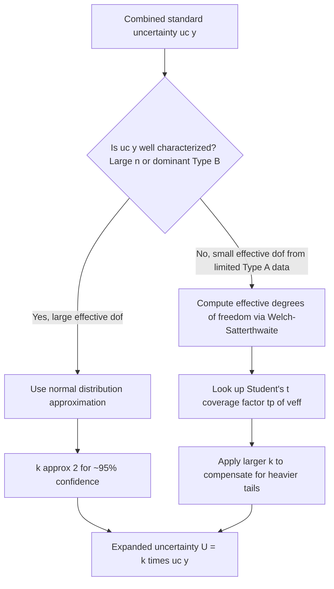

## Coverage Factors and Confidence Levels

### Definition and Role in the GUM Framework

A **coverage factor** ($k$) is the numerical multiplier applied to a combined standard uncertainty $u_c(y)$ to produce an **expanded uncertainty** $U$, which defines an interval around a measurement result within which the value of the measurand is believed to lie with a stated **level of confidence**.

$$U = k \cdot u_c(y)$$

The final reported result takes the form:

$$Y = y \pm U$$

This is always accompanied by a statement of the coverage factor and the corresponding confidence level, since $U$ alone is meaningless without knowing how "wide" a net was cast to construct it. The concept exists because a **standard uncertainty** ($u_c$, analogous to one standard deviation) captures relatively narrow statistical confidence (~68% under normality), which is generally considered too low for reporting purposes in calibration, testing, and quality-critical measurement work.

**Key Points**

- Coverage factor and confidence level are linked but distinct: $k$ is a multiplier; the confidence level is the probability that the true value lies within $y \pm U$.
- The relationship between $k$ and confidence level is only exact under a specific assumed probability distribution (commonly normal/Gaussian) for the output quantity $Y$.
- A reported uncertainty without an accompanying $k$ value and distributional assumption is considered incomplete under GUM/ISO 17025 conventions.

### The Normal Distribution Basis

For a combined standard uncertainty $u_c(y)$ where the output quantity $Y$ is assumed to follow a normal (Gaussian) distribution — justified via the Central Limit Theorem when many independent input quantities of comparable magnitude contribute — the relationship between coverage factor and confidence level follows the standard normal cumulative distribution function.

| Coverage Factor $k$ | Confidence Level (Normal Distribution) |
| --- | --- |
| 1.000 | 68.27% |
| 1.645 | 90.00% |
| 1.960 | 95.00% |
| 2.000 | 95.45% |
| 2.576 | 99.00% |
| 3.000 | 99.73% |

**Key Points**

- $k = 2$ is the most widely used convention in industrial and calibration practice, treated as an approximation to a 95% confidence level. Strictly, $k=1.96$ yields exactly 95.00% under normality, while $k=2$ yields 95.45%; the distinction is small and $k=2$ is broadly accepted by convention (per JCGM 100:2008, Annex G) as a practical round figure.
- $k = 3$ is used in contexts requiring a higher assurance margin, such as safety-critical or high-consequence measurements, corresponding to the "three-sigma" convention widely used in statistical process control.

### Choosing a Coverage Factor: The Role of Effective Degrees of Freedom

The direct use of $k=2$ for 95% confidence assumes the combined standard uncertainty is well-characterized — effectively, that it is based on a large number of underlying observations or well-known Type B distributions. When a Type A component derives from a small sample size, the normal distribution is not statistically justified, and the **Student's t-distribution** must be used instead, since the t-distribution has heavier tails that widen the coverage factor to compensate for the added uncertainty in a poorly-known standard deviation.

#### Welch-Satterthwaite Equation

To apply a t-distribution-based coverage factor to a combined uncertainty built from multiple components (each with its own degrees of freedom), the **effective degrees of freedom** $\nu_{eff}$ must first be computed:

$$\nu_{eff} = \frac{u_c^4(y)}{\displaystyle\sum_{i=1}^{N} \frac{u_i^4(y)}{\nu_i}}$$

Where $u_i(y)$ is the uncertainty contribution of input $i$, and $\nu_i$ is the degrees of freedom of that input's evaluation. For a Type A evaluation from $n$ repeated observations, $\nu_i = n - 1$. For Type B evaluations, degrees of freedom are typically assumed to approach infinity ($\nu_i \to \infty$) unless the uncertainty in the estimate of $u(x_i)$ itself is quantified (per GUM Annex G.4.2), in which case:

$$\nu_i \approx \frac{1}{2}\left[\frac{\Delta u(x_i)}{u(x_i)}\right]^{-2}$$

where $\Delta u(x_i)/u(x_i)$ is the relative uncertainty of the uncertainty estimate itself.

#### Student's t Coverage Factors

Once $\nu_{eff}$ is determined, the coverage factor for a desired confidence level $p$ is looked up from the Student's t-distribution table, denoted $t_p(\nu_{eff})$:

| $\nu_{eff}$ | $k$ for 95% confidence | $k$ for 99% confidence |
| --- | --- | --- |
| 1 | 12.71 | 63.66 |
| 2 | 4.30 | 9.92 |
| 5 | 2.57 | 4.03 |
| 10 | 2.23 | 3.17 |
| 20 | 2.09 | 2.85 |
| 30 | 2.04 | 2.75 |
| 50 | 2.01 | 2.68 |
| $\infty$ | 1.96 | 2.576 |

As $\nu_{eff} \to \infty$, the t-distribution converges to the normal distribution, and $k \to 1.96$ for 95% confidence — confirming why $k=2$ is a reasonable approximation when the budget is dominated by well-characterized components or large sample sizes.

**Example**

A measurement's combined uncertainty $u_c(y) = 0.50\ \mu m$ is computed from five input components. Using the Welch-Satterthwaite equation, the effective degrees of freedom is calculated as $\nu_{eff} = 8$. For a 95% confidence level, interpolating the t-distribution table gives approximately $k \approx 2.31$ (rather than the default 2.00), yielding:

$$U = 2.31 \times 0.50 = 1.155\ \mu m$$

Using the default $k=2$ in this case would understate the true 95%-confidence interval width, since the small effective degrees of freedom means the t-distribution's tails are heavier than the normal distribution's.

### Non-Normal Output Distributions

When the output quantity distribution is not well-approximated by a normal or t-distribution — for example, when a single dominant Type B component follows a rectangular or U-shaped distribution rather than being the sum of many comparable contributions — using conventional $k=2$ can significantly misstate the true confidence level.

Common scenarios requiring caution:

- **Single dominant rectangular component**: If one Type B rectangular-distribution source dominates the combined uncertainty, the output distribution itself remains closer to rectangular than normal, and a $k=2$ multiplier may cover well over 99% of the interval rather than 95%, or in other geometries could undercover — the relationship is distribution-specific and should not be assumed.
- **Highly asymmetric or skewed inputs**: Certain measurement models (e.g., involving squared terms, absolute values, or ratio quantities near a boundary) produce asymmetric output distributions where a symmetric $\pm U$ interval is not statistically appropriate.

#### GUM Supplement 1: Monte Carlo Method

For these cases, **JCGM 101:2008** (GUM Supplement 1) describes a **Monte Carlo Method (MCM)** as an alternative to the analytical law of propagation of uncertainty. Instead of computing a coverage factor from an assumed distribution shape, MCM:

1. Assigns a full probability density function (PDF) to each input quantity $X_i$ (not just a standard uncertainty)
2. Draws a large number of random samples (commonly $10^6$) from each input PDF
3. Propagates each full set of sampled inputs through the model function $Y = f(X_1, \ldots, X_N)$ to build an empirical distribution of $Y$
4. Directly determines a **coverage interval** from the resulting empirical distribution (e.g., the interval between the 2.5th and 97.5th percentiles for 95% coverage), without needing to assume normality or compute an explicit coverage factor at all

**Key Points**

- MCM produces a **coverage interval**, which may be asymmetric around $y$, rather than a symmetric $\pm U$ expanded uncertainty.
- MCM is particularly favored in complex measurement models (e.g., coordinate metrology, non-linear sensor calibration) where sensitivity coefficients are difficult to derive analytically or the output distribution is demonstrably non-normal.
- [Inference] In routine industrial dimensional metrology, the GUM analytical method with $k=2$ remains the dominant practice due to simplicity and calibration software support, with MCM reserved for cases where a laboratory's technical assessment or accreditation body specifically requires validation of non-normal behavior.

### One-Sided vs. Two-Sided Confidence Levels

Coverage factors as described above assume a **two-sided (symmetric) confidence interval** — the true value is equally likely to fall above or below $y$. Some applications require a **one-sided** confidence bound instead, particularly in conformity assessment against a single specification limit (e.g., "the diameter shall not exceed X").

For a one-sided bound at confidence level $p$ under a normal distribution, the coverage factor corresponds to a different point on the cumulative distribution:

| One-Sided Confidence | $k$ (Normal, One-Sided) | Equivalent Two-Sided $k$ |
| --- | --- | --- |
| 95% | 1.645 | 90% |
| 97.5% | 1.960 | 95% |
| 99.5% | 2.576 | 99% |

This distinction matters directly in **conformity assessment** (ISO 14253-1 and related decision-rule standards), where a measurement result combined with its expanded uncertainty is compared against a tolerance limit to determine pass/fail, and using a two-sided $k$ where a one-sided bound is intended will produce an overly conservative (or, if inverted, an overly lenient) acceptance decision.

### Reporting Conventions

A complete uncertainty statement per GUM/ISO 17025 practice includes:

$$Y = y \pm U, \quad \text{where } U = k \cdot u_c(y), \; k = \_\_, \text{ giving approximately } \_\_\% \text{ confidence}$$

Typical certificate language: *"The reported expanded uncertainty is based on a standard uncertainty multiplied by a coverage factor $k=2$, providing a level of confidence of approximately 95%."*

**Common Pitfalls**

- Reporting $U$ without stating $k$ or the confidence level, making the result impossible to interpret or compare against another lab's measurement.
- Assuming $k=2$ always corresponds to exactly 95% regardless of the underlying distribution shape or effective degrees of freedom.
- Applying a two-sided coverage factor in a one-sided conformity decision context.
- Treating the coverage factor as a property of the instrument rather than a property of the *reported result*, computed fresh for each specific uncertainty budget.

### Standards and Reference Documents

- **JCGM 100:2008 (GUM)**, Clause 6 and Annex G — Expanded uncertainty and coverage factors
- **JCGM 101:2008 (GUM Supplement 1)** — Propagation of distributions using a Monte Carlo Method
- **ISO 14253-1** — Decision rules for proving conformity or non-conformity with specifications
- **ISO/IEC 17025:2017** — Requirements for uncertainty reporting on calibration certificates
- **NIST Technical Note 1297**, Appendix B — Coverage factors for evaluating uncertainty

**Related Topics**

- Welch-Satterthwaite effective degrees of freedom (detailed derivation and worked examples)
- GUM Supplement 1 Monte Carlo Method implementation
- Conformity assessment and decision rules (ISO 14253-1, guard-banding)
- Type A vs. Type B uncertainty evaluation
- Asymmetric and non-normal uncertainty distributions
- Uncertainty budgets (full component-level construction)
- Student's t-distribution tables and interpolation methods
- Traceability and calibration certificate interpretation