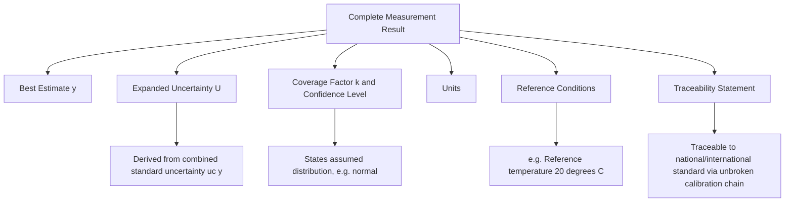
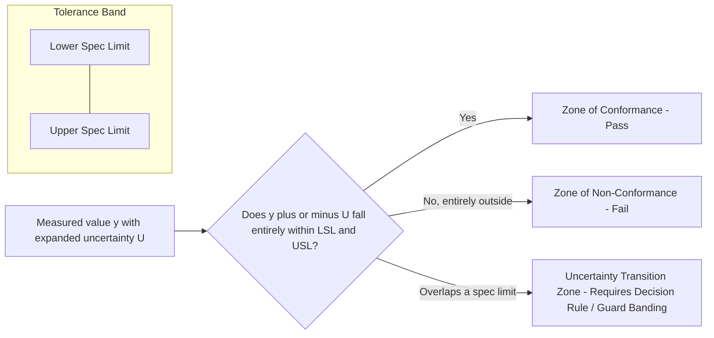

## Reporting Measurement Results with Uncertainty

### Purpose and Governing Principle

The final step of any measurement process is communicating the result in a form that is complete, unambiguous, and traceable. A numerical measurement value alone — without an associated uncertainty — is considered scientifically and metrologically incomplete, since it gives no indication of how much confidence can be placed in that value or how it should be compared against a specification, another laboratory's result, or a reference standard.

The governing principle, per the GUM (JCGM 100:2008, Clause 7), is that a complete measurement result consists of three inseparable elements:

1. The **best estimate** of the measurand (the reported value $y$)
2. The **associated uncertainty**, expressed as either a standard uncertainty $u_c(y)$ or an expanded uncertainty $U$
3. The **coverage factor $k$** and/or **confidence level**, along with the assumed distribution, if expanded uncertainty is used

**Key Points**

- A result reported as "$25.001\ \text{mm}$" is not metrologically meaningful on its own; "$25.001\ \text{mm} \pm 0.002\ \text{mm}\ (k=2)$" is.
- Uncertainty reporting is not optional documentation — it is a mandatory requirement for ISO/IEC 17025-accredited calibration certificates and test reports where a client requests it or a decision rule requires it.
- The way uncertainty is reported (standard vs. expanded, absolute vs. relative) must be explicit; ambiguity in this regard invalidates comparability between results.

### Standard Formats for Reporting

#### Format 1: Expanded Uncertainty (Most Common)

$$Y = y \pm U$$

Always accompanied by a statement of the coverage factor and confidence level. Per GUM convention:

> *"The reported expanded uncertainty is based on a standard uncertainty multiplied by a coverage factor $k = 2$, providing a level of confidence of approximately 95%."*

**Example**

$$L = 25.0000\ \text{mm} \pm 0.0007\ \text{mm} \quad (k=2)$$

#### Format 2: Standard Uncertainty with Compact Notation

The GUM also permits a compact notation where the standard uncertainty in the last digit(s) of the reported value is given in parentheses, without a $\pm$ sign. This format is common in physical constants tables and scientific literature.

**Example**

$$m = 100.02147(35)\ \text{g}$$

This means the standard uncertainty $u(m) = 0.00035\ \text{g}$, applied to the last two digits shown. This format is compact but requires the reader to understand the convention; it is far less common in industrial calibration certificates than the explicit $\pm U$ format.

#### Format 3: Relative (Percentage) Uncertainty

For quantities where uncertainty scales proportionally with the measured value (common in mass, volume, or electrical measurements across a wide range), uncertainty is reported as a percentage of the reported value rather than an absolute quantity.

$$U_{rel} = \frac{U}{y} \times 100\%$$

**Example**

$$m = 500.0\ \text{g} \pm 0.02\%\ (k=2)$$

### Significant Figures and Rounding Conventions

A critical, frequently mishandled aspect of reporting is **consistency between the number of significant figures in the value and its uncertainty**. The precision implied by the reported value must match the precision of the stated uncertainty.

#### Rules for Rounding the Uncertainty

- The uncertainty itself is conventionally rounded to **one or two significant figures**. NIST and BIPM guidance (NIST TN 1297, Section 7) recommends **one significant figure**, with a second retained only if the leading digit is 1 or 2 (since rounding to one figure in that case would cause a large relative change, e.g. rounding 1.96 to 2 vs. keeping 2.0).
- The measured value $y$ is then rounded to the **same decimal place** as the rounded uncertainty — not to an independently chosen number of decimal places.

**Example**

Raw calculation: $y = 25.00147\ \text{mm}$, $U = 0.00068\ \text{mm}$

1. Round $U$ to 2 significant figures (leading digit is 6, which rounds cleanly, but per the "leading digit 1 or 2" rule this doesn't apply here — one significant figure would suffice, but 2 sig figs is also common lab practice): $U \approx 0.0007\ \text{mm}$
2. Round $y$ to match the same decimal place as $U$: $y \approx 25.0015\ \text{mm}$

**Output**

$$L = 25.0015\ \text{mm} \pm 0.0007\ \text{mm} \quad (k=2)$$

**Common Pitfalls**

- Reporting a value with more decimal places than the uncertainty justifies (e.g., "$25.001473\ \text{mm} \pm 0.0007\ \text{mm}$") implies false precision in the value.
- Reporting a value with fewer decimal places than the uncertainty (e.g., "$25.00\ \text{mm} \pm 0.0007\ \text{mm}$") discards resolution the measurement actually achieved.
- Rounding the uncertainty down instead of up (uncertainty should generally be rounded such that the reported interval is not understated — conventional practice rounds the uncertainty value up, or "away from zero," rather than to the nearest value, particularly in metrology contexts where understating uncertainty carries risk).

### Full Anatomy of a Reported Result (Calibration Certificate Context)

A complete calibration certificate entry typically includes, in addition to the value and uncertainty:

- **Reference conditions**: the environmental conditions (e.g., 20°C, specific humidity range) under which the stated uncertainty applies — a value reported without this context cannot be validly used outside those conditions without additional correction.
- **Traceability statement**: identification of the reference standards and calibration chain used, linking the measurement to national or international standards (e.g., via a National Metrology Institute).
- **Method reference**: the measurement procedure or standard method used (e.g., a specific ISO or internal SOP document number).

### Conformity Statements and Decision Rules

When a reported measurement result is used to determine pass/fail against a specification limit, **ISO 14253-1** defines standardized zones and decision rules that explicitly incorporate the uncertainty into the conformity decision, rather than comparing the raw value alone against the tolerance.

#### Conformance Zones

- **Zone of conformance**: the reported value falls within the specification limits by a margin greater than $U$ — conformity can be stated with confidence.
- **Zone of non-conformance**: the reported value falls outside the specification limits by a margin greater than $U$ — non-conformity can be stated with confidence.
- **Uncertainty (transition) zone**: the specification limit falls within the interval $y \pm U$ — the measurement result alone cannot definitively establish conformance or non-conformance without an agreed decision rule (e.g., guard-banding).

**Key Points**

- **Guard-banding** is a common decision rule where the acceptance limit is deliberately tightened by an amount related to $U$ (e.g., accepting only results within $\text{USL} - U$) to shift risk away from accepting non-conforming items, at the cost of increased risk of rejecting conforming items.
- The choice of decision rule (simple acceptance, guard-banded acceptance, shared risk) must itself be documented and agreed upon, typically per ISO 14253-1 or a customer-specific quality agreement, since different rules produce different pass/fail outcomes for results falling in the transition zone.

### Reporting Multiple or Repeated Results

When a measurement is repeated (e.g., in a Gauge R&R study or a series of production inspections), reporting conventions distinguish between:

- **Standard deviation of the sample** ($s$) — describes the spread/dispersion of individual repeated observations.
- **Standard uncertainty of the mean** ($u = s/\sqrt{n}$) — describes the uncertainty of the *average* of those observations as an estimate of the measurand, and is what feeds into an uncertainty budget's Type A component.

Reporting a sample standard deviation where a standard uncertainty of the mean was intended (or vice versa) is a frequent and consequential reporting error, since the two can differ by a large factor when $n$ is large — a $u$ value derived from many repeats is substantially tighter than the raw spread of individual readings.

### Reporting Software and Traceable Records

[Inference] Most modern metrology software (CMM reporting packages, calibration management systems) automates significant-figure rounding and coverage-factor application according to configurable house rules, but the underlying model equation, sensitivity coefficients, and Type A/B component identification generally still require manual engineering judgment and periodic validation, since automated defaults may not correctly capture a lab's specific measurement process or non-standard distributions.

**Common Pitfalls**

- Presenting a bare tolerance-compliance statement ("PASS") without retaining the underlying measured value and uncertainty in the traceable record — auditability requires the full numeric result, not just a binary outcome.
- Failing to distinguish, in a report, between measurement uncertainty and manufacturing/process tolerance — these are related but conceptually distinct: uncertainty describes doubt in the *measurement*, tolerance describes the *acceptable range of the manufactured feature*.
- Omitting reference conditions when reporting a dimensional value affected by thermal expansion, making the reported uncertainty invalid outside the stated temperature range.

### Standards and Reference Documents

- **JCGM 100:2008 (GUM)**, Clause 7 — Reporting uncertainty
- **NIST Technical Note 1297**, Section 7 — Reporting uncertainty, rounding rules, and significant figures
- **ISO/IEC 17025:2017**, Clause 7.8 — Reporting of results
- **ISO 14253-1:2017** — Decision rules for proving conformity or non-conformity with specifications
- **ISO 80000-1** — Quantities and units, general principles (notation conventions)

**Related Topics**

- Uncertainty budgets (component-level construction feeding into the reported result)
- Coverage factors and confidence levels
- Conformity assessment and guard-banding (ISO 14253-1)
- Traceability and calibration hierarchies
- Type A vs. Type B uncertainty evaluation
- Significant figures and rounding conventions in metrology
- Gauge Repeatability and Reproducibility (Gauge R&R) reporting
- Calibration certificate structure and interpretation