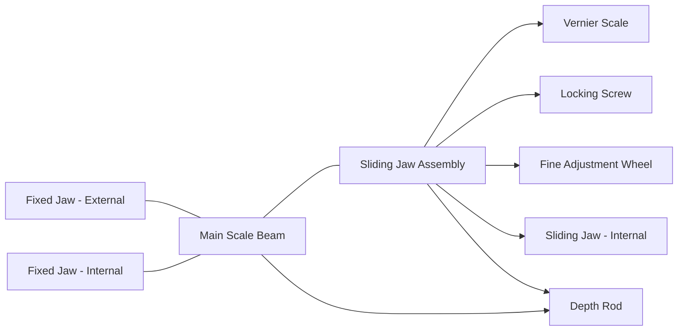
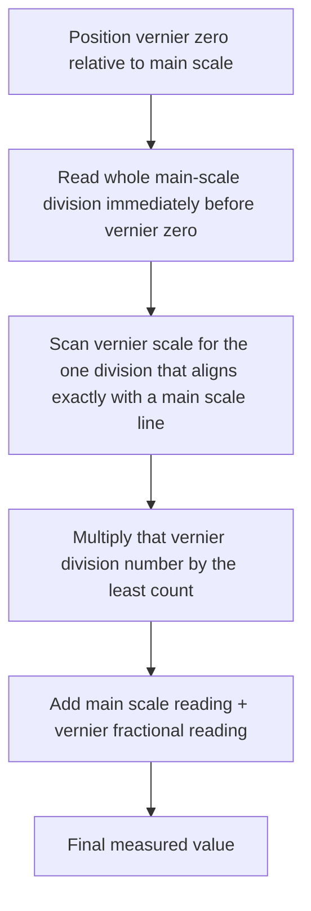

## Vernier Calipers and Vernier Scales

### Overview and Historical Context

The vernier caliper is a hand-held dimensional measuring instrument used to measure linear dimensions — external length/diameter, internal diameter, and depth — with substantially higher resolution than a plain graduated scale allows unaided. It derives its name from Pierre Vernier, who described the auxiliary sliding scale mechanism in 1631, though the modern combination of a fixed main scale with jaws for external, internal, and depth measurement is a later engineering development commonly attributed to Joseph R. Brown in the 19th century.

The vernier scale principle is significant beyond calipers themselves: the same mechanism underlies vernier height gauges, vernier depth gauges, vernier protractors (bevel protractors), and historically, sextants and theodolites — making it a foundational concept in precision metrology rather than a caliper-specific curiosity.

**Key Points**

- The vernier scale allows a mechanical instrument to resolve fractions of the smallest division on its main scale without requiring finer, harder-to-read main-scale graduations.
- Vernier calipers have been substantially supplanted in many workshop contexts by dial calipers and digital (electronic) calipers, but remain in use where ruggedness, absence of a power source, or resistance to coolant/contamination is valued, and remain foundational for teaching measurement principles.

### Physical Construction

A standard vernier caliper consists of:

- **Main scale (fixed beam)**: a graduated steel beam, typically in millimeters (metric) or inches (imperial/fractional or decimal), fixed to the stationary jaw.
- **Vernier scale (sliding jaw)**: a shorter secondary scale mounted on the sliding jaw, graduated such that its divisions are a fixed fraction shorter than the main scale's divisions.
- **External jaws**: the larger, typically outward-facing jaws used to measure the external dimensions of an object (e.g., outer diameter, length, thickness).
- **Internal jaws**: smaller, typically knife-edged or rounded jaws (often on the opposite end from the external jaws) used to measure internal dimensions (e.g., bore diameter, slot width).
- **Depth rod (depth bar)**: a thin rod extending from the end of the beam, used to measure the depth of holes, slots, or steps.
- **Locking screw**: a thumbscrew that fixes the sliding jaw in place once a measurement is taken, preventing movement before the reading is recorded.
- **Fine adjustment wheel** (on many designs): a small knurled wheel allowing precise, controlled final positioning of the jaws against the workpiece.

### The Vernier Scale Principle

The core principle exploits the difference in spacing between the main scale's divisions and the vernier scale's divisions to allow interpolation between main-scale graduations.

For a common **metric vernier caliper with 0.02 mm resolution**:

- The main scale is graduated in $1\ \text{mm}$ divisions.
- The vernier scale has 50 divisions spanning a total length of $49\ \text{mm}$ (i.e., each vernier division is $49/50 = 0.98\ \text{mm}$).
- The difference between one main-scale division and one vernier-scale division is $1 - 0.98 = 0.02\ \text{mm}$ — this difference defines the instrument's **least count** (resolution).

**General formula for least count**:

$$\text{Least Count} = \frac{\text{Value of one main scale division}}{\text{Number of divisions on the vernier scale}}$$

For the example above: $\text{LC} = \dfrac{1\ \text{mm}}{50} = 0.02\ \text{mm}$.

A common alternative construction uses a vernier scale with 20 divisions spanning $39\ \text{mm}$ (each vernier division $= 1.95\ \text{mm}$, main scale division $= 2\ \text{mm}$ in some dual-reading designs), or the classic imperial 25-division vernier yielding a $0.001\ \text{in}$ least count on a scale with $0.025\ \text{in}$ main divisions.

### Reading a Vernier Scale

The reading procedure involves two components combined additively:

1. **Main scale reading**: Identify the main-scale graduation immediately to the left of (before) the "0" mark on the vernier scale. This gives the whole-number portion of the measurement.
2. **Vernier scale reading (coincidence method)**: Scan along the vernier scale to find the single vernier graduation that most precisely aligns (is "in coincidence") with any graduation on the main scale. The vernier division number at that point of coincidence, multiplied by the least count, gives the fractional portion.

$$\text{Measured Value} = \text{Main Scale Reading} + \left(\text{Vernier Coincidence Division} \times \text{Least Count}\right)$$

**Example**

Main scale reading (last full mm mark before vernier zero): $12\ \text{mm}$

Vernier coincidence occurs at the 24th division: $24 \times 0.02\ \text{mm} = 0.48\ \text{mm}$

$$\text{Measured Value} = 12 + 0.48 = 12.48\ \text{mm}$$

### Types of Vernier Calipers

| Type | Distinguishing Feature |
| --- | --- |
| Standard vernier caliper | Manual coincidence reading as described above; typical range 0–150/200/300 mm |
| Dial caliper | Replaces the vernier scale with a rack-and-pinion driven analog dial indicator for direct fractional reading, eliminating the coincidence-finding step |
| Digital (electronic) caliper | Replaces the vernier scale with a capacitive or optical linear encoder and LCD digital readout |
| Vernier height gauge | Vernier mechanism mounted vertically on a graduated column with a base, used for marking out and height measurement from a reference surface |
| Vernier depth gauge | Vernier mechanism configured specifically for depth measurement, typically with a flat base spanning the opening being measured |
| Universal (bevel) vernier protractor | Vernier principle applied to angular measurement instead of linear measurement |

**Key Points**

- The underlying vernier *scale* principle is identical across all these variants; only the transducer/display mechanism and physical form factor for applying the measurement differ in dial and digital versions (dial and digital calipers do not use a true vernier scale for reading, but are commonly grouped in the same instrument family for pedagogical and historical reasons).
- Digital calipers typically offer resolution down to $0.01\ \text{mm}$ ($0.0005\ \text{in}$) and support unit switching (mm/inch) and zero-setting at any position, capabilities not available on a purely mechanical vernier instrument.

### Sources of Error and Measurement Uncertainty

Applying the uncertainty budget framework (see: Uncertainty budgets), vernier caliper measurements are subject to several characteristic error sources:

- **Parallax error**: Since the vernier scale and main scale lie in slightly different planes (or the observer's eye is not perpendicular to the coincidence point), an incorrect viewing angle causes a misread coincidence point. This is one of the largest practical contributors to reading error and is entirely operator-dependent.
- **Zero error**: If the jaws do not read exactly zero when fully closed (positive zero error: vernier zero is to the right of main scale zero when closed; negative zero error: to the left), a systematic correction must be subtracted from (or added to) every reading.

$$\text{Corrected Reading} = \text{Observed Reading} - \text{Zero Error (with sign)}$$

- **Excessive jaw force**: Overtightening the jaws against the workpiece, particularly on softer materials, causes elastic deformation of both the jaws and the workpiece, introducing a measurement bias. This is why vernier calipers are generally unsuitable for high-precision measurement of soft or compliant materials without a controlled, minimal contact force.
- **Coincidence-finding ambiguity**: At the resolution limit, more than one vernier division may appear "approximately" aligned, and different observers may select different coincidence points — a Type A repeatability source when characterized statistically across repeated readings or operators.
- **Jaw wear and beam straightness**: Wear on the jaw faces (from repeated use, especially on rough or abrasive workpieces) and long-term beam bending or warping introduce systematic errors that calibration and periodic inspection are intended to detect.
- **Abbe offset error**: Because the vernier caliper's scale (the main beam) is not exactly coincident with the measurement line of action at the jaw tips, a geometric misalignment (angular deviation of the jaws, or lateral offset) is amplified into a linear error proportional to the offset distance and the tangent of the angular deviation — this is a specific instance of the general Abbe principle violation common to caliper-type (as opposed to micrometer-type) instruments.
- **Thermal expansion**: Both the instrument and the workpiece are subject to thermal expansion; measurements taken away from the standard reference temperature of $20°\text{C}$ require a correction term if high accuracy is required, particularly for larger nominal dimensions.

**Example**

A vernier caliper with a resolution of $0.02\ \text{mm}$ has an assumed rectangular resolution uncertainty contribution (as derived in the Uncertainty budgets reference):

$$u_{res} = \frac{0.01}{\sqrt{3}} \approx 0.00577\ \text{mm}$$

Combined with a manufacturer-stated maximum permissible error (MPE) of $\pm 0.03\ \text{mm}$ (treated as a rectangular Type B bound):

$$u_{MPE} = \frac{0.03}{\sqrt{3}} \approx 0.01732\ \text{mm}$$

If these are the only two significant sources considered for a simplified budget:

$$u_c = \sqrt{u_{res}^2 + u_{MPE}^2} \approx \sqrt{0.00577^2 + 0.01732^2} \approx 0.01826\ \text{mm}$$

$$U = 2 \times 0.01826 \approx 0.037\ \text{mm} \quad (k=2)$$

[Inference] A full production-grade uncertainty budget for a vernier caliper measurement would typically also include repeatability (Type A, from repeated readings), operator/parallax variation, and jaw contact force effects, which are process- and operator-dependent and not captured by manufacturer specifications alone; the simplified example above should not be treated as a complete or universally applicable budget.

### Proper Use and Technique

- Verify zero error before use and record/apply the correction consistently throughout a measurement session.
- Apply consistent, minimal contact force — many quality vernier and dial calipers include a fine-adjustment wheel specifically to enable light, repeatable jaw closure without over-torquing.
- View the coincidence point perpendicular to the scale face to minimize parallax error; some precision vernier instruments include a magnifying glass integrated over the vernier scale to assist this.
- For internal measurements, ensure the internal jaws are aligned with the true diameter (not a chord) by gently rocking the instrument to find the maximum (for bores) or minimum (for external features measured via internal-jaw workarounds) reading.
- For depth measurements, ensure the base of the instrument sits flush and square against the reference surface before extending the depth rod.
- Periodically calibrate against gauge blocks or a certified reference standard, checking multiple points across the instrument's range (not just at zero), since wear and damage are not uniformly distributed along the beam.

### Standards and Reference Documents

- **ISO 13385-1:2019** — Geometrical product specifications (GPS) — Dimensional measuring equipment — Part 1: Vernier callipers; design and metrological requirements
- **ASME B89.1.14** — Calipers (dial, digital, and vernier) — American national standard covering design, performance, and calibration requirements
- **JIS B 7507** — Japanese Industrial Standard for vernier, dial, and digital calipers

**Related Topics**

- Micrometer screw gauges and the Abbe principle
- Dial and digital caliper transducer mechanisms (rack-and-pinion, capacitive encoders)
- Vernier height gauges and depth gauges
- Uncertainty budgets (component-level construction for caliper measurements)
- Gauge blocks and calibration reference standards
- Zero error correction and instrument calibration procedures
- Abbe's principle and offset error in length metrology
- Bevel protractors and angular vernier scales