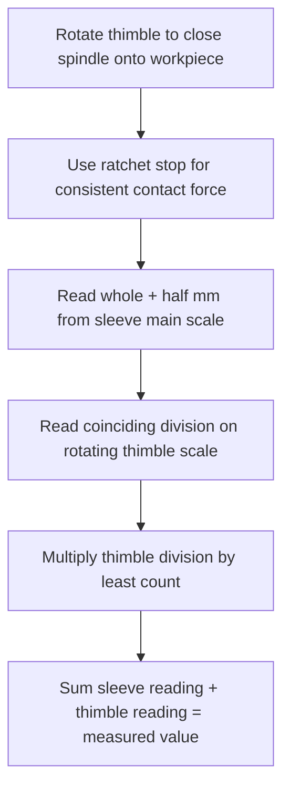

## Outside, Inside, and Depth Micrometers

### Overview

Micrometers are precision hand-held instruments that use a calibrated screw thread mechanism to measure linear dimensions with higher resolution and generally lower measurement uncertainty than vernier calipers, owing to their adherence (in the outside micrometer's case) to the Abbe principle and their finer mechanical amplification of small displacements. The three principal families — **outside (external)**, **inside (internal)**, and **depth micrometers** — share a common screw-thread reading mechanism but differ substantially in frame geometry and application.

**Key Points**

- All three types rely on the same fundamental principle: converting rotational displacement of a precisely-pitched screw into linear displacement, read via a graduated thimble and sleeve.
- Only the outside micrometer, in its typical C-frame form, closely satisfies the **Abbe principle** (the measurement axis is collinear with the scale axis); inside and depth micrometers frequently violate it to varying degrees depending on design, which affects their achievable accuracy.

### The Micrometer Screw Principle

The core mechanism consists of a precisely machined screw (the **spindle**) with a known, constant **thread pitch**, rotating within a fixed nut. One full rotation of the spindle advances it axially by exactly one pitch length.

$$\text{Axial Displacement} = (\text{Number of Full Rotations}) \times (\text{Thread Pitch}) + (\text{Partial Rotation Reading})$$

For a standard metric micrometer with a thread pitch of $0.5\ \text{mm}$:

- The **sleeve (barrel)** is graduated in $0.5\ \text{mm}$ divisions along its axial line, with additional marks (often offset) subdividing each $1\ \text{mm}$ into upper and lower rows for $0.5\ \text{mm}$ resolution.
- The **thimble**, rotating around the sleeve, is graduated circumferentially into 50 divisions. Since one full thimble rotation = $0.5\ \text{mm}$ of spindle travel, each thimble division represents:

$$\text{Least Count} = \frac{\text{Pitch}}{\text{Number of Thimble Divisions}} = \frac{0.5\ \text{mm}}{50} = 0.01\ \text{mm}$$

Many precision micrometers add a **vernier scale on the sleeve** itself (typically 5 or 10 additional divisions), extending resolution further — e.g., to $0.001\ \text{mm}$ — using the same coincidence-reading principle described for vernier calipers.

For imperial micrometers, a common thread pitch of $0.025\ \text{in}$ (40 threads per inch) combined with a 25-division thimble yields:

$$\text{Least Count} = \frac{0.025\ \text{in}}{25} = 0.001\ \text{in}$$

**Example**

Sleeve reading (last visible major + minor division line): $5.5\ \text{mm}$

Thimble reading (line coinciding with the sleeve's reference line): division 27 → $27 \times 0.01\ \text{mm} = 0.27\ \text{mm}$

$$\text{Measured Value} = 5.5 + 0.27 = 5.77\ \text{mm}$$

### Outside (External) Micrometers

The outside micrometer is the most common form, used to measure external dimensions: thickness, outer diameter, width across flats.

#### Construction

- **Frame**: a rigid, typically C-shaped (or "G-shaped") casting, often with insulated (low thermal-conductivity) grips to reduce heat transfer from the operator's hand during measurement.
- **Anvil**: the fixed measuring face.
- **Spindle**: the moving measuring face, driven by the screw thread mechanism.
- **Sleeve and thimble**: as described above.
- **Ratchet stop or friction thimble**: a mechanism that limits the applied torque (and thus contact force) when closing the spindle onto the workpiece, improving measurement repeatability by standardizing contact force across operators and readings.
- **Lock nut/lever**: fixes the spindle position once a reading is obtained.

Outside micrometers are manufactured in fixed measuring ranges (commonly $0$–$25\ \text{mm}$, $25$–$50\ \text{mm}$, etc., or $0$–$1\ \text{in}$, $1$–$2\ \text{in}$), since the frame size and spindle travel are matched to a specific range rather than offering continuous adjustability across a wide span — this is a key structural difference from calipers.

**Key Points**

- Because the anvil and spindle faces lie directly on the same axis as the sleeve/thimble scale, the outside micrometer frame most closely satisfies the **Abbe principle**, minimizing cosine-error amplification from angular misalignment — a primary reason micrometers generally achieve better accuracy than calipers of comparable cost.
- Frame size directly affects rigidity; larger-range micrometers (e.g., $500$–$600\ \text{mm}$) require substantially more massive frames to avoid flexure under measuring force, and are correspondingly heavier and more expensive.

### Inside Micrometers

Inside micrometers measure internal dimensions: bore diameters, groove widths, slot widths. Two principal architectural variants exist:

#### Caliper-type (Transfer) Inside Micrometers

Resemble a small outside micrometer but with the measuring faces reversed/curved outward to contact the internal walls of a bore. Limited to relatively small measurement ranges (typically up to approximately $150$–$200\ \text{mm}$ depending on design).

#### Extension Rod (Stick) Inside Micrometers

Consist of a micrometer head unit combined with interchangeable extension rods of fixed lengths, allowing a single head to cover a very wide range of bore diameters by adding rods (e.g., a base head plus rods to measure from $50\ \text{mm}$ up to $1500\ \text{mm}$ or more, depending on the manufacturer's system).

**Key Points**

- Inside micrometers of the extension-rod type inherently violate the Abbe principle to a greater degree than outside micrometers, since the measurement is taken between two points spanned by the assembled rod, not necessarily perfectly coaxial with the micrometer head's own screw axis — this makes correct centering technique (finding the true diameter, not a chord) especially critical.
- **Technique for correct diameter finding**: the instrument must be gently rocked/pivoted in two perpendicular planes within the bore while slowly adjusting the spindle, searching for the point of maximum reading (which corresponds to the true diameter, since any chord across a circular bore is shorter than the diameter). This "rocking" technique is a significant source of operator-dependent variability and a key contributor to repeatability uncertainty for this instrument type.
- Extension rods must be handled carefully and their fit/coupling faces kept clean, since burrs, dirt, or wear at the rod-to-head interface directly introduce length errors additive to the true bore dimension.

### Depth Micrometers

Depth micrometers measure the depth of holes, slots, steps, and counterbores relative to a reference (base) surface.

#### Construction

- **Base**: a flat, rigid reference surface (often wider than a caliper's depth-rod base) that sits flush against the top surface from which depth is being measured.
- **Spindle/measuring rod**: extends downward through (or from) the base as the thimble is rotated, contacting the bottom of the feature being measured.
- **Interchangeable extension rods**: similar in principle to inside micrometers, allowing a single instrument to cover a range of depths by swapping rods of different fixed lengths.

**Key Points**

- Depth micrometer scale numbering runs in the *opposite sense* to outside micrometers: because increasing spindle extension corresponds to increasing measured depth, but the thimble is turning in the direction that would decrease an outside micrometer's reading, the sleeve and thimble graduations on a depth micrometer are reversed relative to an outside micrometer, which is a frequent source of reading confusion for operators trained primarily on outside micrometers.
- Correct use requires the base to be held perfectly flat and square against the reference surface, with no rocking, since even small angular misalignment of the base directly introduces a cosine-error-like bias into the depth reading.
- Depth micrometers, like inside micrometer extension-rod systems, are subject to length-standard additive errors at rod-to-head coupling interfaces.

### Comparative Summary

| Feature | Outside Micrometer | Inside Micrometer | Depth Micrometer |
| --- | --- | --- | --- |
| Primary application | External dimensions | Internal (bore) dimensions | Depth from reference surface |
| Typical frame | Rigid C-frame | Caliper-type or extension-rod head | Flat base + spindle/rod |
| Abbe principle compliance | Generally good | Often violated (extension-rod types) | Generally violated |
| Key technique challenge | Consistent contact force (ratchet use) | Finding true diameter via rocking | Maintaining base squareness |
| Scale direction convention | Standard (increasing = increasing dimension) | Standard | Reversed relative to outside micrometer |

### Sources of Error and Measurement Uncertainty

Applying the uncertainty budget framework (see: Uncertainty budgets), micrometer measurements are affected by:

- **Zero error**: analogous to caliper zero error — the reading at full closure (outside micrometer) or at a known reference length (inside/depth types, verified with setting standards or gauge blocks) must be checked and any offset corrected.
- **Contact/measuring force variation**: even with a ratchet stop, force is not perfectly invariant across operators and instruments; excessive force elastically deforms both the instrument frame and the workpiece, particularly significant for thin-walled or compliant parts.
- **Screw thread wear and periodic error**: wear in the spindle screw thread over the instrument's service life can introduce a **periodic error** that cycles with each full thimble rotation, rather than a simple linear offset — this is why calibration should check multiple points across a full rotation cycle, not just single-point zero checks.
- **Parallax error**: reading the thimble/sleeve coincidence line at an angle, less pronounced than with vernier calipers on typical mechanical (non-digital) micrometers due to the graduation design, but still present.
- **Frame flexure**: particularly relevant for large-range outside micrometers, where the C-frame can flex elastically under measuring force, and for extension-rod inside/depth micrometers, where rod coupling introduces additional compliance.
- **Thermal expansion and hand-transferred heat**: prolonged hand contact with an uninsulated frame can measurably raise the instrument's temperature relative to the workpiece and the $20°\text{C}$ reference condition, particularly significant for high-precision work; insulated grip pads mitigate but do not eliminate this effect.
- **Abbe offset error** (inside/depth types especially): as described above, non-coaxial measurement geometry amplifies angular misalignment into linear error.

**Example**

An outside micrometer with $0.001\ \text{mm}$ resolution (including vernier sleeve subdivision) has a manufacturer-stated maximum permissible error (MPE) of $\pm 0.002\ \text{mm}$ across its 25 mm range. Treating this as a rectangular Type B distribution:

$$u_{MPE} = \frac{0.002}{\sqrt{3}} \approx 0.001155\ \text{mm}$$

Combined with a resolution-based contribution:

$$u_{res} = \frac{0.0005}{\sqrt{3}} \approx 0.000289\ \text{mm}$$

Simplified combined standard uncertainty (these two components only):

$$u_c = \sqrt{0.001155^2 + 0.000289^2} \approx 0.00119\ \text{mm}$$

$$U = 2 \times 0.00119 \approx 0.0024\ \text{mm} \quad (k=2)$$

[Inference] As with the vernier caliper example, a complete production uncertainty budget would additionally incorporate Type A repeatability from repeated readings, measuring force variability, thermal effects, and — for inside/depth types — the specific Abbe offset and rod-coupling contributions; the simplified calculation above illustrates method only and should not be treated as representative of a specific real-world calibration result.

### Proper Use and Technique

- Always use the ratchet stop (or friction thimble) for final closure rather than the main thimble directly, to standardize measuring force across readings and operators.
- Verify zero setting before use: outside micrometers at full closure (or against a setting standard for larger ranges), inside and depth micrometers against a certified setting ring, gauge block stack, or reference length appropriate to the configured rod/range.
- Support the workpiece and micrometer frame to avoid inducing flexure or misalignment during measurement, particularly for larger frame sizes.
- For inside micrometers, apply the rocking technique in two perpendicular planes to confirm the true diameter is captured, not a chord.
- For depth micrometers, ensure full, flat contact of the base against the reference surface before taking a reading.
- Store micrometers in their cases with spindle faces not in continued firm contact (to avoid long-term deformation or thermal/humidity-related sticking), and periodically calibrate against gauge blocks or certified setting standards across multiple points in the range.

### Standards and Reference Documents

- **ISO 3611:2010** — Geometrical product specifications (GPS) — Dimensional measuring equipment — Outside micrometers; design and metrological requirements
- **ISO 3611-2** and related parts — Inside and depth micrometer design/metrological requirements (series varies by specific instrument type)
- **ASME B89.1.13** — Micrometers (American national standard for design, performance, and calibration)
- **JIS B 7502 / B 7503 / B 7504** — Japanese Industrial Standards for outside, inside, and depth micrometers respectively

**Related Topics**

- Vernier calipers and vernier scales
- Abbe's principle and cosine error in length metrology
- Gauge blocks and setting standards for micrometer calibration
- Setting rings for inside micrometer calibration
- Thread pitch measurement and screw thread metrology
- Uncertainty budgets (component-level construction for micrometer measurements)
- Digital and electronic micrometers (linear encoder-based variants)
- Periodic error detection in screw-thread instruments