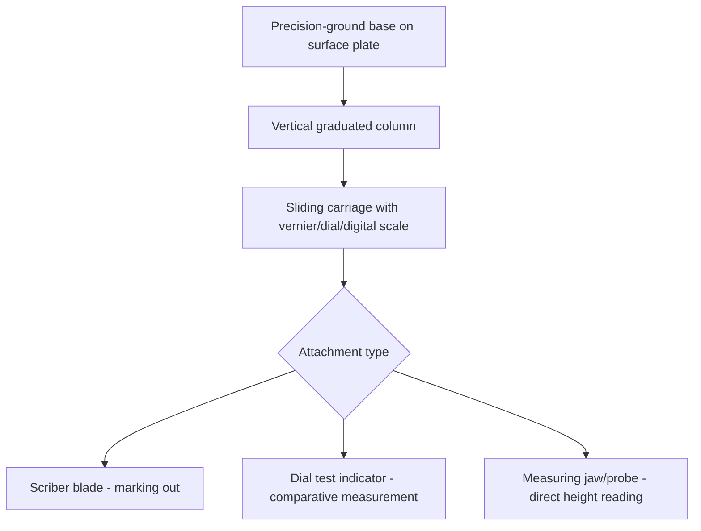

## Height Gauges and Depth Gauges

### Overview

Height gauges and depth gauges are dimensional measuring instruments used respectively to measure vertical distances from a reference surface (typically a surface plate) and to measure the depth of recesses, holes, slots, and steps relative to a reference face. Both instrument families exist in vernier, dial, and digital variants, and both are frequently used not only for direct measurement but also for precision **marking out** (scribing reference lines onto a workpiece).

**Key Points**

- Height gauges are fundamentally surface-plate-referenced instruments — their accuracy depends entirely on the flatness and condition of the surface plate they are used on, in addition to the instrument's own calibration.
- Depth gauges, by contrast, carry their own reference (a base) directly on the workpiece feature being measured, making them independent of an external reference plane but more sensitive to the flatness and squareness of the local feature.

### Vernier Height Gauges

#### Construction

- **Base**: a heavy, precision-ground flat base that sits on a surface plate or other reference datum surface, providing the "zero" reference plane for all height measurements.
- **Vertical column (beam)**: a graduated column rising from the base, carrying the main scale.
- **Sliding jaw/carriage**: moves along the column, carrying the vernier scale and, typically, a **scriber** (a hardened, pointed blade) for marking, or an attachment point for a dial indicator or other measuring tip.
- **Fine adjustment mechanism**: allows precise positioning of the carriage, analogous to the fine-feed mechanisms on calipers and micrometers.
- **Locking mechanism**: fixes the carriage at the desired height once positioned.

The vernier scale principle applied here is identical to that described for vernier calipers (see: Vernier calipers and vernier scales) — a main scale on the column combined with a shorter vernier scale on the carriage, using the coincidence method to resolve fractions of the main scale's smallest division.

$$\text{Height Reading} = \text{Main Scale Reading} + \left(\text{Vernier Coincidence Division} \times \text{Least Count}\right)$$

Typical resolution for a vernier height gauge is $0.02\ \text{mm}$ (metric) or $0.001\ \text{in}$ (imperial), matching common vernier caliper conventions.

#### Applications

- **Direct height measurement**: measuring the height of a step, a workpiece feature, or the overall height of a part relative to the surface plate.
- **Marking out (layout work)**: using the scriber attachment to scribe precise horizontal reference lines onto a workpiece at specified heights — a traditional machine-shop layout technique preceding CNC and CMM-based methods.
- **Comparative measurement**: fitted with a dial test indicator (DTI) or electronic probe instead of a scriber, a height gauge becomes a precision comparator for checking height differences, parallelism, or flatness deviations across a workpiece surface.

### Dial and Digital Height Gauges

- **Dial height gauges** replace the vernier scale with a rack-and-pinion-driven dial indicator for direct fractional reading, eliminating the coincidence-finding step and reducing reading error.
- **Digital (electronic) height gauges** use a linear encoder (commonly capacitive or optical) to provide a direct digital readout, often with additional functionality: zero-setting at any reference point, unit switching (mm/inch), tolerance comparison (go/no-go indication against programmed limits), statistical data output (SPC), and, in higher-end instruments, direct interfacing with a computer or CMM-adjacent software for data logging.

**Key Points**

- Digital height gauges used for quality control frequently incorporate a data output port (e.g., RS-232 or USB, or a proprietary SPC cable) allowing direct transfer of readings into a statistical process control system, reducing manual transcription error — a significant advantage over vernier variants in high-volume inspection contexts.
- Motorized digital height gauges exist, which drive the carriage under electronic control for repeatable, programmable positioning, often used in semi-automated bench-top inspection setups. [Inference] These are less common in general job-shop use due to higher cost, and are more typically found in dedicated metrology labs or inspection cells with sufficient measurement volume to justify the investment.

### Depth Gauges

Depth gauges measure the vertical distance from a reference (base) surface down to a lower feature — the bottom of a hole, slot, counterbore, or step.

#### Vernier Depth Gauges

- **Base**: a flat, rigid crossbar or plate that spans and rests on the reference surface (e.g., the top face of a part, straddling the opening of the feature being measured).
- **Graduated rod/blade**: extends downward through or alongside the base as the vernier slide is advanced, contacting the bottom of the feature.
- **Vernier scale**: mounted on the base, reading against the graduated rod using the same coincidence principle as a vernier caliper.

**Key Points**

- Vernier depth gauge scale direction runs consistently with increasing depth (unlike the depth *micrometer*, whose thimble/sleeve convention is reversed relative to an outside micrometer, as discussed in the micrometer reference) — this is a specific point of potential confusion between depth *gauges* and depth *micrometers*, which are distinct instrument families despite similar application.
- The base must span a sufficiently wide, flat area of the reference surface to sit stably without rocking; measuring a feature near an edge or on an uneven surface compromises the validity of the "zero" reference.

#### Dial and Digital Depth Gauges

Analogous to their height-gauge counterparts, dial depth gauges use a rack-and-pinion dial indicator, and digital depth gauges use a linear encoder for direct digital readout, with the same general benefits (elimination of coincidence-reading, direct SPC data output in digital variants).

#### Depth Gauge vs. Depth Micrometer — Distinction

| Feature | Depth Gauge (vernier/dial/digital) | Depth Micrometer |
| --- | --- | --- |
| Measuring mechanism | Sliding scale (vernier/dial/digital encoder) | Screw thread (spindle) |
| Typical resolution | 0.02 mm (vernier), 0.01 mm (dial/digital) | 0.01 mm or finer |
| Base design | Crossbar/blade spanning the opening | Flat disc-like base |
| Contact force control | Manual, less standardized | Ratchet stop (standardized) |
| Best suited for | Broader range, faster general-purpose depth checks | Higher-precision depth measurement |

### Sources of Error and Measurement Uncertainty

Applying the uncertainty budget framework (see: Uncertainty budgets), height and depth gauge measurements are affected by:

- **Surface plate condition (height gauges specifically)**: any deviation from flatness in the reference surface plate directly propagates into every height measurement taken from it; surface plates require their own periodic calibration and are graded (e.g., per ASME B89.3.7 or DIN 876 grades) for flatness accuracy.
- **Base flatness and squareness**: wear, damage, or contamination (burrs, debris) on the underside of the height gauge base, or on the depth gauge's crossbar, introduces a tilt error that is not correctable by the instrument's own scale.
- **Squareness of the column to the base (height gauges)**: if the vertical column is not perfectly perpendicular to the base, readings taken at different heights along the column will include a cosine-error component proportional to the sine of the squareness deviation and the height of measurement — this error grows with measured height, making it particularly significant for tall workpieces.
- **Scriber/probe tip wear and consistency**: for marking-out applications, a worn or damaged scriber tip changes the effective reference point of the carriage relative to the scale reading; for measurement applications with an attached DTI or probe, the probe's own calibration and stylus geometry contribute additional uncertainty.
- **Parallax error**: as with vernier calipers, misreading the vernier or dial coincidence point due to off-axis viewing.
- **Contact/measuring force variation**: particularly relevant when a height or depth gauge is used with a rigid measuring jaw (rather than a spring-loaded probe) directly against a workpiece feature, where excessive force can deflect the column or the workpiece.
- **Thermal effects**: given that height and depth gauges are frequently used for larger workpieces than calipers or micrometers, thermal expansion mismatches between the instrument (often steel or granite-based) and the workpiece become proportionally more significant for large nominal dimensions.
- **Abbe offset**: height gauges, by virtue of their geometry (scale on the column, measurement point offset horizontally at the jaw or probe tip), inherently violate the Abbe principle to some degree; the magnitude of the resulting error depends on the specific column-to-measuring-point offset and any angular deviation present.

**Example**

A vernier height gauge with a column squareness deviation of $0.01\ \text{mm}$ over a $300\ \text{mm}$ column length introduces an angular deviation of:

$$\theta = \arctan\left(\frac{0.01}{300}\right) \approx 0.0019°$$

At a measurement height of $200\ \text{mm}$ from the base, the resulting Abbe-type offset error (treating the column deviation as approximately linear) is proportionally:

$$\text{Error} \approx 0.01\ \text{mm} \times \frac{200}{300} \approx 0.0067\ \text{mm}$$

This illustrates why squareness calibration checks on a height gauge column are typically performed at multiple heights along its full travel, not just a single reference point — a squareness deviation that appears negligible near the base can produce a non-negligible error at full column extension. [Inference] This simplified calculation assumes the squareness deviation is approximately linear along the column length, which is a reasonable first-order approximation but may not capture more complex, non-linear column deflection patterns present in a specific instrument.

### Proper Use and Technique

- Always use height gauges on a certified, clean, and appropriately graded surface plate; verify the surface plate's own condition is within its calibration interval.
- Check and record zero position/offset before use, referencing a gauge block stack or the surface plate itself for the zero datum, depending on the instrument design and application.
- For marking out, ensure the scriber tip is sharp, undamaged, and securely clamped; for measurement, prefer a DTI or dedicated measuring attachment over a scriber blade where higher accuracy is required.
- For depth gauges, ensure the base sits fully flat against the reference surface, checking for rocking especially near edges or on features with surrounding surface irregularities.
- Handle and store both instrument types to protect the base and reference edges from nicks, burrs, or corrosion, since damage to these reference surfaces directly and often invisibly compromises subsequent measurements.
- Periodically calibrate across the full working range (not solely at a single reference height/depth), since squareness and linearity errors are typically position-dependent rather than uniform offsets.

### Standards and Reference Documents

- **ISO 13385-2** — Geometrical product specifications (GPS) — Dimensional measuring equipment — Part 2: Calipers for depth, step, and height measurements; design and metrological requirements (vernier, dial, digital depth/height instruments)
- **ASME B89.1.10** — related dimensional measuring instrument design/calibration standards (height gauge coverage varies by specific national standard)
- **ASME B89.3.7 / DIN 876** — Surface plate flatness grading, relevant to height gauge reference datum accuracy
- **JIS B 7517 / B 7518** — Japanese Industrial Standards for vernier and dial height gauges

**Related Topics**

- Vernier calipers and vernier scales
- Outside, inside, and depth micrometers
- Surface plates and reference datum flatness grading
- Dial test indicators (DTIs) and comparative measurement
- Abbe's principle and cosine error in length metrology
- Gauge blocks for height and depth gauge calibration
- Statistical process control (SPC) data integration from digital gauges
- Uncertainty budgets (component-level construction for height/depth measurements)