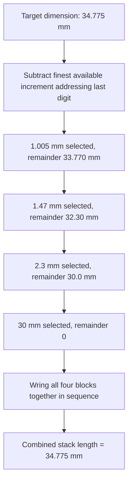

## Slip Gauges and Gauge Blocks

### Overview and Terminology

Slip gauges (the traditional British/Commonwealth term) and gauge blocks (the more common international and American term, also known as **Johansson gauges** or **Jo blocks** after their originator, Carl Edvard Johansson) are precision-ground blocks of hardened material used as physical length standards. They form the foundational basis of dimensional metrology's **traceability chain**, providing a means of transferring a known, calibrated length from a national or international standard down to shop-floor measuring instruments.

**Key Points**

- Gauge blocks are not measuring *instruments* in the sense of calipers or micrometers — they are **reference artifacts**: physical embodiments of a specific, known length used to calibrate, set, or verify other instruments.
- The defining physical property that makes gauge blocks uniquely useful is **wringing**: the ability of two blocks with sufficiently flat and smooth faces to adhere to one another when slid together, forming a combined stack whose total length is the sum of the individual block lengths with negligible additional gap.

### Physical Construction and Materials

Gauge blocks are rectangular (or, less commonly, cylindrical or square) blocks with two opposing **gauging faces** lapped to an extremely high degree of flatness and surface finish.

#### Common Materials

- **Hardened alloy tool steel**: the traditional and still widely used material, offering good wear resistance and dimensional stability when properly stress-relieved and seasoned, at relatively lower cost than ceramic alternatives.
- **Tungsten carbide**: substantially harder and more wear-resistant than steel, commanding a higher price but offering longer service life, particularly valuable for gauge blocks subjected to frequent wringing/unwringing cycles.
- **Chromium carbide**: an alternative hard-wearing material with corrosion resistance advantages over steel.
- **Ceramic (e.g., zirconia-based)**: offers excellent dimensional stability (low thermal expansion coefficient, resistance to magnetism, and corrosion immunity), increasingly used for high-grade reference sets, though generally more brittle and requiring more careful handling than metallic blocks.

**Key Points**

- Material choice affects the block's **coefficient of thermal expansion**, which must be known and accounted for (or matched to the workpiece material) when using gauge blocks for precise calibration away from the $20°\text{C}$ reference temperature.
- Ceramic gauge blocks' lower thermal conductivity means they equilibrate to ambient/hand-contact temperature more slowly than steel, which can be either an advantage (less susceptible to rapid hand-warming during handling) or a complication (longer thermal stabilization time required before use) depending on context.

### Grades and Accuracy Classes

Gauge blocks are manufactured and certified to accuracy **grades**, which specify permissible tolerances on length deviation from nominal, flatness, and parallelism. Two parallel grading systems are in widespread international use.

#### ISO 3650 Grades

| Grade | Typical Application |
| --- | --- |
| Calibration grade (K) | Reference/master standard for calibrating other gauge blocks; highest accuracy |
| Grade 0 | High-precision inspection and calibration work |
| Grade 1 | General precision workshop and toolroom use |
| Grade 2 | Workshop/production floor use, less critical applications |

#### ASME B89.1.9 (American) Grades

| Grade | Typical Application |
| --- | --- |
| Grade 0.5 (formerly AAA) | Master reference laboratory standard |
| Grade 1 (formerly AA) | Reference/inspection laboratory standard |
| Grade 2 (formerly A+/A) | Toolroom and precision inspection |
| Grade 3 (formerly B) | Workshop and production use |

**Key Points**

- Higher grades (tighter tolerances) are used as *masters* to calibrate lower-grade working sets, embodying the traceability chain principle in physical form — a Grade 0.5/K block might be used, in turn, to calibrate an interferometer setup or a Grade 1 working set, which then calibrates shop-floor instruments.
- The specific tolerance values associated with each grade are length-dependent (larger nominal blocks have proportionally larger absolute tolerance allowances) and are specified in detail within the governing standard rather than as a single fixed number across all block sizes.

### The Wringing Phenomenon

Wringing is the process of sliding two gauge blocks' lapped faces together (with a slight rotating or sliding motion, never simply pressing straight together) to cause them to adhere.

#### Physical Mechanism

[Inference] The precise physical mechanism of wringing is understood to result from a combination of factors rather than a single dominant cause: molecular/intermolecular attraction between the extremely flat and smooth surfaces, a thin residual film of oil or the surfaces' own natural surface energy, and atmospheric pressure acting on the near-total absence of an air gap between the mated faces. The relative contribution of each mechanism remains a subject of some technical discussion, though the practical result — a bond strong enough to lift a substantial stack against gravity, with negligible added gap between blocks — is well-established and consistently observed.

#### Building a Gauge Block Stack

A desired combined length is achieved by wringing together the minimum practical number of individual blocks from a set, selected according to a systematic subtraction method to minimize stack count and thus minimize cumulative wringing-layer and squareness error.

**Example**

To build a stack totaling $34.775\ \text{mm}$ using a typical 88-piece metric gauge block set (which includes blocks with increments as fine as $0.005\ \text{mm}$ in a specific low sub-range, then $0.01\ \text{mm}$, then larger increments):

1. Select $1.005\ \text{mm}$ (addresses the $0.005\ \text{mm}$ remainder) → remaining: $33.770\ \text{mm}$
2. Select $1.47\ \text{mm}$ (addresses the next decimal digit) → remaining: $32.30\ \text{mm}$
3. Select $2.3\ \text{mm}$ → remaining: $30.0\ \text{mm}$
4. Select $30\ \text{mm}$ → remaining: $0\ \text{mm}$

$$1.005 + 1.47 + 2.3 + 30 = 34.775\ \text{mm}$$

**Key Points**

- Minimizing the number of blocks in a stack is a deliberate goal, since each wringing interface introduces a (very small but non-zero) additional uncertainty contribution, and each additional block increases the cumulative risk of alignment/parallelism error across the stack.
- Blocks must be scrupulously clean (free of oil residue beyond an appropriate thin film, dust, or fingerprints) before wringing; contamination between faces prevents proper wringing or introduces a measurable gap.

### Applications

- **Calibration of micrometers, calipers, and dial/digital indicators**: gauge block stacks provide known-length references against which an instrument's reading can be directly verified across its range.
- **Setting comparators and height gauges**: establishing a known zero or reference point for comparative measurement instruments.
- **Sine bars and angle measurement**: used in conjunction with a sine bar to establish precise angles via trigonometric calculation from a known gauge block height and the sine bar's roller center distance.
- **Direct dimensional verification**: checking manufactured parts directly against a gauge block or stack for go/no-go style acceptance in some contexts, though this is less common than using gauge blocks to calibrate an intermediary instrument.
- **Machine tool and CMM calibration**: gauge blocks (and block-derived length standards such as step gauges) are used to verify the positioning accuracy of coordinate measuring machines and machine tool axes.

### Handling and Care

Given their role as reference standards, gauge blocks demand rigorous handling discipline:

- **Minimize hand contact time** with the gauging (measuring) faces; use handling tongs, gloves, or handle by the non-gauging sides where possible, since skin oils and body heat both contaminate the surface and introduce thermal expansion error.
- **Thermal stabilization**: allow blocks to reach thermal equilibrium with the measurement environment (ideally the standard $20°\text{C}$ reference temperature) before use, since temperature differences between block and workpiece/instrument introduce direct dimensional discrepancy via differential thermal expansion.
- **Clean before and after use**: residual oil, dust, or fingerprints must be removed with appropriate cleaning solvents and lint-free wipes; blocks are typically stored with a light protective oil film when not in active use to prevent corrosion.
- **Unwring promptly after use**: leaving blocks wrung together for extended periods, particularly steel blocks, risks micro-welding or increased difficulty of separation, and ties up inventory unnecessarily.
- **Store in fitted cases**: individual felt- or foam-lined compartments protect blocks from mechanical damage and contamination between uses.
- **Periodic recalibration**: working sets require recalibration at defined intervals (dependent on frequency of use and required accuracy) against a higher-grade master or via an accredited external calibration laboratory, maintaining the unbroken traceability chain.

**Common Pitfalls**

- Pressing blocks together face-on without the correct sliding/rotating wringing motion, which fails to expel trapped air and residual film properly, resulting in a poor or false wring.
- Using a stack with more blocks than necessary for a given dimension, unnecessarily accumulating wringing-layer and alignment uncertainty.
- Neglecting thermal acclimation time, particularly when blocks have been stored in a different environment (e.g., a temperature-controlled vault) than the shop floor where they are being used.
- Mixing block materials with significantly different thermal expansion coefficients within a single stack without accounting for the resulting differential expansion behavior across a temperature excursion.

### Contribution to Uncertainty Budgets

Gauge blocks, as reference standards, contribute directly to the **Type B uncertainty** components of instruments calibrated against them (see: Uncertainty budgets). A gauge block's own calibration certificate states an expanded uncertainty $U$ and coverage factor $k$ (typically $k=2$), which is converted to a standard uncertainty for inclusion in a derived calibration's budget:

$$u_{block} = \frac{U_{block}}{k}$$

Additional gauge-block-specific contributions to a calibration uncertainty budget include:

- Uncertainty in the block's length due to time elapsed since its last calibration (drift/stability).
- Wringing-layer thickness uncertainty (typically very small, but non-zero, for each interface in a multi-block stack).
- Temperature deviation of the block from the $20°\text{C}$ reference during use, combined with its (typically well-known, low-uncertainty) thermal expansion coefficient.

**Example**

A Grade 1 gauge block's calibration certificate states $U = 0.10\ \mu m$ at $k=2$ for a $25\ \text{mm}$ nominal block.

$$u_{block} = \frac{0.10}{2} = 0.05\ \mu m$$

This value would be entered directly as one Type B component within the uncertainty budget of any instrument calibration that uses this specific block as its reference length.

### Standards and Reference Documents

- **ISO 3650:1998** — Geometrical Product Specifications (GPS) — Length standards — Gauge blocks
- **ASME B89.1.9-2020** — Gauge blocks (American national standard covering grades, tolerances, and calibration methods)
- **JIS B 7506** — Japanese Industrial Standard for gauge blocks

**Related Topics**

- Uncertainty budgets (gauge blocks as Type B reference contributions)
- Traceability and calibration hierarchies
- Vernier calipers and vernier scales (calibration application)
- Outside, inside, and depth micrometers (calibration application)
- Sine bars and angle measurement via gauge block stacks
- Surface plates and reference datum flatness
- Interferometric length measurement (calibration of master gauge blocks)
- Coordinate measuring machine (CMM) calibration using step gauges