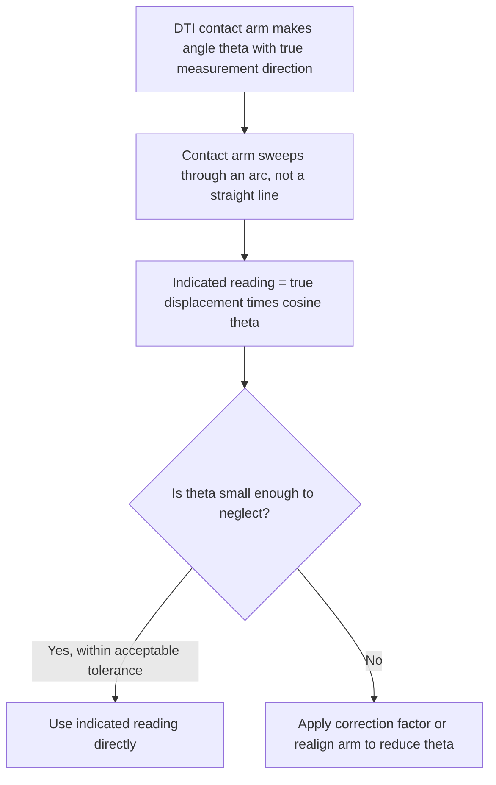

## Dial Indicators and Dial Test Indicators

### Overview and Distinction

Dial indicators and dial test indicators are both **comparative measurement instruments** — rather than measuring an absolute dimension directly, they display the *deviation* of a measured surface relative to a set zero reference position, amplified mechanically and displayed on a graduated dial. Despite the similarity in name, the two instrument types have distinct mechanisms, contact geometries, and typical applications, and the distinction between them is a frequent source of terminological confusion.

**Key Points**

- **Dial indicators (plunger-type)** use a spring-loaded plunger that moves linearly (axially) into and out of the instrument body, with that linear motion converted to rotary dial movement via a rack-and-pinion (or, in some designs, a lever) gear train.
- **Dial test indicators (DTIs, also called "finger" or "lever" indicators)** use a pivoting lever arm with a contact point, where angular deflection of the lever is converted to dial movement, typically via a more compact gear train suited to the smaller, more sensitive mechanism.
- DTIs are generally more compact and better suited to confined spaces and low-force, high-sensitivity applications (e.g., centering a workpiece on a lathe or mill), while plunger-type dial indicators are generally more robust and suited to larger-range comparative measurements (e.g., checking flatness, runout over larger travel, or height gauge attachment).

### Plunger-Type Dial Indicators

#### Construction

- **Spindle/plunger**: a spring-loaded shaft that moves linearly, with a contact tip (often a hardened steel or carbide ball) at its measuring end.
- **Rack and pinion gear train**: the linear motion of the plunger's rack teeth drives a pinion gear, which through a gear train rotates the main pointer; an additional gear train typically drives a smaller "revolution counter" hand to track how many full rotations of the main pointer have occurred, extending the effective range beyond a single dial rotation.
- **Dial face**: a circular graduated scale, typically rotatable (bezel) to allow zero-setting at any pointer position without needing to physically reposition the plunger.
- **Bezel clamp**: locks the rotatable dial face in place once zeroed.
- **Mounting stem/lug**: allows the indicator to be mounted on a stand, height gauge, magnetic base, or comparator fixture.

#### Common Resolutions and Ranges

| Type | Typical Resolution | Typical Total Range |
| --- | --- | --- |
| Standard dial indicator | $0.01\ \text{mm}$ or $0.001\ \text{in}$ | $0$–$10\ \text{mm}$ / $0$–$1\ \text{in}$ (varies) |
| Long-range dial indicator | $0.01\ \text{mm}$ | Up to $50\ \text{mm}$ or more |
| High-magnification dial indicator | $0.001\ \text{mm}$ or finer | Correspondingly smaller total range |

**Key Points**

- The rack-and-pinion mechanism inherently introduces **backlash** — a small amount of "play" in the gear train that can cause a slightly different reading depending on the direction of approach (increasing vs. decreasing plunger travel), a significant consideration for both usage technique and calibration.
- Anti-backlash designs (using a hairspring or secondary loading gear to keep the gear train engaged on one flank of the teeth) are common in precision dial indicators specifically to mitigate this effect.

### Dial Test Indicators (Lever-Type)

#### Construction

- **Contact arm (feeler/finger)**: a pivoting lever, typically much shorter than a plunger indicator's stroke, with a contact point at its free end.
- **Pivot and gear train**: converts the small angular deflection of the contact arm into pointer rotation via a compact, often more delicate gear train than a plunger indicator.
- **Reversible/swiveling head**: many DTIs allow the contact arm and/or the entire head to be rotated or reversed, accommodating measurement in different orientations or directions without repositioning the entire mounting setup.

#### Key Application: Cosine Error in DTI Measurement

Because the DTI's contact arm moves through an arc (not a straight line, unlike a plunger indicator's linear travel), the indicated reading does not equal the true linear displacement of the measured surface unless the arm is oriented exactly parallel to the direction of measurement. When the contact arm's line of travel is angled relative to the true measurement direction by an angle $\theta$, the true displacement $d_{true}$ relates to the indicated reading $d_{indicated}$ by:

$$d_{true} = \frac{d_{indicated}}{\cos\theta}$$

Or, expressed as the error introduced by an uncorrected angular misalignment:

$$\text{Error} = d_{true} \times (1 - \cos\theta)$$

**Example**

A DTI's contact arm is misaligned by $10°$ from the true direction of surface travel. For a true displacement of $0.100\ \text{mm}$:

$$\text{Indicated Reading} = 0.100 \times \cos(10°) = 0.100 \times 0.9848 \approx 0.0985\ \text{mm}$$

This represents an under-reading of approximately $0.0015\ \text{mm}$ ($1.5\ \mu m$) purely from the $10°$ angular misalignment — illustrating why manufacturers typically recommend keeping cosine misalignment below approximately $10$–$15°$ for general work, with correction applied or a realignment performed for higher-precision applications.

### Applications

- **Runout measurement**: mounting a dial indicator or DTI against a rotating shaft, spindle, or workpiece to measure radial or axial runout (total indicated runout, TIR) as the part is rotated.
- **Parallelism and flatness checks**: sweeping an indicator across a surface (often mounted on a height gauge, surface plate stand, or coordinate measuring fixture) to detect deviations from a flat or parallel reference.
- **Workpiece alignment/centering**: DTIs are extensively used in machining setup — for example, centering a workpiece in a lathe chuck or aligning a vise on a milling machine table — by sweeping the indicator and adjusting the workpiece position until indicated deviation is minimized.
- **Comparative gauging**: used with a comparator stand and a gauge block or master part to check a workpiece dimension against a known reference by measuring the *difference*, rather than an absolute value — often faster and, for certain applications, more repeatable than direct absolute measurement.
- **Machine tool geometric accuracy checks**: verifying spindle runout, table flatness, and axis alignment in machine tools as part of installation, maintenance, or periodic geometric accuracy verification.

### Digital (Electronic) Indicators

Digital dial indicators and DTIs replace the mechanical gear train and analog dial with an electronic linear encoder (commonly capacitive) and digital display, offering:

- Direct digital readout, eliminating dial-graduation interpolation and associated parallax error.
- Zero-setting at any position via a button rather than a mechanical bezel.
- Data output (SPC/statistical process control interfacing) for direct logging, similar to digital calipers and height gauges.
- Unit switching (mm/inch) without recalculation.
- In some models, tolerance/go-no-go indication with visual or audible alerts.

**Key Points**

- [Inference] Mechanical dial indicators remain in widespread use in general shop-floor and machine-setup contexts due to their ruggedness, complete independence from a power source or battery, and generally lower cost relative to comparable-quality digital variants, whereas digital variants are more often favored specifically where direct data logging or elimination of reading interpolation is a priority.

### Sources of Error and Measurement Uncertainty

Applying the uncertainty budget framework (see: Uncertainty budgets), dial indicator and DTI measurements are affected by:

- **Backlash (plunger-type dial indicators)**: as discussed above, gear train play can cause direction-dependent reading discrepancies; good measurement technique approaches the reading consistently from one direction to minimize this effect.
- **Cosine error (DTIs specifically)**: as derived above, angular misalignment of the contact arm from the true measurement direction under-reads the true displacement.
- **Contact/gauging force and stylus deflection**: the spring force holding the plunger or lever against the measured surface, while necessary for consistent contact, can cause measurable elastic deflection on soft materials or introduce small positional shifts on curved surfaces if not applied consistently.
- **Mounting rigidity**: dial indicators and DTIs are typically held via an external stand, magnetic base, or fixture; any flexure, looseness, or vibration in this mounting system directly appears as apparent (spurious) indicator deflection unrelated to the actual workpiece dimension.
- **Stylus/contact tip geometry and wear**: the shape (ball, flat, point) and condition of the contact tip affects how it interacts with curved, textured, or angled surfaces; a worn or damaged tip introduces a systematic bias.
- **Gear train wear and periodic error (mechanical types)**: as with micrometers, long-term wear in the gear train can introduce a position-dependent (rather than purely linear) error across the full range of dial travel.
- **Parallax error (analog dial types)**: misreading the pointer position against the dial graduations when viewed off-axis; many precision dial indicators include a mirrored dial face specifically to help the operator confirm perpendicular viewing angle and minimize this effect.
- **Thermal effects**: as with all precision instruments, temperature differences between the indicator body, its mounting fixture, and the workpiece introduce differential expansion effects, particularly relevant for longer-duration comparative setups (e.g., extended machine tool geometric checks).

**Example**

A dial test indicator with a stated accuracy specification of $\pm 0.005\ \text{mm}$ over its working range (treated as a rectangular Type B distribution) combined with an estimated cosine error contribution from a typical setup misalignment of up to $5°$:

$$u_{spec} = \frac{0.005}{\sqrt{3}} \approx 0.00289\ \text{mm}$$

$$\text{Max cosine error at } \theta=5°\text{, indicated reading } 0.050\ \text{mm}: \quad 0.050 \times (1-\cos 5°) \approx 0.050 \times 0.00381 \approx 0.00019\ \text{mm}$$

Treating the cosine error bound as a rectangular Type B contribution:

$$u_{cosine} = \frac{0.00019}{\sqrt{3}} \approx 0.00011\ \text{mm}$$

Simplified combined standard uncertainty (these two components only):

$$u_c = \sqrt{0.00289^2 + 0.00011^2} \approx 0.00289\ \text{mm}$$

[Inference] This example shows the cosine error contribution as relatively small at a modest $5°$ misalignment and small indicated displacement; the cosine error contribution grows disproportionately at larger misalignment angles and larger displacement values, and a complete budget for a specific setup would need to evaluate this contribution using the actual misalignment angle and reading magnitude present, along with mounting rigidity and repeatability components not included in this simplified illustration.

### Proper Use and Technique

- Mount the indicator on a sufficiently rigid stand or fixture, checking for looseness or flexure before taking readings.
- For DTIs, orient the contact arm as close to parallel with the true measurement direction as practically achievable, and apply a cosine correction or note the estimated error where exact alignment is not possible.
- Approach the zero-setting and subsequent readings consistently from the same direction where backlash is a concern (plunger-type indicators).
- Use adequate, consistent contact/gauging force — avoid excessive preload that could deflect a delicate workpiece or the mounting fixture.
- Protect the contact tip and (for plunger types) the spindle from damage, contamination, and lack of lubrication, since smooth, consistent plunger/lever motion is essential to repeatable readings.
- Periodically calibrate against a certified reference (e.g., a calibrated micrometer head, gauge block stack with a comparator stand, or dedicated indicator calibration fixture), checking linearity across the full working range rather than only at a single point.

### Standards and Reference Documents

- **ASME B89.1.10** — Dial indicators (American national standard covering design, performance, and calibration requirements)
- **DIN 878** — German standard for dial gauges (dial indicators)
- **ISO/DIS 463** — Geometrical Product Specifications — Dial gauges for linear measurement — Design and metrological characteristics
- **JIS B 7503** — Japanese Industrial Standard covering dial indicator design and requirements

**Related Topics**

- Vernier calipers and vernier scales
- Height gauges and depth gauges (comparator applications)
- Gauge blocks (comparator reference standards)
- Cosine error and Abbe's principle in length metrology
- Total indicated runout (TIR) measurement technique
- Surface plates and comparator stands
- Uncertainty budgets (component-level construction for comparative measurement)
- Coordinate measuring machines (CMM) and probe technology