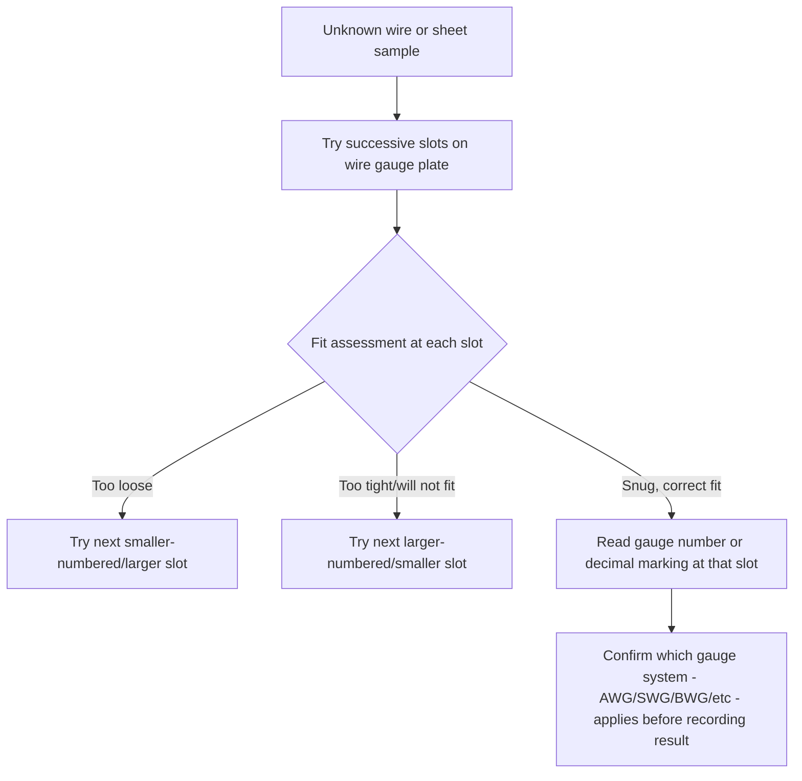

## Feeler Gauges and Wire Gauges


### Overview

Feeler gauges and wire gauges are simple, fixed-dimension comparative instruments used primarily to check the width of a gap or clearance, or to identify the diameter of round stock (wire, drill bits, sheet material), respectively. Unlike vernier calipers, micrometers, or dial indicators, these are typically **go/no-go**-style or direct-fit checking tools rather than instruments providing a continuously variable reading — a distinction that shapes both their applications and their characteristic sources of uncertainty.

**Key Points**

- Feeler gauges measure by physical insertion into a gap and assessment of fit (drag/resistance), not by a graduated scale reading — the "measurement" is fundamentally a binary or semi-quantitative judgment of fit at a known blade thickness.
- Wire gauges (and their close relative, sheet metal gauges) are primarily **classification/identification tools**, matching an unknown diameter or thickness against a series of fixed reference notches or holes, rather than providing a direct numeric readout.

### Feeler Gauges

#### Construction

A feeler gauge set consists of a series of thin steel (or, for non-magnetic applications, brass or plastic) blades, each of precisely controlled, uniform thickness, typically pivoted together at one end like a pocketknife or folding tool set, allowing individual blades to be selected and used independently or in combination.

- **Individual blade thickness**: each blade is stamped or marked with its thickness (e.g., $0.05\ \text{mm}$, $0.10\ \text{mm}$, or fractional-inch equivalents such as $0.002\ \text{in}$, $0.004\ \text{in}$).
- **Blade material**: hardened spring steel is most common; brass or plastic ("non-sparking" or non-marring) blades are used in specific contexts such as spark-sensitive environments or where marking a delicate surface must be avoided.
- **Combination stacking**: multiple blades can be used together (stacked) to check gaps that fall between the thickness of any single available blade, with the combined thickness being the arithmetic sum of the stacked blades.

$$\text{Combined Thickness} = \sum_{i=1}^{n} t_i$$

**Example**

To check a gap believed to be approximately $0.35\ \text{mm}$, an operator might combine a $0.20\ \text{mm}$ blade with a $0.15\ \text{mm}$ blade:

$$0.20 + 0.15 = 0.35\ \text{mm}$$

If this combination inserts into the gap with the correct, specified "slight drag" resistance (neither loose nor forced), the gap is confirmed to be at or very near $0.35\ \text{mm}$.

#### Applications

- **Spark plug gap setting**: verifying and adjusting the gap between spark plug electrodes to a manufacturer-specified value.
- **Valve clearance (tappet clearance) checking**: measuring the clearance between a valve stem and rocker arm or camshaft lobe in internal combustion engines, a common automotive and small-engine maintenance task.
- **Machine tool and bearing clearance verification**: checking backlash or running clearance in mechanical assemblies, way surfaces, or bearing fits.
- **Gap/fit verification in assembly and fabrication**: confirming a joint gap in welding preparation, or checking a mating surface gap in general mechanical assembly against a specified tolerance.

```mermaid
flowchart TD
    A[Identify target gap dimension from specification] --> B[Select single blade of matching thickness, or combination summing to target]
    B --> C[Insert blade(s) into gap]
    C --> D{Fit assessment}
    D -->|Blade passes with correct slight drag| E[Gap confirmed at approximately this thickness]
    D -->|Blade too loose - gap larger| F[Try next larger blade/combination]
    D -->|Blade will not insert or binds - gap smaller| G[Try next smaller blade/combination]
```

#### Sources of Error

- **Subjective "feel" of drag/resistance**: since the core measurement judgment relies on tactile assessment of insertion resistance, this introduces substantial **operator-dependent variability** — different operators (or the same operator on different occasions) may judge the same physical gap differently, making this one of the least repeatable common metrology tools in terms of *reading* consistency, even though the blade thickness itself is precisely manufactured.
- **Blade wear and damage**: repeated use, especially in gritty or abrasive environments, gradually wears blade edges and can introduce burrs, changing the effective thickness from the stamped nominal value.
- **Blade bending/bowing**: thin blades, particularly longer ones, can bow slightly when inserted into a gap, especially if forced, giving a false sense of the true gap dimension.
- **Combination stack error accumulation**: when multiple blades are stacked, any individual manufacturing tolerance on each blade's thickness accumulates (via root-sum-square combination, if treated as independent Type B rectangular sources) across the stack, though this is typically small relative to the fundamental "feel" judgment uncertainty.
- **Surface contamination**: oil, debris, or corrosion on either the blade or the gap surfaces can alter the perceived fit independent of the true underlying dimension.

**Example**

Two feeler gauge blades, each with a manufacturing tolerance of $\pm 0.005\ \text{mm}$ (rectangular Type B), are stacked to check a $0.35\ \text{mm}$ gap:

$$u_{blade} = \frac{0.005}{\sqrt{3}} \approx 0.00289\ \text{mm} \quad \text{(per blade)}$$


$$u_{stack} = \sqrt{u_{blade,1}^2 + u_{blade,2}^2} = \sqrt{0.00289^2 + 0.00289^2} \approx 0.00408\ \text{mm}$$

[Inference] While this stack-tolerance uncertainty is calculable, in practical use the dominant source of measurement uncertainty for feeler gauge gap-checking is very likely the qualitative "slight drag" fit judgment itself, which is difficult to quantify numerically and is not well-represented by treating the tool purely as a stack of precisely toleranced blades; feeler gauge measurements are generally regarded as a semi-quantitative go/no-go technique rather than a precision measurement method suitable for tight uncertainty budgets.

### Wire Gauges

#### Construction and Purpose

A wire gauge is typically a flat, disc-shaped or rectangular plate with a series of graduated slots or holes machined around its edge or through its face, each corresponding to a specific standard wire diameter (or, for sheet metal gauges, thickness) and labeled with a **gauge number** rather than (or in addition to) a direct dimensional value.

**Key Points**

- Wire and sheet metal gauge numbering systems are **not universally consistent** — multiple historical and regional standards exist (e.g., American Wire Gauge/AWG, Birmingham Wire Gauge/BWG, Standard Wire Gauge/SWG, Music Wire Gauge, and separate systems for ferrous vs. non-ferrous sheet metal), and critically, a given gauge *number* corresponds to a *different* actual dimension depending on which system is in use. This is a frequent and consequential source of confusion and error when specifications or drawings do not explicitly state which gauge system applies.
- Higher gauge numbers correspond to *smaller* diameters/thicknesses in most (though not universally all) of these systems — a counterintuitive inverse relationship relative to most other measurement conventions, originating historically from the number of wire-drawing operations required to produce that gauge from a starting stock size.

#### Common Wire Gauge Standards

| System | Typical Application | Notes |
| --- | --- | --- |
| American Wire Gauge (AWG) | Electrical wire (North America) | Diameter follows a geometric progression; widely used for conductor sizing |
| Standard Wire Gauge (SWG) | General wire (UK/historical) | Distinct numbering from AWG for the same nominal application |
| Birmingham Wire Gauge (BWG) | Tubing, some wire and sheet applications | Distinct system, also historically used for hypodermic needle sizing in a related but separate convention |
| Music Wire Gauge (MWG) | Springs, music wire | Distinct numbering, generally larger actual diameters at a given gauge number than comparable AWG/SWG numbers |
| Manufacturers' Standard Gauge | Sheet steel | A specific U.S. sheet steel gauge system distinct from wire gauge systems |

**Example**

A "20 gauge" designation means substantially different things depending on system: [Inference] as a general illustrative point, specifying only a bare gauge number without identifying the applicable standard (AWG, SWG, BWG, etc.) is insufficient for unambiguous specification, and a technical drawing or procurement specification should always state the specific gauge system alongside the number, or better, state the actual dimensional value directly, to avoid this ambiguity — actual numeric equivalence tables should be consulted from the specific governing standard for the application in question rather than assumed from general familiarity with one system.

#### Using a Wire Gauge

The unknown wire (or sheet) is inserted into successive slots (usually arranged from largest to smallest around the gauge's perimeter) until the slot that provides a correct, snug fit — neither loose nor requiring force — is found; the gauge number (or, on dual-marked gauges, the corresponding decimal dimension) stamped adjacent to that slot identifies the wire's size.



#### Sources of Error

- **Gauge system ambiguity**: as noted, using or reporting a bare gauge number without specifying the system is a significant potential source of gross error (a full category error, not merely an uncertainty contribution), distinct from the finer measurement uncertainty sources below.
- **Slot wear**: repeated insertion and removal of wire/sheet stock gradually wears and enlarges the gauge's slots, causing the plate to over-read (accept a slightly larger actual size as fitting a given nominal slot) over its service life.
- **Fit judgment subjectivity**: similar to feeler gauges, determining "snug fit" involves an operator's tactile and sometimes visual judgment, introducing operator-dependent variability.
- **Non-circularity or surface irregularity of the sample**: wire that is not perfectly round (out-of-round) or has surface roughness/coating (e.g., insulation, plating) can give an inconsistent or misleading fit assessment depending on the orientation tested.
- **Quantization (discrete step) resolution limit**: because wire gauges present only discrete, fixed slot sizes rather than a continuous scale, the true diameter of a sample falling between two adjacent gauge numbers can only be bracketed (known to lie between two values), not measured to a finer resolution — a fundamentally different type of resolution limitation than the interpolation-based resolution of a vernier or micrometer scale.

**Key Points**

- For any application requiring genuine dimensional traceability and reportable uncertainty (as opposed to quick shop-floor identification/sorting), a wire or sheet gauge should be treated as a preliminary or approximate classification tool, with a micrometer or caliper used for the actual reportable dimensional measurement where precision matters.

### Standards and Reference Documents

- **ASTM B258** — Standard specification for standard nominal diameters and cross-sectional areas of AWG sizes of solid round wires used as electrical conductors
- **BS 3737** — Historical British Standard Wire Gauge (SWG) specification (superseded but still referenced for legacy equipment/drawings)
- **ASME/ANSI feeler gauge tolerance references** — dimensional tolerance specifications for feeler gauge blade thickness (specific standard varies by manufacturer and national context; feeler gauges are less rigorously standardized internationally than gauge blocks or wire gauges)

**Related Topics**

- Vernier calipers and vernier scales (for precise verification beyond gauge-based classification)
- Outside, inside, and depth micrometers
- Go/no-go gauging and functional gauging principles
- Gauge blocks and slip gauges (contrast with fixed-classification gauges)
- Screw thread and pitch gauges (a related fixed-comparison gauge family)
- Uncertainty budgets (qualitative vs. quantitative measurement method distinctions)
- Sheet metal gauge standards and Manufacturers' Standard Gauge