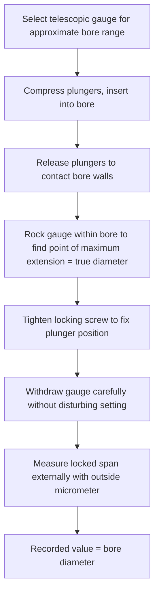

## Telescopic and Small Hole Gauges

### Overview

Telescopic gauges and small hole gauges are **transfer instruments** — they do not themselves display a numeric dimensional reading. Instead, they are manually expanded or adjusted to contact the internal walls of a bore, then locked in place and withdrawn, after which their now-fixed span is measured externally using a separate instrument, typically an outside micrometer. Both instrument types exist specifically to address internal diameter measurement scenarios where a direct-reading inside micrometer is impractical, most commonly due to small bore diameter or limited depth/access.

**Key Points**

- The defining characteristic of both instrument families is that the **measurement transfer step introduces its own uncertainty**: the act of locking, withdrawing, and re-measuring the gauge adds a source of error beyond the gauge's own internal contact mechanism, distinguishing these tools from direct-reading instruments like inside micrometers or bore gauges with integrated dial/digital readouts.
- Telescopic gauges and small hole gauges cover complementary, overlapping-but-distinct diameter ranges, with small hole gauges specifically addressing the smallest bores where even a telescopic gauge's minimum contracted size is too large to fit.

### Telescopic Gauges

#### Construction

- **Two spring-loaded, telescoping plungers**: a pair of cylindrical or hemispherical-tipped contact arms mounted coaxially, each free to slide within a central body and biased outward by an internal spring.
- **Central handle**: provides a grip for manipulating the gauge within the bore.
- **Locking screw**: located on the handle, used to fix the telescoping plungers at their current extended position once proper contact with the bore walls has been achieved.

#### Sizing Sets and Range

Telescopic gauges are manufactured in sets covering a range of bore diameters (commonly, a typical set spans from approximately $5\ \text{mm}$ up to $150\ \text{mm}$ or more across several individual gauges, each covering a specific sub-range), since each individual gauge has a limited range of plunger travel.

#### Technique

1. Select the telescopic gauge from the set whose range brackets the approximate bore diameter to be measured.
2. Compress both plungers inward (against their spring pressure) and insert the gauge into the bore.
3. Allow the spring-loaded plungers to expand outward against the bore walls.
4. While maintaining light contact, gently rock/pivot the gauge within the bore (in a manner analogous to the inside micrometer "rocking" technique) to find the true diameter — the point of maximum plunger extension corresponds to the bore's true diameter, since any misaligned or angled position would present a chord shorter than the true diameter.
5. At the point of maximum extension, tighten the locking screw to fix the plungers in place.
6. Withdraw the gauge carefully from the bore without disturbing the locked plunger position.
7. Measure the locked span across the plunger tips using an outside micrometer (or, for lower-precision applications, a vernier caliper).

**Key Points**

- Because the final numeric value comes from a *separate* micrometer measurement of the locked gauge, the overall measurement uncertainty is a combination of the telescopic gauge's own contact/setting uncertainty *and* the micrometer's own uncertainty (see: Outside, inside, and depth micrometers) — the telescopic gauge does not eliminate micrometer-related uncertainty sources, it adds to them.
- Withdrawal technique is critical: if the plungers shift even slightly during withdrawal (e.g., by catching on a bore edge, chamfer, or surface irregularity), the locked span no longer represents the true bore diameter, and this disturbance is not visually detectable — it can only be caught by comparing against a second independent reading or by careful, practiced technique.

### Small Hole Gauges (Split-Ball Gauges)

#### Construction

- **Split, spherical (ball-shaped) measuring head**: the contact end consists of two hemispherical halves that can be expanded apart.
- **Expansion mechanism**: typically an internal tapered plug or wedge, driven by a knurled adjusting screw at the opposite end of the handle, which forces the split-ball halves outward when turned.
- **Handle**: provides grip and houses the adjustment screw mechanism.

#### Sizing Sets and Range

Small hole gauge sets typically cover diameters smaller than the practical minimum for telescopic gauges — commonly from approximately $1.5$–$3\ \text{mm}$ up to around $13$–$20\ \text{mm}$ (specific range boundaries vary by manufacturer), making them the appropriate tool for the smallest bores, blind holes, slots, and grooves that a telescopic gauge cannot access.

#### Technique

1. Select the small hole gauge whose range brackets the approximate feature size.
2. Adjust the knurled screw to contract the split-ball head sufficiently to insert into the bore or slot.
3. Insert the gauge into the feature.
4. Turn the adjusting screw to expand the split-ball head until light, consistent contact with the bore/slot walls is felt — by feel (tactile "drag") rather than a numeric indication, similar in character to feeler gauge fit assessment.
5. As with telescopic gauges, gently rock the gauge to confirm the point of maximum expansion corresponds to the true diameter (for round bores) or the true width (for slots).
6. Withdraw carefully without disturbing the set position.
7. Measure the resulting span externally using an outside micrometer.

**Key Points**

- Small hole gauges are particularly well suited to **blind holes** (holes that do not pass completely through the workpiece) and shallow features where a telescopic gauge's plunger geometry or a full inside micrometer's length would not fit or would contact the bottom of the hole before achieving proper wall contact.
- The tactile "feel" component of setting a small hole gauge (judging correct contact pressure) introduces operator-dependent variability analogous to feeler gauge and wire gauge fit judgments (see: Feeler gauges and wire gauges), and is generally considered a less repeatable step than the telescopic gauge's spring-loaded, self-centering plunger action.

### Comparative Summary

| Feature | Telescopic Gauge | Small Hole Gauge |
| --- | --- | --- |
| Contact mechanism | Spring-loaded telescoping plungers (self-adjusting to contact) | Manually expanded split-ball head (screw-adjusted) |
| Typical diameter range | Larger bores (~5 mm and up) | Smallest bores, slots, blind holes (~1.5–20 mm) |
| Setting method | Automatic (spring pressure) up to lock point | Manual (tactile feel via adjusting screw) |
| Suitable for blind holes | Limited by plunger geometry | Well suited |
| Operator-dependent variability | Present (rocking/locking technique) | Present, generally greater (tactile setting) |

### Sources of Error and Measurement Uncertainty

Applying the uncertainty budget framework (see: Uncertainty budgets), telescopic and small hole gauge measurements carry several compounding sources of error, since the process involves two distinct measurement/setting steps rather than one:

- **Rocking/centering technique variability**: as with inside micrometers, failing to properly find the point of maximum extension (true diameter) rather than a chord introduces an under-measurement bias, and the consistency of this technique varies by operator.
- **Withdrawal disturbance**: physical disturbance of the locked plunger or ball position during withdrawal from the bore, as discussed above — this is a source of potentially significant, non-random error that is difficult to quantify statistically without repeated-measurement validation.
- **Locking mechanism precision**: the locking screw's own mechanical action (e.g., any slight plunger movement caused by the act of tightening the screw itself) can introduce a small systematic bias.
- **Transfer measurement (micrometer) uncertainty**: the subsequent external micrometer measurement of the locked span carries its own full uncertainty budget (resolution, MPE, contact force, zero error, etc., as detailed under Outside, inside, and depth micrometers), which adds directly to the overall combined uncertainty of the bore measurement.
- **Contact force/spring tension consistency (telescopic gauges)**: while the spring mechanism provides some self-centering consistency, spring tension can vary between individual gauges and degrade over the instrument's service life.
- **Tactile setting force (small hole gauges)**: the operator's judgment of "correct" contact pressure when turning the adjusting screw is inherently more variable than a spring-loaded self-centering mechanism, since there is no built-in force standardization.
- **Ball/plunger tip geometry and surface condition**: wear, damage, or contamination on the contact surfaces changes the effective contact geometry from the nominal, calibrated condition.

**Example**

A bore is measured using a telescopic gauge, followed by an outside micrometer reading of the locked span. The micrometer contributes a combined standard uncertainty (from its own budget) of $u_{mic} = 0.0012\ \text{mm}$ (consistent with the earlier micrometer example). The telescopic gauge's own setting/rocking repeatability, estimated from repeated trials (Type A), yields a standard deviation of $s = 0.003\ \text{mm}$ across $n=5$ repeated settings:

$$u_{gauge} = \frac{s}{\sqrt{n}} = \frac{0.003}{\sqrt{5}} \approx 0.00134\ \text{mm}$$

Combined standard uncertainty for the overall bore measurement (treating the two contributions as independent):

$$u_c = \sqrt{u_{mic}^2 + u_{gauge}^2} = \sqrt{0.0012^2 + 0.00134^2} \approx 0.0018\ \text{mm}$$

$$U = 2 \times 0.0018 \approx 0.0036\ \text{mm} \quad (k=2)$$

[Inference] This example illustrates the general method of combining the transfer instrument's own setting uncertainty with the subsequent micrometer's measurement uncertainty; a complete production-grade budget would typically also incorporate withdrawal-disturbance risk (difficult to model as a standard statistical distribution and often instead controlled through technique validation and repeated-reading acceptance criteria rather than a pure numeric uncertainty term) and would use the specific gauge's and micrometer's actual calibration data rather than illustrative values.

### Proper Use and Technique

- Select the correct gauge from the set for the approximate expected bore diameter before starting, to avoid working near the extreme limits of a given gauge's range where accuracy may degrade.
- Practice the rocking/centering technique to reliably find the true diameter (maximum extension point) rather than a chord, ideally validated through repeated readings on a known reference bore during operator training.
- Withdraw the gauge slowly and carefully, minimizing contact with the bore edges or chamfers that could disturb the locked setting.
- Immediately measure the locked span with the micrometer after withdrawal, minimizing the time during which the setting could be inadvertently disturbed by handling.
- Take multiple repeated measurements (re-inserting and re-setting the gauge) where feasible, to establish a Type A repeatability estimate for the specific measurement rather than relying on a single reading.
- Periodically verify the micrometer used for the transfer measurement against gauge blocks, since it forms a direct, undiminished contribution to the overall bore measurement's uncertainty.

### Standards and Reference Documents

- **ASME B89.1.5** and related dimensional gauging standards — general requirements for internal diameter transfer gauges (specific coverage varies; telescopic and small hole gauges are less extensively covered by dedicated international standards than gauge blocks or micrometers, with much of their governing practice found in general dimensional metrology handbooks and manufacturer specifications)
- **ISO 3611** (referenced for inside micrometer context, relevant as the comparison/transfer measurement instrument)

**Related Topics**

- Outside, inside, and depth micrometers (transfer measurement instrument)
- Vernier calipers and vernier scales
- Uncertainty budgets (multi-step transfer measurement combination)
- Bore gauges with integrated dial/digital readouts (direct-reading alternative)
- Gauge blocks (calibration reference for the transfer micrometer)
- Go/no-go gauging and functional gauging principles
- Feeler gauges and wire gauges (related tactile-fit measurement technique)