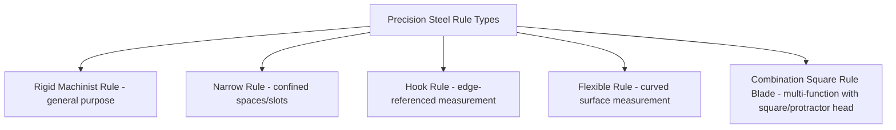

## Precision Steel Rules and Calibrated Scales

### Overview

Precision steel rules and calibrated scales are among the most fundamental linear measuring instruments in metrology — direct-reading graduated straightedges used to measure length by visual alignment of a workpiece feature against printed or engraved scale markings, without any mechanical amplification, screw mechanism, or vernier interpolation. Despite their conceptual simplicity relative to calipers, micrometers, and dial instruments, precision rules remain foundational tools in machine shops, quality control, and as reference/setting aids for other instruments.

**Key Points**

- Precision steel rules are **direct comparison instruments**: the measurement resolution is fundamentally limited to the finest graduation interval marked on the scale itself, with no built-in mechanism for interpolating between graduation lines beyond visual estimation.
- The term "calibrated scale" in this context also extends beyond simple rules to graduated scales integrated into other instruments (e.g., the main scale of a vernier caliper or micrometer sleeve) — the underlying manufacturing and calibration principles for producing an accurate graduated scale are common across these applications.

### Construction and Materials

#### Materials

- **Hardened and tempered steel**: the most common material, offering good wear resistance for graduation lines and resistance to bending/deformation under normal use.
- **Stainless steel**: offers corrosion resistance, often at some trade-off in hardness/wear resistance relative to hardened tool steel.
- **Spring steel (flexible rules)**: used for rules intended to conform to curved surfaces (flexible rules), trading rigidity for the ability to measure along a curved profile.

#### Graduation Types

- **Satin chrome / non-glare finish**: a matte finish applied to reduce light reflection/glare, improving graduation line legibility under workshop lighting.
- **Engraved (etched) graduations**: lines physically etched or engraved into the surface, offering superior durability and resistance to wear compared to printed markings, standard on higher-quality precision rules.
- **Printed/stamped graduations**: lower-cost alternative, more prone to wear and fading over time, typically found on lower-grade or disposable-tier rules.

#### Common Graduation Intervals

| Scale Type | Typical Finest Graduation |
| --- | --- |
| Standard machinist rule (metric) | $0.5\ \text{mm}$ or $1\ \text{mm}$ |
| Standard machinist rule (imperial) | $1/64\ \text{in}$ or $1/100\ \text{in}$ (decimal) |
| Fine-graduated precision rule | $0.25\ \text{mm}$ or finer |
| Decimal-inch rule | $0.01\ \text{in}$ (with additional finer subdivisions on some rules) |

**Key Points**

- Machinist rules often provide **multiple graduation systems on different edges** of the same rule (e.g., one edge in millimeters, the opposite edge in fractional inches, and additional edges with different fraction denominators), allowing a single physical rule to serve multiple measurement conventions without requiring separate tools.
- The finest graduation interval directly caps the rule's practical resolution; a rule graduated to $0.5\ \text{mm}$ cannot reliably resolve differences finer than roughly half that interval even with careful visual interpolation, in contrast to a vernier or micrometer scale specifically engineered to resolve fractions of the main scale division through a secondary mechanism.

### Types of Precision Rules

- **Rigid rule (machinist's rule)**: a flat, straight, rigid steel rule, the most common general-purpose form, typically available in lengths from approximately $150\ \text{mm}$ ($6\ \text{in}$) up to $1\ \text{m}$ or more.
- **Narrow rule**: a thinner, narrower-width rule designed for measuring in confined spaces or slots where a standard-width rule cannot be positioned.
- **Hook rule**: incorporates a fixed hook or lip at the zero end, allowing the rule to be reliably positioned against an edge or step without needing to visually align the zero mark, improving repeatability for edge-referenced measurements.
- **Flexible rule**: made from thin spring steel, able to bend around curved surfaces (e.g., measuring the circumference-derived length along a curved profile), at the cost of reduced rigidity for straight-line measurement.
- **Depth/rule combination sets**: rule blades usable in combination with a separate square or protractor head (as in a combination square set), extending the rule's utility to depth measurement and basic angle reference.

### Reading Technique

Since a precision rule provides no mechanical amplification or vernier interpolation, correct reading technique is critical to minimizing avoidable error:

1. Align the rule's zero end (or a known reference graduation) precisely with one edge of the feature being measured.
2. Ensure the rule lies flat against the workpiece surface (or, for edge measurements, that the rule's edge is in full contact along the measurement line) to avoid measuring along a non-parallel or tilted path.
3. View the graduation aligning with the opposite edge of the feature directly perpendicular (avoiding parallax), ideally with the eye positioned directly above the graduation line.
4. Where the feature edge falls between two graduation lines, visually estimate the fractional position — this estimation is inherently more subjective and less repeatable than an instrument with a built-in interpolation mechanism.

**Key Points**

- Because there is no vernier or dial mechanism, any fractional reading between graduation lines relies entirely on the operator's visual estimation, making precision rules generally unsuitable for reporting measurements finer than roughly half of the finest graduation interval with high confidence.

### Sources of Error and Measurement Uncertainty

Applying the uncertainty budget framework (see: Uncertainty budgets), precision rule measurements are subject to:

- **Resolution/interpolation uncertainty**: since the finest graduation interval fundamentally limits resolution, this is typically the dominant Type B contribution, treated as a rectangular distribution across the graduation interval (or, for careful visual interpolation between lines, a somewhat finer effective resolution, though this remains a matter of the individual operator's practiced skill and is less rigorously quantifiable than an instrument-defined resolution).
- **Parallax error**: viewing the scale from an angle rather than directly perpendicular causes an apparent shift in the aligned graduation position — this is a particularly significant contributor for rule measurements precisely because there is no thimble, dial, or digital display designed to minimize this effect, unlike more sophisticated instruments.
- **Zero-end wear and damage**: the zero end of a rule (or the hook, on a hook rule) is a frequent point of physical damage from repeated use, nicks, or wear, directly biasing every measurement taken from that reference point.
- **Thermal expansion**: as with all metallic length standards, temperature deviation from the $20°\text{C}$ reference condition introduces expansion/contraction error, proportionally more significant for longer rules and larger nominal measured dimensions.
- **Rule flatness and straightness**: bending, warping, or damage to the rule body (particularly relevant for thinner or flexible rules used in applications requiring rigidity) introduces a measurement bias if the rule is not held perfectly straight along the true measurement line.
- **Graduation manufacturing accuracy**: the precision with which the graduation lines themselves were engraved/printed at the correct nominal spacing; higher-grade precision rules are manufactured and, in some cases, certified to tighter graduation accuracy tolerances than general-purpose rules.
- **Contact/alignment technique variability**: operator-dependent variation in how precisely the rule is aligned with the feature's true edges, encompassing both zero-end alignment and reading-end alignment.

**Example**

A precision steel rule graduated to $0.5\ \text{mm}$ intervals is used to estimate a length by interpolating visually between graduation lines. Treating the graduation interval itself as a rectangular Type B resolution contribution:

$$u_{res} = \frac{0.25}{\sqrt{3}} \approx 0.144\ \text{mm}$$

(using half the $0.5\ \text{mm}$ graduation interval as the rectangular half-width, representing the fundamental resolution limit before considering interpolation skill)

Combined with an estimated parallax contribution — for example, a $2\ \text{mm}$ viewing height error at a typical viewing distance introducing an apparent shift, estimated (illustratively) at $\pm 0.1\ \text{mm}$ (rectangular):

$$u_{parallax} = \frac{0.1}{\sqrt{3}} \approx 0.058\ \text{mm}$$

Simplified combined standard uncertainty (these two illustrative components only):

$$u_c = \sqrt{0.144^2 + 0.058^2} \approx 0.155\ \text{mm}$$

$$U = 2 \times 0.155 \approx 0.31\ \text{mm} \quad (k=2)$$

[Inference] This example is illustrative of method rather than a universal figure — the actual resolution and parallax contributions for a specific rule and measurement setup depend heavily on the rule's graduation interval, the operator's specific viewing technique and distance, and whether careful visual interpolation between graduations is credited with finer effective resolution than the raw graduation-interval-based rectangular bound used here; precision rule measurements are generally regarded as suitable for coarser tolerance verification and rough layout work rather than tight-tolerance quality control reporting, for which vernier, micrometer, or digital instruments are preferred.

### Calibration of Precision Rules and Scales

Precision rule calibration verifies that the graduation spacing along the rule's length conforms to its stated accuracy class, typically performed by comparison against a calibrated reference (a certified master scale, or a series of gauge block-derived reference lengths) at multiple points along the rule's full length, since graduation error is not necessarily uniform across the scale.

**Key Points**

- Higher-grade precision rules may be manufactured and sold with a stated accuracy class or tolerance specification (e.g., per relevant national or international rule/scale standards), analogous in concept to gauge block grading, though rule accuracy standards are generally less universally standardized across manufacturers than gauge block grading systems.
- Rules used as a **reference or setting standard** for other shop-floor purposes (for example, a certified scale used to periodically spot-check other instruments) warrant more rigorous periodic calibration than a general-purpose rule used only for rough layout or non-critical measurement.

### Proper Use and Technique

- Select the appropriate graduation system (metric/imperial) and finest interval appropriate to the required measurement precision and the tolerance being verified.
- Ensure the rule lies flat against the workpiece and is aligned along the true measurement line, avoiding measurement along an angled or skewed path.
- View graduation alignment perpendicular to the scale to minimize parallax error; where higher precision is needed, consider a magnifying aid.
- Protect the zero end (and hook, if present) from damage, and inspect it periodically for wear, nicks, or burrs that would bias every subsequent measurement.
- Recognize the inherent resolution limitation of a plain graduated scale and select a vernier, micrometer, or digital instrument instead when the required tolerance approaches or exceeds the rule's practical resolution.
- Store rules to avoid bending (particularly flexible rules when not in active curved-surface use) and away from corrosive or abrasive environments that could damage graduation lines.

### Standards and Reference Documents

- **ASME B46.1** (surface texture, referenced context for graduation line quality) and general national rule/scale accuracy specifications (specific governing standards for machinist rule graduation accuracy vary by country and are less unified internationally than gauge block or micrometer standards)
- **DIN 866 / DIN 865** — German standards referenced for steel rule and scale specifications in some contexts
- **JIS B 7514** — Japanese Industrial Standard for steel rules

**Related Topics**

- Vernier calipers and vernier scales (interpolation mechanism contrast)
- Outside, inside, and depth micrometers
- Gauge blocks and slip gauges (reference standards for rule calibration)
- Height gauges and depth gauges
- Combination square sets and layout tools
- Uncertainty budgets (resolution-dominated measurement scenarios)
- Parallax error in direct-reading scale instruments