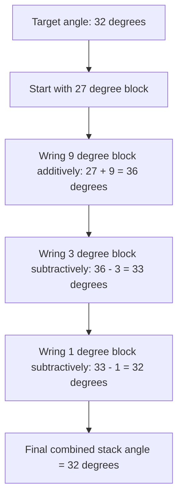

## Angle Gauge Blocks

### Overview

Angle gauge blocks (also referred to as angle blocks) are precision-ground physical artifacts embodying a specific, known angular value, serving as the angular measurement analogue to linear gauge blocks. They provide a direct means of establishing, transferring, and verifying known angles without relying on graduated protractor scales, and, like linear gauge blocks, they can be **combined by wringing** to build up a wide range of angles from a limited set of individual pieces.

**Key Points**

- Angle gauge blocks are reference artifacts, not measuring instruments in the sense of a bevel protractor or clinometer — they embody a known angle for comparison, setting, or calibration purposes, analogous to how linear gauge blocks embody a known length.
- The same wringing phenomenon that allows linear gauge blocks to be stacked applies to angle gauge blocks, and — critically — angle blocks can be combined not only additively but also **subtractively**, by flipping one block relative to another, allowing a relatively small set of blocks to generate a very large number of distinct angle combinations.

### Physical Construction

Angle gauge blocks are typically manufactured as flat, precision-ground blocks (commonly of hardened steel, though tungsten carbide and ceramic variants exist, paralleling linear gauge block material options) with two flat faces meeting at the block's nominal angle, and with the faces lapped to the same high degree of flatness and surface finish as linear gauge blocks to enable proper wringing.

Most angle gauge block sets are based on a specific systematic set of nominal angles, commonly following either:

- A **decimal/degree-minute-second progression** (e.g., individual blocks representing 1°, 3°, 9°, 27°, and 41° in one common commercial set arrangement, allowing combination to generate any integer degree value from 0° to 99° through addition and subtraction), or
- A **specialized set** including blocks for minutes and seconds of arc, allowing fine angular increments to be added to a whole-degree base combination.

### Combining Angle Gauge Blocks

#### Additive Combination

When two angle blocks are wrung together with their angles oriented in the same rotational sense, the resulting combined angle is the **sum** of the individual block angles.

$$\theta_{combined} = \theta_1 + \theta_2$$

#### Subtractive Combination

When one block is wrung to another but flipped (reversed) relative to the first, the combined angle becomes the **difference** between the two angles.

$$\theta_{combined} = \theta_1 - \theta_2$$

This subtractive capability is what gives angle gauge block sets their combinatorial efficiency: a small set of carefully chosen nominal angles (following a specific systematic progression, such as the 1°/3°/9°/27°/41° example above) can generate every integer-degree value across a wide range purely through selective addition and subtraction, in a manner conceptually similar to how a minimal coin denomination set can represent a wide range of monetary values.

**Example**

Using blocks of 1°, 3°, 9°, and 27° from a systematic set, a combined angle of $32°$ can be built as:

$$27° + 9° - 3° - 1° = 32°$$

Wringing sequence: the $27°$ and $9°$ blocks are combined additively (same orientation), then the $3°$ and $1°$ blocks are wrung on with reversed orientation to subtract their values.

**Key Points**

- As with linear gauge block stacks, minimizing the number of individual blocks used for a given combination reduces cumulative wringing-interface and alignment uncertainty, and systematic angle sets are specifically designed by their manufacturers to achieve broad angular coverage with a minimal number of pieces.
- Correct identification of which orientation (additive vs. subtractive) is required for each block in a combination requires careful attention, since a block wrung in the wrong orientation produces a substantially different resulting angle rather than a small error — this is a distinct failure mode from linear gauge block stacking, where blocks are only ever combined additively.

### Applications

- **Calibrating and setting bevel protractors and other angular measuring instruments**: providing a known-angle reference against which a protractor's scale can be verified across its range.
- **Setting up machine tools and fixtures**: establishing a precise angular reference for workholding fixtures, tool angles, or workpiece orientation on machine tools (e.g., setting a compound slide angle on a lathe, or a fixture angle on a grinder).
- **Inspection of angular features on manufactured parts**: direct comparison of a machined angular feature (e.g., a chamfer, a dovetail angle, a tapered feature) against a wrung angle block combination, often using an optical or mechanical comparator technique to detect any gap or light leakage indicating a deviation from the reference angle.
- **Sine bar and sine plate calibration/cross-verification**: while sine bars generate angles trigonometrically from linear gauge block heights (a distinct technique covered separately), angle gauge blocks provide an independent, direct-embodiment method for cross-checking or calibrating angle-generating setups.

### Comparison with Sine Bars

| Feature | Angle Gauge Blocks | Sine Bar (with linear gauge blocks) |
| --- | --- | --- |
| Method of angle generation | Direct physical embodiment (wrung stack) | Trigonometric calculation from linear height difference |
| Combination flexibility | Fixed set of achievable angles from block set (via addition/subtraction) | Continuously variable angle (limited by gauge block increment fineness) |
| Primary uncertainty source | Individual block angular accuracy + wringing-interface alignment | Sine bar roller center distance accuracy + linear gauge block height uncertainty + sine function sensitivity at high angles |
| Typical best use case | Direct angle verification, protractor calibration | Generating and verifying a wide, continuously adjustable range of precise angles |

**Key Points**

- Sine bar accuracy degrades disproportionately at higher angles (as the angle approaches 90°) due to the non-linear sensitivity of the sine function near its maximum, whereas angle gauge blocks maintain consistent accuracy (governed by their own manufacturing tolerance) regardless of the absolute angle value — this makes angle gauge blocks generally preferable for high-angle reference applications where sine bar technique becomes increasingly uncertain.

### Sources of Error and Measurement Uncertainty

Applying the uncertainty budget framework (see: Uncertainty budgets), angle gauge block measurements and combinations are affected by:

- **Individual block angular tolerance**: each block's manufactured angle carries a stated tolerance (analogous to a linear gauge block's grade-dependent length tolerance), certified via calibration against a higher-accuracy angular reference (e.g., an autocollimator or precision angle comparator).
- **Wringing-interface alignment error**: unlike linear gauge blocks, where a wringing interface primarily contributes a small additional *length* uncertainty, an angle block wringing interface can also introduce a small **rotational misalignment** if the blocks are not perfectly co-planar or properly wrung, directly affecting the combined angle rather than merely a length.
- **Orientation error (additive/subtractive mix-up)**: as discussed, using the wrong orientation for a block in a combination produces a substantial, non-small error, distinct in character from the fine uncertainty contributions of properly-oriented components — this is more accurately characterized as a gross error/mistake risk than a statistical uncertainty component, and is mitigated through careful procedure and verification rather than through uncertainty budget accounting alone.
- **Surface flatness and cleanliness**: as with linear gauge blocks, contamination or damage to the gauging faces compromises proper wringing and introduces both length-like and angular misalignment errors at the interface.
- **Thermal effects**: while angular values themselves are dimensionless and not directly subject to thermal expansion in the way a linear dimension is, differential thermal expansion across a physically asymmetric block or stack can, in principle, introduce small angular distortion; [Inference] this effect is generally considered secondary compared to the dominant sources above for typical shop-floor temperature variations, though it may become more relevant in high-precision reference laboratory contexts or with significant temperature gradients across a large stack.

**Example**

An individual angle gauge block has a stated calibration uncertainty of $U = 2\ \text{arc-seconds}$ at $k=2$ (from its calibration certificate).

$$u_{block} = \frac{2}{2} = 1\ \text{arc-second}$$

For a combination of three such blocks (assuming comparable, independent uncertainty for each and treating the wringing-interface contribution as separately estimated, here illustratively assumed negligible relative to the certified block uncertainties for simplicity):

$$u_c = \sqrt{u_1^2 + u_2^2 + u_3^2} = \sqrt{1^2 + 1^2 + 1^2} \approx 1.73\ \text{arc-seconds}$$

$$U = 2 \times 1.73 \approx 3.46\ \text{arc-seconds} \quad (k=2)$$

[Inference] This example assumes each block's calibration uncertainty is independent and of comparable magnitude, which is a reasonable simplifying assumption for blocks from the same set and calibration batch, but a rigorous budget for a specific combination would also require an explicit estimate of the wringing-interface angular alignment contribution for each interface in the stack, rather than treating it as negligible by default.

### Handling and Care

- Handling, cleaning, and storage practices mirror those for linear gauge blocks: minimize hand contact with gauging faces, clean thoroughly before wringing, allow thermal stabilization before precision use, and store in fitted cases to protect against mechanical damage.
- Verify correct block orientation (additive vs. subtractive) carefully before wringing, ideally cross-checking the intended combination arithmetic before assembly to avoid the orientation mix-up error discussed above.
- Unwring promptly after use and avoid leaving angle blocks in a wrung stack for extended periods unnecessarily.

### Standards and Reference Documents

- **ISO 6165** and related angular metrology standards (specific dedicated international standard coverage for angle gauge blocks is less extensive/unified than for linear gauge blocks under ISO 3650; much governing practice derives from general angular metrology standards and manufacturer specifications)
- **ASME B89.3.1** — related American national standards addressing angular measurement instrument context
- Manufacturer-specific angle gauge block set specifications (systematic angle progressions and stated tolerances vary by manufacturer)

**Related Topics**

- Slip gauges and gauge blocks (linear analogue and shared wringing principle)
- Sine bars and sine plates (trigonometric angle generation, alternative technique)
- Bevel protractors and universal protractors
- Autocollimators (high-precision angular calibration reference)
- Uncertainty budgets (angular combination uncertainty propagation)
- Optical flats and light-band comparison techniques for angle verification