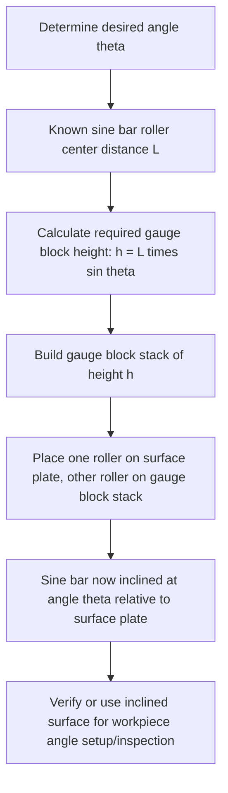

## Sine Bars and Sine Centers

### Overview

Sine bars and sine centers are precision instruments that generate a known, precise angle **trigonometrically**, by establishing a controlled height difference between two precision cylindrical rollers of known, fixed center-to-center distance, using stacks of linear gauge blocks. Rather than embodying an angle directly as a physical artifact (as an angle gauge block does), a sine bar computes the angle indirectly through the geometric relationship of a right triangle, making it a versatile tool capable of generating a continuously variable range of angles limited only by the fineness of available gauge block increments.

**Key Points**

- The fundamental principle exploits the trigonometric sine function: for a right triangle with hypotenuse equal to the sine bar's roller center distance and one leg equal to the gauge block stack height, the angle of inclination is the arcsine of the ratio of these two values.
- Sine bars and sine centers are distinguished primarily by geometry and application: sine bars are used for flat or prismatic workpieces mounted on or alongside the bar, while sine centers incorporate centers (as on a lathe) for setting up cylindrical or between-centers workpieces at a precise angle.

### The Sine Bar Principle

#### Construction

- **Precision-ground bar (or plate)**: a rigid steel bar with flat, parallel top and bottom reference surfaces, hardened and precision-ground for flatness and parallelism.
- **Two precision cylindrical rollers**: mounted at each end of the bar, ground to identical diameter and positioned such that their center-to-center distance is a precisely known, calibrated value — commonly $100\ \text{mm}$, $200\ \text{mm}$, or $5\ \text{in}$, $10\ \text{in}$ in standard commercial sine bars.
- **Mounting/clamping provisions**: many sine bars include holes, slots, or clamping features to secure a workpiece to the bar's top surface for combined setup and angle-generation.

#### Trigonometric Relationship

With one roller resting on a reference surface (e.g., a surface plate) and the other roller elevated on a gauge block stack of height $h$, the bar tilts to an angle $\theta$ given by:

$$\sin\theta = \frac{h}{L}$$

Where $L$ is the sine bar's roller center-to-center distance. Solving for the required gauge block stack height to achieve a desired angle:

$$h = L \sin\theta$$

**Example**

To set a $100\ \text{mm}$ sine bar to an angle of $30°$:

$$h = 100 \times \sin(30°) = 100 \times 0.5 = 50\ \text{mm}$$

A $50\ \text{mm}$ gauge block stack placed under the elevated roller produces the desired $30°$ inclination.

**Key Points**

- Because the relationship is $\sin\theta = h/L$, the achievable angular resolution for a given gauge block increment is not constant across the full 0°–90° range: near $0°$, small changes in $h$ produce small, well-controlled changes in $\theta$, but as $\theta$ approaches $90°$, the sine function's rate of change decreases sharply, meaning increasingly large changes in $h$ are needed to produce the same angular increment — this non-linear sensitivity is a fundamental limitation of the sine bar principle at high angles.
- Sine bars are generally recommended for angles up to approximately $45°$, and most manufacturers and metrology references advise against use above roughly $60°$, due to this compounding loss of angular resolution and sensitivity, along with increasing practical difficulty in maintaining a stable, accurately measurable setup geometry at steep inclinations.

### Applications

- **Setting and verifying precise angles on workpieces**: clamping a workpiece to the sine bar's top surface and elevating one roller to a calculated height to establish a known reference angle for machining, grinding, or inspection.
- **Angle inspection via comparator technique**: setting the sine bar to a nominal target angle and then checking a workpiece's actual angular feature against the bar's inclined surface using a dial indicator swept along the feature, revealing any deviation from the nominal angle as an indicated height variation.
- **Machine tool setup**: establishing precise angular fixture or workpiece orientation on surface grinders, milling machines, and other machine tools where a specific angular feature must be produced.

### Sine Centers

Sine centers extend the sine bar principle to cylindrical or between-centers workpieces, incorporating precision centers (analogous to lathe centers) mounted on a sine-bar-like base, allowing a shaft, taper, or other between-centers workpiece to be held and precisely inclined at a calculated angle for inspection or machining of angular features along its length (such as checking or grinding a taper).

**Key Points**

- Sine centers are particularly suited to verifying tapers on shafts and similar cylindrical components, where the workpiece's own geometry (rather than a flat clampable surface) makes a standard sine bar's flat mounting surface impractical.
- The same trigonometric height-calculation principle applies, with the center-to-center distance of the sine center's own roller/support geometry substituted for $L$ in the sine relationship.

### Compound Sine Plates and Sine Vises

For applications requiring **compound angles** (a workpiece angled simultaneously in two perpendicular planes, such as certain complex tooling or aerospace component features), **compound sine plates** stack two sine mechanisms at 90° to each other, allowing independent angle-setting in each plane via two separate gauge block height calculations.

**Key Points**

- Compound angle calculations for two-axis sine plates are not simply independent in the way they might first appear — because the two rotations are sequential and interact geometrically, calculating the correct gauge block heights for a desired combined compound angle (rather than a single-plane angle) requires accounting for this interaction, often via reference tables, dedicated calculation software, or more advanced trigonometric formulas specific to the compound sine plate's mechanical arrangement, rather than a simple independent sine calculation for each axis.
- [Inference] Compound angle sine plate calculations are considered a more specialized and error-prone task than single-axis sine bar setup, and verification of the resulting compound angle (e.g., via CMM or optical means) is generally advisable for critical applications given the increased opportunity for calculation or setup error.

### Sources of Error and Measurement Uncertainty

Applying the uncertainty budget framework (see: Uncertainty budgets), sine bar and sine center measurements involve several compounding uncertainty sources, since the final angle is a *calculated* quantity derived from multiple independently uncertain physical measurements, rather than a directly observed value:

- **Roller center distance calibration uncertainty**: the sine bar's own $L$ value carries a calibration uncertainty (from its manufacture and periodic verification), which propagates directly into every angle calculated using that bar.
- **Gauge block stack height uncertainty**: the combined standard uncertainty of the gauge block stack used to set height $h$ (see: Slip gauges and gauge blocks), including individual block calibration uncertainty and wringing-interface contributions.
- **Reference surface (surface plate) flatness**: any deviation from true flatness in the surface plate supporting the sine bar's non-elevated roller directly biases the achieved angle.
- **Roller diameter matching and roundness**: if the sine bar's two rollers are not identical in diameter, or are not perfectly round, the effective center-to-center distance (or the geometry of contact with the supporting surfaces) deviates from the bar's nominal calibrated value.
- **Non-linear sensitivity at high angles**: as discussed, the rate of change of $\sin\theta$ with respect to $h$ decreases as $\theta$ increases, meaning a fixed absolute uncertainty in $h$ translates to a progressively larger angular uncertainty as the target angle increases toward 90°. This can be derived via error propagation on the inverse relationship:

$$\theta = \arcsin\left(\frac{h}{L}\right) \quad \Rightarrow \quad u(\theta) \approx \frac{1}{\sqrt{L^2 - h^2}} \cdot \sqrt{u(h)^2 + \left(\frac{h}{L}\right)^2 u(L)^2}$$

This expression shows the denominator term $\sqrt{L^2 - h^2}$ approaching zero as $h \to L$ (i.e., as $\theta \to 90°$), causing the angular uncertainty $u(\theta)$ to grow without bound near the sine bar's geometric limit — a direct mathematical confirmation of the practical guidance to avoid sine bar use at high angles.

**Example**

A $200\ \text{mm}$ sine bar with a roller center distance calibration uncertainty of $u(L) = 0.001\ \text{mm}$ is set to $\theta = 30°$ using a gauge block stack with combined standard uncertainty $u(h) = 0.0005\ \text{mm}$.

$$h = 200 \times \sin(30°) = 100\ \text{mm}$$

$$u(\theta) \approx \frac{1}{\sqrt{200^2 - 100^2}} \cdot \sqrt{0.0005^2 + (0.5)^2 \times 0.001^2} = \frac{1}{173.2} \times \sqrt{0.00000025 + 0.00000000025} \approx \frac{0.0005}{173.2} \approx 0.00000289\ \text{rad}$$

Converting to arc-seconds ($1\ \text{rad} \approx 206265\ \text{arc-seconds}$):

$$u(\theta) \approx 0.00000289 \times 206265 \approx 0.6\ \text{arc-seconds}$$

$$U(\theta) \approx 2 \times 0.6 = 1.2\ \text{arc-seconds} \quad (k=2)$$

[Inference] This example illustrates the general propagation method and shows a relatively small angular uncertainty at a moderate $30°$ angle for well-calibrated equipment; recalculating this same expression at an angle approaching $80°$–$85°$ with the same $u(h)$ and $u(L)$ values would show the angular uncertainty growing substantially due to the denominator term shrinking, which is the mathematical basis for the practical recommendation to limit sine bar use to lower angles for high-precision work.

### Proper Use and Technique

- Verify the sine bar's roller center distance calibration is current and use the certified value (rather than only the nominal marked value) in angle calculations where high precision is required.
- Ensure the reference surface (surface plate) is clean, flat, and within its own calibration/flatness specification before use.
- Minimize the number of gauge blocks in the height stack to reduce cumulative wringing-interface uncertainty, following standard gauge block stack-building practice.
- Avoid sine bar use for angles above approximately 45°–60° where alternative methods (angle gauge blocks, precision index tables, or direct angular measurement instruments) offer better accuracy.
- Allow thermal stabilization of the sine bar, gauge blocks, and workpiece before precision setup, given the multiple interacting components each subject to thermal expansion.
- For compound angle work, use validated reference tables or calculation methods specific to the compound sine plate's geometry, and verify the resulting angle independently where feasible.

### Standards and Reference Documents

- **ASME B89.3.1** — Measurement of out-of-roundness (related angular/geometric measurement context)
- **ISO 2768** and general angular tolerancing standards (referenced context for angular measurement applications)
- Manufacturer-specific sine bar and sine plate specifications (roller center distance tolerances and calibration procedures vary by manufacturer; sine bar accuracy classes are commonly specified per national or manufacturer-specific standards rather than a single unified international standard)

**Related Topics**

- Angle gauge blocks (direct-embodiment alternative to trigonometric angle generation)
- Slip gauges and gauge blocks (height stack component)
- Bevel protractors and universal protractors
- Uncertainty budgets (non-linear error propagation through trigonometric functions)
- Compound sine plates and multi-axis angular setup
- Surface plates and reference datum flatness
- Autocollimators (high-precision angular verification)