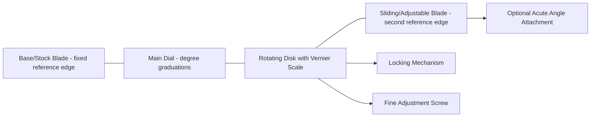

## Bevel Protractors and Universal Bevel Protractors

### Overview

Bevel protractors are direct-reading angular measuring instruments used to measure or set the angle between two surfaces or lines, functioning as the angular analogue of the vernier caliper. The **universal bevel protractor** specifically refers to a precision variant incorporating a vernier scale for fine angular resolution, distinguishing it from simpler, non-vernier protractors used for less demanding work.

**Key Points**

- A plain (non-vernier) bevel protractor provides direct angular reading limited to the resolution of its main scale graduations (typically whole degrees or half-degrees), suitable for general-purpose angle checking where high precision is not required.
- A **universal bevel protractor** adds a vernier scale to the main graduated dial, extending resolution typically down to $5$ arc-minutes ($1/12°$), making it a precision instrument suitable for toolroom and inspection work, directly analogous to how a vernier caliper extends a plain rule's resolution.

### Construction

#### Universal Bevel Protractor Components

- **Base (stock) blade**: a fixed blade forming one reference edge of the angle being measured, analogous to a combination square's stock.
- **Main dial (protractor scale)**: a circular graduated scale, typically marked in degrees across a full $360°$ or a $0°$–$90°$–$0°$ dual-direction arrangement, fixed to the base blade.
- **Rotating disk with vernier scale**: mounted concentrically with the main dial, carrying a vernier scale that reads against the main dial's degree graduations using the same coincidence-reading principle as a vernier caliper (see: Vernier calipers and vernier scales).
- **Sliding/adjustable blade**: a second blade, mounted to the rotating disk, that can be extended, retracted, and rotated to contact the second surface of the angle being measured.
- **Locking mechanism**: fixes the rotating disk (and thus the angular reading) once the desired blade positions are achieved.
- **Fine adjustment mechanism**: on many precision universal bevel protractors, a small adjusting screw allows fine rotational control of the disk for precise final positioning, analogous to the fine-feed mechanisms on calipers and micrometers.
- **Acute angle attachment**: an optional accessory blade extension used specifically for measuring acute angles that would otherwise be difficult to access with the standard blade configuration.

### Reading a Universal Bevel Protractor

The reading procedure parallels vernier caliper reading, applied to angular rather than linear scale:

1. **Main dial reading**: identify the whole-degree (or half-degree) graduation on the main dial immediately preceding the vernier scale's zero mark.
2. **Vernier scale reading (coincidence method)**: scan the vernier scale for the single division that most precisely aligns with a main dial graduation; this division number, multiplied by the vernier's least count, gives the fractional (minute) portion.

$$\text{Angle} = \text{Main Dial Reading} + \left(\text{Vernier Coincidence Division} \times \text{Least Count}\right)$$

For a common universal bevel protractor vernier providing $5$ arc-minute resolution (12 vernier divisions spanning a $23°$ main-scale span, in one common construction, yielding a least count of $5' = 1/12°$):

**Example**

Main dial reading: $34°$

Vernier coincidence at the 3rd division: $3 \times 5' = 15'$

$$\text{Angle} = 34° + 15' = 34°15'$$

### Applications

- **Direct angle measurement of machined features**: checking chamfers, tapers, dovetails, and other angular features on workpieces directly against the protractor's blades.
- **Setting up machine tools and fixtures**: establishing precise angular positioning for workholding fixtures, tool holders, or workpiece angles on milling machines, grinders, and other equipment.
- **Layout and marking-out work**: establishing reference angle lines on a workpiece prior to machining, in combination with a scriber, similar in workflow role to a height gauge's marking-out application for linear dimensions.
- **Inspection and quality control**: verifying that a manufactured angular feature falls within its specified tolerance, either through direct reading or comparative light-gap assessment against the protractor's blade edges.

### Types and Variants

| Type | Distinguishing Feature |
| --- | --- |
| Plain (non-vernier) bevel protractor | Direct-reading main scale only; resolution limited to whole/half degrees |
| Universal bevel protractor | Adds vernier scale for fine (typically 5 arc-minute) resolution |
| Digital bevel protractor | Replaces mechanical dial/vernier with an electronic angular encoder and digital display |
| Combination set protractor head | A protractor head usable interchangeably with a combination square's rule blade, providing basic (typically non-vernier) angular reference as part of a multi-function toolset |

**Key Points**

- Digital bevel protractors offer direct digital readout (eliminating vernier coincidence-reading and its associated parallax risk), zero-setting at any reference angle, and, on many models, an inclinometer mode using gravity reference (a built-in accelerometer-based level function) that allows angle measurement independent of a second physical reference surface — a capability not available on purely mechanical vernier or dial protractors, which require a physical second contact edge.
- [Inference] Mechanical universal bevel protractors remain common in general toolroom and shop-floor use due to their independence from a power source, ruggedness, and lower cost relative to precision digital variants, while digital protractors are increasingly favored where direct data logging, inclinometer-mode flexibility, or elimination of vernier reading is prioritized.

### Sources of Error and Measurement Uncertainty

Applying the uncertainty budget framework (see: Uncertainty budgets), bevel protractor measurements are subject to:

- **Vernier coincidence reading error**: as with linear vernier instruments, ambiguity in identifying the precise coincidence point on the vernier scale, and the associated resolution limit of the least count itself, contributes a Type B rectangular uncertainty.
- **Parallax error**: misreading the vernier or main dial coincidence point due to off-axis viewing, analogous to the parallax sources discussed for vernier calipers and dial instruments.
- **Blade contact and alignment error**: the blades must make full, flat contact along their length with each surface of the angle being measured; incomplete contact (e.g., due to surface irregularity, burrs, or the blade only touching at one point rather than along its full length) introduces a measurement bias, since the instrument then reads the angle to that specific contact point rather than the true surface angle.
- **Blade and pivot wear**: wear at the pivot point of the rotating disk, or wear/damage to the blade edges themselves, introduces systematic bias that accumulates over the instrument's service life.
- **Zero/calibration reference error**: verifying the protractor reads exactly $0°$ (or another known reference angle, via angle gauge blocks) when the blades are aligned in a known configuration; any offset must be identified and corrected.
- **Backlash in the locking/fine-adjustment mechanism**: similar in character to the backlash discussed for plunger-type dial indicators, mechanical play in the fine adjustment or locking mechanism can introduce a small, direction-dependent reading discrepancy.
- **Thermal effects**: while angular readings are dimensionless, differential thermal expansion between the protractor's blades, dial, and a workpiece of substantially different temperature can, in principle, introduce small distortions in blade straightness or dial concentricity, though [Inference] this is generally a secondary concern relative to reading and contact-related uncertainty sources for typical shop-floor conditions.

**Example**

A universal bevel protractor with a stated vernier least count of $5'$ (arc-minutes) has an associated resolution-based Type B uncertainty (rectangular distribution across the least count interval):

$$u_{res} = \frac{2.5'}{\sqrt{3}} \approx 1.44'$$

Combined with an estimated blade contact/alignment uncertainty, illustratively bounded at $\pm 3'$ (rectangular) due to minor surface irregularity on the measured feature:

$$u_{contact} = \frac{3'}{\sqrt{3}} \approx 1.73'$$

Simplified combined standard uncertainty (these two illustrative components only):

$$u_c = \sqrt{1.44^2 + 1.73^2} \approx 2.25'$$

$$U = 2 \times 2.25 \approx 4.5' \quad (k=2)$$

[Inference] This example illustrates the general combination method for two plausible contributions; a complete production-grade uncertainty budget for a specific bevel protractor measurement would additionally incorporate Type A repeatability from repeated readings, the instrument's own certified calibration uncertainty (if calibrated against angle gauge blocks or an autocollimator), and pivot/backlash contributions specific to the individual instrument's condition, rather than relying solely on the illustrative resolution and contact-error estimates used here.

### Proper Use and Technique

- Ensure both blades make full, flat contact along their length with the respective surfaces of the angle being measured, checking for light gaps that would indicate incomplete contact.
- Use the fine adjustment mechanism for final positioning rather than relying solely on the coarse rotational movement of the disk, improving both repeatability and reading precision.
- View the vernier coincidence point perpendicular to the scale to minimize parallax error.
- Verify zero/reference calibration periodically using angle gauge blocks or another certified angular reference, and record any necessary correction.
- Protect blade edges and the pivot mechanism from damage, contamination, and wear, since both directly and often invisibly compromise subsequent measurement accuracy.
- For acute angles difficult to access with the standard blade configuration, use the dedicated acute angle attachment rather than attempting an awkward or unstable standard-blade setup.

### Standards and Reference Documents

- **ISO 1101** (referenced context for geometrical tolerancing of angular features, relevant to protractor-based inspection applications)
- **ASME B89.3.1** and general angular measuring instrument standards (protractor-specific dedicated international standard coverage is less extensive/unified than for linear instruments such as calipers and micrometers; much governing practice derives from manufacturer specifications and general angular metrology handbooks)
- **JIS B 7455** — Japanese Industrial Standard for bevel protractors

**Related Topics**

- Vernier calipers and vernier scales (shared vernier reading principle)
- Angle gauge blocks (calibration reference for protractor zero/accuracy verification)
- Sine bars and sine centers (alternative trigonometric angle-generation method)
- Dial indicators and dial test indicators (comparative angular/feature inspection)
- Digital and electronic angular measurement instruments (inclinometers)
- Uncertainty budgets (component-level construction for angular measurement)
- Autocollimators (high-precision angular calibration reference)